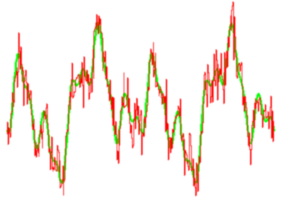
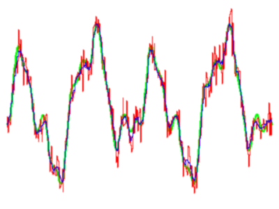

# Kuvien suodatus ja muokkaus

Tässä luvussa tutustumme konvoluutioon ja kuvien suodattamiseen sen avulla.
Tutustumme myös morfologisiin operaatioihin.

Käytännöllisiä asioita tällä kerralla:

* kokeillaan konvoluutiota erilaisia suotimilla,
* yhdistetään aiemmin opittu asia -- kynnystys -- konvoluution kanssa ja luodaan
  tällä tavoin morfologisia operaatioita,
* hahmotetaan kohteiden rakennetta *hit-or-miss* -maskien avulla.

## Lineaariset systeemit

Signaalinkäsittelyssä on oleellista ymmärtää ja mallittaa huolellisesti
systeemien vasteita syötesignaaleihin. Erilaiset kuvantamisjärjestelmät ovat
esimerkkejä *lineaarisista, aikariippumattomista* systeemeistä (engl. *linear
time-invariant systems*, LTI), joita tutkitaan LTI-systeemiteoriassa. Kuten
aiemmin todettiin, kuvantamisjärjestelmät tuottavat vasteita aikaulottuvuuden
lisäksi myös tilaulottuvuuksissa, ja näissä yhteyksissä puhutaan myös
lineaarisista *siirtoriippumattomista* (engl. *translation invariant*)
systeemeistä.

**Aikariippumattomuus** tai aikainvarianssi tarkoittaa sitä, että järjestelmän
vaste ei riipu ajanhetkestä. Jos syöte $f(t)$ tuottaa vasteen $R(f(t))$, silloin
ajan suhteen siirretty syöte $f(t+\delta)$ tuottaa ajan suhteen siirretyn
vasteen $R(f(t+\delta))$. Tässä yhteydessä on syytä huomata, että systeemissä
esiintyvä viive ei ole merkki aikariippuvuudesta, ellei viiveen suuruus riipu
ajanhetkestä.

Lineaarisuus tarkoittaa sitä, että systeemi toteuttaa *superpositiona* ja
*skaalautuvuutena* tunnetut ominaisuudet. **Superpositio** tarkoittaa sitä, että
kahden syötteen summan tuottama vaste on sama kuin kahden erillisen syötteen
tuottamien vasteiden summa: $R(f+g) = R(f) + R(g)$. **Skaalautuvuus** puolestaan
tarkoittaa sitä, että nollasyötteen vaste on nolla, ja skaalatun syötteen vaste
on sama kuin skaalaamattoman syötteen skaalattu vaste: $R(kf) = kR(f)$. Nämä
ovat siis vastaavat ominaisuudet kuin muillakin lineaarisilla systeemeillä:
asioita voidaan laskea yhteen ja kertoa skalaarilla.

**Siirtoriippumattomuus** tai siirtoinvarianssi tarkoittaa sitä, että tilan
suhteen siirretty syöte tuottaa vastaavalla tavalla siirtyneen vasteen: jos
syöte $f(x,y)$ tuottaa vasteen $R(f(x,y))$, silloin syötteen $f(x+u,y+v)$
tuottama vaste on $R(f(x+u,y+v))$.

Kerrataan edellä kuvatut ominaisuudet ja havainnollistetaan ne
kuvantamisjärjestelmien yhteydessä. Kuvitellaan että meillä on kamera, joka
kuvaa pientä kirkasta valopistettä. Valopiste tuottaa kameran kuvaan
jonkinlaisen kirkkaan läiskän.

* Aikariippumattomuus: jos valopisteen syttymishetkeä viivästetään, kameran
  kuvassa näkyy pisteen tuottama läiskä vastaavalla tavalla viivästyneenä.

* Superpositio: jos valopisteitä on kaksi, lopputulos on sama riippumatta siitä,
  kuvataanko pisteet yhtä aikaa vai kuvataanko ne erikseen ja lasketaan
  tuloksena syntyvät kuvat yhteen.

* Skaalautuvuus: jos valopistettä skaalataan (esimerkiksi siirtämällä lähemmäksi
  tai kauemmaksi tai lisäämällä kirkkautta), kameran kuvaan syntyvä läiskä on
  samanlainen kuin jos alkuperäisen valopisteen tuottamaa kuvaa skaalataan.

* Siirtoriippumattomuus: jos valopistettä siirretään kuvatason suuntaisesti,
  kameran kuvassa näkyy pisteen tuottama läiskä vastaavalla tavalla siirtyneenä.

Nämä ominaisuudet täyttävät järjestelmät tuottavat helposti ennustettavia
vasteita syötteisiin, mikä tekee järjestelmistä jossakin mielessä helppoja
analysoida. Useimmat kuvantamisjärjestelmät käyttäytyvät tällä tavoin. Tämän
kurssin yhteydessä ei jouduta sen syvällisemmin pohtimaan näitä ominaisuuksia,
mutta on hyvä olla tietoinen siitä, että tällaisten ominaisuuksien *oletetaan*
olevan voimassa.

## Impulssivaste

Eräs lineaaristen, aika- ja siirtoriippumattomien järjestelmien keskeinen
ominaisuus on se, että niiden käyttäytymistä voidaan kuvata *impulssivasteen*
avulla. Impulssivaste on funktio, joka kuvaa järjestelmän tuottamaa vastetta
syötteenä saamaansa *impulssiin* eli tietynlaiseen lyhyeen signaaliin.
Äänisignaalien tapauksessa impulssi voisi olla hyvin lyhyt piipahdus, kun taas
kuvasignaalien tapauksessa impulssi voisi olla hyvin pieni ja kirkas valopiste.

Millainen impulssin pitäisi olla? Jotta järjestelmän vastetta voidaan mitata
tarkasti, sen pitäisi olla ajan suhteen mahdollisimman lyhyt ja tilan suhteen
mahdollisimman pieni, mutta sen voimakkuuden tulisi olla vakio. Usein puhutaan
*yksikköimpulssista*, jonka voimakkuus on ykkönen jollakin asteikolla.

Määritellään hieman kummallisen oloinen matemaattinen olio nimeltä
*Diracin delta* $\delta$. Tätä kutsutaan toisinaan myös *delta-funktioksi*,
vaikka se ei tarkkaan ottaen ole funktio perinteisessä mielessä. Se määritellään
intuitiivisesti funktion kaltaisena oliona, jonka arvo on $0$ koko
reaaliakselilla lukuunottamatta origoa, ja jonka integraali yli koko
reaaliakselin on $1$.

Pohtimalla asiaa hetken voidaan vakuuttua siitä, että on hieman vaikeaa sanoa,
mikä funktion arvon pitäisi olla origossa. Vain yhdessä pisteessä nollasta
poikkeavia arvoja saavan funktion integraali ei mitenkään voi olla $1$.

Integraali $1$ tuo mieleen todennäköisyysjakauman. Diracin delta voidaankin
mieltää raja-arvojakaumana, kun tarkastellaan jonoa normaalijakaumia eli
Gaussisia jakaumia, joiden *keskiarvo* on $0$ ja joiden *keskihajonta* lähestyy
arvoa $0$:

$$\delta(x) = \frac{1}{\sigma\sqrt{\pi}}e^{-\frac{x^2}{\sigma^2}},
  \sigma \rightarrow 0.$$

Koska kyseessä on todennäköisyysjakauma, sen integraali yli koko reaaliakselin
on $1$. Intuitiivisesti ajatellen arvo $\delta(0)$ lähestyy ääretöntä. Kyseessä
ei kuitenkaan ole mikään konkreettinen jakauma, vaan edellä kuvatun jonon raja-
arvo. Diracin $\delta$ on siis järkeenkäypä olio lähinnä silloin, kun se
esiintyy integraalin sisällä, jolloin siitä voidaan lausua jotakin hyvin
määriteltyä.

Kuvantamisjärjestelmistä puhuttaessa impulssi on siis äärettömän lyhyt,
äärettömän pieni ja äärettömän kirkas valopulssi, jonka voimakkuus tietyllä
asteikolla on yksi. Tällaista on luonnollisesti mahdoton toteuttaa käytännössä,
mutta matemaattisena abstraktiona se on hyödyllinen käsite. Järjestelmän
vastetta tällaiseen impulssiin kutsutaan *yksikköimpulssivasteeksi*, ja tätä
käyttäen järjestelmän vaste mille tahansa syötteelle saadaan laskettua
*konvoluution* avulla.

## Konvoluutio

Matemaattinen *konvoluutio* (engl. *convolution*) on operaatio, joka tuottaa
funktioista $f$ ja $g$ kolmannen funktion, jota merkitään yleensä $f \ast g$.
Intuitiivisesti voidaan ajatella konvoluution mittaavan kahden funktion
*päällekkäisyyttä* kun toinen funktio käännetään ympäri ja sitä siirretään
suhteessa toiseen funktioon. Matemaattisesti tätä voidaan kuvailla integraalina

$$(f \ast g)(x) = \int_{-\infty}^{\infty}f(y)g(x-y)dy.$$

Konvoluutiota $(f \ast g)(x)$ voidaan siis ajatella *painotettuna keskiarvona*
funktiosta $f(y)$, jossa painokertoimet määräytyvät funktion $g(-y)$ mukaan.
Konvoluution soveltamista tiettyihin funktioihin kutsutaan *konvolvoinniksi*.
Tässä tapauksessa sanotaan, että funktiota $f$ konvolvoidaan funktiolla
$g$. Konvoluutio on *kommutatiivinen*, joten sama tulos saadaan jos funktiota
$g$ konvolvoidaan funktiolla $f$. Tyypillisesti konvoluutiota käytetään
kuitenkin siten, että toinen funktioista on ikään kuin operaattori, jonka avulla
toiselle funktiolle tehdään jokin muunnos. Tämän takia operaattorina toimiva
funktio asetetaan tyypillisesti jälkimmäiseksi lausekkeessa, ja sanotaan, että
operaattorilla konvolvoidaan tutkittavaa funktiota.

Konvoluution rooli signaalinkäsittelyssä on, että se kuvaa edellä määriteltyjen
lineaaristen aika- ja siirtoriippumattomien järjestelmien vasteita tunnettuihin
syötteisiin. Tällaisen järjestelmän tuottama vaste on yhtä kuin syöte
konvolvoituna järjestelmän yksikköimpulssivasteella. Erilaisia suodattimia ja
muita signaalinkäsittelyjärjestelmiä mallinnetaankin tyypillisesti niiden
yksikköimpulssivastetta kuvaavina funktioina.

Myöhemmin palaamme vielä impulssivasteeseen kun pohdimme signaalien
*taajuustason* analyysiä ja Fourier-muunnosta. Käy ilmi, että vasteen
laskeminen yksinkertaistuu huomattavasti taajuustasossa.

## Diskreetti konvoluutio ja suodatus

Diskreettien, näytteistettyjen signaalien tapauksessa integraali muuttuu
summaksi:

$$(f \ast g)(x) = \sum_{i}f(i) g(x-i).$$

Diskreettiä funktiota $g$ kutsutaan usein *maskiksi* tai *ytimeksi* eli
*kerneliksi*. Summausrajan oletetaan kattavan koko maskin, eli $i$ saa kaikki
maskin indeksien arvot. Konvoluution laskenta voidaan periaatteessa mieltää
seuraavina vaiheina.

* Peilataan toinen signaali (käännetään se ympäri): $g(-i)$.
* Siirretään tätä käännettyä signaalia $x$ askelta: $g(x-i)$.
* Kerrotaan keskenään vastinpaikoilla olevat arvot.
* Lasketaan nämä tulot yhteen.

Konvoluutiota voidaan käyttää signaalien suodattamiseen, esimerkiksi liian
suurten taajuuskomponenttien ja kohinan poistamiseen. Kohina on signaalissa
esiintyvää satunnaista häiriötä, joka voi olla seurausta esimerkiksi signaalin
siirtokanavan puutteista, ja se voidaan mieltää ylimääräisinä, hyvin nopeasti
vaihtelevina taajuuskomponentteina. Edellisessä luvussa tutkittavat signaalit
saattaisivat näyttää esimerkiksi tältä, jos niihin lisätään kohinaa:

Kohinaa voi yrittää poistaa konvolvoimalla sopivalla suodinfunktiolla. Yritetään
aluksi keskiarvosuodinta:

$$g_a = \left[\begin{array}{ccccc}
          \frac{1}{5} & \frac{1}{5} & \frac{1}{5} & \frac{1}{5} & \frac{1}{5}
        \end{array}\right].$$

Konvoluutio tällaisella maskilla vastaa siis liukuvaa keskiarvoa, ja se
siloittaa jonkin verran signaalin satunnaista vaihtelua, tosin myös osa
signaalin oikeastakin vaihtelusta hukkuu kohinaan:

Keskiarvosuodin on toimiva ratkaisu tiettyihin tarkoituksiin, mutta se ei ole
kovin hyvä valinta. Jos ajatellaan yksikköimpulssia, konvoluutio
keskiarvosuotimen kanssa tuottaisi laatikkomaisen signaalin. Intuitio sanoo,
että vasteen tulisi vaimentua pyöreämuotoisesti. Gaussin funktio on
*alipäästösuodin*, joka vaimentaa tiettyä rajaa nopeampia muutoksia, ja sillä
on pyöreä muoto joka ei tuota signaaliin ylimääräisiä teräviä kulmia.
Kokeillaan siis seuraavaksi sitä:

$$G(\sigma,x) = \frac{1}{\sqrt{2 \pi \sigma^2}} e^{-\frac{x^2}{2 \sigma^2}}.$$

Parametri $\sigma$ vastaa normaalijakauman keskihajontaa. Tästä funktiosta
voidaan näytteistää sopivan kokoisia suodinmaskeja. On huomattava, että
Gaussin funktio saa arvoja koko reaaliakselilla, jolloin periaatteessa maskin
pitäisi olla äärettömän pitkä. Funktio kuitenkin vaimenee nopeasti, joten
käytännössä riittää valita maskin pituus $\sigma$:n mukaan siten, että kaikki
merkittävästi nollasta poikkeavat termit tulevat mukaan. Esimerkki:

$$g_g = \left[\begin{array}{ccccc}
          0.027 & 0.233 & 0.479 & 0.233 & 0.027
        \end{array}\right].$$

### Tehtävä 3.1 {-}

Seuraavassa koodiesimerkissä esitetään signaalin korruptoimista kohinalla sekä
suodattamista keskiarvosuotimella ja Gaussisella suotimella. Kurssisivulla
pääsee muuttamaan kohinan voimakkuutta, maskin kokoa ja valitsemaan
keskiarvosuotimen ja Gaussin suotimen välillä. Kokeile erilaisia signaaleja ja
kohinan tasoja sekä eri kokoisten suodinmaskien vaikutuksia. Miten kohinan
määrä vaikuttaa vaadittavaan suodatukseen jotta kohina poistuu? Missä vaiheessa
signaali alkaa hukkua kohinaan?

Muunkinlaisia suotimia on olemassa, ja näihin palataan myöhemmin.

Suodattamisessa käytetään usein symmetristä maskia siten, että maskin
keskikohta siirretään signaalin tutkittavan alkion kahdalle, ja maskilla
lasketaan painotettu keskiarvo tai muunlainen vaste kyseisen alkion
ympäristöstä. Tällöin signaalin reunimmaisten alkioiden kohdalla maski ei
mahdu kokonaan signaalin päälle, jolloin konvoluution arvoa ei voida laskea.
Ongelman voi yrittää ratkaista jatkamalla signaalia reunoilta sopivalla
tavalla. Tähän on monia eri keinoja:

* Yksi vaihtoehto on tietysti käyttää vain signaalin oikeita arvoja ja jättää
  reunimmaiset alkiot huomiotta, mutta tällöin signaali kutistuu pienemmäksi.
* Voidaan jatkaa signaalia reunalla vakioarvolla, kuten arvolla $0$, mutta tämä
  voi aiheuttaa hyppäyksen ja vääristää vastetta.
* Voidaan myös jatkaa signaalia samalla arvolla kuin reunassa, mahdollisesti
  vaimentaen vähitellen nollaan.
* Joissakin tilanteissa voi olla mahdollista käsitellä signaalia periodisena
  siten, että lopusta siirrytään takaisin alkuun, mutta tämäkin voi aiheuttaa
  ylimääräisen hyppäyksen.

## Konvoluutio, korrelaatio ja sisätulo

Jos pohditaan ja tuijotellaan hetken aikaa diskreetin konvoluution lauseketta,
siinä tuntuu olevan jotakin samankaltaista korrelaation ja vektorien sisätulon
kanssa. Korrelaatio mittaa kahden signaalin samankaltaisuutta;
kahden satunnaismuuttujan ristikorrelaatio puolestaan mittaa muuttujien
jakaumien samankaltaisuutta. Sisätulo mittaa kuinka paljon vektorissa on
tiettyä toista vektoria, eli se mittaa vektorin projektion suuruutta toisella
vektorilla. Verrataan näitä operaatioita muokkaamalla merkintöjä hieman:

* sisätulo: $(f \cdot g) = \sum_{i=1}^{n}f_i g_i$
* korrelaatio: $(f \star g)(j) = \sum_{i=1}^{n}f_i g_{i+j}$
* konvoluutio: $(f \ast g)(j) = \sum_{i=1}^{n}f_i g_{j-i}$

Nämä merkinnät eivät ole aivan täsmällisiä, mutta näistä voidaan havaita
millainen yhteys näillä operaatioilla on. Korrelaatio on ikään kuin liukuva
sisätulo kahdelle signaalille joita tarkastellaan yhtä pitkinä vektorimuotoisina
pätkinä siten, että toiseen signaaliin lisätään viive. Voidaan siis ajatella
tämän mittaavan sitä, kuinka paljon toiseen signaaliin sisältyy ensimmäistä
signaalia.

Konvoluutio puolestaan vastaa korrelaatiota, jossa toinen signaali peilataan:
$f(t) \star g(t) = f(t) \ast g(-t)$. Jos jälkimmäinen signaali on symmetrinen,
silloin konvoluutio ja korrelaatio tuottavat saman tuloksen. On kuitenkin syytä
huomata, että korrelaatio ei ole *kommutatiivinen*, toisin kuin konvoluutio.
Myöhemmin, kun tarkastelemme taajuustasoa, huomaamme muitakin eroja. On myös
syytä pitää mielessä konvoluution merkitys nimenomaan mitattaessa systeemin
tuottamaa vastetta syötesignaaleihin.

## Konvoluution ominaisuuksia

Seuraavassa lyhyt kooste konvoluution tärkeistä ominaisuuksista.

* **Assosiatiivisuus**:  $f_1 \ast (f_2 \ast f_3) = (f_1 \ast f_2) \ast f_3$

* **Kommutatiivisuus**:  $f_1 \ast f_2 = f_2 \ast f_1$

* **Distributiivisuus**: $f_1 \ast (f_2+f_3) = f_1 \ast f_2 + f_1 \ast f_3$

* **Monilineaarisuus**:
  $\alpha\left(f_1 \ast f_2\right) =
   \left(\alpha f_1\right) \ast f_2 =
   f_1 \ast \left(\alpha f_2\right)$

* **Siirto-ominaisuus**:
  $T_{x,y}\left(f_1 \ast f_2\right) =
  \left(T_{x,y} f_1\right) \ast f_2 =
  f_1 \ast \left(T_{x,y} f_2\right)$, missä
  $\left[T_{x,y} f\right](u,v)=f(u-x,v-y)$

* **Derivaatta**: (Mikäli derivoitava signaali on jatkuva ja
  derivoituva):
  $\frac{d}{dx}(f_1 \ast f_2) =
  \left(\frac{d f_1}{dx} \ast f_2\right) =
  \left(f_1 \ast \frac{d f_2}{dx}\right)$

* **Konvoluutio impulssifunktiolla**: $f \ast \delta = f$

Näistä erityisesti derivaatta-ominaisuutta hyödynnämme myöhemmin reunanhaun
yhteydessä. Huomattakoon myös, että impulssifunktio toimii eräänlaisena
yksikköalkiona konvoluutiolle.

## Kaksiulotteinen konvoluutio ja kuvien suodatus

Kaksiulotteinen diskreetti konvoluutio voidaan kirjoittaa muodossa

$$(f \ast g)(x,y) = \sum_{i,j} f(i,j) g(x-i,y-j).$$

Esimerkiksi Gaussinen suodatusmaski:

$$G_g = \left[\begin{array}{ccccc}
  0.0007 & 0.0063 & 0.0129 & 0.0063 & 0.0007 \\
  0.0063 & 0.0543 & 0.1116 & 0.0543 & 0.0063 \\
  0.0129 & 0.1116 & 0.2292 & 0.1116 & 0.0129 \\
  0.0063 & 0.0543 & 0.1116 & 0.0543 & 0.0063 \\
  0.0007 & 0.0063 & 0.0129 & 0.0063 & 0.0007
  \end{array}\right]$$

Jos on tarpeen täsmentää, että kyseessä on nimenomaan kaksiulotteinen
konvoluutio, käytetään toisinaan merkintää $f\;\ast\ast\;g$. Tietyt suotimet,
kuten esimerkiksi Gaussinen suodin, ovat *separoituvia*: tämä tarkoittaa sitä,
että ne voidaan jakaa kahdeksi yksiulotteiseksi suotimeksi, jolloin kaksi
yksiulotteista konvoluutiota, yksi riveittäin ja yksi sarakkeittain, tuottaa
saman tuloksen kuin yksi kaksiulotteinen konvoluutio. Tämä vähentää
huomattavasti tarvittavien laskutoimituksien määrää.

### Tehtävä 3.2 {-}

Kuvia voidaan suodattaa samaan tapaan kuin muitakin signaaleita konvolvoimalla
niitä kaksiulotteisilla maskeilla. Seuraavassa koodiesimerkissä esitetään kuvien
suodatusta erilaisilla maskeilla. Kurssisivulla pääsee vaihtamaan maskeja ja
vertailemaan tuloksia. Kokeile ja vertaile erilaisten ja eri kokoisten maskien
tuottamia tuloksia erilaisille kuville. Kokeile myös syöttää maskeja käsin.
Kerro havainnoistasi.

## Kynnystyksen parantelua

Edellisessä luvussa opimme tuottamaan harmaasävykuvista binäärikuvia, joissa on
vain mustia tai valkoisia pikseleitä. Kokeilujen yhteydessä saatoimme kuitenkin
huomata, että operaatioon liittyy pulmia. Ensinnäkin kohde voi toisinaan olla
taustaa vaaleampi mutta toisinaan taas taustaa tummempi. Haluaisimme
normalisoida tilanteen siten, että binäärikuvassa kohde olisi aina valkoinen
($1$) ja tausta musta ($0$). Ennakoimme myös tulevaa ja otamme käyttöön
pikseliarvojen $(0,1)$ lisäksi myös pikseliarvot $(-1,+1)$. Syy tähän selviää
tämän luvun lopussa. Nyt meillä on siis neljä erilaista kynnystysoperaatiota:

$$T_{(0,1)}\left(t,I\right)(x,y)   = \begin{cases}
                                          0, &\text{ jos } I(x,y) < t \\
                                          1, &\text{ muuten }
                                        \end{cases}$$

$$T_{(1,0)}\left(t,I\right)(x,y)   = \begin{cases}
                                          1, &\text{ jos } I(x,y) < t \\
                                          0, &\text{ muuten }
                                        \end{cases}$$

$$T_{(-1,+1)}\left(t,I\right)(x,y) = \begin{cases}
                                         -1, &\text{ jos } I(x,y) < t \\
                                         +1, &\text{ muuten }
                                        \end{cases}$$

$$T_{(+1,-1)}\left(t,I\right)(x,y) = \begin{cases}
                                         +1, &\text{ jos } I(x,y) < t \\
                                         -1, &\text{ muuten }
                                        \end{cases}$$

Toinen yleinen ongelma kynnystyksessä on se, että kohteisiin saattaa jäädä
koloja tai reikiä, koska kohde ei aina ole yhtenäisen värinen jolloin osa
kohteesta tulkitaan virheellisesti taustaksi. Tähän ongelmaan etsitään ratkaisua
seuraavaksi.

## Binäärikuvien morfologiset operaatiot

Nyt määrittelemme konvoluution avulla *morfologisia operaatioita*. Ne ovat
eräänlaisia suotimia, jotka muuttavat binäärikuvan muotoa. Niitä tarvitaan
usein kynnystyksen jälkeen löydettyjen kappaleiden siistimiseen, esimerkiksi
pienien reikien ja rakojen paikkaamiseen tai tukkeutuneiden reikien avaamiseen.

Morfologiset operaatiot perustuvat *muokkauselementtiin* (engl. *structuring
element*). Se on eräänlainen binäärinen maski, tyypillisesti paljon tutkittavaa
kappaletta pienempi, jota liikutetaan kappaleen yli. Kappaleen rakennetta
muokataan sen perusteella, kuinka elementti sopii kappaleen sisälle. Tyypillisiä
elementtejä ovat eri muotoiset ja kokoiset laatikot ja ellipsit. Seuraavassa on
yksinkertainen esimerkki:

$$s = \left[\begin{array}{ccc}  0 &  1 &  0 \\
                                1 &  1 &  1 \\
                                0 &  1 &  0 \end{array}\right]$$

Yleinen morfologinen operaatio on muotoa

$$m(s,I,t)(x,y) = \begin{cases}
                    0, &\text{ jos } (I \ast s)(x,y) < t\\
                    1, &\text{ muuten.}
                  \end{cases}$$

Funktio $m$ tarkoittaa siis kuvan konvolvointia muokkauselementillä $s$ ja
lopputuloksen kynnystämistä kynnysarvolla $t$. Tämä voitaisiin siis kirjoittaa
myös muodossa $m(s,I,t) = T_{(0,1)}(t,I \ast s)$. Eri $t$:n arvoilla saadaan eri
tavoin käyttäytyviä operaatioita. Kun $sum(s)$ on muokkauselementin alkioiden
summa (eli nollasta poikkeavien alkioiden määrä), perusoperaatiot voidaan
määritellä näin:

* **laajentaminen** (*dilation*): $\text{dilate}(s,I) = m(s,I,1)$
* **kuluttaminen** (*erosion*): $\text{erode}(s,I) = m(s,I,sum(s))$
* **avaaminen** (*opening*):
  $\text{open}(f,s) = \text{dilate}(s,\text{erode}(s,I))$
* **sulkeminen** (*closing*):
  $\text{close}(f,s) = \text{erode}(s,\text{dilate}(s,I))$

Laajentaminen siis ottaa pikselin mukaan, jos yksikin elementin pikseleistä
osuu kappaleen sisälle, mikä tietysti kasvattaa kappaleen kokoa. Kuluttaminen
ottaa pikselin mukaan vain, jos elementti sopii kappaleen sisälle kokonaan, mikä
kutistaa kappaletta. Jos ensin kulutetaan ja sitten laajennetaan, kappaleessa
mahdollisesti olevat tukkeutuneet kohdat aukenevat, ja jos ensin laajennetaan ja
sitten kulutetaan, kappaleessa mahdollisesti olevat pienet reiät sulkeutuvat.
Operaatioita voidaan myös suorittaa useita kertoja peräkkäin, esimerkiksi jos
kappaleessa on suuria reikiä tai ylimääräisiä osia. Voidaan esimerkiksi sulkea
siten, että ensin laajennetaan kolme kertaa ja sitten kulutetaan kolme kertaa.

Yleisiä matemaattisia merkintöjä operaatioille ovat

* laajentaminen: $I \oplus s$,
* kuluttaminen: $I \ominus s$,
* avaaminen: $I \circ s$,
* sulkeminen: $I \bullet s$.

Lisätietoa [morfologiasta wikipediassa].

### Tehtävä 3.3 {-}

Seuraavassa koodiesimerkissä kokeillaan aiemmin kynnystämämme kuvan siistimistä
morfologisten operaatioiden avulla. Kurssisivulla pääsee kokeilemaan eri
kuvilla ja erilaisilla operaatioiden yhdistelmillä. Kokeile ruuvien (bolt_1.png,
bolt_2.png), mutterien (nut.png) ja neliöiden (rect1-small.png, rect2-small.png,
rect3-small.png) kynnystämistä ja korjailua. Voit myös yrittää yhdistää tähän
suodatuksen kohinan vähentämiseksi. Kerro tuloksista ja pohdi kuinka niitä voisi
parantaa.

[morfologiasta wikipediassa]: http://en.wikipedia.org/wiki/Mathematical_morphology

## Hit-or-miss

Edellä kuvattujen morfologisten operaatioiden sukulainen on operaatio nimeltä
**hit-or-miss**. Tätä käytetään etsimään kuvista täsmälleen tietyn maskin
mukaisia kohteita siten, että osa maskin alkioista voi olla mielivaltaisia.
Esimerkiksi:

$$e_1 = \left[\begin{array}{ccc} 0 &  - &  1 \\
                                 0 &  1 &  1 \\
                                 0 &  - &  1 \end{array}\right]$$

$$c_1 = \left[\begin{array}{ccc} 0 &  0 &  - \\
                                 0 &  1 &  1 \\
                                 - &  1 &  - \end{array}\right].$$

Nollalla merkityt alkiot sopivat taustapikseleihin ja ykkösellä merkityt kohteen
pikseleihin. Viivalla merkityt alkiot sopivat sekä taustan että kohteen
pikseleihin. Maski $e_1$ löytää siis kohteiden vasemman reunan pikseleitä ja
maski $c_1$ kohteiden vasemman ylänurkan pikseleitä. Tekemällä näistä 90 asteen
välein kierrettyjä kopioita löydetään kaikki eri reunat ja nurkat.

Tämä operaatio muistuttaa hieman morfologisia operaatioita. Saisiko senkin
määriteltyä konvoluution ja kynnystyksen avulla? Vastaus on kyllä, jos ensin
kynnystetään kuva siten, että kohteen pikselit saavat arvon $+1$ ja taustan
pikselit arvon $-1$ ja käytetään maskista seuraavanlaista muotoilua

$$c_1 = \left[\begin{array}{ccc} -1 & -1 &  0 \\
                                 -1 & +1 & +1 \\
                                  0 & +1 &  0 \end{array}\right]$$

jossa siis $0$ vastaa alkiota, jonka arvolla ei ole merkitystä. Kun
konvolvoidaan $T_{(+1,-1)}$-kynnystetty kuva tällaisella maskilla ja
$T_{(0,1)}$-kynnystetään maskin alkioiden itseisarvojen summalla, kuvaan jäävät
jäljelle vain ne pikselit jotka sopivat yhteen tämän maskin kanssa. Voidaan siis
määritellä operaatio **hit-or-miss** yllä olevaan tapaan:
$\text{hit-or-miss}(I,s) = m(s,I,sum(abs(s)))$.

Nyt voidaan määritellä operaatio nimeltä **thinning** eli ohentaminen. Tämä
tarkoittaa sitä, että kuvasta etsitään kaikki reunapikselit suorittamalla
*hit-or-miss* sopivalla kokoelmalla maskeja, ja lisäämällä löydetyt pikselit
taustaan. Tämä operaatio siis muistuttaa *kuluttamista*, mutta sen tärkeä
ominaisuus on se, että se ei koske reunojen päätepisteisiin. Tästä on hyötyä
silloin, kun kuvasta etsitään reunoja tai kapeita kohteita ja halutaan ohentaa
reunat tai kohteet yhden pikselin levyisiksi.

## Skeleton

Jos ohentamista tehdään monta kertaa peräkkän niin kauan että poistettavia
pikseleitä ei enää ole, saadaan operaatio nimeltä *skeleton* eli luuranko. Tämä
operaatio siis tuottaa tuloksen, jossa ovat jäljellä kohteen keskiviivalla
olevat pikselit. Tämä on erityisen hyödyllistä myöhemmin, kun tutkimme reunojen
hakua.

Yksinkertainen skeleton-operaatio voidaan toteuttaa myös morfologisilla
operaatioilla seuraavasti; luuranko on aluksi tyhjä.

1. avataan kuvaa ja lisätään luurankoon ne kuvan pisteet, jotka eivät sisälly
   avattuun kuvaan
1. kulutetaan kuvaa ja korvataan alkuperäinen kuva kulutetulla versiolla
1. toistetaan alusta kunnes kuva on tyhjä

Muodostuvan luurangon rakennetta saadaan kuitenkin hallittua paremmin
toteuttamalla operaatio edellä kuvatulla *thinning*-operaatiolla. Tuloksena
olevaan luurankoon jää usein pienä ylimääräisiä haarakkeita, jotka täytyy
poistaa. Tämä voidaan tehdä suorittamalla ohennuksia haluttu määrä kertoja
käyttäen viivojen päätepisteitä löytäviä maskeja. Tämän operaation nimi on
**pruning** eli karsiminen. Operaatio kuluttaa lopulta kaikki viivat pois, joten
sitä kannattaa tehdä vain muutaman kerran.

### Tehtävä 3.4 {-}

Seuraavassa koodiesimerkissä esitetään kynnystetyn ja muokatun kappaleen muodon
hahmottamista skeleton-operaation avulla. Kurssisivulla pääsee kokeilemaan
erilaisia kuvia sekä myös muita *hit-or-miss*-operaatioita. Kokeile eri
kohteiden reunojen ja luurangon löytämistä *hit-or-miss* operaatioilla. Kuvaile
ja pohdi tuloksia. Voit kokeilla myös muita operaatioita tutoriaalisivun tuella.

## Tehtäviä

1) Kokeile erilaisia signaaleja ja kohinan tasoja sekä eri kokoisten
   suodinmaskien vaikutuksia. Miten kohinan määrä vaikuttaa vaadittavaan
   suodatukseen jotta kohina poistuu? Missä vaiheessa signaali alkaa hukkua
   kohinaan?
2) Kokeile ja vertaile erilaisten ja eri kokoisten maskien tuottamia tuloksia
   erilaisille kuville. Kokeile myös syöttää maskeja käsin. Kerro
   havainnoistasi.
3) Kokeile ruuvien (bolt_1.png, bolt_2.png), mutterien (nut.png) ja neliöiden
   (rect1-small.png, rect2-small.png, rect3-small.png) kynnystämistä ja
   korjailua. Voit myös yrittää yhdistää tähän suodatuksen kohinan
   vähentämiseksi. Kerro tuloksista ja pohdi kuinka niitä voisi parantaa.
4) Kokeile eri kohteiden reunojen ja luurangon löytämistä *hit-or-miss*
   -operaatioilla. Kuvaile ja pohdi tuloksia. Voit kokeilla myös muita
   operaatioita tutoriaalisivun tuella.
