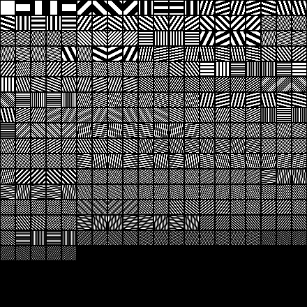
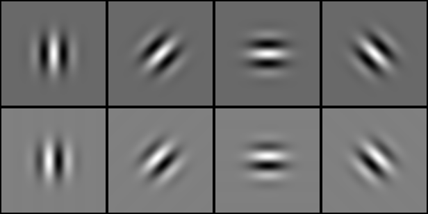

# Kuvien taajuusanalyysi

Tässä luvussa tutustumme taajuustasoon ja opimme analysoimaan kuvia ja muitakin
signaaleja Fourier-muunnoksen avulla. Aiheina *Fourier-muunnos*, *DFT/FFT*,
lyhyesti *Gaborin suotimet*.

Käytännöllisiä asioita tällä kerralla:

* kokeillaan DFT:tä erilaisiin oikeisiin ja keinotekoisiin kuviin,
* mietitään taajuustason sisältämää informaatiota,
* kokeillaan Gaborin suotimia kuviin.

## Näytteistetyn signaalin integroituva malli

Fourier-analyysiä varten meidän on pystyttävä esittämään kuva integroituvana
funktiona. Intuitiivisesti ajateltuna kuvan integraalin tulisi olla kuvan
kaikkien pikselien summa, mutta jos integroimme pisteittäin määriteltyä
funktiota, jollainen näytteistetty kuva on, integraaliksi tulee $0$.

Edellisestä luvusta muistamme Diracin $\delta$:n, jonka integraali yli koko
reaaliakselin on $1$. Koska $\delta$ saa arvon $0$ kaikkialla muualla paitsi
origossa, on funktion $f$ ja $\delta$:n tulon integraali sama kuin $f(0)$.

$$\int_{-\infty}^{\infty}\delta(x)f(x)dx = f(0).$$

Summaamalla yhteen siirrettyjä versioita $\delta$:sta siten, että jokaisessa
reaaliakselin kokonaislukupisteessä on oma $\delta$, saadaan funktionkaltainen
matemaattinen konstruktio, jonka integraali yli reaaliakselin on funktion $f$
arvojen summa. Näin saamme siis määriteltyä näytteistetyn signaalin
integroituvana funktiona, joka on summa joukosta siirrettyjä $\delta$-olioita.

## Fourier-muunnos

Aiemmin esitettiin tulkinta, jonka mukaan kuvat ovat vektoreita eli painotettuja
summia *kantavektoreista* jotka puolestaan vastaavat yksittäisiä pikseleitä.
Lineaarialgebrasta on tuttua ajatus siitä, että vektoriavaruuksissa voidaan
suorittaa *kannanvaihtoja* eli esittää samat vektorit joidenkin toisten
kantavektoreiden avulla. Tällaiset kannanvaihdot voidaan myös kääntää ja
palauttaa vektorit alkuperäisten kantavektorien mukaiseen muotoon. Kannanvaihdon
tavoitteena on yleensä saada jotakin etua muuntamalla vektorit sellaiseen
muotoon jolla on joitakin hyödyllisiä ominaisuuksia tutkittavan ongelman
kannalta.

Aiemmalla luennolla havainnollistettiin, kuinka signaaleita voidaan koostaa
summaamalla yhteen *taajuuskomponentteja*, jotka ovat eri taajuisia
*siniaaltoja*. Muuttamalla siniaaltojen amplitudia ja vaihetta saadaan
taajuuskomponentit vahvistamaan ja kumoamaan toisiaan sopivasti. Mutta voiko
tällä tavalla saada aikaan minkä tahansa signaalin? Käy ilmi, että vastaus on
kyllä, ja että **Fourier-muunnos** on työkalu jolla minkä tahansa signaalin saa
purettua erillisiksi taajuuskomponenteikseen.

Fourier-muunnos voidaan ymmärtää kannanvaihtona, jossa uudet kantavektorit ovat
taajuuskomponentteja. Kuvien tapauksessa nämä ovat eri suuntiin eteneviä ja eri
taajuisia *sinitasoaaltoja*, eli tasossa eteneviä siniaaltoja, jotka saavat
vakioarvoja tietyn suuntaisilla suorilla. Kannanvaihdon tavoitteena on, että
nämä siniaaltokomponentit kuvaisivat kuvassa tapahtuvia tietyn suuntaisia ja
taajuisia muutoksia. Seuraavassa kuvassa on muutamia esimerkkejä eri taajuisista
sinitasoaalloista.

Voi tuntua kummalliselta ajatella siniaaltoja kantavektoreina, mutta on
muistettava että tutkimme *vektorimuodossa* olevia kuvia. Kantavektorit ovat
hyvin korkeaulotteisia, ja ne ovat tulkittavissa kuviksi jos vektorien arvot
järjestetään sopivalla tavalla riveiksi ja tulkitaan vektorin alkioiden arvot
pikselien kirkkauksiksi. Normaalissa kuvakannassa kantavektorit ovat sellaisia,
joissa vain yksi arvo poikkeaa nollasta. Sisätulo tällaisen kantavektorin kanssa
tuottaa siis hyvin *paikallista* informaatiota kuvasta. Fourier-kannassa
kantavektorien arvoista suurin osa poikkeaa nollasta, ja kuvana esitettäessä ne
näyttävät sinitasoaalloilta. Sisätulo Fourier-kantavektorien kanssa siis tuottaa
informaatiota kuvan *globaaleista* säännöllisistä vaihteluista.

Tutkitaan aluksi Fourier-muunnosta jo aiemmin tutkimillemme yksiulotteisille
keinotekoisille signaaleille. Yksiulotteisen integroituvan signaalin $g(x)$
Fourier-muunnos määritellään näin:

$$F(g(x))(u) = \int_{-\infty}^{\infty}g(x)e^{-i 2 \pi ux}dx.$$

Eksponenttilauseke näyttää pelottavalta, mutta se on vain *Eulerin kaava*, joka
esittää trigonometristen funktioiden ja kompleksisen eksponenttifunktion
yhteyden. Eulerin kaava kertoo, että $e^{ix} = cosx + i sinx$ ja
$e^{-ix} = cos(-x) + i sin(-x) = cos x - i sin x$, joten yllä oleva
eksponenttilauseke voidaan kirjoittaa auki näin:

$$e^{-i 2 \pi ux} = cos(2 \pi ux) - i sin(2 \pi ux).$$

Huomataan, että tuloksena on *kompleksilukuja*. Fourier-muunnos tuottaa siis
$x$:n suhteen määritellystä reaaliarvoisesta funktiosta $u$:n suhteen
määritellyn kompleksiarvoisen funktion, jonka reaali- ja imaginaariosa ovat
kumpikin siniaaltoja. Tarkennetaan vielä, että myös alkuperäinen funktio $g$ on
itse asiassa kompleksiarvoinen funktio, jonka imaginaariosa vain on kaikkialla
$0$.

Kaava $e^{ix}$ voidaan tulkita siten, että se piirtää yksikköympyröitä
reaaliakselin ympäri kun $x$ liikkuu pitkin reaaliakselia. Tällöin reaalitasoon
projisoituna tulos näyttää siniaallolta. Tästä saadaan myös selitys sille, minkä
takia Fourier-muunnoksen tulos koostuu kompleksiluvuista: jotta Fourier-muunnos
pystyisi esittämään kaikki mahdolliset syötteet taajuustasossa, sen täytyy voida
esittää siniaallon *taajuuden* lisäksi sen *amplitudi* eli siniaallon 'korkeus'
tai voimakkuus sekä *vaihe* eli intuitiivisesti ajateltuna mistä kohdasta
siniaallon värähtely 'alkaa'. Aallon korkeus ja vaihe esitetään kompleksitasossa
polaarikoordinaatteina. Korkeus on etäisyys origosta, eli intuitiivisesti
reaaliakselin ympärille piirtyvän ympyrän säde, ja vaihe on kulma joka osoittaa
alkukohdan josta ympyrää aletaan piirtää lähdettäessä liikkeelle origosta.
Taajuus on ymmärrettävä nopeutena jolla ympyrää piirretään suhteessa $x$:n
muutosnopeuteen. Jos syötesignaali on parillisesti symmetrinen taajuuden suhteen
(eli kaikki taajuuskomponentit ovat nollia origossa), Fourier-muunnoksen tulos
on täysin reaalinen.

## Diskreetti Fourier-muunnos

Esitetään seuraavaksi, kuinka Fourier-muunnos lasketaan diskreetille
signaalille. Kyseinen operaatio on *diskreetti Fourier-muunnos* (engl.
*Discrete Fourier Transform*) joka lyhennetään usein DFT. Tutkitaan aluksi
*N-periodista* diskreettiä signaalia, joka esitetään $N$-ulotteisena vektorina
$x(n), n \in [0,N-1]$. Periodisuusehto tarkoittaa sitä, että kyseessä tulisi
olla *ääretön* signaali, jossa sama $N$:n alkion jono toistuu loputtomasti.
Äärellisellä signaalilla tämä saadaan aikaan, kun signaali vaimennetaan
molemmissa päissä nollaan. Jos näin ei tehdä, tulokseen voi tulla virhettä. Tämä
johtuu siitä, että Fourier-muunnos tulkitsee signaalin periodiseksi ja olettaa,
että arvon $x(N-1)$ jälkee tulee uudestaan $x(0)$. Jos tässä kohtaa on hyppäys,
se vaikuttaa koko signaalin taajuusanalyysiin.

Signaalin $x(n)$ diskreetti Fourier-muunnos voidaan laskea kaavalla

$$F\left(x\left(n\right)\right)\left(u\right) = \sum_{n=0}^{N-1}
  x\left(n\right) \cdot e^{-i 2 \pi \frac{un}{N}}, u \in \mathbb{Z}.$$

Käyttämällä Eulerin kaavaa tämä muuttuu muotoon

$$F\left(x\left(n\right)\right)\left(u\right) = \sum_{n=0}^{N-1}
  \left(x\left(n\right) \cdot \cos\left(2 \pi \left(\frac{un}{N}\right)\right) -
  i \cdot x\left(n\right) \cdot
  \sin\left(2 \pi \left(\frac{un}{N}\right)\right)\right).$$

Tuloksena on siis kompleksilukuja, jotka vastaavat tietyn taajuisen siniaallon
amplitudia ja vaihetta. Näitä lukuja kutsutaan *Fourier-kertoimiksi* (engl.
*Fourier coefficients*). Koska Fourier-muunnos on *periodinen*, normaalisti on
riittävää käyttää $u$:n arvoja väliltä $\left[0,N-1\right]$. Lisäksi reaalisilla
syötteillä Fourier-muunnos on *symmetrinen*, joten periaatteessa vain puolet
kertoimista tarvitaan (loput saadaan peilaamalla alkuosa), ja lisäksi kertoimet
$0$ ja $N/2$ ovat aina reaalilukuja ja vastaavat koko signaalin *keskiarvoa*.

Käänteinen Fourier-muunnos, jolla saadaan takaisin alkuperäiset arvot $x(n)$, on

$$x\left(n\right) = \frac{1}{N}\sum_{u=0}^{N-1}
  F\left(x\left(n\right)\right)\left(u\right) \cdot e^{i 2 \pi \frac{un}{N}},
  n \in \mathbb{Z}.$$

Käytetään jälleen Eulerin kaavaa ja muistetaan, että lopputulos on reaaliluku,
joten imaginaariosa voidaan olettaa nollaksi.

$$x(n) = \sum_{u=0}^{N-1}
  \left(Re\left(F\left(x\left(n\right)\right)\left(u\right)\right) \cdot
  \cos\left(2 \pi \left(\frac{un}{N}\right)\right) -
  Im\left(F\left(x\left(n\right)\right)\left(u\right)\right) \cdot
  \sin\left(2 \pi \left(\frac{un}{N}\right)\right)\right).$$

### Tehtävä 4.1 {-}

Seuraavassa koodiesimerkissä esitetään aiemmilta luennoilta tutun
yksiulotteisen, korruptoidun signaalin palauttaminen Fourier-kertoimista.
Kurssisivulla pääsee kokeilemaan erilaisia signaaleita ja eri tapoja valita
Fourier-kertoimet. Oheisessa kuvassa on esitetty yhdeksästä vahvimmasta
kertoimesta palautettu signaali, ja nähdään että se on lähellä oikeaa. On
huomattava, että signaalin arvoväli skaalataan eri tavalla Fourier-muunnoksen
yhteydessä, joten Fourier-kertoimet eivät täysin vastaa signaalin generoimisessa
käytettyjä amplitudi- ja vaihearvoja. Kokeile erilaisilla signaaleilla,
kohinan tasoilla ja käänteismuunnoksessa käytettyjen komponenttien määrillä.
Kuvaile Fourier-muunnoksien eroja ja käänteismuunnoksen tuloksia.

~~~{.haskell .jy-vision}
{-#LANGUAGE NoImplicitPrelude#-}
import CVLangUC

-- plot width in pixels
width = 400
-- plot height in pixels
height = 300
-- plot margin
margin = 10
-- plot x scale
xscale = 4*pi
-- plot y scale
yscale = (sum(amplitudes) - ymin)
-- y value minimum
ymin = min(0, (head(amplitudes) - sum(tail(amplitudes))))
-- standard deviation of the additive gaussian noise
-- TODO: try different noise levels
gaussianNoiseSigma = 1.0

-- how many of the largest frequency components are used in reconstruction
-- TODO: try changing this count
componentCount :: Int
componentCount = 9

amplitudes :: [Float]
phases :: [Float]

-- amplitudes a and phases p for b [0..10] frequency components
-- TODO: try different kinds of signals
-- signal is calculated as a[0] + sum of all (a * sin (bx + p*pi))
--          b:   0    1    2    3    4    5    6    7    8    9   10
amplitudes = [10.0, 2.0, 5.0, 0.0, 0.0, 2.0, 0.0, 0.0, 0.0, 0.0, 1.0]
phases =     [ 0.0, 1.0, 0.0, 0.0, 0.0,-0.5, 0.0, 0.0, 0.0, 0.0, 1.0]

test :: CVLang()
test = do
  let
    signal = sample((width-2*margin), xscale, signalGenerator(amplitudes,phases))
    corrupted = corruptSignalWithGaussian(gaussianNoiseSigma, signal)
    fsignal = dft1D(corrupted)
    -- create a plottable signal from the logarithm of the fourier magnitude
    msignal = zip(forEach(signal,fst),forEach(dftToPolar1D(fsignal),lnMag))
    isignal = zip(fstItems(corrupted), idft1D((-componentCount),fsignal))
    clean =
        signalToPixel((width,height), margin, (xscale,yscale), ymin, signal)
    points =
        signalToPixel((width,height), margin, (xscale,yscale), ymin, corrupted)
    ipoints =
        signalToPixel((width,height), margin, (xscale,yscale), ymin, isignal)
    mpoints =
        signalToPixel((width,height), margin,
          (xscale,maximum(forEach(msignal,snd))), 0, msignal)
  displayImage("Signaalin Fourier-muunnos",
      plotLines(red, 1, mpoints, emptyColorImage((width,height), white)))
  displayImage("Suodatettu signaali",
      plotLines(blue, 2, ipoints,
        plotLines(red, 1, points,
          plotLines(green, 2, clean,
            emptyColorImage((width,height), white)))))

yToFloat((x,y)) = (x,realToFrac y)
yToDouble((x,y)) = (x,realToFrac y)
lnMag(_,a,p) = log(sqrt(a**2+p**2))
~~~

## Kaksiulotteinen Fourier-muunnos

Kaksiulotteisen integroituvan signaalin $g(x,y)$ Fourier-muunnos määritellään
samaan tapaan kuin yksiulotteisen:

$$F\left(g\left(x,y\right)\right)\left(u,v\right) =
  \int_{-\infty}^{\infty}\int_{-\infty}^{\infty}
  g\left(x,y\right) \cdot e^{-i 2 \pi \left(ux+vy\right)}dxdy.$$

Fourier-muunnos tuottaa siis $x$:n ja $y$:n suhteen määritellystä
reaaliarvoisesta funktiosta $u$:n ja $v$:n suhteen määritellyn
*kompleksiarvoisen* funktion, jonka reaali- ja imaginaariosa ovat kumpikin
sinitasoaaltoja.

Eksponenttilauseke saadaan kirjoitettua jälleen auki

$$e^{-i 2 \pi\left(ux+vy\right)} = \cos\left(2 \pi \left(ux + vy\right)\right)
  - i \sin\left(2 \pi \left(ux + vy\right)\right)$$

ja tämän lausekkeen reaaliosaa- ja imaginaariosia tutkimalla havaitaan, että ne
tuottavat molemmat vakioarvoja, kun $(ux+vy)$ on vakio. Näin tapahtuu siis
pitkin reaali- ja kompleksitason suoria, joiden suunnalle $\theta$ pätee
$\tan\left(theta\right) = \frac{v}{u}$. Tuloksena on siis kohtisuoraan tätä
suoraa vastaan eteneviä siniaaltoja, joiden *taajuus* eli värähtelynopeus on
$\sqrt{u^2 + v^2}$. Reaali- ja kompleksitason sinitasoaallot ovat muuten
samanlaisia, mutta ne ovat vastakkaisessa vaiheessa.

Yllä kuvattuja sinitasoaaltoja kutsutaan *spatiaalisiksi taajuuskomponenteiksi*
ja Fourier-muunnokseen sisältyvä integraali tulee ymmärtää *sisätulona* näiden
taajuuskomponenttien mukaisten vektorien kanssa. Sisätulo mittaa kuinka paljon
tiettyä vektoria 'sisältyy' toiseen vektoriin, joten voidaan ymmärtää
integraali operaationa, joka mittaa kuinka paljon kutakin taajuuskomponenttia
sisältyy kuvaan.

## Kaksiulotteinen diskreetti Fourier-muunnos

Moniulotteisen signaalin Fourier-muunnos voidaan laskea muuntamalla dimensio
kerrallaan käyttäen yksiulotteista muunnosta. Kuvan tapauksessa siis voidaan
muuntaa ensin sarake kerrallaan ja sitten tämän operaation tulos rivi
kerrallaan, tai toisinpäin. Olkoon nyt $I(x,y)$ kuva, jonka leveys on $W$ ja
korkeys $H$, jolloin $x \in [0,W-1]$ ja $y \in [0,H-1]$. Kuvan diskreetti
Fourier-muunnos on

$$\begin{aligned}
  F\left(I\left(x,y\right)\right)\left(u,v\right)
  &= \sum_{x=0}^{W-1} e^{-i 2 \pi \frac{ux}{W}} \cdot
  \left(\sum_{y=0}^{H-1} e^{-i 2 \pi \frac{vy}{H}} \cdot
  I\left(x,y\right)\right) \\
  &= \sum_{x=0}^{W-1} \sum_{y=0}^{H-1} I\left(x,y\right) \cdot
  e^{-i 2 \pi \left(\frac{ux}{W}+\frac{vy}{H}\right)}.
  \end{aligned}$$

Tuloksena on siis ikään kuin kompleksiarvoinen kuva, joka on saman kokoinen kuin
alkuperäinen kuva. Jokaista tuloskuvan 'pikseliä' kohti lasketaan summa kaikista
alkuperäisen kuvan pikseleistä kerrottuna sinitasoaaltoja kuvaavalla
eksponenttilausekkeella. Onkin helppo nähdä, että Fourier-muunnos on hyvin
kallis operaatio, ja juuri tämän vuoksi *nopean Fourier-muunnoksen*
mahdollistavaa algoritmia (engl. *Fast Fourier Transform*, FFT) pidetään
merkittävänä keksintönä.

Käänteismuunnos kuvalle on vastaavasti kuin aiemmin

$$\begin{aligned}
  I\left(x,y\right)
  &= \frac{1}{N*M} \sum_{u=0}^{W-1} \sum_{v=0}^{H-1}
  F\left(I\left(x,y\right)\right)\left(u,v\right) \cdot
  e^{+i 2 \pi \left(\frac{ux}{W}+\frac{vy}{H}\right)}.
  \end{aligned}$$

Muistetaan vielä tapa, jolla eksponenttilauseke avataan, ja saamme seuraavat
kaavat:

$$\begin{aligned}
  e^{-i 2 \pi \left(\frac{ux}{W}+\frac{vy}{H}\right)}
  &= \cos\left(2 \pi \left(\frac{ux}{W}+\frac{vy}{H}\right)\right)
  -i \sin\left(2 \pi \left(\frac{ux}{W}+\frac{vy}{H}\right)\right) \\
  e^{+i 2 \pi \left(\frac{ux}{W}+\frac{vy}{H}\right)}
  &= \cos\left(2 \pi \left(\frac{ux}{W}+\frac{vy}{H}\right)\right)
  +i \sin\left(2 \pi \left(\frac{ux}{W}+\frac{vy}{H}\right)\right).
  \end{aligned}$$

Näiden perusteella voimme vaikkapa toteuttaa käsin kuvien naiivin Fourier-
muunnoksen ja käänteismuunnoksen, ja yrittää hieman ymmärtää sen toimintaa.
On syytä huomata, että näin toteutettuna operaatio on erittäin hidas vähänkin
suuremmille kuville, joten pitäydytään pienikokoisissa esimerkeissä.

### Tehtävä 4.2 {-}

Seuraavassa koodiesimerkissä esitetään yksinkertaisen kuvan taajuustason
amplitudi ja vaihe. Kurssisivulla pääsee kokeilemaan eri kuvia. On huomattava,
että tässä DFT toteutetaan naiivisti, joten suurilla kuvilla operaatio on hyvin
hidas. Tutki erilaisten pikkukuvien Fourier-muunnoksen polaariesitystä. Pohdi
ja kuvaile eri kuvien eroja.

~~~{.haskell .jy-vision}
{-#LANGUAGE NoImplicitPrelude#-}
import CVLangUC

-- available test images; s in the beginning means 'smoothed'
-- TODO: try different images and compare results
disc     :: Image GrayScale Float
sdisc    :: Image GrayScale Float
torus    :: Image GrayScale Float
storus   :: Image GrayScale Float
square   :: Image GrayScale Float
ssquare  :: Image GrayScale Float
diamond  :: Image GrayScale Float
sdiamond :: Image GrayScale Float

test = do
  displayGrayImage("Amplitude", upscaleImage(8,logNormalize(amp)))
  displayGrayImage("Vaihe", upscaleImage(8,unitNormalize(pha)))
  where
    img = disc
    (re,im) = dft2D(img)
    (amp,pha) = dftToPolar2D(re,im)

-- 20pix image of r=5 white disc on black background
disc = discGrayImage(20,5,1,0)
sdisc = imGaussian((3,3), disc)
-- 24pix image of r1=3 and r2=9 white torus on black background
torus = torusGrayImage(24,3,9,1,0)
storus = imGaussian((3,3), torus)
-- 20pix image of r=5 white square on black background
square  = squareGrayImage(20,5,1,0)
ssquare = imGaussian((3,3), square)
-- 20pix image of r=5 white diamond on black background
diamond  = diamondGrayImage(20,5,1,0)
sdiamond = imGaussian((3,3), diamond)
~~~

### Tehtävä 4.3 {-}

Seuraavassa koodiesimerkissä havainnollistetaan pienen kuvan Fourier-kantaa
esittämällä painotetut kantavektorit samassa järjestyksessä kuin kertoimet
esitettiin yllä. Kantavektorit ovat siis pieniä kuvia. Kurssisivulla pääsee
kokeilemaan eri kuvia. Näistä voi havainnoida, minkä suuntaisia ja taajuisia
komponentteja kussakin pikkukuvassa on. Samalla voidaan tehdä johtopäätös, että
yksinkertainenkin kuva syntyy summana hyvin suuresta määrästä erilaisia
taajuuskomponentteja, jotka vahvistavat ja kumoavat toisiaan. Yksittäisistä
taajuuskomponenteista ei siis ole kovinkaan paljon apua kuvan analysoimisessa.
Tutki erilaisten pikkukuvien Fourier-kantaa. Osaatko selittää, mistä erot kuvien
välillä johtuvat?

~~~{.haskell .jy-vision}
{-#LANGUAGE NoImplicitPrelude#-}
import CVLangUC

-- available test images; s in the beginning means 'smoothed'
-- TODO: try different images and compare results
disc     :: Image GrayScale Float
sdisc    :: Image GrayScale Float
torus    :: Image GrayScale Float
storus   :: Image GrayScale Float
square   :: Image GrayScale Float
ssquare  :: Image GrayScale Float
diamond  :: Image GrayScale Float
sdiamond :: Image GrayScale Float

test = do
  displayGrayImage("Fourier-kanta", dftImages(re,im))
  where
    img = disc
    (w,h) = getSize(img)
    (re,im) = dft2D(img)

-- 20pix image of r=5 white disc on black background
disc = discGrayImage(20,5,1,0)
sdisc = imGaussian((3,3), disc)
-- 24pix image of r1=3 and r2=9 white torus on black background
torus = torusGrayImage(24,3,9,1,0)
storus = imGaussian((3,3), torus)
-- 20pix image of r=5 white square on black background
square  = squareGrayImage(20,5,1,0)
ssquare = imGaussian((3,3), square)
-- 20pix image of r=5 white diamond on black background
diamond  = diamondGrayImage(20,5,1,0)
sdiamond = imGaussian((3,3), diamond)
~~~

Seuraavassa puolestaan havainnollistetaan sitä, että Fourier-kanta tuottaa melko
*harvan* esityksen. Kuvan taajuuskomponentit on lajiteltu amplitudin mukaiseen
järjestykseen, ja käänteismuunnos on tehty käyttäen vain osaa komponenteista,
alkaen vahvimmasta ja lisäten komponenttien määrää yhdellä joka askelella.
Huomaamme siis, että muutama tärkein taajuuskomponentti palauttaa kappaleen
perusmuodon, ja sen jälkeen tulevat komponentit tuottavat vain pieniä
korjauksia.

Seuraavassa esitetään vielä taajuuskomponentit siinä järjestyksessä kuin niitä
yllä olevassa kuvassa käytetään.

## Fast Fourier Transform

Kuten yllä todettiin, jokaista Fourier-kerrointa varten on laskettava summa
kaikista kuvan pikseleistä kerrottuna sopivalla siniaaltofunktiolla. Naiivin
algoritmin aikavaativuus on siis $O(N^2)$ kun kuvan pikselien määrä on $N$.
Nopea FFT-algoritmi suoriutuu operaatiosta ajassa $O(N \log N)$ jakamalla
ongelmaa pienempiin osiin. Se tuottaa täsmälleen saman tuloksen, mutta koska
laskutoimitusten määrä on pienempi, pyöristysvirheiden kertautuminen saattaa
tehdä naiivista toteutuksesta jopa epätarkemman.

Seuraavassa esitetään valokuvan Fourier-muunnos käyttäen FFT-algoritmia.

~~~{.haskell .jy-vision}
{-#LANGUAGE NoImplicitPrelude#-}
import CVLangUC

test = do
  img <- readGrayImage("park.png")
  let
    (re,im) = complexSplit(dft(img))
    (amp,pha) = dftToPolar2D(im,re)
  displayGrayImage("Reaaliosa", logNormalize(re))
  displayGrayImage("Imaginaariosa", logNormalize(im))
  displayGrayImage("Amplitudi", logNormalize(amp))
  displayGrayImage("Vaihe", unitNormalize(pha))
~~~

Seuraavassa havainnollistetaan, että kuvien Fourier-muunnoksen oleellinen
informaatio sisältyy Fourier-kertoimien *vaiheeseen*: kahden eri kuvan
vaihekomponentit vaihdetaan keskenään, ja lopputuloksena oleva kuva muistuttaa
enemmän sitä kuvaa, jonka vaihekomponentti yhdistelmässä on. Tämä johtuu siitä,
että luonnollisia näkymiä esittävissä valokuvissa on aina melko samankaltainen
jakauma eri taajuuksia. Eroja on lähinnä siinä, mitä suuntia on edustettuna
enemmän. Kuvan oleelliset piirteet syntyvätkin siitä, millä tavoin
taajuuskomponentteja siirrellään eli mikä on kunkin komponentin vaihe.

~~~{.haskell .jy-vision}
{-#LANGUAGE NoImplicitPrelude#-}
import CVLangUC

test = do
  img1 <- readGrayImage("park.png")
  img2 <- readGrayImage("boat.png")
  let
    (pre,pim) = complexSplit(dft(img1))
    (bre,bim) = complexSplit(dft(img2))
    (pamp,ppha) = dftToPolar2D(pim,pre)
    (bamp,bpha) = dftToPolar2D(bim,bre)
    pimg = idft(dftMerge(polarToDft2D(pamp,bpha)))
    bimg = idft(dftMerge(polarToDft2D(bamp,ppha)))
  displayGrayImage("Puisto", img1)
  displayGrayImage("Vene", img2)
  displayGrayImage("Puisto+Vene", unitNormalize(pimg))
  displayGrayImage("Vene+puisto", unitNormalize(bimg))
~~~

## Konvoluutioteoreema

Ymmärrämme nyt mitä Fourier-muunnos tekee ja kuinka se lasketaan. Meillä on myös
tehokas työkalu sen laskemiseksi kuvista ja muista signaaleista. Mutta mitä
käytännön hyötyä siitä on? Taajuustason intuitiivinen hahmottaminen auttaa
ymmärtämään kuvasignaaleja, mutta koska Fourier-muunnos tuottaa *globaalia*
tietoa koko kuvasta, sitä on hankalaa käyttää varsinaisessa kuvan
analysoinnissa. Fourier-muunnoksella on kuitenkin joitakin hyödyllisiä
ominaisuuksia, joista tärkein lienee *konvoluutioteoreemana* tunnettu lause:

$$F\left(f \ast g\right) = F\left(f\right) \cdot F\left(g\right)$$

*Konvoluutio* muuttuu siis taajuustasossa *kertolaskuksi*. Tämä on erittäin
hyödyllistä, jos ajatellaan kuvien suodattamista hyvin suurilla maskeilla.
Konvoluutiohan vaatii maskin koon verran kerto- ja yhteenlaskuoperaatioita
jokaista pikseliä kohti. Jos maski on riittävän suuri, operaatio hoituu
nopeammin laskemalla sekä kuvan että maskin Fourier-muunnos, kertomalla ne
keskenään ja tekemällä lopputulokselle käänteismuunnos.

Muistamme myös konvoluution ja ristikorrelaation yhteyden edelliseltä luennolta.
Käy ilmi, että ristikorrelaatiolle pätee

$$F\left(f \star g\right) = F\left(f\right)^* \cdot F\left(g\right),$$

missä $F\left(f\right)^*$ tarkoittaa Fourier-muunnoksen *kompleksikonjugaattia*.

## Paikallinen taajuusinformaatio

Olemme todenneet jo useaan otteeseen, että Fourier-muunnoksen globaali luonne
tuottaa hankaluuksia. Jos halutaan paikallisempaa tietoa signaalin sisältämistä
taajuuksista, voidaan tietysti tutkia vain osaa signaalista kerrallaan. Tämä on
yleistä erityisesti äänisignaalien tapauksessa: voidaan tehdä Fourier-muunnosta
lyhyille aikapätkille kerrallaan. Tästä operaatiosta käytetään nimeä *short-time
Fourier transform* (STFT), toisinaan myös *short-term Fourier transform* jos
kyse ei ole ajan suhteen tapahtuvista muutoksista.

Tyypillinen tapa toteuttaa tällainen paikallinen Fourier-muunnos on kertoa
signaalia *ikkunointifunktiolla*, joka on nollaa suurempi vain rajoitetulla
osalla reaaliakselia. Gaussin funktio on yleisesti käytetty, vaikka se
periaatteessa onkin nollaa suurempi koko reaaliakselilla. Ikkunointi pakottaa
signaalin nollaksi muualla paitsi tutkittavan alueen ympäristössä, jolloin tämän
tulon Fourier-muunnos tuottaa paikallista tietoa taajuustasosta. Ongelmaksi
muodostuu *resoluutio*: jos ikkuna on kovin pieni, se tuottaa paikallisempaa
tietoa, mutta tutkittava taajuuskaista jää kapeaksi - kovin hitaita signaalin
muutoksia ei mahdu ikkunaan. Vastaavasti suurempi ikkuna tuottaa paikan tai ajan
suhteen globaalimpaa tietoa. Tästä käytetään termiä *epätarkkuusperiaate* (engl.
*uncertainty principle*).

Paikallisen Fourier-muunnoksen sukulaisoperaatio on Gaborin suotimilla
konvolvoiminen. Nämä suotimet koostuvat siniaallosta, jota kerrotaan Gaussin
funktiolla, jolloin siniaallon muodostama taajuuskomponentti vaimenee nollaan
pienen ikkunan ulkopuolella. Näillä suotimilla on reaali- ja kompleksiosa, joten
niillä konvolvointi vastaa eräänlaista paikallista Fourier-muunnosta. On
viitteitä siitä, että ihmisen aivokuoressa on neuroneita, jotka laskevat hyvin
paljon Gabor-suotimia muistuttavia esitysmuotoja verkkokalvon tuottamasta
informaatiosta. Vaikuttaakin siltä, että tällainen tieto on olennaista näkymien
analysoinnin kannalta, ja palaamme tähän myöhemmillä luennoilla.

~~~{.haskell .jy-vision}
{-#LANGUAGE NoImplicitPrelude#-}
import CVLangUC

-- the size of the mask; 7 recommended
size = 7
-- the index of mask centerpoint
center = getMaskCenter2D(size)
-- the used mask; available gabor1..gabor8, with different directions
mask = gabor1

g = [gabor1,gabor2,gabor3,gabor4,gabor5,gabor6,gabor7,gabor8]

test = do
  img <- readGrayImage("park.png")
  let
    (gre,gim) = filterGabor(mask, size, center, img)
    (gamp,gpha) = dftToPolar2D(gim,gre)
  displayGrayImage("Reaaliosa", logNormalize(gre))
  displayGrayImage("Imaginaariosa", logNormalize(gim))
  displayGrayImage("Amplitudi", stretchNormalize(gamp))
  displayGrayImage("Vaihe", unitNormalize(gpha))
~~~

## Spatial envelope

Vielä eräs tapa hyödyntää hieman paikallisempaa taajuustietoa on tehdä
kuvan Fourier-muunnos muutamassa osassa, esimerkiksi jakamalla kuva 4x4 osaan ja
muuntamalla kukin osa erikseen. Tällä tavalla saadaan tietoa siitä, millä
tavalla esimerkiksi kuvan ala- ja yläosa eroavat taajuuskomponenteiltaan, mikä
voi olla avuksi pääteltäessä millainen näkymä voisi olla kyseessä. Näitä eroja
kuvan sisällä ja kuvien välillä tutkitaan tilastollisesti. Tätä tekniikkaa on
kutsuttu kirjallisuudessa nimellä *spatial envelope*.

## Tehtäviä

1) Kokeile Fourier-muunnosta erilaisilla signaaleilla, kohinan tasoilla ja
   käänteismuunnoksessa käytettyjen komponenttien määrillä. Kuvaile Fourier-
   muunnoksien eroja ja käänteismuunnoksen tuloksia.
2) Tutki erilaisten pikkukuvien Fourier-muunnoksen polaariesitystä. Pohdi
   ja kuvaile eri kuvien eroja.
3) Tutki erilaisten pikkukuvien Fourier-muunnosta sekä polaarimuodossa että
   Fourier-kannan muodossa. Osaatko selittää, mistä erot kuvien välillä
   johtuvat?
