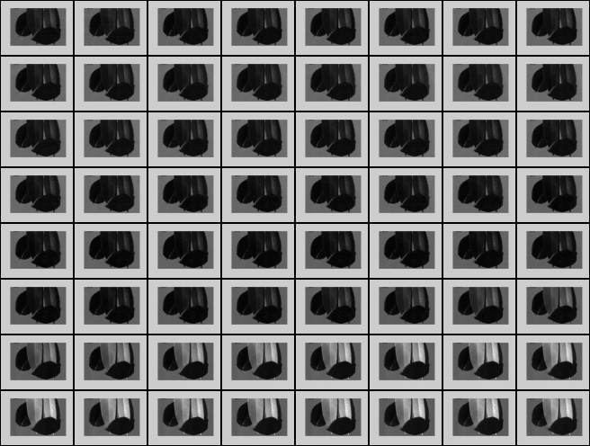
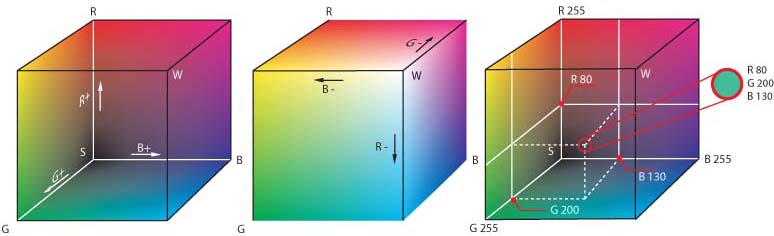
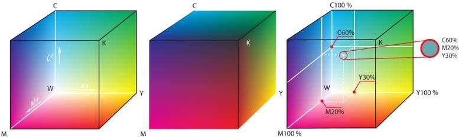
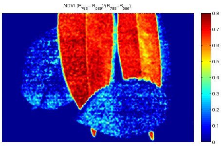

# Värit ja spektri

Tässä luvussa tutustumme lyhyesti väreihin ja värien spektriin sekä
spektrikuvaukseen. Sisältö perustuu vahvasti FT Ilkka Pölösen
luentomateriaaliin. Ilkan luentomuistiinpanot löytyvät pdf-muodossa
[täältä](https://www.dropbox.com/s/8qjtlvt485cbro5/spektri.pdf).

Tällä luennolla käytetään esimerkkeinä spektrikuvia, joissa on eläviä ja
muovisia lehtiä. Erotatko muovikasvin aidosta? Eri taajuuskaistoja on 64, ja
kurssisivun koodiesimerkeissä pääsee tutkimaan kaikkia erikseen. Tämä datasetti
on [ladattavissa täältä](https://www.dropbox.com/s/rud2k9j9yslu4xo/plant.zip).

Käytännöllisiä asioita tällä kerralla:

* spektrikuvien katselua,
* ehkä jotakin väreihin liittyvää,
* monikanavakuvien tutkailua.

Spektrikuvantaminen on nopeasti kasvava monitieteinen kuvantamiseen liittyvä
ala. Nimensä mukaisesti spektrikuvantamisessa yhdistyy kuvantaminen ja
spektrometria. Spektrikuva itsessään on siis yhdistelmä useista kuvista valon
eri aallonpituuksilla, kuten kuva \ref{fig:kuutio} esittää. Sensori- ja
linssiteknologian puitteissa spektrikuvia voidaan ottaa aina ultravioletista
termiseen infrapunaan asti. Kuvassa \ref{fig:spec} on esitetty sähkömagneettisen
säteilyn eri muotoja.

Ensimmäiset kokeet spektrin keinotekoiseksi hajoittamiseksi teki Isaac Newton
1600-luvulla. Tässä kokeessa Newton hajoitti prismoilla auringon valon
ihmissilmille näkyvät aallonpituudet sateenkaaren omaiseksi spektriksi.
Ihmissilmä näkee väreistä noin 400 - 700 nm alueen. Kuvassa \ref{fig:herkkyys}
on kuvattu sekä ihmissilmän, että kahden kuvasensorin CCD
(*Charge-Coupled Device*) ja CMOS (*Complementary Metal Oxide Semiconductor*)
suhteellista herkkyyttä. Ihmissilmä näkee lopulta vain hyvin kapean osan
spektristä, kun taas CCD- ja CMOS-sensoreilla voidaan kattaa moninkertaisesti
laajempi aallonpituusalue.

Tämän perusteella on myös digitaalisiin värikuviin luotu väriavaruudet.
Näistä yleisimmät ovat RGB (*Red-Green-Blue*) -avaruus ja CMYK
(*Cyan-Magneta-Yellow-Key*) -avaruus.

RGB-avaruus on kolmeulotteinen, kuten kuva \ref{fig:rgb} osoittaa, joka
esimerkiksi 24-bittisenä vaihtelee arvoja $R,G,B \in [0,255]$ välillä. Jos
kaikki arvot ovat $0$, väri on musta; vastaavasti, jos värivektorin kaikki
arvot ovat $255$, väri on valkoinen. Vastaavasti CMYK-avaruus on
neliuloitteinen. Siinä väriavaruutta säädellään kolmen värin ja mustan avulla.
Koska tietokoneiden näytöt pääsääntöisesti käyttävät RGB-mallia lienee se meille
tällä kurssilla mielenkiintoisempi.

RGB-kuvan ja spektrikuvan ero on ymmärrettävissä hyvin kuvasta
\ref{fig:cmos-spect}, jossa on kuvattu CMOS-RGB-sensorin herkyyttä RGB-alueella.
CMOS-värikennossa olevat kaivot lukevat kolmea eri väriä: sinistä, vihreää ja
punaista. Kuvasta havaitaan, että kennossa olevat pikselit kaappaat itseasiassa
aika leveitä kaistoja informaatiota itseensä. Koska punaisen kaivon herkkyysalue
jatkuu infrapunan puolelle on se useista kaupallisista kameroista leikattu pois
sopivalla suodattavalla filtterillä. Siinä missä RGB-kuva koostuu käytännössä
näiden kolmen värin leveistä kaistoista, koostuu spektrikuva useista kapeista
kaistoista (5 - 20 nm). Sensori käytännössä tallentaa siihen tietyssä ajassa
osuneiden fotonien määrän.

Näissä luentomuistiinpanoissa hyödynnetään spektrikuvaa, jossa on vaalealla
muovisella pinnalla kuvattuna vihreitä eläviä lehtiä ja tummia muovisia lehtiä.
Kuvassa \ref{fig:kuva1} on esitetty RGB-kuvaa jäljittelevä kuva lehdistä.
Tässä on aitojen RGB kaistojen sijaan hyödynnetty kolmea kapeaa spektrikaistaa,
jotka on otettu noin 400, 500 ja 650 nm kohdilta. Kuvassa \ref{fig:kuva2} on
esitetty kuvan kohteista otetut yksittäiset spektrit. Kuten spektreistä huomaa
on kasvillisuuden erottaminen muovista sangen helppoa. Elollisella aineksella on
yleisesti punaisen ja infrapunan rajalla varsin selkeä "reuna" ns. red-edge.

## Perusilmiöt

Useimmissa käytännön kuvaustilanteissa kamera tallentaa sen kennolle tulevaa
diffuusia valon heijastusta kuvatusta kohteesta. Tätä kutsutaan reflektanssiksi.
Käytännössä reflektanssiin vaikuttavat valon lähteen laatu ja kohteelle
ominainen absorbanssi. Jos kuvattava kohde heijastaa valoa myös muualta kuin sen
pinnasta (eli osa valosta kulkeutuu kohteen sisään ja heijastuu sieltä)
vaikuttaa kuvaukseen myös transmittanssi. Esimerkiksi iho on tälläinen kohde.

Absorptio (wikipedia) Absorptiolla tarkoitetaan kvanttimekaniikassa prosessia,
jossa fotonin energia siirtyy esimerkiksi atomille, jonka valenssielektroni
siirtyy korkeampaan energiatilaan. Fotoni häviää tässä prosessissa.
Absorboitunut energia voi emittoitua uudelleen tai muuttua lämpöenergiaksi.
Useimpien aineiden kyky absorboida sähkömagneettista säteilyä riippuu säteilyn
aallonpituudesta. Tämän johdosta osa aineen läpi kulkevasta valkoisen valon
aallonpituuksista suodattuu muita tehokkaammin pois ja aine nähdään värillisenä.
Esimerkiksi aine, joka absorboi sinistä, vihreää ja keltaista valoa havaitaan
punaisena, kun sitä valaistaan valkoisella valolla. Absorptiospektroskopian eli
eri aallonpituuksien absorboitumisen mittaamisen avulla voidaan tunnistaa eri
aineita näytteestä. Absorptio ei ole rajoittunut vain näkyvään valoon, vaan myös
kaikki muut sähkömagneettisen säteilyn aallonpituudet voivat absorboitua
aineeseen.

## Laitteet

Käytännössä spektrikuvaa muodostettaessa jonkin täytyy liikkua; joko se on
kuvattava kohde, kameran jalusta tai jonkinlainen filtteri. Kuvaustekniikoita,
joissa kohde tai kamera liikkuu kutsutaan skannaaviksi. Kuvassa \ref{fig:rivi}
on tyypillinen skannaavan spektrikuvantamislaitteen rakenne. Kohde liikkuu
skannausalustalla, kun kohde heijastaa valoa laitteen optiikkaan, niin valo
osuu prismaan, joka hajoittaa valon sensorikennolle. Tällöin kamera tallentaa
kerralla aina yhden spatiaalisen rivin kuvasta kaikilla kuvattavilla
aallonpituuksilla. Jyväskylän yliopistolta löytyy tälläinen spektrikamera
aallonpituusalueelle 1000-1700 nm.

Toinen vaihtoehtoinen tekniikka on liikuttaa filtteriä, kuten kuva
\ref{fig:taso} näyttää. Tällöin kamera tallentaa aina yhden spektrikaistan
kerrallaan. Erilaisia filtterisysteemejä on aina filtterikiekoista säädettäviin
nestekristallifilttereihin. Jyväskylän yliopistolla on Fabry-Perot
interferometriin pohjautuva spektrikamera.

Kuvassa \ref{fig:fabry} on esitetty Fabry-Perot interferometriin perustuvan
kameran optinen tie. FPI mahdollistaa kuvan nopean ottamisen sillä kahden
peilinvälistä ilmarakoa voidaan muuttaa muutamassa millisekunnissa
pietsosähköisellä ohjaimella. Kun ilmarakoa muutetaan päästää peilisysteemi
kolme aallonpituutta läpi. Tällöin vastaan ottava sensorikenno itseasiassa
tallentaa kolme aallonpituutta kerralla bayermatriisille.

Erilaisia spektrikuvantamislaitteiden valmistajia suomalaisten Specimin ja
Rikolan lisäksi on muun muassa yhdysvaltalainen Headwall ja norjalainen Norsk
Elektro Optisk. Filtterikiekkokameroita valmistaa muun muassa Pixelteq. Kun
aiemmin sanottiin, että jonkin täytyy liikkua spektrikuvaa ottaessa, niin
seuraavaksi kumotaan tämä väite. On kehitetty myös menetelmiä, joissa
sensorikennoon on esim. mikroprismojen kanssa suoraan integroitu
spektrierottelu. Nämä ovat sinällään toimivia tekniikoita, mutta niissä
integroidut hilat vievät tilaa spatiaaliresoluutiolta. Näissä sovelluksissa siis
sekä spektriresoluutio että spatiaaliresoluutio ovat pienempiä kuin aiemmin
esitetyissä.

## Datan käsittelyä

Seuraavaksi alamme päästä itse asiaan, eli spektrikuvien analysointiin.
Pääasiassa spektrikuvantamisen avulla havainnoidaan siis kohteen reflektanssia.
Kamerat eivät kuitenkaan suoraan tallenna reflektanssia vaan normalisoimattoman
digitaalisen suureen, joka riippuu valaistus oloista ja kuvausparametreista
esim. valotusajasta. Tällöin kuvat eivät ole vertailukelpoisia. Olkoon $I_{raw}$
raaka kuva ja olkoon $I_{dark}$ ja $I_{white}$ kuvattu musta referenssi ja
valkoinen referenssi. Näiden avulla voidaan laskea refektanssi

$$R = \frac{I_{raw}-I_{dark}}{I_{white}-I_{dark}}.$$

Pääosa seuraavaksi esitetyistä menetelmistä hyödyntää laskennassa spektrejä.
Tällöin käytännön sovelluksissa spektrikuva muunnetaan datamatriisiksi siten,
että jokainen rivi vastaa jotain kuvan spektriä.

Analytiikka  on ilmiö kohtaista, mikä ohjaa sitä mitä halutaan löytää.
Seuraavassa käydään läpi erilaisia tapoja käsitellä spektridataa ja jalostaa
siitä mahdollista lisäarvoa. Periaatteessa yksittäisiä kuvia on mahdollista
käyttää sellaisenaan, mutta seuraavien esimerkkien valossa voimme huomata, että
spektrikuvantaminen voi paljastaa silmille näkymättömiä asioita.

### Spektri-indeksit

Koska vanhimmat spektrikuvantamisen sovellukset tulevat kaukokartoituksesta,
myös monet menetelmät on alunperin kehitetty sitä varten. Erilaiset
spektri-indeksit ovat tapoja laskea kanavien välisiä suhteita. Ne ovat sinällään
aika karkeita tapoja käsitellä dataa. Niiden tulkinta vaatii yleensä vankkaa
tuntemusta kuvattavasta sovelluksesta. Spektri-indeksejä laskettaessa ei kuvaa
tarvitse muuttaa datamatriisin muotoon vaan sitä voidaan käsitellä edelleen
kuvakuutiona.

#### SR - Simple Ratio

Simple ratio on nimensä mukaisesti kahden spektrikanavan välinen suhde esim.

$$SR=R_{790}/R_{590},$$

kuten kuvassa \ref{fig:kuva3} on laskettu. Menetelmän avulla voidaan esimerkiksi
tunnistaa elävä aines muista materiaaleista.

Seuraavassa lasketaan SR kahdelle taajuuskaistalle kerrallaan. Kaista 23 vastaa
aallonpituutta $590$ ja kaista 58 aallonpituutta $790$ kuten yllä.

#### NDVI - Normalized Vegetation Index

NDVI on paljon käytetty kasvillisuusindeksi. Se on jo hitusen monimutkaisempi,
mutta sinällään sangen yksinkertainen indeksi laskettavaksi. NDVI:ssä
vertaillaan punaisen ja lähi-infrapunan kaistoja keskenään

$$NDVI = \frac{R_{nir}-R_{red}}{R_{nir}+R_{red}}.$$

NDVI on jo kertaluokkaa herkempi tunnistamaan eroja kasvillisuuden ja muiden
kohteiden välillä. NDVI:n tulkintaan vaikuttaa voimakkaasti se, kuinka kapeita
käytetyt kaistat ovat. Yleisesti ne kaistat pyritään ottamaan red-edgen
molemmilta puolin.

Seuraavassa lasketaan NDVI käyttäen samoja taajuuskaistoja kuin edellä.

### Kohteen tunnistaminen

Koska spektrin ajatellaan olevan karakteristinen erilaisille kohteille, on syytä
käydä läpi menetelmiä kohteen tunnistamiseen tunnetun spektrin avulla. Meidän
esimerkkikuvastahan me olemme identifioineet kolme spektriä (elävä lehti,
muovilehti ja tausta-alusta). Näitä havaittuja spektrejä voidaan lähteä etsimään
useilla erilaisilla menetelmillä. Periaatteessa spektrien samankaltaisuutta
voidaan mitata millä tahansa etäisyysmitalla. Näissä tapauksissa yksittäistä
spektriä $\mathbf{x} = (x_1,...,x_L)^T$ verrataan datamatriisin
$S = [\mathbf{s_1} \dots \mathbf{s_{M*N}}]$ spektreihin, missä $L$ on
spektrikanavien määrä ja $M$ ja $N$ spatiaaliresoluutio.

Ollakseen etäisyysmitta on funktion $d$ täytettävä kolme ominaisuutta:

* $d(\mathbf{x},\mathbf{s_i}) \geq 0$ kaikilla spektreillä, ja
  $d(\mathbf{x},\mathbf{s_i}) = 0$ jos ja vain jos $\mathbf{x}=\mathbf{s_i}$.
* $d(\mathbf{x},\mathbf{s_i}) = d(\mathbf{s_i},\mathbf{x})$
* $d(\mathbf{x},\mathbf{s_i}) \leq d(\mathbf{x},\mathbf{s_j}) +
   d(\mathbf{s_j},\mathbf{s_i})$

Yksinkertaisimmillaan voidaan käyttää tavallista euklidista etäisyysmittaa,
mutta muutkaan tunnetut mitat kuten esimerkiksi Minkowskin Mahalanobiksen tai
Chebyshevin etäisyysmitat.

#### Euklidinen etäisyysmitta

Euklidinen etäisyysmitta $R^2$:ssa lienee tutuimmasta päästä etäisyysmittoja. Se
on Minkowskin etäisyyden erikoistapaus, joka meidän esimerkin tapauksessa menisi
seuraavasti:

$$d_{l2}(\mathbf{x},\mathbf{s_i}) =
  \left(\sum_{j=1}^L|x_j -s_{i,j}|^2\right)^{1/2}.$$

Kun kaikki datamatriisin $S$ vektorit on käyty läpi, voidaan kohdevektorin
$\mathbf{x}$ etäisyydet muihin pisteisiin järjestää kuvaksi. Kuvassa
\ref{fig:kuva5} on esitetty esimerkki kuvamme etäisyyskuvat kolmelle eri
spektrijäljelle. Kuten kuvasta huomataan, etäisyysmitta antaa jo paljon
tarkempia tuloksia kuin spektri-indeksit. Lisäksi menetelmät ovat vähemmän
herkkiä kuvassa esiintyvälle kohinalle. Tätä kuten muitakin mittoja voidaan
käyttää luokittelemaan kuvassa näkyviä kohteita määrittämällä kynnysarvoja,
joiden mukaan tuloksia suodatetaan.

#### SAM - Spectral Angle Mapper

SAM mittaa nimensä mukaisesti spektrien välistä kulmaa. Käytännössä siis spektri
on $L$-uloitteinen vektori, ja tällaisten vektoreiden välinen kulma voidaan
laskea suoraan käyttämällä kosinin käänteisfunktiota

$$SAM(\mathbf{x},\mathbf{s_i}) =
  \cos^{-1} \frac{\langle \mathbf{x},\mathbf{s_i} \rangle}
                 {\|\mathbf{x}\| \|\mathbf{s_i}\|},$$

missä $\langle \mathbf{x},\mathbf{s_i} \rangle = \sum_{l=1}^L x_l s_{il}$,
$\|\mathbf{x}\| = (\sum_{l=1}^L (x_l)^2)^{1/2}$ ja vastaavasti
$\|\mathbf{s_i}\| = (\sum_{l=1}^L (s_{il})^2)^{1/2}$. Kuvassa \ref{fig:kuva6}
on esitetty tulokset verrattuna euklidiseen mittaan. Kuvia vertailemalla voidaan
todeta SAM:n antavan paremmat erottelutulokset kuin euklidinen mitta antaa.

#### SID - Spectral Divergence

Kolmas näillä luennoilla esitettävä tapa vertailla spektrejä on SID, joka
pohjatuu informaatioteoriaan. SID vertailee kahden vektorin välistä entropiaa.
SID hyödyntää informaatioteoriassa tunnettua Kullbach-Leibner divergenssiä.
Käytännössä vertailtavista spektreistä pitää ensin laskea todennäköisyysjakaumat
$\mathbf(p) = (p_1,...,p_L)^T$ ja $\mathbf(q) = (q_1,...,q_L)^T$ siten, että $p_l = x_l / \sum_1^L x_l$ ja $q_l = s_{il} / \sum_1^L s_{il}$.
Nyt suhteellinen entropia eli Kullbach-Leibner divergenssi on

$$D_{kl}(\mathbf{x} \| \mathbf{s_i}) = \sum_{l=1}^L p_l \log (q_l/p_l).$$

Nyt on syytä huomata, että KLD ei ole symmetrinen. $D_{kl}(\mathbf{x} \| \mathbf{s_i}) \neq D_{kl}( \mathbf{s_i} \| \mathbf{x})$ kaikilla $\mathbf{s_i}$. SID taas on symmetrinen, koska

$$SID(\mathbf{x} ,\mathbf{s_i}) =
  D_{kl}(\mathbf{x} \| \mathbf{s_i}) +D_{kl}( \mathbf{s_i} \| \mathbf{x}).$$

Kuvassa \ref{fig:kuva7} on esitetty SID:n tulokset spektrikuville.
Mittapohjaisten menetelmien heikkous on, ettei niillä päästä käsiksi alle
pikselin kokoisiin kohteisiin.

### Spektrierottelu

Tässä luvussa keskitymme lineaariseen erottelumalliin (unmixing).
Spektrikuvantamisen tapauksessa erottelu on tarpeellista silloin, kun kuvan
pikselit pitävät sisällään eri aineita. Tämä tilanne on tyypillinen
kaukokartoitussovelluksissa kuten satelliitista tai korkealta lentokoneesta
kuvattaessa. Kuvassa \ref{fig:subpixel} on Agoran päällä "pikseliruudukko", jos
kuva otetaan tarpeeksi kaukaa kohde näyttää hieman oikean puoleiselta kuvalta,
jossa yksittäiset pikselit eivät pysty erottelemaan kohteen yksityiskohtia.
Meidän on kuitenkin mahdollista laskea datasta kohteiden puhtaita spektrijälkiä
(kirjallisuudessa puhutaan endmembereistä), joiden suhteellista esiintymistä
kussakin pikselissä voidaan arvioida.

Kuvassa \ref{fig:unmix} pyritään graafisesti avaamaan lineaarista
erotteluongelmaa. Koska $L$ ulotteisen avaruuden visualisointi on hankalaa
(kun $L\> 3$), niin data projisoidaan alempaan ulottuvuuteen. Monet menetelmät
hyödyntävät esimerkiksi PCA:ta datan käsittelyssä.

Kohdassa A meillä on kaksi tunnettua endmemberiä $x_1$ ja $x_2$. Lisäksi olemme
havainneet pisteen $y$, joka on itseasiassa sekoite $x_1$:stä ja $x_2$:sta
suhteessa $a_1$ ja $a_2$. Tällöin siis

$$y = a_1  x_1 + a_2 x_2,$$

missä $a_i \geq 0$ kaikilla $i$ ja  $\sum_i a_i = 1$.  Kohdassa B kuvassa
\ref{fig:unmix} meillä on jo kolme tunnettua endmemberiä, jolloin

$$y = a_1  x_1 + a_2  x_2 + a_3  x_3,$$

ja $a_i$:t kuten aiemmin. Tästä päästäänkin helpommin yleiseen muotoon, joka on

$$y = \sum_i a_i  x_i,$$

missä $i$ on endmemberien lukumäärä. Koska spektrit ovat vektoreita on
erottelumalli vektroreille seuraava

$$\mathbf{y} = \sum_i a_i \mathbf{x_i}.$$

Edelleen spektrikuva koostuu suuresta määrästä havaitoja, jotka voidaan
järjestää datamatriisiksi $S = (\mathbf{s_1} ... \mathbf{s_{m*n}})^T$. , niin
myös lineaarinen erottelumalli voidaan esittää muodossa

$$S = AX,$$

missä $X = (\mathbf{x_1} ... \mathbf{x_p})$ ja

$$A = \left(
  \begin{array}{ccc}
    a_{1,1}   & \ldots & a_{1,p} \\
    \vdots    & \ldots & \vdots  \\
    a_{m*n,1} & \ldots & a_{m*n,p}
  \end{array}\right),$$

jolloin siis jokaiselle $S:n$ pisteelle saadaan jokaisen endmemberin
suhteellinen esiintymisarvo, jotka voidaan sitten järjestää suhteellisiksi
esiintymiskuviksi. Tällä tavoin voidaan siis selvittää, että jokin yksittäinen
pikseli sisätlää 30\% vettä, 30\% nurmikkoa ja 40\% rakennusta.

Käytännössä lineaarisessa ongelmassa pitää siis ratkaista $A$:n arvot. Tämä
onnistuu muun muassa pienemmän neliösumman menetelmällä tai sitten esimerkiksi
filtteri vektori algoritmia (FVA) hyödyntäen. Jos pienimmän neliösumman
menetelmää vertaillaan FVA:han, niin FVA on robustimpi, mutta toisaalta se
hyödyntää pelkiä matriisi operaatioita, jolloin sen laskennallinen kustannus on
huomattavasti pienempi kuin pienimmän neliösumman menetelmien.

FVA muodostaa matriisin $F$ filtterivektoreita, joiden avulla voidaan laskea
endmembereiden suhteellinen esiintyminen

$$A = FS$$

$$F = (RX)^{-1}R \text{ and } R = X^T - (\frac{I}{N} X)^T$$

missä $I$ on $L \times L$ yksikkömatriisi.

Luonnollisissa kuvissa on aina enemmän tai vähemmän kohinaa, jolloin
todellisuudessa datapisteet eivät ole nätisti endmembereiden muodostaman
konveksin peitteen alla kuten kuvassa \ref{fig:unmix}C on havainnoillistettu.
Sinällään tämä ei tuota kohinan ollessa kohtuullista ongelmaa tai jos
endmemberit ovat tunnettuja. Ongelmaksi muodostuvat ne tilanteet, jolloin
kohinaa on paljon tai endmembereitä ei tunneta.

Käymme seuraavaksi lyhyesti läpi muutamia menetelmiä, joiden avulla datasta
voidaan hakea endmembereitä. Nämä menetelmät tukeutuvat datan konveksiin
geometriaan. Kuvassa \ref{fig:unmix}D on esitetty tilanne, jossa endmembereiden
määrää ei tarkalleen tunneta etukäteen ja datassa on kohinaa. Useimmat
geometriseen lähestymistapaan nojautuvat algoritmit tarvitsevat ennakkotietoa
etsittävien endmembereiden määrästä. Jos etsitään väärää määrää kuvasta
lopputulokset voivat olla aika villejä.

#### Pixel purity index

Pixel purity index on ensimmäisiä, jo 1994, kehitettyjä endmembereiden
etsintäalgoritmeja. PPI hyödyntää myös ortogonaalista datan projisointia.
Ensiksi algoritmi generoi joukon satunnaisia yksikkövektoreita, kattamaan kaikki
mahdolliset projektion suunnat ja sitten ortogonaalisesti projisoi kaikki
spektrikuvan vektorit näiden avulla. etsien jokaiselle yksikkövekrtorille minimi
ja maksimi projektiot. Nyt jokaiselle kuvan spektrille lasketaan niide
yksikkövektorien määrät, jotka tuottavat maksimi tai minimiprojektion
spektrille. Nämä arvot määrittävät PPI:n ja määrittämällä kynnysarvo saadaan
endmemberit selville kynnyksen ylittävistä spektreistä. Koska algoritmin alussa
muodostetaan satunnaisesti yksikkövektorit, niin voivat tulokset vaihdella eri
ajokertojen välillä.

#### N-Findr

N-findr on konveksin datajoukon peitteen kokoa laajentava iteroiva algoritmi. Se
olettaa, että $L$-ulotteisen konveksin joukon peitteen kärkipisteet ovat
endmembereitä. N-Findr etsii nämä kärkipisteet valitsemalla satunnaisesti joukon
spektrejä alustavasti endmembereiksi ja laskemalla sen konveksin joukon peitteen
tilavuuden. Jonka jälkeen kaikille spektreille toistetaan seuraava:

* Jokaisen alustavan endmemberin tilalle vaihdetaan yksi kerrallaan kaikki muut
  spektrikuvan pisteet
* Konveksin peitteen tilavuus lasketaan joka kerta.
* Spektri kiinnitetään endmemberiksi, jos se maksimoi konveksin peitteen
  tilavuuden.

#### VCA

Vertex component analysis etsii myös konveksin peitteen kärkipisteitä, mutta on
laskennallisesti huomattavasti kevyempi kuin PPI tai N-Findr. VCA kasvattaa
konveksia peitettä hyödyntämällä maksimaalista ortogonaalista projektiota. Eli
VCA projektioiden avulla muodostaa sarjan konvekseja peitteitä. Näitä peitteitä
asteittain läpikäymällä etsitään kärkipisteitä, jotka kasvattavat konveksin
peitteen tilavuutta.

Kuvassa \ref{fig:jaljet} on VCA:n avulla etsitty eri määriä endmembereitä ja
laskettu näitä vastaavat esiintymiskartat FVA:n avulla.

### Dimension pienennys

Dimension piennenystä voidaan käyttään esimerkiksi datan piirtetykseen.
Pääkomponenttianalyysi on eräs tapa lähestyä aihetta. PCA:n tuottamat
ominaisarvovektorit voidaan järjestää uudelleen kuvaksi kuten kuvassa
\ref{fig:kuva8} on tehty. Kyseinen kuva paljastaa, että toinen muovinen lehti on
itseasiassa hahmotettavissa elävän lehden alta.

## Saatavilla olevia datasettejä

Jos omien ajatusten kokeileminen kiinnostaa valmiissa data seteissä, niin
internetin syövereistä löytyy muutamia valmiita spektrikuvapaketteja, joihin
olemassa ns. "ground truth" -tieto. Näistä tunnetuimmat ovat Nevadasta kuvattu
Cupriten alueen mineraali kartta (ks Kuva \ref{fig:cuprite})ja Pinen kylästä
Indianasta oleva peltokuva (ks. Kuva \ref{fig:indiana}). Koska tausta-aineisto
on hyvin tunnetua on menetelmien testaaminen näillä aineistoilla
vertailukelpoista.

### Cuprite Nevada

<http://speclab.cr.usgs.gov/cuprite.html>

### Indian Pines

<http://www.ehu.es/ccwintco/index.php/Hyperspectral_Remote_Sensing_Scenes>

