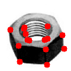

# Reunat ja nurkat {#reunat}

Tässä luvussa opimme löytämään kuvista kappaleiden reunoja ja nurkkia.
Tutustumme myös reunojen ketjutukseen. Käytännöllisiä asioita tällä kerralla:

* kokeillaan erilaisia reunanhakuoperaatioita ja niiden parametreja,
* etsitään sopivia operaatioita joilla saisi testikuvien reunat esille hyvin,
* todetaan että reunanhaku ei kerta kaikkiaan vain aina onnistu hyvin.

Tähän mennessä olemme etsineet kuvista lähinnä tasavärisiä alueita käyttäen
kynnystystä. Kuvien olennainen informaatio on kuitenkin *reunoissa*; tästä
kertoo jo sekin, että evoluutio on saanut aikaan eliöiden aivoihin erityisesti
reunoja havaitsevia neuronirakenteita. Ihmiset ymmärtävät hyvinkin monimutkaisia
näkymiä pelkkien yksinkertaisten viivapiirrosten perusteella, ja jo pienet
lapset osaavat piirtää näkymien ja esineiden olennaisia ominaisuuksia
tunnistettavina viivapiirroksina. Tässä luvussa tutustumme erilaisiin tapoihin
löytää kuvista reunoja ja jatkokäsitellä niitä.

Reunat ovat kuvissa olevia epäjatkuvuuskohtia, jotka esiintyvät tyypillisesti
erilaisten pintojen rajakohdissa. Pinnat voivat erota toisistaan syvyyden
suhteen, kirkkauden tai heijastavuuden suhteen tai pintamateriaalin suhteen.
Toisaalta kuviin syntyy ylimääräisiä reunoja valojen ja varjojen takia.
Reunoja voidaan havaita periaatteessa ainakin seuraavalla neljällä eri tavalla:

* etsimällä ensimmäisen asteen derivaattojen ääriarvoja,
* etsimällä toisen asteen derivaattojen nollakohtia,
* etsimällä voimakkaita muutoksia varianssin tai keskihajonnan avulla, tai
* etsimällä kohtia, joissa useiden eri taajuisten taajuuskomponenttien vaihe on
  sama.

Tässä luvussa tutustumme pääpiirteissään kaikkiin näihin tapoihin, painottaen
derivaattoihin perustuvia menetelmiä. (Huom. lähinnä derivaattoja koskevat osat
ovat valmiina.) Lisäksi pohdimme nurkkien, viivojen päätepisteiden ja
pistemäisten kohteiden havaitsemista. Myöhemmässä luvussa laajennamme
tarkastelut useihin skaaloihin yhtä aikaa.

## Kuvien derivaatat

Palautetaan aluksi mieleen seuraava konvoluution hyödyllinen ominaisuus: jos
symboli $D$ tarkoittaa derivaatta-operaatiota, silloin

$$D(f \star g) = (Df) \star g = f \star (Dg).$$

Konvoluution derivaatta saadaan konvolvoimalla derivoidulla funktiolla; siis
vain toisen konvoluution osapuolena olevan funktion on tarpeen olla derivoituva.
Sama ominaisuus pätee myös *osittaisderivaattojen* suhteen, jos tarkasteltavien
funktioiden lähtöavaruudet ovat useampiulotteisia.

Tässä vaiheessa hyödynnämme kuvien tulkintaa *funktioina* kaksiulotteisen pinnan
hilapisteiltä reaaliluvuille. Jos pystyisimme derivoimaan kuvafunktion, voisimme
tutkia kuvassa tapahtuvia muutoksia. Näytteistetty kuvafunktio on kuitenkin
määritelty pisteittäin, joten sellaisenaan se ei ole derivoituva. Yllä kuvattu
konvoluution ominaisuus kuitenkin kertoo meille, että konvolvoimalla kuvaa
sopivan kaksiulotteisen, derivoituvan funktion osittaisderivaatoilla saamme
laskettua tämän funktion ja kuvan yhdistetyt osittaisderivaatat. Mikä olisi
sopiva funktio?

Kuvissa on aina kohinaa, diskretoinnista tai pakkauksesta johtuvia artefakteja
ja muita pieniä muutoksia, ja derivaatta-operaatiot vahvistavat näitä häiriöitä
entisestään. Tämän vuoksi kuvia on aina syytä siloittaa ennen derivointia.
Siloitus tehdään useimmiten konvolvoimalla Gaussin ytimellä. Gaussin funktio
taas on äärettömän monta kertaa derivoituva, joten se sopii erinomaisesti myös
kuvien derivointiin. Voimme siis derivoida kuvia konvolvoimalla niitä Gaussin
funktion osittaisderivaatoista generoiduilla konvoluutioytimillä. Valitettava
sivuvaikutus on reunojen sumentuminen Gaussisen siloituksen seurauksena, mutta
ilman siloitusta kuvan kohina aiheuttaisi ylimääräisiä reunoja. On siis tehtävä
jonkinlainen kompromissi kohinan tason ja sumentumisen välillä ja valittava
sopiva ytimen koko siloitukseen.

## Ensimmäisen asteen derivaatat

Kynnystys ei yleensä toimi mielivaltaisissa näkymissä sen takia, että tausta
ei ole tasaisen värinen, ja useimmiten tausta ei myöskään ole aina samanlainen
joka kuvassa. Seuraava luonteva ajatus kohteen irrottamiseksi taustasta onkin
etsiä kohteen reunat. Muodostamalla kohteen ympäri ulottuvan yhtenäisen
reunakäyrän saataisiin kohde irti taustastaan.

Reunoja esiintyy siellä, missä kuvassa tapahtuu nopeita muutoksia, eli siis
pisteissä joissa derivaatta saa paikallisia ääriarvoja. Kokeillaan siis aluksi
konvoluutiota maskilla, joka antaa voimakkaan vasteen kohdissa, joiden ympärillä
tapahtuu nopeita muutoksia. Yksinkertaisin vaihtoehto on *keskeisdifferenssi*,
joka käytännössä laskee pikselin molemmin puolin olevien arvojen erotuksen. Alla
on tästä esimerkki. Tämä operaattori reagoi hyvin voimakkaasti kohinaan.
Edistyneempiä operaattoreita ovat esimerkiksi Prewittin ja Sobelin operaattorit,
jotka lisäävät konvoluutioon siloitusta matkimalla Gaussin funktiota.

Sobelin operaattorin maskit ovat tällaisia:

$$S_x = \left[\begin{array}{rrr} -1&  0&  1 \\
                                 -2&  0&  2 \\
                                 -1&  0&  1 \end{array}\right],
  S_y = \left[\begin{array}{rrr}  1&  2&  1 \\
                                  0&  0&  0 \\
                                 -1& -2& -1 \end{array}\right].$$

Positiivisten ja negatiivisten etumerkkien paikat voidaan vaihtaa keskenään,
mutta tämä vaikuttaa reunojen suunnan laskemiseen. Tässä esitellyt muodot
vastaavat luontevaa tulkintaa, jossa x-akselin positiivinen suunta on oikealle
ja y-akselin positiivinen suunta on ylös.

Seuraavassa koodiesimerkissä esitetään kuvan konvolvointi keskeisdifferenssin ja
Sobelin operaattorin avulla.

Nämä ovat eräänlaisia kuvan osittaisderivaattoja approksimoivia operaattoreita,
ja yhdistämällä x- ja y-suuntainen osittaisderivaatta saadaan muodostettua kuvan
**gradientti**, joka on kaksiulotteinen vektorikenttä. Siinä jokaista kuvan
pikseliä kohti on vektori, jonka pituus ja kulma kuvaavat funktiona tulkitun
kuvan muutosten voimakkuutta ja suuntaa kyseisessä pisteessä.

$$\nabla I = \left(\frac{\partial I}{\partial x},
                   \frac{\partial I}{\partial y}\right)
           = (G_x,G_y).$$

Gradientti muodostuu siis kahdesta erillisestä kuvasta $G_x$ ja $G_y$, joista
toisessa on vektorin x-suuntainen komponentti ja toisessa y-suuntainen
komponentti. Gradientin voimakkuus (magnitudi) eli vektorin pituus on siis

$$M_G = \|(G_x,G_y)\| = \sqrt{G_x^2 + G_y^2}$$

ja sen suunta on

$$\Theta_G = \arctan\left(\frac{G_y}{G_x}\right).$$

Nämäkin ovat siis kuvia, jotka saadaan muodostettua suorittamalla
laskutoimitukset jokaiselle gradienttikuvien pikseliparille. OpenCV:ssä ja
CV-kirjastossa nämä saadaan tehtyä kerralla kokonaisille kuville. Suunta saadaan
laskettua atan2-funktiolla ($\text{atan2}(G_y,G_x)$). Tämä funktio tuottaa
arvoja väliltä $[-\pi,\pi]$ siten, että suunta $0$ on vaakasuoraan oikealle ja
positiivinen kiertosuunta on *vastapäivään*. On myös muistettava, että
gradienttivektori osoittaa funktion nopeimman *kasvun* suuntaan; *reunan*
suunta eli reunakäyrän tangentti on kohtisuoraan gradienttia vastaan.

Kuten totesimme aiemmin, kuvien derivaattaoperaatiot ovat herkkiä kohinalle.
Hienostuneempi ja paremmin kohinaa sietävä tapa laskea osittaisderivaattoja on
siis käyttää Gaussin funktion derivaattoja, jolloin saadaan yhdistettyä siloitus
ja reunanhaku. Muistamme, että kaksiulotteinen, symmetrinen Gaussin funktio on
muotoa

$$G(x,y,\sigma) = \frac{1}{2\pi\sigma^2}e^{-\frac{x^2+y^2}{2\sigma^2}}$$

jolloin x-suuntainen ensimmäisen asteen osittaisderivaatta on

$$\frac{\partial G(x,y,\sigma)}{\partial x} =
  -\frac{x}{2\pi\sigma^4}e^{-\frac{x^2+y^2}{2\sigma^2}}$$

ja y-suuntainen ensimmäisen asteen osittaisderivaatta on

$$\frac{\partial G(x,y,\sigma)}{\partial y} =
  -\frac{y}{2\pi\sigma^4}e^{-\frac{x^2+y^2}{2\sigma^2}}.$$

Kuvassa esitetään miltä Gaussin funktion ensimmäisen asteen osittaisderivaatat
näyttävät harmaasävyarvoina piirrettyinä. Näistä voidaan muodostaa
konvoluutioydin näytteistämällä funktioiden arvoja matriisiin. Esimerkiksi jos
$\sigma = 0.8$ ytimen säteellä $2.5$ (joka tuottaa 5x5-matriisin),
 x-suuntainen maski olisi seuraavanlainen.

$$\left[\begin{array}{rrrrr} -0.002 & -0.008 & 0.000 & 0.008 & 0.002 \\
                             -0.016 & -0.081 & 0.000 & 0.081 & 0.002 \\
                             -0.034 & -0.178 & 0.000 & 0.178 & 0.034 \\
                             -0.016 & -0.081 & 0.000 & 0.081 & 0.016 \\
                             -0.002 & -0.008 & 0.000 & 0.008 & 0.002
  \end{array}\right]$$

Gaussin funktio tuottaa nollasta poikkeavia arvoja koko reaaliakselilla, mikä on
ongelmallista diskreetin konvoluutioytimen muodostamisen kannalta; muistamme
kuitenkin, että funktion arvot painuvat nopeasti lähelle nollaa. $3\sigma$:n
etäisyydellä keskipisteestä funktion arvo on mitättömän pieni. Usein onkin
tapana muodostaa ydin, jonka koko on $2 \times 3\sigma + 1$.

Seuraavassa koodiesimerkissä esitetään kuvan osittaisderivaattojen laskeminen
käyttäen Gaussin funktion derivaattoja.

Tehokasta toteutusta tarvittaessa on myös syytä muistaa, että Gaussin funktio ja
kaikki sen osittaisderivaatat ovat *separoituvia*: tämä tarkoittaa sitä, että
kaksiulotteinen konvoluutio saadaan tehtyä nopeammin tekemällä peräkkäin kaksi
yksiulotteista konvoluutiota riveittäin ja sarakkeittain.

On myös hyvä muistaa, että Gaussin funktion x- ja y-suuntainen $\sigma$ voivat
olla erilaisia ja funktion suuntaa voidaan kääntää, jolloin saadaan
pitkänomaisen ellipsin muotoisia maskeja jotka reagoivat vahvasti tietyn
suuntaisiin muutoksiin. Yleensä tämä ei kuitenkaan ole tarpeen, sillä Gaussin
funktion osittaisderivaattojen avulla saadaan myös helposti määriteltyä ns.
**ohjattavia suotimia** (engl. *steerable filters*) joilla voidaan etsiä
kuvasta ns. suunnattua energiaa (engl. *oriented energy*) eli vahvoja muutoksia
tarkoin rajattuun suuntaan. Näitä voidaan käyttää reunojen lisäksi myös
tekstuurien analysointiin. Ohjattava suodin saadaan yksinkertaisesti kertomalla
gradienttikenttää halutun suuntaisella yksikkövektorilla. Tämä kääntää
gradienttikentän tämän vektorin suuntaiseksi. Jos $\hat{u}$ on yksikkövektori
kulmassa $\theta$, eli

$$\hat{u} = (u_x,u_y) = (cos\theta, sin\theta)$$

ja $G_x$ ja $G_y$ ovat osittaisderivaatat, niin suuntaan $\theta$ kierretyn
ohjattavan suotimen antama tulos on

$$G_{\theta} = u_x G_x + u_y G_y$$.

Tässä siis kerrotaan gradienttikuvien jokaista pikseliä vakiolla ja lasketaan
kaksi kuvaa pikseleittäin yhteen. Seuraavassa koodiesimerkissä esitetään
ohjattavan suotimen muodostaminen kuvasta.

Tuloksena syntyvä kuva vastaa siis derivaattaoperaatiota Gaussin
osittaisderivaattaa muistuttavalla suotimella, joka on käännetty annetun
yksikkövektorin suuntaan. Näistä on hyötyä jos tiedetään, että tutkittavissa
kuvissa on tärkeitä reunoja tietyssä asennossa.

Kaikkia näitä menetelmiä käytettäessa törmätään kuitenkin kysymykseen: mitä
teemme näille suodatuksen tuloksena saataville kuville, joissa on vahva vaste
tietyn suuntaisille reunoille? On syytä huomata, että ensimmäisen asteen
derivaatat tuottavat sekä positiivisia että negatiivisia arvoja, ja reunakohdat
löytyvät derivaattojen ääriarvoista. Ääriarvojen löytämiseksi pitäisi tutkia
derivaatan arvoja kohtisuorassa reunaa vastaan kulkevalla suoralla, panna
merkille kasvusuunta ja havaita missä kohdissa saavutetaan minimi- tai
maksimiarvo. Tämä pitäisi tehdä jokaisen pikselin ympäristössä.

Eräs helpompi tapa paikallistaa gradientin ääriarvot on tietysti laskea
gradienttikentän magnitudi (tai ottaa itseisarvo jos käytetään vain
yhdensuuntaista osittaisderivaattaa) ja tuttuun tapaan kynnystää tuloksena oleva
reunakuva. Muistamme, että reunafiltterit tuottavat huipukkaita, harvoja
jakaumia, eli gradientin magnitudi on lähellä nollaa suurimmassa osassa kuvaa ja
suurempi melko harvoissa paikoissa. Kynnystys tuottaa siis melko kapeita
reuna-alueita.

### Tehtävä 7.1 {-}

Seuraavassa koodiesimerkissä kokeillaan reunanhakua käyttäen gradientin
magnitudin kynnystämistä. Kokeile eri kuvilla, voit myös kokeilla syöttää
kynnysarvon käsin. Kuvaile tuloksia ja ongelmakohtia. Voit myös yrittää
käyttää skeleton-operaatiota löydetyn reunan ohentamiseen. Katso mallia
aiemmasta luennosta, tutoriaalistakin voi olla apua.

Näillä luultavasti saisi tehtyä jotakin, jos vielä ohentaa paksut reunat
morfologian avulla ja jollakin lailla karsii ylimääräiset reunat. Parempi,
hieman enemmän laskentaa vaativa tapa on seuraava:

1) kvantisoidaan gradientin suunta neljään pääsuuntaan (pystysuora, vaakasuora
   ja kaksi vinosuuntaa),
2) tutkitaan jokaisen pikselin naapureita gradientin suunnassa (siis oletetun
   reunakäyrän molemmin puolin olevia naapuripikseleitä),
3) jos pikselin gradientin magnitudi on suurempi kuin näissä naapuripikseleissä,
   kyseessä on paikallinen gradientin ääriarvo.

Heiveröiset reunat voidaan poistaa kynnystämällä gradientti magnitudin mukaan.
Tarkempi tulos voidaan saada tutkimalla hieman laajempaa naapurustoa kuin vain
viereisiä pikseleitä, esimerkiksi ottamalla mukaan kaksi naapuria kummaltakin
puolelta.

### Tehtävä 7.2 {-}

Seuraavassa koodiesimerkissä esitetään reunanhaku käyttäen gradientin
ääriarvojen etsintää yllä kuvatulla tavalla. Selvitä itsellesi mitä koodissa
tapahtuu. Kokeile eri kuvilla ja vertaa tuloksia kynnystysmenetelmän tuottamiin
tuloksiin. Miten tulosta voisi vielä parantaa?

## Toisen asteen derivaatat

Edellä käsiteltiin kuvan ensimmäisen asteen osittaisderivaattoja ja gradienttia.
Näiden kanssa tulee ongelmaksi löytää derivaattojen ääriarvot. Koska on
helpompaa löytää toisen asteen derivaatan nollakohta kuin ensimmäisen asteen
derivaatan ääriarvo, usein on tapana käyttää reunanhakuun toisen asteen
osittaisderivaattoja. Erittäin yleinen menetelmä on käyttää *Laplacen
operaattoria* jossa lasketaan yhteen kuvan x- ja y-suuntaiset toisen asteen
osittaisderivaatat:

$$L(x,y) = \frac{\partial^2 I(x,y)}{\partial x^2} +
           \frac{\partial^2 I(x,y)}{\partial y^2}$$.

Tätä operaattoria ja myös toisen asteen derivaattoja voidaan approksimoida
konvoluutiomaskeilla, esimerkiksi

$$l = \left[\begin{array}{ccc} 0& 1& 0 \\
                               1&-4& 1 \\
                               0& 1& 0 \end{array}\right].$$

Koska toisen asteen derivaatat reagoivat kohinaan vielä
voimakkaammin kuin ensimmäisen asteen derivaatat, niiden kanssa on lähes aina
syytä käyttää siloitusta kohinan vähentämiseksi. Gaussin funktion derivaatat
ovatkin erityisen hyödyllisiä tässä:

$$\begin{aligned}
  \frac{\partial^2 G(x,y,\sigma)}{\partial x^2} &=
    \frac{(-1 + \frac{x^2}{\sigma^2})}
         {2\pi\sigma^4}
    e^{-\frac{x^2 + y^2} {2\sigma^2}} \\
  \frac{\partial^2 G(x,y,\sigma)}{\partial y^2} &=
    \frac{(-1 + \frac{y^2}{\sigma^2})}
         {2\pi\sigma^4}
    e^{-\frac{x^2 + y^2}{2\sigma^2}}\\
  \frac{\partial^2 G(x,y,\sigma)}{\partial x \partial y} &=
    \frac{xy}{2\pi\sigma^6}
    e^{-\frac{x^2 + y^2}{2\sigma^2}}
  \end{aligned}$$

Mistä tahansa Gaussin funktion osittaisderivaattojen asteesta saadaan tehtyä
ohjattava filtteri. Toisen asteen derivaatoista se saadaan tehtyä näin:

$$g^2_\theta = u_x^2 G^2_{xx} + 2 u_x u_y G^2_{xy} + u_y^2 G^2_{yy}.$$

Seuraavassa koodiesimerkissä esitetään toisen asteen derivaattojen laskenta
kuvasta käyttäen Gaussin funktion derivaattoja.

Yllä olevan kuvamatriisin alarivissä vasemmalla on kuva, jossa on tulos
operaatiosta $G^2_{xx} + G^2_{yy}$. Tämä on siis Laplacen operaatio, joka on
tehty Gaussin funktiolle. Kyseessä on hyvin tunnettu operaattori nimeltä
**Laplacian of Gaussian** (LoG) ja se antaa voimakkaita vasteita sellaisille
kohdille, joissa on tumman keskustan ympärillä vaaleampaa tai vaalean keskustan
ympärillä tummempaa. Muuttamalla Gaussin funktion $\sigma$:aa saadaan
säädettyä, minkä kokoisille kohteille operaattori on herkkä. Neurotieteen
tutkijat ovat osoittaneet, että silmän verkkokalvoilla on neuroneita
(gangliasoluja) jotka antavat samantapaisia *center-surround*-vasteita eri
skaaloissa. Evoluutio on siis osoittanut tämän tapaisen operaattorin
hyödyllisyyden.

LoG-operaattoria voidaan approksimoida laskemalla kahden eri kokoisen Gaussin
ytimen erotus, eli konvolvoimalla kuva kahdella eri kokoisella gaussisella
maskilla ja laskemalla tulosten erotus. Tämän operaattorin nimi on **Difference
of Gaussians** (DoG) ja se on lähellä LoG:tä kun kahden ytimen koon suhde on
noin 1.6, eli esimerkiksi 3 ja 5 tai 7 ja 11. Vielä karkeampi approksimaatio
saadaan käyttämällä ns. *difference of boxes* -operaattoria, jossa lasketaan
kahden eri kokoisen laatikkofiltterin (keskiarvosuotimen) erotus. Tämä on
erityisen hyödyllinen käytettäessä integraalikuvia, sillä niiden avulla saadaan
laskettua minkä tahansa nelikulmaisen alueen summa kolmella laskutoimituksella.
Näitä operaattoreita käytetään monissa tunnetuissa pistepiirteiden
etsintämenetelmissä, joista lisää jäljempänä.

## Cannyn menetelmä

Eräs vaihtoehto objektien tunnistamiselle on etsiä reunakäyriä yhdistämällä
löydettyjä reunapisteitä pitemmäksi ketjuksi. Tunnetuin menetelmä tämän
tekemiseksi on Cannyn reunanhaku. Tämän menetelmän vaiheet ovat

* kuvan silotus gaussisella suotimella,
* gradienttikentän muodostaminen joillakin osittaisderivaattaoperaattoreilla,
* gradientin magnitudin laskeminen,
* gradientin suunnan pyöristys neljään pääsuuntaan (vaakasuora, pystysuora ja
  kaksi diagonaalia),
* kuvasta etsitään gradientin lokaalit maksimit huomioiden pikselin naapurit
  jotka ovat suorassa kulmassa gradientin suuntaa vastaan (eli jos suunta on
  vaakasuoraan, tutkitaan ylä- ja alapuolella olevia naapureita),
* reunojen seuranta kynnystämällä *hystereesin* avulla, eli kynnystämällä ensin
  suurempaa kynnysarvoa käyttäen esille melko varmat reunat, ja lisäämällä
  näihin naapureita jotka ovat pienempää kynnysarvoa suurempia.

Tätä menetelmää pidetään jossakin määrin optimaalisena keinona löytää kuvasta
hyviä reunoja. Hieman tarkempi ja matemaattisesti vahvempi tapa on
*differentiaaligeometriaan* perustuva reunanhaku, jossa hyödynnetään
korkeampia osittaisderivaattoja *skaala-avaruudessa*, mutta siihen emme mene
tässä yhteydessä.

OpenCV:ssä on Cannyn menetelmän toteutus. Tätä voi käyttää alustavien
reunakäyrien etsimiseen, mutta kokeilu osoittanee että useimmiten näin saadut
reunat ovat käyttökelpoisia lähinnä syötteenä jatkokäsittelylle, jossa voidaan
sovittaa reunojen sisälle esimerkiksi polygoneja tai muita muotoja.

(koodi: cannyn menetelmän muunnelman toteutus attribuuttigraafien avulla)

## Nurkkien haku

Kuvasta on helpointa paikallistaa luotettavasti sellaisia kohtia, joissa kaksi
reunaa muodostaa selkeän nurkan. Tämmöiset sijaitsevat luultavimmin
ympäristöissä, joissa on kaksi voimakasta, selvästi eri suuntiin osoittavaa
gradienttia. Nurkkapisteiden ympäristöä voidaan yrittää kuvailla erilaisilla
piirteillä, jolloin toisesta kuvasta voidaan mahdollisesti tunnistaa samat
pisteet. Tällaisia pistemäisten kohteiden ja niitä kuvailevien piirteiden
yhdistelmiä kutsutaan pistepiirteiksi, ja ne ovat olleet viime aikoina hyvin
suosittuja. Nurkkapisteiden lisäksi niitä voidaan muodostaa mistä tahansa
taustastaan hyvin erottuvista pistemäisistä kohteista.

Helpoin keino nurkkien löytämiseen ovat erilaiset konvoluutiomaskit, esimerkiksi

$$c = \left[\begin{array}{rrr} 1 &-2 & 1 \\
                              -2 & 4 &-2 \\
                               1 &-2 & 1 \end{array}\right].$$

Nämä eivät kuitenkaan välttämättä löydä kovin hyviä nurkkia.

## Harrisin menetelmä

Perinteinen, suosittu, toimiva ja intuiviinen tapa etsiä sopivia kohtia
pistepiirteiden irrotusta varten on Harrisin menetelmä. Tämä perustuu siihen
ajatukseen, että kuvasta kannattaa etsiä sellaisia pisteitä, jotka on
mahdollisimman helppo havaita ja paikallistaa. Sitä, kuinka hyvin piste erottuu
ympäristöstään, saadaan arvioitua vertaamalla pisteen ympäristöä muihin
lähistöllä oleviin ympäristöihin laskemalla esimerkiksi painotettuja
neliöllisten etäisyyksien summia ympäristön ja siirrettyjen ympäristöjen
välillä. Tämä tietysti vaatii paljon laskemista. Keskeinen ajatus Harrisin
menetelmässä onkin arvioida tätä pisteympäristön autokorrelaatiota
*rakennetensorin* (engl. *structure tensor*) eli gradienteista muodostetun
matriisin avulla. Rakennetensori kuvaa pisteympäristön pääasiallisia
muutossuuntia. Matriisia kutsutaan joskus myös *toiseksi momenttimatriisiksi*.

$$A = w * \left[\begin{array}{rl} G_x^2 & G_x G_y \\
                                G_y G_x & G_y^2   \end{array}\right]$$

missä $w$ on painotettu keskiarvomaski. Käyttämällä esimerkiksi Gaussista maskia
saadaan tuloksesta *isotrooppinen* eli suunnasta riippumaton. Tämä matriisi
sisältää siis painotetut keskiarvot tietyn pisteen ympäristössä esiintyvistä
gradienteista. Laskemalla tämän matriisin ominaisarvot voidaan analysoida
ympäristön muotoa.

* Jos molemmat ominaisarvot ovat pieniä, ympäristö on tasainen.
* Jos toinen ominaisarvo on pieni ja toinen suuri, piste on reunalla jossa on
  yksi voimakas gradientti.
* Jos molemmat ominaisarvot ovat suuria, piste on kulmassa jossa on kaksi
  voimakasta gradienttia.

Tunnettu *Shi-Tomasi*-menetelmä käyttää kulmapisteen hyvyysarvona tämän
matriisin pienintä ominaisarvoa, ja kirjallisuuden mukaan tämä lisää erityisesti
kulmapisteiden vakautta kun pyritään seuraamaan pisteitä kuvaruudusta toiseen.
Pienen matriisin ominaisarvotkin saadaan laskettua melko helposti, mutta
Harrisin mukaan tämä voidaan välttää tutkimalla sen sijaan *vastefunktiota*

$$\begin{aligned}
  R(A) & = \lambda_1 \lambda_2 - \kappa(\lambda_1 + \lambda_2)^2\\
       & = det(A) - \kappa trace^2(A)\\
       & = (A_{11}A_{22} - A_{12}A_{21}) - \kappa (A_{11} + A_{22})^2\\
       & = (G_x^2 G_y^2 - (G_x G_y)^2) - \kappa (G_x^2 + G_y^2)^2
  \end{aligned}$$

missä $\lambda_1$ ja $\lambda_2$ ovat rakennetensorin ominaisarvot ja $\kappa$
on vapaa parametri, jolla säädetään funktion herkkyyttä. Yleisesti käytetty arvo
on 0.04, ja kirjallisuuden mukaan arvot 0.04-0.15 ovat toimivia. CV-kirjaston
matemaattisten operaatioiden ja edellä opittujen Gaussisten derivaattamaskien
avulla on helppo laskea Harrisin vastearvot. Seuraava koodiesimerkki näyttää,
kuinka tämä voidaan tehdä. Alemmilla riveillä on rakennetensorin alkioiden arvot
levitettyinä kuviksi, eli sen sijaan että meillä on kuva jossa on
$2\times2$-matriisi jokaisessa pisteessä, meillä on $2\times2$-matriisi kuvia.

On syytä huomata, että tämä menetelmä laskee vain tietynlaisen *vastefunktion*
arvon. Se antaa suuria arvoja hyvin ympäristöstään erottuville pisteille, ja
usein suuria arvoja on useita lähekkäin. Ennen löydettyjen pisteiden
hyödyntämistä on yleensä tehtävä ns. *non-maximal suppression* eli valittava
tietystä ympäristöstä vain lokaalit maksimiarvot. Samoin löydettyjä
kulmapisteitä kannattaa kynnystää esimerkiksi ottamalla mukaan vain ne, joiden
vaste on vaikkapa 0.1 kertaa suurimman vasteen arvo.

Lisätietoa Harrisin menetelmästä ja [kulmanhausta wikipediassa]. Menetelmä on
edelleen suosittu, koska se löytää melko intuitiivisia kulmapisteitä, ja
löydetyt pisteet ovat yleensä erilaisia kuin modernien menetelmien löytämät.
Sitä voidaan siis käyttää yhdessä esimerkiksi SIFT- tai SURF-menetelmien kanssa.

[kulmanhausta wikipediassa]: http://en.wikipedia.org/wiki/Corner_detection

## Hessen matriisin determinantti

Toinen suosittu tapa etsiä nurkkapisteitä on *Hessen matriisin determinanttiin*
perustuva menetelmä, joka on hyvin samankaltainen kuin Harrisin menetelmä, mutta
siinä käytetään *Hessen matriisia* rakennetensorin sijaan. Hessen matriisi
sisältää pikselien ympäristöistä lasketut *toisen asteen osittaisderivaatat*:

$$H = \left[\begin{array}{cc} G^2_{xx} & G^2_{xy} \\
                              G^2_{xy} & G^2_{yy} \end{array}\right]$$

missä

$$\begin{aligned}
  G^2_{xx} & = \frac{\partial^2 I(x,y)}{\partial x^2}\\
  G^2_{yy} & = \frac{\partial^2 I(x,y)}{\partial y^2}\\
  G^2_{xy} & = \frac{\partial^2 I(x,y)}{\partial x \partial y}\\
  \end{aligned}.$$

Hessen matriisi kuvaa kuvafunktion *kaarevuutta* kyseisessä pisteessä.
Matriisin determinantti antaa vahvoja vasteita pisteissä, joissa on voimakas
gradientti kahteen eri suuntaan. *Determinant of Hessian* (DoH) onkin eräs
suosittu keino löytää pistemäisiä kohteita kuvasta. Monissa Hessen matriisiin
perustuvissa menetelmissä etsitään sen sijaan pisteitä, joissa sekä matriisin
determinantti että jälki (engl. *trace*) saa lokaalin maksimiarvon. Huomaamme,
että $\text{trace}(H) = G^2_{xx} + G^2_{yy}$, eli se vastaa *Laplacian of
Gaussian* -operaattorin arvoa kuvapisteessä. Tässä siis yhdistyy kaksi
tehokasta pistemäisten kohteiden etsintään soveltuvaa operaattoria (DoH ja
LoG). Koska LoG reagoi voimakkaasti myös reunoihin, näistä saadaan DoH:n
avulla karsittua esille ne reunapisteet, joissa on myös selkeä kulma tai
kaarevuusmaksimi.

Kun Harris- ja Hesse-pohjaisissa menetelmissä etsitään maksimiarvoja myös
skaaloissa ja normalisoidaan pisteiden ympäristö *affiinin muunnoksen* suhteen,
saadaan menetelmät nimeltä *Harrisin affiini* ja *Hessen affiini*. Näistä tulee
enemmän tietoa myöhemmässä luvussa.

Alla olevassa kuvassa lasketaan DoH ja LoG ja verrataan tuloksia.

Lisätietoa Mikolajczykin ja Schmidin [Harrisin affiinista] ja [Hessen
affiinista] wikipediasta. Myös alkuperäiset paperit ovat selkeitä ja erittäin
mielenkiintoisia, ja niihin kannattaa tutustua jos pistepiirteet kiinnostavat.

[Harrisin affiinista]: http://en.wikipedia.org/wiki/Harris_affine_region_detector
[Hessen affiinista]: http://en.wikipedia.org/wiki/Hessian_affine_region_detector

## Tehtäviä

1) Kokeile reunanhakua gradientin kynnystämistä käyttäen eri kuvilla. Kuvaile
   tuloksia ja ongelmakohtia. Voit myös yrittää käyttää skeleton-operaatiota
   löydetyn reunan ohentamiseen. Katso mallia aiemmasta luennosta,
   tutoriaalistakin voi olla apua.
2) Kokeile reunanhakua gradientin ääriarvojen avulla. Vertaa tuloksia
   kynnystysmenetelmän tuottamiin tuloksiin. Miten tulosta voisi vielä parantaa?
