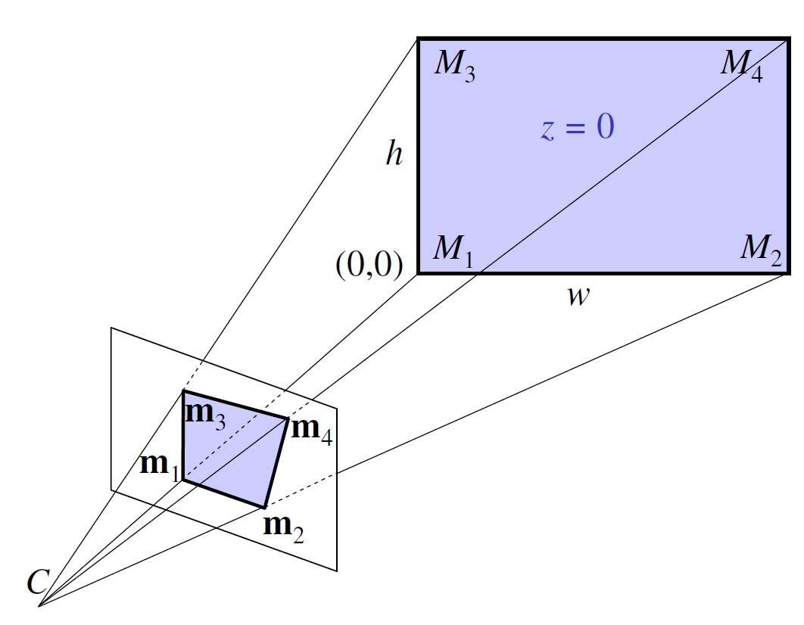

# Kuvien geometriset muunnokset {#geometria}

Monissa hyödyllisissä konenäkösovelluksissa ei tarvitse ottaa huomioon kuvan muodostumista projektiona tai kameran optisia ominaisuuksia. Jos kuitenkin pitää pystyä laskemaan tarkkoja vastaavuuksia kameran kuvan ja todellisen näkymän välillä, tai kahden tai useamman kuvan välillä, on otettava huomioon projektiogeometria ja kameran optiikka.

## Konenäkö käänteisongelmana

Konenäkö voidaan nähdä pohjimmiltaan käänteisongelmana: todellinen näkymä on projisoitu kuvatasoon jonkinlaisella muunnoksella, ja haluaisimme löytää käänteismuunnoksen, jolla saisimme palautettua alkuperäisen näkymän. Useimmat käytännön sovellukset eivät tietenkään vaadi tätä, mutta olisihan toki huomattavasti helpompaa hahmottaa näkymässä olevia kohteita, jos ne olisivat kolmiulotteisia erillisiä objekteja.

Käänteisongelmasta on kyse silloin, jos meillä on tutkittavana seuraavankaltainen ilmiö:

$$d = f(m)$$

Kyseessä on siis tilanne, jossa jokin mekanismi $f$ tuottaa havaintoja, tai datapisteitä $d$, jostakin mallista $m$. Tavoitteena on löytää parhaat mahdolliset mallin $m$ parametrit, joilla $f$ tuottaa hyvin lähelle $d$:tä vastaavan tuloksen.

## Geometrinen kuvanmuodostus projektiona

Aiemmin olemme käsitelleet kuvanmuodostusta vain näytteistyksen ja signaalinkäsittelyn näkökulmasta: olemme siis ottaneet huomioon vain sensorin, joka tallentaa kuvadatan. Näytteistyksessäkin tapahtuu muunnos, mutta todellisuudessa jo kuvasensorille saapuva data on tulosta muunnoksesta. Kolmiulotteinen näkymä on projisoitu kaksiulotteiselle tasolle.

Tilanne on siis se, että mallin parametrien $m$ lisäksi myös muunnos $f$ on tuntematon. Pystyäksemme edes haaveilemaan käänteismuunnoksesta meidän on arvioitava ensin, millainen kameran tekemä projektiomuunnos on. Se voidaan esittää projektiomatriisina, jotka ovat tuttuja lineaarialgebrasta ja tietokonegrafiikasta. Projektiomatriisi muuntaa kameran tapauksessa kolmiulotteisen näkymäavaruuden vektorin kaksiulotteisen kuvatason vektoriksi.

## Homogeeniset koordinaatit

Muistamme, että kolmiulotteisen avaruuden kierrot ja skaalaukset voidaan esittää 3x3-matriiseilla, joita voi kertoa keskenään operaatioiden ketjuttamiseksi. Siirto eli translaatio kolmiulotteisessa avaruudessa on kuitenkin mahdotonta esittää 3x3-matriisien kertolaskuna. Tämän takia käytetään niinsanottuja *homogeenisiä koordinaatteja*, joita kutsutaan myös projektiokoordinaateiksi: matriisiin lisätään ylimääräinen rivi ja sarake, joiden avulla siirto voidaan kuvitella tehtävän ikään kuin ylimääräisen, neljännen ulottuvuuden kautta. Homogeenisillä koordinaateilla voidaan esittää mikä tahansa projektio kertolaskuna 4x4-matriisin kanssa. Koska lopullinen projektio tehdään kaksiulotteiseen avaruuteen, valmis projektiomatriisi on kokoa 3x4.

## Perspektiiviprojektio

Valokuvien analysoinnin, tulkitsemisen ja tarkkojen mittausten kannalta ongelmallista on se, että linssien avulla tapahtuvaan kohdistamiseen perustuvien kameroiden (myös ihmisen silmien) tuottamissa kuvissa on perspektiivivääristymä: yhdensuuntaiset viivat eivät pysy yhdensuuntaisina, vaan suuntautuvat yhteen pisteeseen, niinsanottuun pakopisteeseen.

Tämä ilmiö johtuu siitä, että perspektiiviprojektio muodostetaan vetämällä suora viiva kustakin kohteessa olevasta pisteestä yhteen kiinteään pisteeseen, niinsanottuun projektiokeskipisteeseen. Projektiokeskipisteen ja näkymän väliin asetetaan projektiotaso, ja kuhunkin pisteeseen kulkevan suoran ja kuvatason leikkauspiste on kyseisen pisteen projektio kuvatasossa. Tämä toimenpide johtaa siihen, että vain projektiokeskipisteestä kohtisuoraan projektiotason leikkaavalla suoralla olevat pisteet ovat vääristymättömiä, kaikkien muiden pisteiden sijainti vääristyy hieman. Me ihmiset olemme niin tottuneita perspektiiviprojektioon, ja aivomme olettavat kaiken olevan tällä tavalla projisoitunutta, että emme huomaa itse vääristymiä paitsi tiettyjen optisten harhojen yhteydessä.

Perspektiiviprojektio on ongelmallinen, mutta sitä ei voi välttää nykyisillä kameroilla, koska niissä kuva projisoidaan tasoon linssissä olevan pisteen kautta. Tietokonegrafiikassa voidaan käyttää ortografista projektiota, jossa kohde projisoidaan suoraan tasoon yhdensuuntaisten suorien avulla. Projektiotason on siis oltava saman kokoinen kuin kuvattava kohde. Olisikin hyvin haasteellista rakentaa kamera, jolla voisi projisoida todellisia näkymiä ortografisesti. Käytännössä vaadittaisiin varmaankin tasossa liikkuva, kohtisuoraan eteenpäin jokaisen pikselin yksitellen skannaava sensori, esimerkiksi tavallinen kamera joka tallentaa vain täsmälleen kuvan keskellä olevan pikselin, joka siis on vääristymätön.

Perspektiiviprojektiosta johtuvat vääristymät voi onneksi korjata, mutta sitä varten on tunnettava kameran projektio-ominaisuudet.

## Kameraparametrit

Kameroiden yhteydessä puhutaan kahdenlaisista parametreista:

* Ulkoiset (engl. *extrinsic*) parametrit kuvaavat kameran asemaa kohteeseen nähden: siirto (translaatio) ja kierto (rotaatio), joiden mukaisesti kamera on aseteltu kuvauspaikkaan.
* Sisäiset (engl. *intrinsic*) parametrit kuvaavat syntyneen kuvan asemaa kameraan nähden: heijastus (projektio), siirto (translaatio), skaalaus sekä mahdolliset vääristymät.

## Homografian määrittäminen

## Vastaavuus kahden kuvan välillä homografiana

* Affiinin muunnoksen parametrien arvioimiseen tarvitaan 3 vastinpistettä.
* Perspektiivimuunnoksen arvioimiseen puolestaan tarvitaan 4 vastinpistettä. (miksi, kuva)

