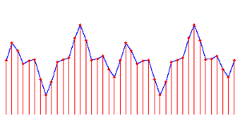
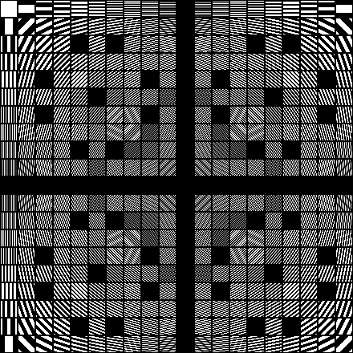
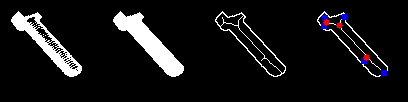

# Yhteenveto

Tämän kurssin tavoitteena on tuottaa yleiskäsitys konenäöstä sekä opettaa
ymmärtämään kuvien analysoinnin tärkeimpiä periaatteita ja menetelmiä
intuitiivisesti. On ollut haastavaa koota aihepiiristä järkevän kokoinen
paketti, joka saataisiin käytyä läpi käytettävissä olevassa ajassa, ja joka
tarjoaisi riittävät työkalut käytännön ongelmien ratkaisemiseen. Materiaalin
tuottamiseen käytössä ollut aika on ollut rajallinen, joten puutteita on vielä
runsaasti. Täydennystä on kuitenkin luvassa myöhemmin.

Tämä luku sisältää lähinnä joukon kalvoja, joiden avulla voi palauttaa mieleen
kurssin keskeisimmän sisällön. Kalvot ovat nähtävissä kurssisivulla. Myöhemmin
kirjoitetaan kunnollinen yhteenvetoluku.

~~~~{.slide}
## Kurssin haasteet

* Aiheen laajuus: matematiikkaa, signaalinkäsittelyä, tilastotiedettä,
  data-analyysiä, koneoppimista, jopa neurotieteitä ja kognitiivista psykologiaa
* Vaikeus: hyppäys perusmenetelmistä vähänkään hankalampiin käytännön
  sovelluksiin on suuri
* Kuinka voitaisiin koota kokonaisuus, joka tuottaisi intuitiivisen
  yleiskäsityksen perusmenetelmistä ja ilmiöistä ja tarjoaisi edes jonkinlaisen
  kosketuksen käytäntöön?
~~~~

~~~~{.slide}
## Kurssin tavoitteet

* Ymmärretään millaista dataa kuvat sisältävät ja mitkä ovat yleisimpiä
  ongelmakohtia; miksi konenäkö on vaikeaa?
* Ymmärretään kuvien eri esitysmuotoja ja niihin liittyviä matemaattisia
  työkaluja
* Saavutetaan intuitiivinen perusymmärrys kuva-analyysiin liittyvistä ilmiöistä
  ja matemaattisista käsitteistä
* Ymmärretään kuinka tärkeimmät analysointimenetelmät toimivat ja osataan
  soveltaa niitä yksinkertaisiin kuviin
* Hahmotetaan kuinka hankalampia kuvia voi ryhtyä analysoimaan
~~~~

~~~~{.slide}
## Kuvien signaalitulkinta

* Signaali kuvaa fysikaalisen suureen muutoksia, useimmiten ajan suhteen
* Valokuva on *spatiaalinen* signaali, jossa muutoksia mitataan kahden
  tilaulottuvuuden suhteen
* Kuvasignaali kuvaa valon intensiteetin muutoksia kaksiulotteiselle pinnalla,
  jolle on heijastettu eli projisoitu kuva kolmeulotteisesta näkymästä
* Signaalitulkinta mahdollistaa kuvien näytteistyksen, interpoloinnin,
  suodatuksen ja taajuusanalyysin määrittelemisen tunnetulle ja hyvin
  ymmärretylle teoriaperustalle
~~~~

~~~~{.slide}
## Kuvien funktiotulkinta

* Kuvasignaali voidaan nähdä myös funktiona kaksiulotteisen, kokonaisluvuin
  indeksoidun tasavälisen hilan pisteiltä reaalilukujen tai kokonaislukujen
  osajoukolle
* $I : (W x H) \rightarrow V,
   W \in [0,M] \subset \mathbb{Z}, H \in [0,N] \subset \mathbb{Z},
   V \in [0,1] \subset \mathbb{R}$
* Kuvafunktio perustuu näytteistetylle kuvasignaalille
* Funktiotulkinta mahdollistaa kuvan muutosten analysoimisen derivoimalla
~~~~

~~~~{.slide}
## Kuvien vektoritulkinta

* Kuva ymmärretään summana skalaareilla skaalattuja kantavektoreita
* Perusmuodossa yksikkökantavektorit vastaavat kuvia, joissa yhden pikselin arvo
  on $1$ ja kaikkien muiden pikselien arvo on $0$
* Kuva on siis hyvin pitkä vektori jossa kaikki pikselit ovat peräkkäin joko
  riveittäin tai sarakkeittain lueteltuina
* Vektoritulkinta mahdollistaa kannanvaihdot, pikseleittäiset matemaattiset
  operaatiot, ja monien data-analyysin menetelmien soveltamisen
~~~~

~~~~{.slide}
## Kuvien graafitulkinta

* Kuva ymmärretään kokoelmana solmuja ja niiden välisiä kaaria
* Solmut ovat pikseleitä ja kaaret niiden välisiä naapuruussuhteita
* Graafitulkinta mahdollistaa pikselien naapurustojen tutkimisen matemaattisesti
  täsmällisessä muodossa, esimerkiksi yhtenäisten alueiden ja mielivaltaisen
  laajojen rakenteiden analysoimiseksi
~~~~

~~~~{.slide}
## Signaalien taajuuskomponentit

* Signaalit muodostuvat summana säännöllisiä muutoksia tietyllä taajuudella,
  ja näitä taajuuskomponentteja kuvataan siniaaltoina

~~~~

~~~~{.slide}
## Kuvien spatiaaliset taajuuskomponentit

* Kuvien taajuuskomponentit puolestaan ovat spatiaalisia sinitasoaaltoja

~~~~

~~~~{.slide}
## Signaalien näytteistys ja interpolointi

* Signaaleita voi näytteistää lukemalla arvoja tasavälein ja rakentaa uudelleen
  interpoloimalla näytepisteiden väliin jäävät arvot

~~~~

~~~~{.slide}
## Konvoluutio

* Konvoluutiolla kuvataan lineaarisen, aika- ja siirtoriippumattoman systeemin
  vastetta annettuun syötteeseen yksikköimpulssivasteen avulla
* Eräänlainen painotettu keskiarvo tai sisätulo, jossa toinen signaali peilataan
* Konvoluutio on assosiatiivinen, kommutatiivinen, distributiivinen, ja
  konvoluutio yksikköimpulssilla palauttaa syötteen muuttumattomana

$$(f \ast g)(x) = \int_{-\infty}^{\infty}f(y)g(x-y)dy$$
~~~~

~~~~{.slide}
## Kuvien suodatus

* Konvoluutiota voidaan käyttää myös kuvien suodattamiseen: eräänlaisena
  sisätulona se mittaa, kuinka paljon signaali muistuttaa annettua maskia
  eri kohdissa
* Perustuu signaalin integraalin ja näytteistetyn signaalin näytepisteiden
  arvojen summan vastaavuuteen

$$(f \ast g)(x,y) = \sum_{i,j} f(i,j) g(x-i,y-j).$$
~~~~

~~~~{.slide}
## Fourier-muunnos

* Käytetään signaalien taajuusinformaation analysointiin tekemällä kannanvaihto
  taajuuskomponenteista muodostetuille kantavektoreille
* Eksponenttilauseke muodostaa kompleksilukuja jotka kuvaavat
  taajuuskomponenttien taajuutta, amplitudia ja vaihetta
* Tulo alkuperäisen signaalin kanssa ja integraali muodostavat sisätulon näiden
  kantavektoreina toimivien taajuuskomponenttien suhteen

$$F(g(x))(u) = \int_{-\infty}^{\infty}g(x)e^{-i 2 \pi ux}dx$$
~~~~

~~~~{.slide}
## Kuvien kaksiulotteinen diskreetti Fourier-muunnos

* Taajuuskomponentit ovat kuvatason pinnalla eri suuntiin eteneviä
  sinitasoaaltoja
* Aallon suunta on $\arctan\frac{v}{u}$ ja taajuus $\sqrt{u^2 + v^2}$
* Sisätulon tuloksena syntyvistä kompleksisista Fourier-kertoimista saadaan
  kyseisen taajuuskomponentin amplitudi ja vaihe kyseisessä kuvassa muuntamalla
  kompleksiluku polaarimuotoon

$$F\left(I\left(x,y\right)\right)\left(u,v\right) =
  \sum_{x=0}^{W-1} \sum_{y=0}^{H-1} I\left(x,y\right) \cdot
  e^{-i 2 \pi \left(\frac{ux}{W}+\frac{vy}{H}\right)}$$
~~~~

~~~~{.slide}
## Fourier-muunnoksen visualisointi

~~~~

~~~~{.slide}
## Kuvien tilastolliset momentit

* Kuvaavat arvojen jakauman muotoa:
* Määritellään odotusarvon avulla: $E\left[X\right] = \sum_i x_i P(X=x_i)$
* Empiirinen odotusarvo eli keskiarvo
  $\mu = E\left[X\right] = \frac{1}{N}\sum_{i=1}^{N} x_i$
* Varianssi on odotusarvo muuttujan neliölliselle etäisyydelle keskiarvosta:
  $Var\left(X\right) = \
  E\left[\left(X - E\left[X\right]\right)^2\right] = \
  E\left[\left(X-\mu\right)^2\right]$
* Kovarianssi on kahden muuttujan yhdistetty varianssi:
  $Cov(X,Y) = E\left[\left(X-E\left[X\right]\right)
                     \left(Y-E\left[Y\right]\right)\right]
            = E\left[XY\right] - E\left[X\right]E\left[Y\right]$
~~~~

~~~~{.slide}
## Kuva-alueiden momentit

* Tilastolliset momentit saadaan laskettua kuva-alueille ikkunoimalla
  Gaussin funktion avulla
* Voidaan nopeuttaa integraalikuvan avulla

~~~~

~~~~{.slide}
## Kuvien histogrammit

* Histogrammit ovat diskreettejä jakaumia, joita voidaan laskea mistä tahansa
  piirteistä kokonaisesta kuvasta tai pienemmältä kuva-alueelta
* Jakauma kuvaa muuttujan eri arvojen suhteellista esiintymistiheyttä
* Integraalihistogrammin avulla voidaan nopeuttaa histogrammien muodostamista
  monilta eri kokoisilta kuva-alueilta
* Hyvin korkea ja kapea jakauma on huipukas eli harva, ja kaikkien
  kuvasuotimien jakauma on tällainen

~~~~

~~~~{.slide}
## Pääkomponentit

* Pääkomponentit ovat vektoreita, joiden suunnassa kuvassa tai kuvajoukossa
  esiintyy eniten vaihtelua
* Voidaan löytää esimerkiksi etsimällä datajoukon kovarianssimatriisin
  ominaisvektorit
* Voidaan käyttää muodostamaan kannanvaihto, jossa tietyn datajoukon sisältämät
  kuvat erottuvat toisistaan parhaiten
* Käytetty hyvin tuloksin esimerkiksi kasvoille
* Kohdekuvien tulee olla riittävän samankaltaisia kaksiulotteisen ulkomuotonsa
  suhteen
~~~~

~~~~{.slide}
## Kuvien kynnystäminen

$$T_{(0,1)}\left(t,I\right)(x,y)   = \begin{cases}
                                          0, &\text{ jos } I(x,y) < t \\
                                          1, &\text{ muuten }
                                        \end{cases}$$
* Tehdään harmaasävykuvasta binäärikuva, jossa esiintyy vain kahta arvoa
* Kiinnostavan kohteen erottamiseksi taustasta
* Voidaan käyttää muitakin arvoja kuin $(0,1)$
* Kynnysarvon valintaan on menetelmiä, esimerkiksi Otsun menetelmä
* Toimii vain suhteellisen tasavärisille kohteille tasaista taustaa vasten

~~~~

~~~~{.slide}
## Morfologiset operaatiot

* Binäärikuvan muokkaamiseen soveltuvia eräänlaisia suotimia
* Konvolvoidaan binäärisellä maskilla eli muokkauselementillä ja kynnystetään
* $m(s,I,t) = T_{(0,1)}(t,I \ast s)$
* laajentaminen (*dilation*): $\text{dilate}(s,I) = m(s,I,1)$
* kuluttaminen (*erosion*): $\text{erode}(s,I) = m(s,I,sum(s))$
* avaaminen (*opening*):
  $\text{open}(f,s) = \text{dilate}(s,\text{erode}(s,I))$
* sulkeminen (*closing*):
  $\text{close}(f,s) = \text{erode}(s,\text{dilate}(s,I))$

~~~~

~~~~{.slide}
## Kuvamomentit

* Momentit ovat eräänlaisia sisätuloja kuvan koordinaattien mukaan määriteltyjen
  polynomien kanssa
* $M_{ij} = \sum_x \sum_y x^i y^j I(x,y)$
* Voidaan normalisoida sijainnin ja skaalan suhteen
* Mittaavat kappaleen muotoa sen mukaan, millä tavalla pikselit jakautuvat
  kappaleen massakeskipisteen suhteen
* Saadaan muodostettua kääntöinvariantteja piirteitä kohteiden tunnistamiseen
~~~~

~~~~{.slide}
## Kuvien derivaatat

* Kuvien derivointi perustuu kuvien funktiotulkintaan ja seuraavaan konvoluution
  ominaisuuteen: $D(f \star g) = (Df) \star g = f \star (Dg)$
* Pisteittäin määriteltyä funktiota voi derivoida konvolvoimalla jonkin
  derivoituvan funktion derivaatan kanssa
* Toisinaan derivaattoja estimoidaan esimerkiksi Sobelin maskien avulla
* Täsmällisempi tulos saadaan käyttäen Gaussin funktion osittaisderivaattoja
* Tässä yhdistyy kuvan siloitus kohinan vähentämiseksi ja derivointi

~~~~

~~~~{.slide}
## Kuvan gradientti

* Vektorikenttä joka kuvaa funktiona tulkitun kuvan muutoksien voimakkuutta ja
  suuntaa
* Muodostetaan kuvafunktion osittaisderivaatoista $G_x$ ja $G_y$:
  $\nabla I = \left(\frac{\partial I}{\partial x},
                    \frac{\partial I}{\partial y}\right)
            = (G_x,G_y)$
* Magnitudi eli voimakkuus on $M_G = \|(G_x,G_y)\| = \sqrt{G_x^2 + G_y^2}$
* Suunta on $\Theta_G = \arctan\left(\frac{G_y}{G_x}\right)$

~~~~

~~~~{.slide}
## Reunanhaku

* Kvantisoidaan gradientin suunta neljään pääsuuntaan
* Tutkitaan naapureita gradientin suunnassa
* Merkitään reunaksi pikselit, joissa on gradientin magnitudin maksimi tässä
  naapurustossa
* Voidaan myös tarkistaa, onko pikselin 8-naapurustossa Laplacen operaattorin
  nollakohta

~~~~

~~~~{.slide}
## Kuvien segmentointi

* Pikselien ositus erillisiin joukkoihin siten, että samaan joukkoon kuuluvat
  pikselit ovat keskenään samankaltaisia mutta erilaisia kuin ympäröiviin
  joukkoihin kuuluvat pikselit
* Erilliset joukot voidaan toteuttaa union-find-menetelmällä
* Gradienttiin perustuvat vedenjakajat ja tasokäyrät
* Pikselien piirrevektorien rypästely tai tiheysfunktion moodien etsintä
* Kuvagraafin virittävien puiden tai leikkausten etsintä
~~~~

~~~~{.slide}
## Skaala-avaruus

* Saman kuvan esitys eri skaaloissa siten, että liian pieniä yksityiskohtia
  poistetaan alipäästösuodatuksen avulla
* $L(x,y;t) = G(x,y;t) \ast I(x,y)$
* $G(x,y;t) = \frac{1}{2 \pi t} e^{-\frac{x^2 + y^2}{2t}}$

~~~~

~~~~{.slide}
## Pistepiirteet

* Selvästi ympäristöstään erottuvia pistemäisiä kohteita, esimerkiksi nurkkia,
  joita kuvataan useimmiten ympäristöstä muodostetun histogrammin avulla
* Löydetään useimmiten Laplacian of Gaussian -operaation, Harrisin
  rakennetensorin tai Hessen matriisin determinantin avulla
* Etsitään skaala-avaruudessa jotta saavutettaisiin skaalainvarianssi
* Normalisoidaan affiinin ympäristön mukaan, jotta saataisiin minimoitua
  kuvakulman muutosten vaikutus
* Pistepareja voidaan vertailla keskenään ja löytää vastinpisteitä eri kuvista
* Tyypillisesti kohteita tunnistetaan etsimällä homografiakuvaus pistepilvien
  välille esimerkiksi käyttäen RANSAC-menetelmää
~~~~

~~~~{.slide}
## Hahmontunnistus

* Pyritään arvioimaan maailman tilaa, jota kuvataan piilevinä muuttujina
  $\mathbf{w}$
* Maailman tilaa ei havaita suoraan, vaan havaintomuuttujien $\mathbf{x}$ kautta
* Havaintomuuttujat voivat olla kuvasta laskettuja piirteitä eli johdettuja
  muuttujia
* Pyritään löytämään havaintomuuttujien ja piilevien muuttujien välisiä
  riippuvuuksia ja muodostamaan funktio $f(\mathbf{x}) = \hat{\mathbf{w}}$, joka
  arvioi todennäköisimman maailman tilan havaintojen perusteella
* Voidaan formuloida Bayesin kaavan avulla uskottavuuden maksimointina:
  $w = \underset{\mathbf{W}}{\operatorname{arg\,max}} P(X \mid W)P(W)$
~~~~

~~~~{.slide}
## Kuvien piirteytys

* Piirteytys tarkoittaa kuvan tai kuvassa olevan kohteen kuvaamista johonkin
  sopivaan piirreavaruuteen
* Tarkoitus on löytää yksinkertainen vektorimuotoinen esitys, jossa samaa
  kohdetta edustavat havainnot ovat lähekkäin ja eri kohteita edustavat
  havainnot ovat kaukana toisistaa
* Erilaisia piirteitä voivat olla esimerkiksi
    - kuvamomentit ja tilastolliset momentit
    - reunapiirteet
    - kuva-alueiden histogrammit
    - jopa pikseliarvoja tai suotimien vasteita voidaan käyttää piirteinä
~~~~

~~~~{.slide}
## Koneoppiminen

* Tavoitteena rakentaa järjestelmiä, jotka pystyisivät suoriutumaan tietyistä
  tehtävistä paremmin ja paremmin oppimalla kokemuksista ilman yksityiskohtaista
  vaiheittaista ohjelmointia
* Muodostetaan malleja, joissa on muokattavia parametreja; mallin kouluttaminen
  tarkoittaa sopivien arvojen etsimistä näille parametreille
* Koulutus tapahtuu käyttäen havaintodataa, jolle oikea tulos on tiedossa
* Mallien keskeinen ominaisuus on *yleistävyys* uusilla havainnoilla
* Mallit koulutetaan koulutusjoukon avulla, parametrien järkevyys varmistetaan
  validointijoukolla, ja lopulta yleistävyys varmistetaan testijoukolla
~~~~

~~~~{.slide}
## Ali- ja ylioppiminen

* Alioppiminen eli bias tarkoittaa systemaattista poikkeamaa odotetusta
  tuloksesta, joka esiintyy sekä koulutus- että validointijoukossa
* Usein alioppiminen johtuu liian yksinkertaisesta mallista tai huonoista
  piirteistä
* Ylioppiminen eli variance tarkoittaa satunnaista poikkeamaa odotetusta
  tuloksesta, joka esiintyy vain validointijoukossa, kun taas koulutusjoukon
  poikkeama on yleensä pieni
* Usein ylioppiminen johtuu liian monimutkaisesta tai joustavasta mallista, joka
  oppii toistamaan liian tarkasti koulutusdatan vaihtelun eikä yleisty uusille
  havainnoille
* Ylioppimista voidaan hallita lisäämällä dataa, yksinkertaistamalla mallia tai
  käyttämällä regularisointia hillitsemään parametrien suuria arvoja
~~~~

~~~~{.slide}
## Luokitteluprosessi

1) Näytekuvien eli datajoukon hankinta,
2) sopivan esikäsittelyn valitseminen kuville vaihteluiden vähentämiseksi,
3) piirteiden valinta ja datajoukon kuvaaminen piirreavaruuteen,
4) piirrevektorien esikäsittely ja skaalaaminen,
5) datajoukon jakaminen koulutus-, validointi- ja testijoukoiksi,
6) luokittelumenetelmän valinta ja luokittimen kouluttaminen validointia
   käyttäen ja oppimistulosta analysoiden,
7) testaaminen testijoukolla.
~~~~

~~~~{.slide}
## Luokittelu lähimpien naapurien avulla

* Tallennetaan koulutusjoukko kd-puuhun
* Etsitään sopiva k:n arvo vertailemalla tuloksia validointijoukossa
* Luokittelutulos on se luokka, joka esiintyy useimmin kun haetaan kd-puusta
  k lähintä naapuria uudelle havainnolle
* Nopea kouluttaa, voi olla hidas käyttää
~~~~

~~~~{.slide}
## Luokittelu neuroverkkojen avulla

* MLP-neuroverkko on funktio muuttujien arvoilta lopputuloksille, esimerkiksi
  eri luokkien todennäköisyyksille
* Verkossa on välikerros jonka avulla muodostetaan epälineaarisesti skaalattuja
  painotettuja summia syötemuuttujien arvoista
* Optimoidaan
    - verkon painokertoimet esimerkiksi gradienttimenetelmillä
    - välikerroksen koko vertailemalla tuloksia validointijoukolla
    - regularisointivakio vertailemalla tuloksia validointijoukolla
* Hidas kouluttaa, nopea käyttää
~~~~

~~~~{.slide}
## Luokittelu Bayesin säännön avulla

* Muodostetaan eri muuttujien luokittaisia jakaumia havaintoaineistossa
* Lasketaan kunkin luokan uskottavuus uuden havainnon suhteen kertomalla
  keskenään kyseisen muuttujan arvon todennäköisyys kyseisessä luokassa
* Lopuksi kerrotaan uskottavuus kyseisen luokan prioritodennäköisyydellä
* Tämä on naiivi Bayes-luokittelija, sillä eri muuttujat oletetaan
  tilastollisesti riippumattomiksi; riippuvuudet voitaisiin mallintaa ja oppia
  datasta käyttäen Bayesin verkkoja

$$w = \underset{\mathbf{W}}{\operatorname{arg\,max}} P(X \mid W)P(W)$$
~~~~

~~~~{.slide}
## Luokittelu rakenteen perusteella

* Rakenteellinen luokittelu on tilastollinen ongelma ja ratkaisu muistuttaa
  Bayesilaista luokitusta
* Havaintodatasta kerätään jakaumia siitä, millaisia osia ja osien yhdistelmiä
  tunnistettavissa kohteissa esiintyy
* Kun uudesta kuvasta löytyy tietynlaisia osia, voidaan tutkia eri kohteiden
  esiintymisen uskottavuutta osien ympäristössä
* Rakenneosista voidaan muodostaa hierarkisia, kielioppien kaltaisia rakennelmia
~~~~

~~~~{.slide}
## Rakenne-elementtien löytäminen

* Kappaleen rakenne muodostuu suorista ja kaarevista viivanpätkistä,
  ääriviivoista tai keskilinjoista, usein molemmista
* Näitä voidaan parametrisoida, ja pikselit äänestävät sopivia parametreja
  parametriavaruudessa; Houghin muunnos
* Tilastolliset formuloinnit mahdollistavat vain järkevien hypoteesien
  keräämisen listaan ja parhaiden valitsemisen uskottavuusavaruudessa
~~~~

# Viitteet {-}
