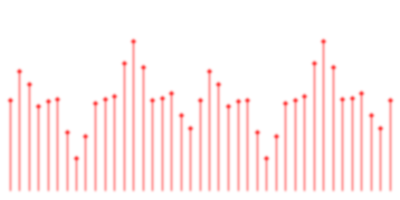
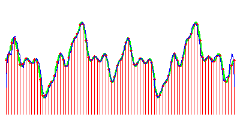

<!--# Kuvanmuodostus ja näytteistys {#kuvanmuodostus}-->

Tässä luvussa tutustumme kuviin, niiden esitysmuotoihin ja matemaattisiin
tulkintoihin. Opimme mitä signaalit ovat ja mitä näytteistys ja interpolointi
tarkoittavat. Tutustumme myös kuvien yksinkertaisiin matemaattisiin
operaatioihin ja kohteiden irrottamiseen kynnystyksen avulla.

Käytännöllisiä asioita tällä kerralla:

* näytteistyksen kokeilua yksiulotteisella signaalilla,
* kuvamatematiikkaa,
* kuvien kynnystystä.

## Kuvanmuodostus

Palautetaan ensimmäisenä mieleen, millä tavoin kuvat muodostuvat. Sama periaate
pätee niin alkeelliseen neulanreikäkameraan ja objektiivilla varustettuun
filmikameraan tai digitaaliseen kameraan kuin myös elävien olentojen silmiin.

Kuva muodostuu, kun tarkasteltava kolmiulotteinen näkymä projisoidaan eli
heijastetaan kaksiulotteiselle pinnalle. Tältä pinnalta kuva voidaan taltioida
valokuvausfilmille, lukea digitaalisella kuvasensorilla tai havaita silmän
verkkokalvon valoherkillä aistinsoluilla. Tällä tavoin *jatkuvasta*
kuvasignaalista muodostuu *diskreetti* eli eroteltu, epäjatkuva tallenne.
Tällaista epäjatkuvaa signaalia kutsutaan yleensä *näytteistetyksi* signaaliksi.

Huomautus: koska näkymästä heijastuva valo koostuu joukosta erillisiä fotoneja,
kuvasignaalia voitaisiin pitää tietyssä mielessä diskreettinä. On mahdollista
rakentaa laitteita, jotka mittaavat yksittäisiä fotoneja. On myös kehitetty
*valokenttäkameroita* (engl. *light field camera*), jotka mittaavat yksittäisten
fotonien saapumissuunnan. Koska tyypillisissä valokuvissa fotonien määrä on
kuitenkin sangen suuri, voidaan tämän luvun kannalta katsoa valon intensiteetti
jatkuvaksi funktioksi, joka muodostuu jonkinlaisesta todennäköisyysjakaumasta
fotonin havaitsemiselle tietyssä kuvapinnan pisteessä. Kvanttimekaniikan ilmiöt
ja epätarkkuusperiaate tekevät fotonien havaitsemisesta joka tapauksessa enemmän
tai vähemmän epätarkkaa.

## Signaalit

Signaalit kuvaavat erilaisia kiinnostavia fyysisiä suureita, jotka vaihtelevat
ajan suhteen ja joskus myös tilan suhteen. Tyypillisesti signaaleissa
kiinnostavaa ovat nimenomaan jonkin fyysisen suureen, kuten äänenpaineen tai
valon intensiteetin *vaihtelut*, joita voidaan kuvata eri taajuuksilla
tapahtuvien säännöllisten muutosten summana. Näitä niin kutsuttuja
*taajuuskomponentteja* voidaan kuvata siniaaltoina, joiden heilahtelunopeus,
heilahtelun laajuus ja heilahtelun alkamiskohta vaihtelevat. Myöhemmin, kun
käsittelemme Fourier-muunnosta, palaamme tähän aiheeseen tarkemmin. Tässä
vaiheessa riittää ymmärtää, että mikä tahansa signaali on purettavissa summaksi
tällaisia säännöllisiä vaihteluita.

### Tehtävä 2.1 {-}

Luentomonisteen interaktiivisessa Jupyter Notebook -versiossa voi kokeilla
keinotekoisten signaalien rakentamista summaamalla siniaaltoina esitettyjä
taajuuskomponentteja.

## Näytteistys

Signaalit ovat yleensä *jatkuvia*, mutta elektronisilla laitteilla voidaan
analysoida lähinnä yksittäisinä numeroina tallennettavia suureita.
**Näytteistys** tarkoittaa jatkuvan signaalin tallentamista lukemalla signaalin
arvoja rajallisessa joukossa näytepisteitä. Ajan suhteen muuttuvaa signaalia,
kuten ääntä, voidaan näytteistää lukemalla signaalin voimakkuutta tietyin
väliajoin. Kuvasignaali muuttuu sekä tilassa että ajassa, joten kuvasignaalia
näytteistetään lukemalla valon kirkkautta yhtä aikaa useista näytepisteistä
pinnalta, jolle kuva on projisoitu.

Niinsanottu *Nyquistin näytteistystaajuus* (engl. *Nyquist rate*) liittyy
signaalin muutostaajuuteen. Jos signaalin nopeimmat muutokset tapahtuvat
taajuudella $k$ kertaa sekunnissa, silloin näytteistämällä $2k$ näytettä
sekunnissa saadaan signaalin muutokset talteen riittävällä tarkkuudella sen
uudelleenrakentamista varten. Tällöin taajuus $2k$ on tämän signaalin Nyquistin
näytteistystaajuus.

## Aliasoituminen

Signaalin näytteistämiseen liittyy ei-toivottu ilmiö nimeltä *aliasoituminen*.
Tämä tarkoittaa signaalin vääristymistä liian alhaisen näytteistystaajuuden
takia: jos signaalissa on nopeampia muutoksia kuin näytteistystaajuus pystyy
erottelemaan, eri taajuiset komponentit sekoittuvat keskenään ja muodostavat
ikään kuin *aliaksia* toisilleen. Tähän liittyy termi, joka saattaa sekoittua
Nyquistin *näytteistystaajuuden kanssa*, nimittäin *Nyquistin taajuus* joka
tarkoittaa puolta signaalin näytteistystaajuudesta. Tämä on näytteistetyn
signaalin ominaisuus ja tarkoittaa taajuutta, jota nopeammat muutokset
aiheuttavat aliasoitumista. Jos signaalia näytteistetään 100 kertaa sekunnissa,
siitä tulisi suodattaa pois muutokset jotka tapahtuvat suuremmalla taajuudella
kuin 50 kertaa sekunnissa; tämä on Nyquistin taajuus ja nimenomaan näytteistetyn
signaalin ominaisuus. Nyquistin näytteistystaajuus puolestaan liittyi
alkuperäisen näytteistettävän signaalin taajuusominaisuuksiin.

## Interpolointi

Interpolointi tarkoittaa jatkuvan signaalin *palauttamista* tai
uudelleenrakentamista eli rekonstruointia näytteistetyistä arvoista.
Näytteistysteoreeman mukaisesti uudelleenrakennettu signaali ei voi sisältää
yksityiskohtia, joiden muutostaajuus on suurempi kuin näytteistystaajuus.
Näytteistäminen siis hukkaa signaalin nopeita muutoksia. Vastaavasti, jos
näytteistystaajuus on suurempi kuin Nyquistin näytteistystaajuus, signaali
voidaan teoriassa palauttaa näytteistä täydellisesti.

### Tehtävä 2.2 {-}

Seuraavassa koodiesimerkissä havainnollistetaan näytteistetyn signaalin
lineaarista interpolointia ja näytteistystaajuuden vaikutusta lopputulokseen.
Kurssisivulla voi kokeilla erilaisia signaaleja ja näytteiden määriä. Kerro
huomioistasi. Jos kuvassa oleva signaali on sekunnin mittainen pätkä, mikä on
interpoloidun signaalin näytteistystaajuus? Mikä on generoidun signaalin
Nyquistin näytteistystaajuus, ja mikä sen määrää? Mikä on näytteistetyn
signaalin Nyquistin taajuus, ja mikä sen määrää?

Näytteistettyjä signaaleja voidaan interpoloida monin eri tavoin, ja eri
menetelmät eroavat sen suhteen, millä tavalla ne pyrkivät arvaamaan kuinka
signaali käyttäytyy näytepisteiden välillä. Yllä olevassa kuvassa on käytetty
*lineaarista interpolointia*, jossa signaalin tulkitaan kulkevan
suoraviivaisesti näytepisteestä toiseen. Tämä voi tuottaa tyydyttävän tuloksen,
jos näytteistystaajuus on riittävän suuri, mutta luonnollisestikaan lopputulos
ei ole derivoituva näytepisteissä.

Parempia interpolointituloksia saadaan sovittamalla näytepisteiden väliin
polynomeja. Niinsanottu kuutiollinen interpolointi (engl. *cubic interpolation*)
perustuu kolmannen asteen polynomien sovittamiseen, ja vaatii signaalin
derivaattojen arvioimista näytepisteiden ympäristössä. Kuvien ollessa kyseessä
interpolointia tehdään kahdessa ulottuvuudessa, jolloin puhutaan
*kaksoislineaarisesta* tai *kaksoiskuutiollisesta* interpoloinnista (engl.
*bilinear* or *bicubic interpolation*). Kuvankäsittelyn yhteydessä kuvia
skaalattaessa käytetään tyypillisesti kuutiollista interpolointia.

Teoreettisesti täydellinen tapa interpoloida signaalia on käyttää niinsanottua
*Whittaker-Shannon interpolointia*, jota joskus kutsutaan
*sinc-interpoloinniksi*:

$$x(t) = \sum_{n=-\infty}^{\infty}x(nT) \cdot sinc\left(\frac{t-nT}{T}\right)$$

Tässä $x(nT)$:t ovat näytepisteiden arvoja, ja $T$ näytepisteiden välinen ero,
eli $1/T$ on näytteistystaajuus. Jos tämä on suurempi kuin Nyquistin taajuus,
tämä kaava teoriassa palauttaa alkuperäisen signaalin täydellisesti. Käytännössä
tähän ei päästä, mutta usein tulos on riittävän hyvä, ja *ylinäytteistämällä*
saadaan pienennettyä uudelleenrakennusvirhettä.

Signaalin kulkua arvioidaan sijoittamalla kunkin näytepisteen kohdalle
$sinc$-funktio, jonka taajuus on säädetty samaksi kuin näytteistystaajuus, ja
kertomalla funktiota näytepisteen arvolla. Kunkin näytepisteen kohdalle
sijoitetun funktion arvo lasketaan halutussa pisteessä $t$, jossa signaalin arvo
halutaan selvittää, ja kaikki tuloksena saadut luvut lasketaan yhteen. Tämän
menetelmän heikkous on siis se, että kunkin interpolointipisteen arvon
määrittelemisessä tarvitaan kaikkia näytepisteitä. Käytännössä $sinc$-funktio
tietysti vaimenee lopulta lähes olemattomiin, joten tietyn kiinteän ympäristön
käyttäminen tuottaa riittävän tarkan tuloksen.

Funktion $sinc$ muoto esitetään oheisessa kuvassa. Kyseessä on siis vaimeneva
sinifunktio.

$$sinc(x) = \frac{\sin x}{x}$$

Oheisessa kuvassa signaali on interpoloitu tällä $sinc$-menetelmällä. Voidaan
huomata, että keskiosassa tulos on melko tarkka. Reunalla tapahtuu poikkeamaa,
mutta tämä johtuu siitä, että signaali loppuu reunassa äkillisesti. Tarkempi
tulos saataisiin vaimentamalla signaali reunoilla tasaisesti nollaan.

## Uudelleennäytteistys

Toisinaan on tarpeen näytteistää signaali uudelleen, mikä tarkoittaa jatkuvan
signaalin palauttamista aiemmin näytteistetyistä arvoista ja tämän palautetun
signaalin näytteistämistä uudelleen eri näytteistystaajuudella. Tyypillinen
esimerkki on kuvan pienentäminen, jolloin näytteitä luetaan pienemmällä
taajuudella. Tästä käytetään termiä *downsampling*.

Nyt on huomattava, että näytteistysteoreema vaatii signaalin korkeataajuuksisten
komponenttien poistamista *alipäästösuodattimen* avulla siten, että Nyquistin
näytteistystaajuutta suuremmat taajuuskomponentit poistuvat.

## Kuvien esitysmuodoista

Kuvia voidaan formuloida useilla eri tavoilla, riippuen tilanteesta. Edellä on
viitattu kuvien esittämiseen **signaaleina**, jolloin voidaan käyttää
signaalinkäsittelyn menetelmiä kuvien suodattamiseksi ja niiden
taajuusinformaation tutkimiseksi. Signaalitulkinta auttaa myös ymmärtämään,
millä tavalla kuvainformaatiota pitäisi käsitellä jotta ei tapahtuisi
aliasoitumista tai muuta vääristymistä.

Kaikille tuttu tapa on ajatella kuvia yksinkertaisesti kaksiulotteisena
taulukkona pikselien arvoja, joka on siis näytteistetty kuvasignaali. Kuvaa
voidaan tarkastella myös **funktiona** säännöllisen kaksiulotteisen hilan
pisteiltä reaaliluvuille; hilapisteitä indeksoidaan kokonaisluvuilla. Tämä
kuvien tulkinta kaksiulotteisina funktioina voidaan laajentaa integroituvaksi ja
derivoituvaksi, jolloin voidaan tehdä yhteenvetoja kuva-alueista ja tutkia
kuvassa tapahtuvia muutoksia.

Kuvia voidaan tarkastella myös **vektoreina**. Tämä tarkoittaa siis sitä,
että kaikkien mahdollisten tietyn kokoisten kuvien joukko muodostaa
korkeaulotteisen *vektoriavaruuden*, jossa jokainen kuva on yksi piste. Kuva
muodostuu siis summana joukosta painotettuja kantavektoreita. Esimerkiksi
kaikkien 100x100 pikselin kokoisten harmaasävykuvien avaruuden virittävät 10000
vektoria joista kukin vastaa yhtä kuvan pikseliä, ja näitä kantavektoreita
kerrotaan pikselin kirkkaudella. Jos kirkkaus skaalataan välille $[-1,1]$, tämä
kuva-avaruus koostuu suljetusta yksikkökuutiosta avaruudessa
$\mathbb{R}^{1000}$. Tällöin origoon sijoittuva piste vastaa kuvaa, joka on
kauttaaltaan keskiharmaa.

Kuvien vektoriesityksiä tutkimme tarkemmin myöhemmissä luvuissa, mutta jo tässä
vaiheessa on syytä huomauttaa, että kuvien mahdollisia vektoriesityksiä on monia
erilaisia. Sen lisäksi että vektorien arvot voidaan skaalata muillakin tavoin,
myös mahdollisia kantavektoreita on monia erilaisia. On olemassa muunnoksia,
joilla kuvia voidaan muuntaa toiseen kantaan ja myös palauttaa takaisin. On
myös monia erilaisia *piirreavaruuksia* jotka ovat hyödyllisiä tiettyjen
sovellusten kannalta; piirteet ovat pikseleiden arvoista *johdettuja* muuttujia
jotka kertovat kuvasta jotakin tietyn sovelluksen kannalta oleellista tietoa.
Voidaan esimerkiksi yrittää muuntaa kuvia avaruuteen, jossa samaa kohdetta
esittävät kuvat olisivat lähellä toisiaan. Piirreavaruudet voivat olla
dimensioltaan pienempiä kuin alkuperäinen kuva-avaruus, ja niistä ei välttämättä
saada palautettua kuvaa entiselleen.

Jo tässä vaiheessa on syytä hahmottaa myös, että vaikka kuvat voidaan tulkita
pisteinä korkeaulotteisessa vektoriavaruudessa, käytännön sovelluksissa
esiintyvät kuvat peittävät tyypillisesti vain pienen osan tästä avaruudesta.
Jos ajatellaan kuvia jostakin tietystä kappaleesta ja oletetaan että
valaistuksen ja kohinan vaikutus eliminoidaan suodattamalla ja normalisoimalla
kuvat, jäljelle jää verrattain vähän *vapausasteita* jotka voisivat vaikuttaa
kappaleen ulkomuotoon kuvassa. Ajatellaan vielä, että skaalauksen ja siirtojen
vaikutus eliminoidaan sijoittamalla kappale kuvan keskelle ja rajaamalla kuva ja
skaalaamalla se vakiokokoiseksi. Jos vielä kuvitellaan kohteet *jäykiksi*
kappaleiksi jotka eivät muuta muotoaan, kuvassa on jäljellä kolme vapausastetta:
kierto kolmen tila-avaruuden akselin ympäri.

Tässä yksinkertaistetussa tilanteessa meillä on siis 10000-ulotteinen
vektoriavaruus, mutta kohteilla on vain kolme vapausastetta. Voidaan siis
odottaa, että kuvat sijoittuisivat lähelle kolmiulotteista *manifoldia* eli
*monistoa*, joka on *upotettu* korkeampiulotteisen avaruuden sisään. Monisto on
matemaattisessa mielessä topologinen avaruus, joka muistuttaa tietynulotteista
euklidista avaruutta jokaisen pisteen ympäristössä, mutta ei välttämättä
globaalisti. Yksinkertainen esimerkki on maapallon pinta. Maa kuviteltiin
muinoin litteäksi, koska maan pinnalta katsottuna ympäristö vaikuttaa
tasaiselta. Minkä tahansa pallon pinta voidaan siis nähdä kaksiulotteisena
monistona joka on upotettu kolmiulotteiseen avaruuteen. Samalla tavoin kuvat
tai mitkä tahansa korkeaulotteiseen vektoriavaruuteen sijoittuvat datajoukot,
joilla on vähemmän vapausasteita kuin vektoriavaruuden dimensio, sijoittuvat
lähelle jonkinlaista mahdollisesti hyvinkin monimutkaisesti mutkittelevaa mutta
kuitenkin verrattain matalaulotteista monistoa.

Jos yksittäisten pikselien sijaan tarkastellaan pikselien naapurustoja, kuvat
muodostavat säännöllisen harvan verkon eli **graafin**, jossa solmut vastaavat
pikseleitä ja kaaret liittävät toisiinsa vierekkäisiä pikseleitä vastaavia
solmuja. Tällainen graafi on *harva* (engl. *sparse*) koska kaaria on noin
$\frac{kn}{2}$ kappaletta, missä $n$ on solmujen määrä ja $k$ on naapuruston
koko. Kaarien määrä on siis luokkaa $O(n)$. Tyypillisiä naapuruston kokoja ovat
4-naapurusto, jossa solmu liittyy vaaka- ja pystysuuntaisiin naapureihin, sekä
8-naapurusto, jossa solmu liittyy kaikkiin kahdeksaan naapuriinsa. Jos solmut
liittyisivät lähes kaikkiin muihin solmuihin, eli kaaria olisi luokkaa $O(n^2)$
kappaletta, verkkoa kutsuttaisiin *tiheäksi* (engl. *dense*).

## Kuvamatematiikkaa

Käsittelemällä kuvia vektoreina voimme suorittaa niille erilaisia
laskutoimituksia, kuten alkioittainen yhteen-, vähennys- ja kertolasku sekä
yhteen-, vähennys- ja kertolasku skalaarin kanssa. Myös jakolasku on
mahdollinen, mutta silloin on huolehdittava siitä, että skalaari tai yksikään
vektorin alkioista ei voi saada arvoa $0$. On myös mahdollista soveltaa
alkioittain monia skalaarifunktioita, kuten $\sqrt{}$, $\log$ tai $\exp$. Näiden
matemaattisten operaatioiden avulla on mahdollista saada aikaan hyvinkin
hyödyllisiä operaatioita, joihin palaamme myöhemmin. Otetaan tässä vaiheessa
esimerkkinä eräänlainen kahden kuvan pisteittäinen 'etäisyys'.

### Tehtävä 2.3 {-}

Seuraavassa koodiesimerkissä esitetään kahden kuvan pisteittäisen etäisyyden
laskeminen sekä kuvan *siirretyn* version luominen. Kurssisivulla voi kokeilla
myös muita matemaattisia operaatioita ja kokeilla operaatiota eri
kuvatiedostoilla, esimerkiksi *bolt.png*, *rect1.png*, *boat.png*, *park.png*.
Kerro huomioistasi. Keksitkö jonkin toisen hyödyllisen operaation, jonka voisi
toteuttaa käyttäen Appendix-osassa kuvailtuja peruslaskutoimituksia? Miten
voitaisiin toteuttaa esimerkiksi normalisointioperaatio, joka skaalaa pikselien
arvot välille $[0,1]$? Entä normalisointi negatiivisia ja positiivisia arvoja
sisältävälle kuvalle siten, että alkuperäisen kuvan arvo $0$ on normalisoidussa
kuvassa arvo $0.5$?

Tämän operaation tuloksesta havaitaan, että tällainen kuvan ja siirretyn kuvan
etäisyys vaikuttaa hyödylliseltä reunojen löytämisessä. Tähän palaamme
myöhemmässä luvussa.

## Kynnystys

Määritellään seuraavaksi ensimmäinen kuvaoperaatio, josta on todellista
käytännön hyötyä. Tämä operaatio on nimeltään *kynnystys* (engl. *thresholding*)
ja se voidaan määritellä kuvalle $I$ näin:

$$T\left(t,I\right)(x,y)=\begin{cases}
                         1, &\text{ jos } I(x,y) < t\\
                         0, &\text{ muuten. }
                        \end{cases}$$

Tässä hyödynnetään siis kuvan funktiotulkintaa ja pakotetaan pikselit joko
valkoisiksi tai mustiksi sen mukaan ovatko ne pienempiä vai suurempia kuin
määrätty kynnysarvo $t$. Tätä kutsutaan joskus myös *binärisöinniksi* (engl.
*binarization*).

### Tehtävä 2.4 {-}

Seuraavassa koodiesimerkissä esitetään kuvan kynnystäminen käyttäen kiinteää
kynnysarvoa. Kurssisivulla pääsee kokeilemaan eri kynnysarvoja ja eri
kuvatiedostoja. Kuvaile tuloksia eri kuvilla. Onko tulos hyödyllinen
kiinnostavien kohteiden tunnistamisen kannalta? Miksi tai miksi ei?

Kynnystys on merkittävä operaatio siksi, että se on yksinkertaisin menetelmä,
jolla kuvasta voidaan irrottaa erilaisia kohteita. Se toimii hyvin silloin, kun
kiinnostavia kohteita kuvataan tasaista taustaa vasten, ja tausta on selvästi
eri värinen kuin kohteet. Teollisuuden liukuhihnat ja tekstidokumentit ovat
sovellusympäristöjä, joissa kynnystys on usein riittävä operaatio kohteiden
irrottamiseksi taustastaan. Kynnystettyä kuvaa, jossa pikseleillä voi olla vain
kaksi eri arvoa (esimerkiksi $0$ ja $1$) kutsutaan *binäärikuvaksi*
(engl. *binary image*). Joskus käytetään myös termiä *monochrome* eli
monokromaattinen (yksivärinen) kuva, vaikka tämä voi tarkoittaa myös
harmaasävykuvaa.

Huomaamme kuitenkin heti, että kynnystyksessä on yksi mahdollisesti kiusallinen
ongelma: miten valita kynnysarvo $t$ siten, että vain haluttu kohde näkyy? Jos
tutkitaan tekstidokumentteja, joissa tausta on täysin valkoinen ja teksti täysin
mustaa, arvo $t=0.5$ saattaa toimia hyvin. Liukuhihnalla, jossa valaistus
voidaan säätää vakioksi, voidaan etsiä kokeilemalla hyvä kynnysarvo ja pitää se
vakiona linjan ollessa käynnissä. Monissa tilanteissa on kuitenkin tarpeen
valita $t$ tapauskohtaisesti tutkimalla kutakin kuvaa erikseen.

Kynnystystä on tutkittu paljon, ja on olemassa monia erilaisia tapoja valita
$t$. On myös kehitetty *adaptiivisia* kynnystysmenetelmiä, joissa kynnysarvo
voi vaihdella kuvan eri osissa. Tämä soveltuu hyvin tilanteisiin, joissa kuvan
kirkkaus vaihtelee suuresti. Tutustumme myöhemmin tarkemmin tällaisiin
menetelmiin. Eräs suhteellisen yksinkertainen menetelmä perustuu oletukseen,
että tietty osuus kuvapisteistä kuuluu kohteeseen:

$$t = \mu(I) + k\sigma(I) + \epsilon.$$

Tässä keskiarvo-keskihajonta-kynnystyksessä asetetaan siis kynnysarvoksi
kuvapisteiden keskiarvo lisättynä $k$ kertaa kuvapisteiden keskihajonnalla.
Pieni toleranssitermi $\epsilon$ tarvitaan hoitamaan ne tapaukset, joissa kuva
on täysin tyhjä, jolloin tulkitaan että kohdetta ei ole sen sijaan että koko
kuva-alue tulkittaisiin kohteeksi. On syytä huomata, että joissakin tapauksissa
$k$:n arvon tulee olla negatiivinen jotta kiinnostava kohde saataisiin esiin.

Seuraavassa esitetään kuvan kynnystäminen keskiarvo-keskihajontamenetelmällä
saadun kynnysarvon avulla. Kurssisivulla pääsee kokeilemaan eri $k$:n ja
$\epsilon$:n arvoja ja lataamaan eri kuvia.

## Tehtäviä

Seuraavassa vielä yhteenveto tämän luvun tehtävistä. Kukin tehtävä liittyy
johonkin koodiesimerkkiin. Tehtävien tekeminen edellyttää interaktiivisen
kurssisivun käyttämistä ja sisäänkirjautumista.

1) Kokeile muuttaa numeroarvoja kahdessa parametrilistassa (amplitudi ja vaihe).
   Kerro havainnoistasi ja yritä selostaa, mitä eri parametrit tekevät. Mitkä
   asiat vaikuttavat lopputuloksena syntyvään signaaliin, joka on piirretty
   kuvaan paksulla vihreällä viivalla?
2) Kokeile muuttaa näytteiden määrää ja generoitavan signaalin parametreja.
   Kerro havainnoistasi. Jos kuvassa oleva signaali on sekunnin mittainen pätkä,
   mikä on interpoloidun signaalin näytteistystaajuus? Mikä on generoidun
   signaalin Nyquistin näytteistystaajuus, ja mikä sen määrää? Mikä on
   näytteistetyn signaalin Nyquistin taajuus, ja mikä sen määrää? (Vihje:
   suhteuta x-akselin skaala `xscale` suurimman taajuuskomponentin taajuuteen.)
3) Kokeile koodiesimerkkiä eri kuvatiedostoilla, esimerkiksi *bolt.png*,
   *rect1.png*, *boat.png*, *park.png*, ja kerro huomioistasi. Keksitkö jonkin
   toisen hyödyllisen operaation, jonka voisi toteuttaa käyttäen Appendix-osassa
   kuvailtuja peruslaskutoimituksia? Kuvaile tuloksia. Miten voitaisiin
   toteuttaa esimerkiksi normalisointioperaatio, joka skaalaa pikselien arvot
   välille $[0,1]$? Entä normalisointi negatiivisia ja positiivisia arvoja
   sisältävälle kuvalle siten, että alkuperäisen kuvan arvo $0$ on
   normalisoidussa kuvassa arvo $0.5$?
4) Kokeile kynnystämistä eri kynnysarvoilla ja eri kuvilla. Onko tulos
   hyödyllinen kiinnostavien kohteiden tunnistamisen kannalta? Miksi tai miksi
   ei?
