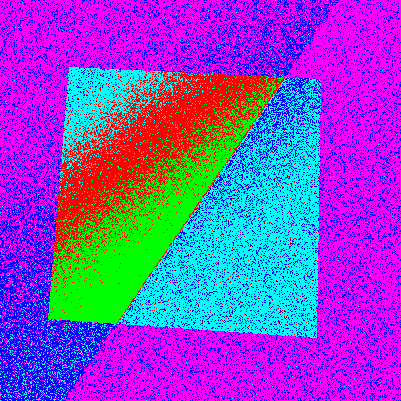
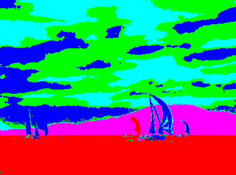
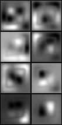

---
title: Luku 7 - Segmentointi ja klusterointi
author: Matti Eskelinen
date: 8.3.2018
title-prefix: TIES411
lang: fi
css: style.css
---

# Segmentointi ja klusterointi {#segmentointi}

Tässä luvussa opimme jakamaan kuvia yhtenäisiin alueisiin.

Käytännöllisiä asioita tällä kerralla:

* kokeillaan perusmenetelmiä testikuvien segmentointiin,
* parametrien kokeilua mahdollisimman hyvän tuloksen saamiseksi,
* todetaan että myöskään segmentointi ei vain onnistu aina hyvin.

## Segmentoinnista yleisesti

**Segmentointi** (engl. *segmentation*) tarkoittaa signaalin jakamista
osiin siten, että toisaalta kukin osa on jollakin tavalla mitattuna sisäisesti
yhtenäinen ja toisaalta samalla tavalla mitattuna erilainen verrattuna
ympäröiviin osiin. Eräs tapa formuloida tämä tavoite on kuvailla osien välistä
eroa $S$ (=*separation*) mukaillen *Fisherin lineaarista diskriminanttia*:

$$S = \frac{\sigma_b^2}{\sigma_w^2} =
  \frac{(\mu_1 - \mu_2)^2}{\sigma_1^2 + \sigma_2^2}.$$

Tässä $\sigma_b^2$ on osien *välinen* varianssi (engl. *between-class variance*)
ja $\sigma_w^2$ on osien *sisäinen* varianssi (engl. *within-class variance*).
Segmentointia voidaan siis ajatella optimointitehtävänä, jossa pyritään
toisaalta joko minimoimaan kunkin osan sisäinen varianssi tai maksimoimaan
kunkin osan *yhtenäisyys*, ja toisaalta maksimoimaan kaikkien osien välinen
varianssi tai minimoimaan osien samankaltaisuus. Tyypillisesti osia on enemmän
kuin kaksi, joten kyseessä on hankala monitavoitteinen optimointitehtävä.
Naiivi ratkaisu olisi kokeilla kaikki mahdolliset kuvan ositukset erillisiin
osiin ja valita paras, mutta tämä on ilmiselvästi mahdotonta, koska erilaisia
osituksia on lukematon määrä.

Kuvien segmentointi tarkoittaa kuvan jakamista erillisiin alueisiin visuaalisen
samankaltaisuuden perusteella. Lopputuloksena on kuvan esitysmuodon
yksinkertaistuminen: sen sijaan, että jouduttaisiin käsittelemään kymmenien
tuhansien tai miljoonien pikselien joukkoa ja tutkimaan kaikkien näiden
pikselien ympäristöjä, saadaan joitakin kymmeniä, satoja tai tuhansia alueita
joiden muotoa ja tilastollisia ominaisuuksia voidaan kuvailla.

Kuvien segmentointi on erittäin aktiivisesti tutkittu konenäön osa-alue.
Erilaisia menetelmiä on paljon. Jotkin niistä perustuvat yleisiin kuva-alueiden
yhtenäisyyden määritelmiin, kun taas toisissa tehdään oletuksia kuvien
sisällöstä ja niissä esiintyvien kappaleiden muodosta. Jotkin menetelmät
vaativat alkuarvauksen tekemistä, joten ne soveltuvat paremmin kuvankäsittelyyn
ja valvottuun kuvien analysointiin, jossa ihminen esittää alkuarvauksen ja kone
optimoi tuloksen tämän perusteella.

Segmentoinniksi kutsutaan toisinaan myös etualalla olevan kohteen erottamista
taustasta (engl. *figure-ground segmentation*) tai kuvan jakamista erillisiin
kohteisiin tai merkityksen mukaisiin alueisiin (engl. *object class
segmentation* tai *semantic labeling*). Nämä tehtävät ovat edistyneempiä ja
vaativat usein monien erillisten alueiden vertailua ja yhdistelyä päättelemällä
tilastollisesti, mitkä alueet voisivat kuulua yhteen. Voidaan käyttää myös
objektimalleja ja näihin perustuvaa optimointia. Näihin palataan myöhemmissä
luvuissa; tässä luvussa keskitytään kuva-alueiden visuaaliseen yhtenäisyyteen
perustuvaan segmentointiin, joka on suhteellisen helposti määriteltävä tehtävä.
Tämä ei kuitenkaan tarkoita, että se olisi helposti suoritettava tehtävä.

Reunanhaku ja segmentointi ovat kiinteästi toisiinsa liittyviä operaatioita,
ja jossakin mielessä ne voidaan käsittää saman operaation vastakkaisiksi
puoliksi: täydellinen reunanhaku tuottaa sivutuotteenaan täydellisen
segmentoinnin, kun yhtenäisiksi alueiksi katsotaan yhtenäisten reunakäyrien
erottamat alueet. Vastaavasti täydellisen segmentoinnin sivutuotteena saadaan
täydelliset reunakäyrät. Useimmissa kuvissa on kuitenkin niin paljon
epävarmuustekijöitä, että reunakäyrät pilkkoutuvat epäyhtenäisiksi pätkiksi ja
yhtenäiset alueet joko pirstaloituvat tai yhdistyvät virheellisesti viereisten
alueiden kanssa. Tämän takia sekä reunanhaun että segmentoinnin lopputulokset
vaativat yleensä jatkokäsittelyä, ja usein voidaan saada parempia tuloksia
yhdistelemällä keskenään tietoja reunoista ja yhtenäisistä alueista. Voidaan
myös suorittaa vuoron perään reunanhakua ja segmentointia, tarkentaen tulosta
kierros kierrokselta.

## Segmentointimenetelmiä

Erilaisia segmentointimenetelmiä voidaan jaotella karkeasti sen mukaan, mihin
kuvien tulkintaan ne perustuvat.

* Kuvien **funktiotulkintaan** perustuvissa menetelmissä tutkitaan kuvien
  kaksiulotteisia gradientteja ja määritetään alueita gradientin maksimien
  muodostamien *vedenjakajien* (engl. *watershed*) avulla. Toisaalta
  *variaatiolaskentaan* perustuvissa menetelmissä määritellään alueet ja niiden
  reunat *funktionaaleina* joiden suhteen määriteltyjä kustannus- tai
  energiafunktioita voidaan minimoida.
* Kuvien **vektoritulkintaan** perustuvissa menetelmissä määritellään pikselien
  arvoihin ja ympäristöihin perustuvia *piirreavaruuksia* ja etsitään näiden
  sisältä ryhmittelyjä käyttäen *klusterointia* eli *rypästelyä* (engl.
  *clustering*).
* Kuvien **graafitulkintaan** perustuvissa menetelmissä yhdistellään graafin
  solmuja samankaltaisuuden perusteella tai pilkotaan graafi erillisiin osiin
  graafileikkauksien tai esimerkiksi virittävän puun avulla.

Eri menetelmät perustuvat saman ongelman formulointiin eri tavoilla. Kaikissa
lopputuloksena on kuvan pikselien ositus *erillisiin joukkoihin* (engl.
*disjoint sets*) joita voidaan kutsua myös *pistevieraiksi* joukoiksi. Jokainen
pikseli kuuluu siis vain yhteen joukkoon, ja kaikki pikselit kuuluvat johonkin
joukkoon.

Kaikissa menetelmissä pikseleille määritellään jokin arvo, ja pikselien välisiä
etäisyyksiä täytyy voida mitata jonkin metriikan avulla. Arvot voivat olla
skalaareita tai vektoreita. Kirkkaus- ja väriarvojen lisäksi voidaan käyttää
erilaisten suotimien vasteita ja pikseliympäristöistä muodostettuja
histogrammeja. Tyypillisesti pikselien arvojen lisäksi huomioidaan niiden
sijainti, eli lähekkäin olevat pikselit määrätään todennäköisemmin samaan
joukkoon kuin kauempana toisistaan olevat pikselit.

## Vedenjakajat

Jos kuvan gradienttia tarkastellaan topografisena karttana, voidaan analysoida
mihin suuntaan kunkin pikselin kohdalle tiputettu kuviteltu vesipisara
virtaisi. Tällä tavalla saadaan määriteltyä valuma-alueet ja näiden väliset
*vedenjakajat*, jotka ovat siis gradientin lokaaleja maksimeja, eräänlaisia
harjanteita, joista vesi pääsee virtaamaan kahteen tai useampaan eri suuntaan.
Samoihin valuma-alueisiin kuuluvat pikselit muodostavat kuvan segmentoinnin.

Valuma-alueita voidaan analysoida kahdella eri tavalla: joko simuloimalla kuvan
hukuttamista veteen alkaen minimikohdista ja panemalla merkille missä kohdissa
erillisten altaiden vedet kohtaavat, tai tutkimalla jyrkimmän gradientin polkuja
jokaisesta pikselistä alkaen ja panemalla merkille mistä pikseleistä vesi päätyy
samoihin paikkoihin.

Vedenjakajamenetelmät kärsivät lokaaleista minimeistä. Jos gradientti on hyvin
epätasainen ja lokaaleja minimikohtia on paljon, kuva pilkkoutuu moniin pieniin
alueisiin. Tilannetta voidaan parantaa eliminoimalla vähemmän tärkeitä
minimikohtia käyttäen harmaasävykuvien morfologisia operaatioita. Toinen
mahdollisuus on muodostaa valuma-alueista hierarkia sallimalla kokonaan veden
alle joutuvien alueiden yhdistyä viereisten alueiden kanssa.

Vedenjakajamenetelmästä on olemassa tehokas graafimuotoinen formulointi, johon
palaamme myöhemmin täsä luvussa.

## Variaatiomenetelmät*

Toinen tapa analysoida kuvia funktioina on *variaatiolaskenta*. Se on
matemaattisen analyysin haara, jossa maksimoidaan ja minimoidaan
funktionaaleja. Nämä ovat kuvauksia vektoriavaruuksilta niihin liittyville
skalaareille. Nämä voidaan nähdä *funktioavaruuksina* jotka kuvaavat sellaisia
funktioita, jotka saavat parametreina toisia funktioita. Kuva-analyysissä
käytetään tyypillisesti funktioita vektoreilta skaalarille: avaruus koostuu
funktioista, joista kukin kuvaa vektorimuotoisen kuvan yhdeksi reaaliarvoksi.
Näistä funktioista valitaan se, joka tuottaa parhaan arvon. Tämä funktio voi
vastata esimerkiksi kuvan jakamista yhtenäisiin alueisiin optimaalisella
tavalla jonkin metriikan suhteen.

Eräs yleinen variaatiolaskennassa käytettyjen funktionaalien ryhmä ovat
*energiafunktionaalit*. Näissä vektoriavaruudet kuvaavat jonkin järjestelmän
mahdollisia tiloja, ja kuhunkin tilaan liittyy reaaliluku joka vastaa
järjestelmän *energiaa*. Tämä voidaan nähdä *kustannuksena*, jonka järjestelmä
maksaa voidakseen olla tietyssä tilassa. Tavoitteena on tyypillisesti löytää
tila, jossa energia tai kustannus minimoituu. Tällainen tila voidaan nähdä
järjestelmän tasapainotilana.

Kuvien segmentoinnissa käsitellään funktionaaleja, jotka kuvailevat näkymässä
olevia alueita ja niiden reunoja. Tällaisen funktionaalin minimointi tuottaa
siis funktion, joka kuvaa jonkinlaisen alueiden ja niiden reunojen vakaan
tilan. Ehkä tunnetuin näistä on **Mumford-Shah**-funktionaali. Sen idea on
määritellä kuvafunktio paloittain sileinä osafunktioina ja mitata tällaisen
osituksen optimaalisuutta energiafunktionaalin avulla. Tämä funktionaali on
määritelty siten, että kustannus riippuu osituksen ja alkuperäisen kuvan
välisestä etäisyydestä, osafunktioiden sileydestä ja alueiden reunojen
pituudesta; tavoitteena on siis mahdollisimman hyvin alkuperäistä kuvaa
vastaava ositus, jonka osaset ovat mahdollisimman tasaisia ja reunakäyriltään
lyhyitä. Kun funktionaali minimoidaan, tuloksena on ositus joka vastaa
jonkinlaista hyvää kompromissia näiden vaatimusten välillä.

Hieman yksinkertaisemmin käsiteltävä variaatiolaskentaan perustuva tapa kuvata
alueita ja niiden reunoja ovat *tasojoukkoihin* perustuvat menetelmät (engl.
*level set methods*). Näissä alueiden reunat kuvataan jonkin korkeampiulotteisen
pinnan tasoleikkauksina. Etuna on se, että esitysmuoto on parametrisoimaton;
alueita ja niiden reunoja etsiessä ei siis ole tarpeen optimoida mahdollisesti
hyvinkin monimutkaisessa parametriavaruudessa, vaan riittää käsitellä
numeerisesti tasojoukkoja, mihin on olemassa tehokkaita tietorakenteita.

Variaatiomenetelmiä emme käsittele tämän tarkemmin; on yleissivistyksen kannalta
hyödyllistä tuntea niiden yleiset periaatteet, mutta vaadittavat matemaattiset
esitiedot vievät ne tämän kurssin ulkopuolelle. Lisäksi ne ovat jossakin määrin
teoreettisia menetelmiä, joiden suorittaminen vie paljon aikaa. Keskitymme tällä
kurssilla suoraviivaisempiin ja käytännöllisempiin menetelmiin.

## Klusterointi ja piirreavaruudet

Data-analyysissä paljon käytetty perusmenetelmä on *klusterointi* eli
*rypästely* (engl. *clustering*). Tämä tarkoittaa datapisteiden ryhmittelyä
siten, että kuhunkin ryhmään kuuluvat datapisteet ovat jossakin mielessä enemmän
samankaltaisia toisten ryhmään kuuluvien pisteiden kanssa kuin muihin ryhmiin
kuuluvien datapisteiden kanssa. Kyseessä on siis periaatteessa sama operaatio
kuin segmentointi. Kuvia ja kuvissa esiintyviä kohteita voidaan rypästellä
kokonaisuuksina, suhteessa muihin kuviin, kun taas segmentoinnissa on kyse yhden
yksittäisen kuvan pikselien rypästelystä. Tähän voidaan soveltaa yleisiä
rypästely- eli klusterointimenetelmiä, kuten *k-means*. Tämä edellyttää
pikselien tarkastelua *vektoreina* jossakin *piirreavaruudessa*.

Piirreavaruuksien tulisi olla *vektoriavaruuksia*, joihin on määritelty *normi*
tai *seminormi*, ja jotka ovat *täydellisiä*.

Normi on funktio $p : X \rightarrow \mathbb{R}$ siten, että

* $p(x) \geq 0$ kaikilla $x \in X$ (positiivisuus),
* $p(x) = 0$ vain jos $x$ on nollavektori,
* $p(kx) = |k|p(x)$ (skaalautuvuus),
* $p(x+y) \leq p(x)+p(y)$ kaikilla $x,y \in X$ (kolmioepäyhtälö).

Positiivisuusehto seuraa muista ehdoista. Seminormi täyttää muut ehdot paitsi
toisen, eli se sallii nollatuloksen myös joillekin muille vektoreille
nollavektorin lisäksi. Normi määrittää *metriikan* vektorien välille; kahden
vektorin välinen etäisyys on niiden erotuksen normi. Metriikka puolestaan
määrittää avaruudelle *topologian* eli eräänlaisen pisteiden ympäristön
käsitteen, jota puolestaan voidaan käyttää jatkuvuuden, konvergenssin ja
samankaltaisuuden määrittelemiseen.

Piirreavaruuden täydellisyysehto tarkoittaa sitä, että jokainen *Cauchyn jono*
avaruuden pisteitä *suppenee* siten, että jonolla on raja-arvo joka myös kuuluu
samaan joukkoon. Tämä on tärkeää siksi, että useat menetelmät ovat
iteratiivisia, joten on voitava luottaa niiden konvergoituvan joukon sisälle
kuuluviin pisteisiin.

Avaruuden $\mathbb{R}^n$ suljetut osajoukot, joihin liitetään jokin tunnettu
seminormi (kuten tavallinen Euklidinen normi) täyttävät kaikki edellä luetellut
ehdot, joten näiden kanssa emme joudu vaikeuksiin. Toisenlaisia piirreavaruuksia
kehiteltäessä on syytä varmistua siitä, että ehdot ovat voimassa.

Kuinka määrittelemme vektoriavaruuksia kuville? Yksinkertaisimmillaan voimme
käyttää harmaasävykuvien pikselien kirkkautta yksiulotteisena piirrevektorina.
Tällaisessa avaruudessa klusterit muodostuvat usein esiintyvien, histogrammien
huippuja vastaavien kirkkausarvojen ympärille. Tätä voidaan ajatella
kynnystyksenä, joka yleistetään useampaan kuin kahteen luokkaan. Tuloksena
syntyy kuva, jossa pikseleillä voi olla esimerkiksi viisi eri arvoa kahden tai
$256$:n sijaan. Tätä kutsutaan myös kuvan *kvantisoinniksi*, ja se on vastaava
operaation kuin gradientin suunnan kvantisointi edellisessä luvussa.

Määritellään *piirrekuvaus* $F$, joka muuntaa kuvan pistejoukoksi valitussa
piirreavaruudessa. Esimerkiksi harmaasävykuville voitaisiin muodostaa kuvaus

$$F_{\text{g}}(I) =
  \left\{\left[\begin{array}{c}
  I(x,y)
  \end{array}\right] \bigg| (x,y) \in \text{dom}(I) \right\},$$

ja vastaavasti värikuville

$$F_{\text{rgb}}(I) =
  \left\{\left[\begin{array}{c}
  I_r(x,y) \\ I_g(x,y) \\ I_b(x,y)
  \end{array}\right] \bigg|  (x,y) \in \text{dom}(I) \right\}.$$

Piirreavaruuteen liitetään aina myös käytettävä normi. Harmaasävykuvien
tapauksessa on luontevaa käyttää esimerkiksi euklidista normia, mutta
värikuvien kanssa joudumme vaikeuksiin. Kuten aiemmassa luvussa \ref{värit}
sivusimme, normaalien RGB-värikuvien värien euklidiset etäisyydet eivät vastaa
meidän käsitystämme siitä, millaiset värit näyttävät samankaltaisilta. Lab-
väriavaruudessa euklidinen etäisyys vastaa paremmin meidän havaintoamme värien
samankaltaisuudesta. Käsiteltäessä värikuvia vektoreina on siis syytä käyttää
Lab-väriavaruutta tai LCh(ab)-väriavaruutta. Voidaan myös käyttää pelkkää
h(ab)-kanavassa olevaa värisävyä, jolloin normissa on otettava huomioon
napakoordinaattimuoto, eli etäisyys on mitattava ympyrän kehää pitkin. Lab-
kuvien piirrekuvaus on vastaava kuin RGB-kuvilla:

$$F_{\text{Lab}}(I) =
  \left\{\left[\begin{array}{c}
  I_L(x,y) \\ I_a(x,y) \\ I_b(x,y)
  \end{array}\right] \bigg| (x,y) \in \text{dom}(I) \right\}.$$

Lab-muodossa olevan kuvan kolme eri kanavaa näyttävät esimerkiksi tältä:

(kuva)

Kuvien segmentoinnissa oleellista on pikselien kirkkauden tai värin lisäksi myös
pikselien sijainti kuvassa ja se, millaisia pikseleitä lähiympäristössä on.
Myöhemmin tarkastelemme pikselinaapurustoja graafeina, mutta voisimmeko liittää
pikselien sijaintitiedon jollakin tavalla vektoriavaruuksiin? Määritellään tätä
ajatellen seuraavaksi pikselikoordinaattien muodostama *spatiaalinen* eli
*tila-avaruus*

$$F_s(I) =
  \left\{\left[\begin{array}{c}
  x \\ y
  \end{array}\right] \bigg|
  (x,y) \in \text{dom}(I) \subset \mathbb{R}^2\right\},$$

joka digitaalisten kuvien tapauksessa muodostaa suorakaiteen muotoisen
tasavälisen hilan pisteitä. Tämä avaruus ei sellaisenaan sisällä hyödyllistä
rakennetta, koska pisteet sijaitsevat tasavälein eikä avaruudessa siten ole
mitään tihentymiä. Mutta jos tila-avaruus yhdistetään esimerkiksi väriavaruuden
kanssa, voidaan tutkia muodostavatko lähekkäin sijaitsevat pikselit samanvärisiä
klustereita:

$$F_{s \times \text{Lab}}(I) = F_{s}(I) \oplus F_{\text{Lab}}(I) =
  \left\{\left[\begin{array}{c}
  x \\ y \\ I_L(x,y) \\ I_a(x,y) \\ I_b(x,y)
  \end{array}\right] \bigg|  (x,y) \in \text{dom}(I) \right\}$$

Kuvan esitys tässä avaruudessa on tietysti isomorfinen alkuperäisen kuvan
kanssa, mutta miten pitäisi valita tässä avaruudessa käytettävä normi? Kuinka
monen pikselin suuruinen etäisyys on yhtä suuri kuin punaisen ja sinisen värin
välinen etäisyys? Tämä riippuu muun muassa kuvan ja kohteiden koosta, ja on
päätettävä tapauskohtaisesti. Voidaan käyttää euklidista etäisyyttä, jossa
pikselikoordinaattien arvoa skaalataan jollakin sopivalla vakiolla. Lupaava
lähtökohta voisi olla skaalata vektoriavaruuden kaikki dimensiot esimerkiksi
välille $[0,1]$ tai $[-1,1]$.

Vastaavalla tavalla voidaan muodostaa monenlaisia piirreavaruuksia käyttäen
esimerkiksi kuva-alueiden tilastollisia tunnuslukuja tai erilaisten
suodinjoukkojen vasteita.

## K-means

Piirreavaruuksissa on yleensä rakennetta: tietyillä alueilla on pisteitä
tiheämmässä kuin muualla. Klusteroinnin tavoitteena on löytää automaattisesti
tällaiset tihentymät. Tunnetussa *k-means -klusteroinnissa* tavoitteena on jakaa
piirreavaruus $k$:hon osajoukkoon $S_i$ siten, että pisteiden etäisyydet
joukkojen keskipisteisiin $\mu_i$ ovat keskimäärin mahdollisimman pieniä. Toisin
sanoen, tavoitteena on minimoida

$$\underset{\mathbf{S}} {\operatorname{arg\,min}}
  \sum_{i=1}^{k} \sum_{\mathbf x_j \in S_i}
  \left\| \mathbf x_j - \boldsymbol\mu_i \right\|_2^2.$$

Optimaalisen ratkaisun löytäminen ei vaikuta helpolta, sillä erilaisia tapoja
muodostaa osajoukot on luokkaa $N!$ kappaletta. Tämä on kuitenkin hyvä esimerkki
NP-täydellisestä ongelmasta, jolle löytyy tehokas ja käytännössä toimiva
*heuristinen* ratkaisu. Menetelmän keksi Stuart Lloyd jo vuonna 1957, ja se
toimii näin:

0) Valitaan mielivaltaiset klustereiden keskipisteet $\mu_i$.
1) Jaetaan pisteet joukkoihin siten, että kukin piste sijoittuu lähimmän
   keskipisteen määräämään joukkoon.
2) Lasketaan uudet keskipisteet siten, että ne vastaavat näin muodostettujen
   joukkojen massakeskipisteitä, ja palataan kohtaan 1.
3) Kun pisteiden jaot eivät enää muutu, ratkaisu on löytynyt.

Menetelmän löytämä ratkaisu ei ole globaalisti optimaalinen, vaan riippuu
alkuarvauksesta $\mu_i$. Lisäksi on osattava arvata joukkojen määrä $k$. Joskus
voikin olla syytä suorittaa etsintä useita kertoja eri $k$:n arvoilla ja
alkuarvauksilla ja mitata löydettyjen ositusten hyvyyttä jollakin sopivalla
tavalla, esimerkiksi käyttäen yllä määriteltyä summaa pisteiden etäisyyksille
keskiarvosta tai luennon alussa mainittua Fisherin diskriminanttia.

### Tehtävä 8.1 {-}

Seuraavassa koodiesimerkissä esitetään kuvan *kvantisointi* käyttäen k-means
klusterointia pikselien arvoille. Kokeile eri kuvilla ja eri k:n arvoilla.
Kuvaile ja selitä tuloksia.

{ .centered }

### Tehtävä 8.2 {-}

Seuraavassa koodiesimerkissä esitetään tila-avaruudella lisätyn piirreavaruuden
k-means klusterointia. Kokeile eri kuvilla ja eri k:n arvoilla. Kuvaile ja
selitä tuloksia. Millä tavalla tulos eroaa pelkille pikseliarvoille suoritetusta
klusteroinnista? Millä tavalla tila-avaruuden skaalauskerroin vaikuttaa
lopputulokseen?

{ .centered }

{ .centered }

{ .centered }

Klusterointia on tutkittu erittäin paljon, kuten segmentointiakin, ja menetelmiä
on monia. K-means pitää silti edelleen pintansa yleiskäyttöisenä
klusterointimenetelmänä, ja sitä käytetään yhä paljon. On kuitenkin huomattava,
että se pyrkii löytämään mahdollisimman symmetrisiä klustereita, ja jakaa
avaruuden näiden mukaan Voronoi-tyyppisiin monikulmioihin. Jos klusterit eivät
ole pallomaisia, K-means saattaa helposti jakaa ne useiksi palasiksi. Yksi
luontevalta tuntuva ratkaisu tähän voisi olla etsiä moninkertainen määrä
klustereita tarpeeseen nähden, ja pyrkiä yhdistelemään klustereita kokoelmiksi.
Tätä ei kuitenkaan ole välttämättä helppo tehdä käytännössä.

## Tiheysfunktion arviointi ja mean shift

Eräs viime aikoina paljon käytetty segmentointimenetelmä on *mean shift*, joka
tarkoittaa *keskiarvosiirtoa*. Tämä viittaa yksinkertaiseen ideaan, jossa
piirreavaruuden pisteitä siirretään toistuvasti määrätystä ympäristöstään
lasketun keskiarvon kohdalle. On osoitettu, että kun tätä toistetaan riittävän
monta kertaa, kaikki pisteet kasaantuvat muutamien pisteiden ympärille. Nämä
pisteet vastaavat pisteiden arvioidun tiheysfunktion *moodeja*, eli pisteiden
todennäköisyysjakauman huippuja. Pisteet siis kerääntyvät klustereiksi sen
mukaan, kuinka tiheässä ne esiintyvät, ja mikä tihentymä sijaitsee lähinnä
kutakin pikseliä.

Mean shift -menetelmän idea voidaan hahmottaa stokastisen prosessin kautta.
Ajatellaan, että piirreavaruuden pisteet syntyvät jonkin mekanismin tuloksena,
ja tämän mekanismin toiminta voidaan mallintaa tilastollisesti: tulos ei ole
joka kerralla sama, vaan noudattaa jotakin todennäköisyysjakaumaa. Voidaan
ajatella, että prosessi tuottaa näytteitä jostakin reaalimaailman ilmiöstä,
tässä tapauksessa jonkin näkymässä olevan kappaleen pinnasta. Jos otamme yhä
uusia kuvia ja keräämme enemmän ja enemmän näytteitä, saamme tiheämpiä ja
tiheämpiä pistepilviä.

Jos valitaan piirreavaruuden mielivaltainen piste, kuinka todennäköisesti tämä
piste löytyy seuraavan kappaleesta otetun kuvan piirrejoukosta? Mitä tiheämmästä
kohdasta piste valitaan, sitä suurempi todennäköisyys on. Kuvassa on tietysti
yleensä useita kohteita ja pintoja, ja voidaan olettaa että jokainen näistä
sijaitsee jossakin piirreavaruuden tihentymässä. Tästä syntyy ajatus, että
voitaisiin valita piirreavaruuden tiheimmät kohdat ja käyttää näitä edustamaan
kaikkia lähellä olevia pisteitä. Kyseessä on siis klusterointi, jossa kaikki
näytepisteet jaetaan piirreavaruuden tihentymien kesken. Piirreavaruutta
kuvaavan todennäköisyysjakauman tiheysfunktio kertoo, mistä avaruuden tiheimmät
kohdat löytyvät; tiheysfunktion huiput eli moodit vastaavat avaruuden tiheimpiä
kohtia.

Määritellään mean shift -algoritmi näin:

1) Valitaan aloituspiste $y_0$.
2) Lasketaan seuraava iteraatiopiste $y_i$ keskiarvona riittävän lähellä
   pistettä $y_{i-1}$ olevista pisteistä:

   $$y_i = \frac{\sum_{x \in F}{K(x-y_{i-1})x}}{\sum_{x \in F}{K(x-y_{i-1})}}
         = y_{i-1} + (m(y_{i-1})-y_{i-1}),$$

  missä $K$ on *ydin*- eli *kernelfunktio* joka määrää millaisesta ikkunasta
  naapuripisteitä tutkitaan:

  $$K(x)=\begin{cases}
           1, \text{kun } \|x\| \leq \lambda \\
           0, \text{muuten.}
         \end{cases}.$$

3) Toistetaan kunnes $\|y_i - y_{i-1}\|$ on sopivan pieni.

Tässä $m$ on *mean shift -vektori*, joka osoittaa datasta arvioidun
tiheysfunktion gradientin eli maksimaalisen kasvun suuntaan. Seuraamalla
gradienttia päädytään lopulta huipulle. Mean shift on siis gradienttimenetelmä
tiheysfunktion huippujen löytämiseksi.

Tästä tulee myöhemmin tarkempaa tietoa ja koodiesimerkki.

## Kuvien graafitulkinta

Aiemmin olemme käsitelleet kuvia signaaleina, mikä mahdollistaa niiden
analysoinnin taajuustasossa sekä suodattamisen konvoluution avulla; vektoreina,
mikä mahdollistaa yleiskäyttöisten data-analyysin menetelmien soveltamisen,
mutta pakottaa tarkastelemaan kuvien globaalia informaatiota; sekä funktioina,
mikä mahdollistaa muutosten analysoimisen derivaattojen avulla, mutta nämä
muutokset ovat hyvin paikallisia.

Kuvissa on yleensä rakenteita ja riippuvuuksia, jotka saattavat vaikuttaa koko
kuvan alueella, mutta usein niiden vaikutus rajoittuu pienemmälle alueelle jonka
muoto saattaa olla hyvin monimutkainen. On hyvin tilannekohtaista millaisia
rakenteita ja riippuvuuksia annetusta kuvasta löytyy, joten tarvitaan abstraktio
joka on riittävän joustava mukautuakseen eri tilanteisiin.

Graafi on matemaattinen rakennelma, joka kuvaa diskreettiä joukkoa elementtejä
sekä näiden välisiä pareittaisia suhteita. Elementtejä ja suhteita voidaan
lisätä ja poistaa, joten tämä abstraktio on rakenteeltaan joustava. Graafi
kuvataan yleensä formaalisti parina
$\mathcal{G}=\langle\mathcal{V},\mathcal{E}\rangle$. Tässä $\mathcal{V}$ on
diskreetti joukko elementtejä, joita kutsutaan yleensä *solmuiksi* (engl.
*vertex*) ja $\mathcal{E} \in \mathcal{V}\times\mathcal{V}$ on diskreetti joukko
näiden välisiä *relaatioita*, joita kutsutaan yleensä *kaariksi* (engl. *arcs*
tai *edges*).

Sellaisenaan graafit kuvaavat rakenteita olemassaolosuhteiden kautta: tietty
solmu joko on olemassa tai ei ole, ja kahden solmun välillä joko on kaari tai ei
ole. Laajennamme seuraavaksi tällaisen yksinkertaisen graafin
käyttömahdollisuuksia määrittelemällä *attribuuttigraafin* $\mathcal{G}_A =
\langle\mathcal{V},\mathcal{E},\mathcal{A}_V,\mathcal{A}_E,f_V,f_E\rangle$.
Tässä $\mathcal{A}_V$ ja $\mathcal{A}_E$ ovat diskreettejä joukkoja
attribuutteja joita voidaan liittää solmuihin ja kaariin, ja $f_V$ ja $f_E$ ovat
funktioita, jotka liittävät kuhunkin solmuun attribuutin arvon.

Attribuutit ovat funktioita $f_V : V \times A_V -> R(A_V)$ jotka palauttavat
tiettyyn solmuun liitetyn tietyn attribuutin arvon. $R(a_i)$ on attribuutin
$a_i$ arvojoukko.

Tähän tulee vielä lisää...

## Ekvivalenssiluokat

Segmentoinnissa kuvan pikselit jaetaan *erillisiin joukkoihin* siten, että
kuhunkin joukkoon kuuluvat pikselit ovat jossakin mielessä keskenään
samanlaisia. Ne siis muodostavat *ekvivalenssiluokkia* eli joukkoja, joiden
alkioiden välillä vallitsee ekvivalenssirelaatio.

Tehokas tapa muodostaa alkioista erillisiä joukkoja on *union-find* -algoritmi
käyttäen metsärakennetta joukkojen hallinnointiin. Jokaista joukkoa edustaa yksi
joukon alkioista, ja nämä edustajat ovat puiden juurisolmuja. Aluksi kaikki
joukot ovat erillisiä ja jokainen alkio on itsensä juurisolmu. Perusoperaatioita
on kaksi. Operaatio **union** yhdistää kaksi joukkoa ja asettaa jomman kumman
joukon edustajan eli juurisolmun toisen joukon edustajan juurisolmuksi.
Operaatio **find** etsii koko puun juurisolmun seuraamalla juurisolmulinkkejä
kunnes löytyy solmu joka on itsensä juurisolmu.

Tämän tietorakenteen käsittelyä saadaan tehostettua kahdella yksinkertaisella
tempulla, ja lopputuloksena sekä *union*- että *find*-operaatio saadaan
suoritettua vakioajassa riippumatta joukkojen koosta. Ensimmäinen temppu on
pitää kirjaa puiden syvyydestä ja asettaa *union*-operaatiossa juurisolmuksi
aina matalampi puu. Toinen temppu on puun litistäminen siten, että aina kun
juurisolmuja etsitään *find*-operaation avulla, jokainen hakupolun varrella
kohdattu solmu liitetään suoraan juurisolmuun. Tällä tavoin puusta tulee lopulta
ykkösen syvyinen.

Yksityiskohtaisempaa tietoa erillisten joukkojen toteuttamisesta ja *union-find*
-algoritmista esimerkiksi [Wikipediasta](
http://en.wikipedia.org/wiki/Disjoint-set_data_structure) ja kyseisellä sivulla
viitatuista artikkeleista.

## Yhtenäiset kappaleet

Yksinkertaisin tapa segmentoida kuvia on kynnystäminen ja *yhtenäisten
kappaleiden* merkitseminen (engl. *connected components*). Tässä menetelmässä
yksinkertaisesti merkitään samaan joukkoon kuuluviksi ne pikselit, jotka ovat
vierekkäisiä jossakin naapurustossa (yleensä 4-naapurusto) ja joilla on sama
arvo (siis $0$ tai $1$). Tausta voidaan myös jättää huomiotta ja merkitä vain
yhtenäiset kohdepikseleitä sisältävät alueet.

Nopea tapa toteuttaa menetelmä on käydä pikselit yhden kerran läpi riveittäin,
luoda kullekin pikselille ekvivalenssiluokka, verrata vasemmalla ja yläpuolella
olevan pikselin kanssa ja suorittaa *union*-operaatio jos pikseleillä on sama
arvo. Sama voidaan tehdä myös käyttäen pikseleille kokonaislukutunnisteita ja
merkitsemällä pikseli aina samalla tunnisteella kuin samanarvoinen
naapuripikseli, mutta tässä joudutaan pitämään erikseen kirjaa eri
kokonaislukujen ekvivalensseista. Tämä johtuu siitä, että alueet, jotka aluksi
merkittiin eri tunnistein, saattavat yhdistyä myöhemmin tutkittaessa
pikseliriviä eteenpäin. Käyttämällä *union-find* -tekniikkaa selvitään yhdellä
läpikäynnillä ilman ylimääräistä kirjanpitoa.

(tähän tarvittaisiin kuva)

Yhtenäisten kappaleiden etsintä voidaan formuloida myös käyttäen
attribuuttigraafeja. Tässä solmut varustetaan kahdella attribuutilla:
pikseliarvo ja ekvivalenssiluokka käyttäen erillisiä joukkoja. Jokaisen solmun
pikseliarvoa verrataan naapurisolmujen pikseliarvojen kanssa, ja muodostetaan
unioni niiden solmujen kanssa, joiden arvo on yhtä suuri. Tästä huomataan, että
graafiesitys mahdollistaa hyvin kompaktin ja formaalin esitystavan joka ei ota
kantaa solmujen tutkimisjärjestykseen tai graafin toteutustapaan.

(kuva)

Graafitulkinta mahdollistaa yhtenäisten alueiden muodostamisen laajentamisen
helposti myös muihin kuin binäärikuviin. Pikselin etäisyys naapureihinsa voidaan
laskea käyttäen sopivaa metriikkaa, ja riittävän lähellä toisiaan olevat
pikselit voidaan yhdistää. Joukkojen juurisolmuissa voidaan ylläpitää koko
joukkoa kuvailevia tilastollisia tietoja, kuten arvojen ja koordinaattien
summia, joista voidaan laskea alueiden koko, keskipiste, keskiarvo ja
keskihajonta. Näitä tietoja voidaan käyttää etäisyyden laskemisessa. Voidaan
esimerkiksi painottaa pikselin ja pikselijoukon etäisyyttä sen mukaan, kuinka
kaukana pikseli on joukon keskipisteestä, ja kuinka kaukana pikselin arvo on
joukon keskiarvosta suhteessa joukon keskihajontaan.

Seuraavassa koodiesimerkissä havainnollistetaan yhtenäisten kappaleiden
etsintää.

## Alueiden kasvatus

Eräs perinteinen segmentointimenetelmä on alueiden kasvatus. Siinä valitaan
muutamia aloituspisteitä tai siemeniä (engl. *seed*) ja yhdistetään niihin
vierekkäisiä pisteitä jotka ovat riittävän samankaltaisia. Tämä muistuttaa
hieman yllä kuvattua yhtenäisten alueiden muodostamisen yleistettyä versiota,
mutta heikkoutena on se, että aloituspisteet on löydettävä jollakin tavoin. Tätä
menetelmää käytetään kuvankäsittelyssä, jossa käyttäjä voi valita pisteen ja
ohjelma valitsee ja merkitsee alueen, joka koostuu samankaltaisista pikseleistä.

## Alueiden pilkkominen ja yhdistely

Yhtenäisiä kappaleita muodostetaan yhdistelemällä pikseleitä toisiin pikseleihin
ja pikselijoukkoihin jonkin yhtenäisyyskriteerin perusteella. Tässä on
heikkoutena se, että erilliset alueet saattavat päätyä yhteen, jos niiden
välillä on tasainen siirtymä ilman suurta hyppäystä. Tätä voidaan jonkin verran
ehkäistä tutkimalla alueiden tilastollisia tunnuslukuja tai jopa jakaumia. Silti
eteen saattaa tulla tilanteita, joissa alueita pitäisi voida myös jakaa osiin
yhdistämisen lisäksi.

Eräs perinteinen segmentointimenetelmien ryhmä on nimeltään *split-and-merge*
eli pilkkominen ja yhdistely. Näissä kuva esitetään yleensä *nelipuun* muodossa.
Ylimmällä tasolla on koko kuva, ja solmu voidaan aina jakaa neljään yhtä suureen
osaan. Solmun kattamaa kuva-aluetta tutkitaan, ja jos se todetaan jollakin
tavalla mitaten epäyhtenäiseksi, se pilkotaan neljään osaan. Jos kaksi
vierekkäistä solmua on keskenään samanlaisia ja ne muodostavat yhtenäisen
alueen, nämä solmut voidaan yhdistää. Näin jatketaan, kunnes solmuja ei enää
voida yhdistää tai jakaa.

Nelipuut toimivat parhaiten neliön muotoisille kuville, joiden leveys on
kakkosen potenssi. Muun kokoiset kuvat voidaan jakaa *nelipuumetsäksi* joka
muodostuu joukosta vierekkäisiä, saman kokoisia nelipuita, joiden leveys on
kakkosen potenssi. Tällaista metsää voidaan käsitellä graafina, jolloin
operaatiot yksinkertaistuvat.

Tämä lähestymistapa on yksinkertainen formuloida, mutta sen heikkous on se, että
vain neliönmuotoisia alueita voidaan pilkkoa helpolla tavalla. Yleiskäyttöisempi
menetelmä vaatisi epäyhtenäiseksi todetun alueen jakamisen esimerkiksi siten,
että mielivaltaisen alueen kahdesta tai neljästä reunapisteestä tai
satunnaisesta sisäosan pisteestä ryhdytään kasvattamaan uusia alueita.

## Pienin virittävä puu

Graafimuodossa esitettyjen kuvien segmentointiin voidaan käyttää myös
graafiteorian tarjoamia apuneuvoja. Eräs suoraviivainen keino on *pienimmän
virittävän puun* (engl. *minimum spanning tree*, MST) muodostaminen. Tämä
perustuu graafin kaarien painokertoimiin, jotka voidaan muodostaa jonkin
pikselien välistä samankaltaisuutta mittaavan metriikan avulla. Pienin virittävä
puu on *syklitön graafi* eli puu, jonka kaarien painokertoimien summa on pienin
kaikkien mahdollisten virittävien puiden joukossa.

Kuvagraafin pienin virittävä puu voidaan muodostaa parhaimmillaan lineaarisessa
ajassa käyttäen Felzenszwalbin esittelemää menetelmää. Se perustuu Kruskalin
algoritmiin, jossa graafin kaaria lisätään virittävään puuhun painokertoimien
mukaisessa järjestyksessä alkaen pienimmistä, jos lisätty kaari ei tuota puuhun
syklejä. Kuvagraafien tapauksessa aloitetaan siis eniten toisiaan muistuttavia
pikseleitä yhdistävistä kaarista. Kaaren lisääminen virittävään puuhun voidaan
tulkita sen liittämien pikselien yhdistämisenä alueeksi, ja virittävän puun
hallinnointiin voidaan käyttää *union-find*-menetelmää.

Graafin syklit voidaan havaita ennakkoon siitä, että tutkittavan kaaren
yhdistämät pikselit kuuluvat jo samaan joukkoon, eli *find*-komento palauttaa
saman arvon. Tällaisia kaaria ei lisätä virittävään puuhun. Jos halutaan
säilyttää varsinainen puurakenne, *find*-komennon toteutus pitäisi parametroida
siten, että solmujen liittämistä suoraan juurisolmuun ei tehdä. Tehokkuus kärsii
jonkin verran, mutta muodostuvaa puuta voi käyttää hierarkiseen segmentointiin,
jonka tulosta voi myöhemmin analysoida ja muokata.

Jos käytetään kynnysarvoa yhdistettävien pikselien ja pikselijoukkojen väliselle
samankaltaisuudelle ja jätetään tätä arvoa suuremmat kaaret lisäämättä
virittävään puuhun, tuloksena on joukko virittäviä puita eli metsä, jonka puut
vastaavat kuvan segmenttejä. Jos kynnysarvoa ei käytetä, ja solmuja ei
*find*-operaatiossa liitetä suoraan juurisolmuun, tuloksena on koko kuvan
hierarkinen segmentointi yhdeksi puuksi. Poistamalla kaaria puusta, esimerkiksi
alkaen suurimmista painokertoimista tai huomioiden muodostuvien alueiden
kompaktiuden, saadaan pilkottua kuvaa pienemmiksi ja yhtenäisemmiksi alueiksi.
Tapa, jolla pikseleitä vertaillaan, on luonnollisesti ratkaisevan tärkeä
lopputuloksen kannalta.

### Tehtävä 8.3 {-}

Seuraavassa koodiesimerkissä havainnollistetaan segmentointituloksia pienimmän
virittävän puun avulla. Kokeile eri kuvilla ja eri kynnysarvoilla - huomaa, että
pikseliarvot ovat väliltä $[0,1]$. Kuvaile ja selitä havaintoja.

Pienimmän virittävän puun muodostaminen saadaan rinnakkaistettua tehokkaasti
Wassenbergin mukaan. Suurin merkitys suoritusaikaan on kaarien lajitteluun
käytetty menetelmä. Jos painokertoimet ovat pieniä kokonaislukuja (kuten
käytettäessä painokertoimina esimerkiksi pikseliarvojen kirkkauseroja) lajittelu
saadaan tehtyä lähes lineaarisessa ajassa käyttäen *counting sort* -menetelmää.

## Vedenjakajien graafitulkinta

Aiemmin mainittu vedenjakajiin perustuva segmentointimenetelmä voidaan toteuttaa
tehokkaasti etsimällä virittävä puu gradientin magnitudin mukaan rakennetussa
graafissa. Ideana on se, että jokaisesta puun solmusta muodostetaan kaaria
pitkin kulkeva polku gradientin suurimman laskun suuntaan; tämä polku siis
kuvaa, mihin suuntaan solmun kohdalle kaadettu vesi virtaa. Muodostuviin
polkuihin kuuluvat solmut merkitään tunnisteilla, ja jos matkalla kohdataan jo
aiemmin merkitty polku, nämä kaksi polkua yhdistetään. Maksimikohdat, joista
lähtee vähintään kaksi polkua, jäävät ilman polkutunnistetta. Koska polut
merkitään solmuihin, on tarpeen käydä kaikki solmut läpi vain yhden kerran, ja
läpikäynti voidaan tehdä mielivaltaisessa järjestyksessä.

Tähän tulee vielä lisää tietoa ja koodiesimerkki...

## Graafileikkaukset*

Graafileikkaus tarkoittaa graafin pilkkomista kahteen erilliseen osaan
poistamalla osa kaarista; se on siis eräänlainen graafin segmentointioperaatio.
Minimileikkaus tarkoittaa leikkausta, jonka poistamien kaarien painokertoimien
summa on minimaalinen. Erilaisia graafileikkauksia on eksponentiaalinen määrä,
ja minimaaliset leikkaukset ovat taipuvaisia suosimaan mahdollisimman pieniä
solmujen kokoelmia, jolloin poistettavia kaaria on vähemmän. On vaikeaa löytää
hyviä leikkauksia, jotka jakaisivat graafin kahteen lähes yhtä suureen osaan.

(tähän gradientteihin perustuvista menetelmistä)

Parempi tapa löytää graafileikkauksia perustuu *spektraaliseen graafiteoriaan*.
Tässä tutkitaan *matriisimuodossa* esitettyjen graafien ominaisarvoja ja
-vektoreita. Graafi voidaan kuvailla esimerkiksi *viereisyysmatriisin* eli
*vierusmatriisin* (engl. *adjacency matrix*) $A$ avulla: siinä graafin jokaista
solmua kohti on yksi rivi ja sarake, ja matriisin alkio kohdassa $(i,j)$ kertoo
kuinka monta kaarta solmujen $i$ ja $j$ välillä on. Jos kaarilla on
painokertoimet, voidaan käyttää *painomatriisia* $W$, jonka alkiot $(i,j)$
koostuvat solmujen $i$ ja $j$ välisten kaarten painokertoimista $w_{ij}$.
Graafin *astematriisi* (engl. *degree matrix*) $D$ on diagonaalimatriisi, joka
kertoo kunkin solmun *asteen* eli siihen liittyvien kaarien määrän. Niinsanottu
*Laplacen matriisi* $L$ muodostetaan astematriisin sekä vierus- tai
painomatriisin avulla: $L = D-A$ tai $L = D-W$. Tämä matriisi vastaa
*Laplacen operaattoria* $\nabla^2$ jota käytetään esimerkiksi lämpöyhtälössä.
Sen siis voidaan ajatella kuvaavan lämmön leviämistä eli *diffuusiota*
graafissa.

Shi ja Malik osoittivat, että jos ratkaistaan pienimpiä ominaisarvoja vastaavat
ominaisvektorit $\lambda$ tehtävästä $Lx - \lambda Dx$, saadaan approksimoitua
graafin leikkauksia jotka minimoivat niinsanotun *normalisoidun*
leikkauskustannuksen: tämä tarkoittaa leikkauksessa poistettujen kaarien
painojen summaa suhteessa kyseisten osien kaikkien kaarien painoihin:

$$\text{ncut}(A,B) = \frac{w(A,B)}{w(A,V)} + \frac{w(A,B)}{w(B,V)}$$

missä $w(A,B) = \sum_{i \in A, j \in B}w_{ij}$$ eli kaikkien solmujoukkoja $A$
ja $B$ yhdistävien kaarien painokertoimien summaa. Tavallisessa
minimileikkauksessa minimoidaan $w(A,B)$:n suhteen, kun taas Shi ja Malik
pyrkivät minimoimaan $\text{ncut}(A,B)$:n suhteen. Varsinainen minimointitehtävä
on NP-täydellinen, mutta ominaisarvotehtävän *toiseksi pienintä ominaisarvoa*
vastaava ominaisvektori approksimoi globaalia minimiä; voidaan osoittaa, että
pienin ominaisarvo on $0$. Kyseessä on reaaliarvoinen vektori, mutta se voidaan
kynnystää nollia ja ykkösiä sisältäväksi vektoriksi joka kertoo mitkä solmut
kuuluvat muodostettaviin kahteen alueeseen. Usein hyvä kynnysarvo on $0$, mutta
voidaan myös tutkia eri kynnysarvojen tuottamia $\text{ncut}$-arvoja ja valita
parhaan tuloksen tuottava arvo.

Tätä menetelmää kutsutaan nimellä *normalisoidut leikkaukset* (engl.
*normalized cuts*) ja sen tunteminen on hyödyksi yleissivistyksen kannalta,
mutta emme tässä mene siihen sen tarkemmin. Toteamme vain, että etsimällä
useita pienimpiä ominaisarvoja vastaavia ominaisvektoreita saadaan useita
leikkauksia, joilla voidaan jakaa kuva useampaan kuin kahteen osaan. Mainittu
ominaisarvotehtävä saadaan ratkaistua tehokkaasti käyttäen Lanczosin
menetelmää, joka soveltuu käytettäväksi *harvojen* matriisien kanssa,
jollainen kuvagraafien Laplacen matriisi on. Yleisesti ottaen normalisoidut
leikkaukset on hidas menetelmä käyttää, ja sen hyödyllisyyttä vähentää se,
että leikkaus jakaa graafin aina kahteen osaan.

{ .centered }

## Ylisegmentointi ja superpikselit

Tutkittuamme tärkeimpiä keinoja ja tapoja lähestyä kuvien segmentointia joudumme
lopulta toteamaan, että segmentointi ei aina onnistu. Käytännön tilanteissa
törmätään usein kuviin, joita on mahdotonta segmentoida oikein pelkkiin
pikselien arvoihin nojautuen; jos valot ja varjot tai pintojen
heijastavuusominaisuudet osuvat sopivasti, pintojen välinen reuna katoaa ja
kaksi tai useampia pintoja sulautuu yhteen. Toisinaan voidaan yrittää paikata
aukkoja esimerkiksi yrittämällä jatkaa katkenneita reunoja aiempaan
kulkusuuntaansa. Toisinaan ainoa keino segmentoida kohde oikein on kuitenkin
tunnistaa tai arvata mikä kohde on kyseessä ja käyttää aiempaa tietoa kohteen
muodosta oikean reunojen sijainnin arvaamiseen. Samalla voidaan vahvistaa, oliko
arvaus oikea ja näyttääkö kuva sellaiselta, että siinä voisi olla arvattu kohde.

Koska segmentointi ei aina onnistu, viime aikoina on suosittu tapaa
*ylisegmentoida* kuva, eli jakaa se moniin pieniin alueisiin siten, että
segmentit pilkkoutuvat. Ideana on se, että kahden segmentin sulautumisen
todennäköisyys olisi pienempi. Näitä palasia pyritään sitten yhdistelemään
kohteiksi tilastollisen päättelyn avulla. Toisinaan segmentit muodostetaan
tasavälisen hilan määräämien aloituspisteiden ympärille; tällaisia segmenttejä
kutsutaan *superpikseleiksi*. Huolimatta ylisegmentoinnista näissä menetelmissä
kohteiden reunoihin saattaa tulla ylimääräisiä mutkia, joten jos tarvitaan hyvin
tarkka reunakäyrä, voi olla tarpeen käyttää kohteen tunnistamisen jälkeen vielä
jonkinlaista reunan muodon kuvaavaa mallia reunakäyrän optimointiin.

## Tehtäviä

1) Kokeile pikseliarvojen k-means klusterointia eri kuvilla ja eri k:n arvoilla.
   Kuvaile ja selitä tuloksia.
2) Kokeile piirreavaruuden k-means klusterointia eri kuvilla ja eri k:n
   arvoilla. Kuvaile ja selitä tuloksia. Millä tavalla tulos eroaa pelkille
   pikseliarvoille suoritetusta klusteroinnista? Millä tavalla tila-avaruuden
   skaalauskerroin vaikuttaa lopputulokseen?
3) Kokeile pienimmän virittävän puun segmentointia eri kuvilla ja eri
   kynnysarvoilla. Kuvaile ja selitä havaintoja.
