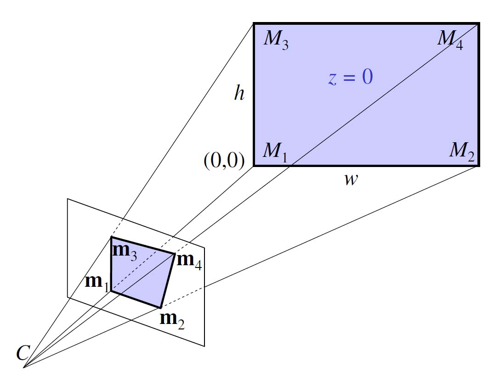

---
title: Luku 10 - Kuvien geometriset muunnokset
author: Matti Eskelinen, Ville Tirronen, Tuomo Rossi
date: 5.4.2018
title-prefix: TIES411
lang: fi
css: style.css
---

# Kuvien geometriset muunnokset {#geometria}

Monissa hyödyllisissä konenäkösovelluksissa ei tarvitse ottaa huomioon kuvan
muodostumista projektiona tai kameran optisia ominaisuuksia. Jos kuitenkin pitää
pystyä laskemaan tarkkoja vastaavuuksia kameran kuvan ja todellisen näkymän
välillä, tai kahden tai useamman kuvan välillä, on otettava huomioon
projektiogeometria ja kameran optiikka.

## Konenäkö käänteisongelmana

Konenäkö voidaan nähdä pohjimmiltaan käänteisongelmana: todellinen näkymä on
projisoitu kuvatasoon jonkinlaisella muunnoksella, ja haluaisimme löytää
käänteismuunnoksen, jolla saisimme palautettua alkuperäisen näkymän. Useimmat
käytännön sovellukset eivät tietenkään vaadi täydellistä käänteismuunnosta,
mutta olisihan toki huomattavasti helpompaa hahmottaa näkymässä olevia kohteita,
jos ne olisivat kolmiulotteisia erillisiä objekteja.

Käänteisongelmasta on kyse silloin, jos meillä on tutkittavana
seuraavankaltainen tilanne:

$$f(m) = d$$

ja haluaisimme saada muodostettua käänteisoperaation

$$f^{-1}(d) = m$$

Kyseessä on siis tilanne, jossa jokin ilmiö tuottaa mittauksia jostakin
tutkittavasta kohteesta. Tässä ilmiötä on kuvattu funktiolla $f$, jota
sovelletaan kohdetta kuvailevaan malliin $m$. Tuloksena on havaintoja, tai
datapisteitä, $d$ tutkittavasta kohteesta. Käänteisoperaatio $f^{-1}$ tuottaa
havainnoista mallin, jonka parametreja tutkimalla toivotaan saatavan hyödyllisiä
tietoja mittausten kohteesta.

Malli on jossakin määrin kuvitteellinen, mutta esimerkiksi konenäköongelmassa
voidaan ajatella mallia esimerkiksi kolmiulotteisena mallina, joka kuvaa
näkymässä olevien kohteiden sijainnin ja ulkomuodon tarkasti. Mallissa
ajatellaan olevan parametreja, joita säätämällä kohteiden sijaintia ja
ulkomuotoa voidaan säätää, ja kutakin näkymää vastaa yksikäsitteinen joukko
parametrien arvoja. Funktio $f$ taas on jokin mittalaite, esimerkiksi
kamerajärjestelmä, joka projisoi kolmiulotteisen näkymän kaksiulotteiseksi,
diskreetiksi kuvaksi.

Haastetta ongelmaan tuo se, että usein sekä funktio $f$ että mallin $m$
parametrointi ovat tuntemattomia. Ei siis ole mahdollista tehdä mielin määrin
kokeiluja käyttäen valmista funktiota ja mallia. Ensimmäinen vaihe ongelman
ratkaisemisessa onkin mallittaa ongelma approksimoimalla jollakin sopivalla
tavalla funktiota $f$ ja mallia $m$.

Esimerkiksi fysikaalisia ilmiöitä tutkittaessa funktiota $f$ tyypillisesti
approksimoidaan osittaisdifferentiaaliyhtälöllä ja mallia approksimoidaan
diskreetillä hilalla tutkittavan avaruuden pisteitä. Reunaehdoksi tarvitaan
mittaamalla tai mielivaltaisesti valitsemalla saatu joukko arvoja hilapisteissä.
Sitten osittaisdifferentiaaliyhtälö ratkaistaan numeerisesti sopivalla
menetelmällä.

Konenäköongelmissa on usein liian haastavaa rekonstruoida kolmiulotteinen näkymä
täydellisesti.  Luonnollisissa näkymissä on liian paljon pieniä yksityiskohtia
ja ylimääräisiä esineitä. Jokaisen esineen tarkan paikan ja asennon
määrittäminen olisi hankalaa ja turhaakin. Tyypillisesti käsillä olevan ongelman
ratkaisemiseksi riittää selvittää yhden kiinnostavan kohteen asema näkymässä.
Toisenlaisissa ongelmissa taas riittää selvittää kameran asento suhteessa
näkymään, tai seurata asennon muuttumista videokuvan ruudusta toiseen.

## Geometrinen kuvanmuodostus projektiona

Aiemmin olemme käsitelleet kuvanmuodostusta vain näytteistyksen ja
signaalinkäsittelyn näkökulmasta: olemme siis ottaneet huomioon vain sensorin,
joka tallentaa kuvadatan. Näytteistyksessäkin toki tapahtuu muunnos, mutta
todellisuudessa jo kuvasensorille saapuva data on tulosta muunnoksesta.
Kolmiulotteinen näkymä on projisoitu kaksiulotteiselle tasolle.

Tilanne konenäön käänteisongelman kannalta on siis se, että mallin $m$
parametroinnin lisäksi myös muunnos $f$ on tuntematon. Pystyäksemme edes
haaveilemaan käänteismuunnoksesta meidän on arvioitava ensin, millainen kameran
tekemä projektiomuunnos on. Se voidaan esittää projektiomatriisina, jotka ovat
tuttuja lineaarialgebrasta ja tietokonegrafiikasta. Projektiomatriisi muuntaa
kameran tapauksessa kolmiulotteisen näkymäavaruuden vektorin kaksiulotteisen
kuvatason vektoriksi.

## Homogeeniset koordinaatit

Muistamme, että kolmiulotteisen avaruuden kierrot ja skaalaukset voidaan esittää
3x3-matriiseilla, joita voi kertoa keskenään operaatioiden ketjuttamiseksi.
Siirto eli translaatio kolmiulotteisessa avaruudessa (sekä projektio) on
kuitenkin mahdotonta esittää 3x3-matriisien kertolaskuna, koska
matriisikertolaskuun sisältyy oletus siitä, että origo pysyy muuttumattomana.
Siirrossa origonkin pitäisi siirtyä, mutta jos kuvitteellista siirtomatriisia
sovellettaisiin origoon $(0,0)$, tuloksena saataisiin sama piste. Tämän takia
käytetään niinsanottuja *homogeenisiä koordinaatteja*, joita kutsutaan myös
projektiokoordinaateiksi: matriisiin lisätään ylimääräinen rivi ja sarake,
joiden avulla siirto voidaan kuvitella tehtävän ikään kuin ylimääräisen,
neljännen ulottuvuuden kautta, jossa alkuperäisen avaruuden origon kaikki
koordinaatit eivät olekaan nollia. Homogeenisillä koordinaateilla voidaan
esittää mikä tahansa projektio kertolaskuna 4x4-matriisin kanssa. Koska
lopullinen projektio tehdään kaksiulotteiseen avaruuteen, valmis
projektiomatriisi on kokoa 3x4.

## Perspektiiviprojektio

Valokuvien analysoinnin, tulkitsemisen ja tarkkojen mittausten kannalta
ongelmallista on se, että linssien avulla tapahtuvaan kohdistamiseen perustuvien
kameroiden (myös ihmisen silmien) tuottamissa kuvissa on perspektiivivääristymä:
yhdensuuntaiset viivat eivät pysy yhdensuuntaisina, vaan suuntautuvat yhteen
pisteeseen, niinsanottuun pakopisteeseen.

{ .centered }

Tämä ilmiö johtuu siitä, että perspektiiviprojektio muodostetaan vetämällä suora
viiva kustakin kohteessa olevasta pisteestä yhteen kiinteään pisteeseen,
niinsanottuun projektiokeskipisteeseen. Projektiokeskipisteen ja näkymän väliin
asetetaan projektiotaso, ja kuhunkin pisteeseen kulkevan suoran ja kuvatason
leikkauspiste on kyseisen pisteen projektio kuvatasossa. Tämä toimenpide johtaa
siihen, että vain projektiokeskipisteestä kohtisuoraan projektiotason
leikkaavalla suoralla olevat pisteet ovat vääristymättömiä, kun taas kaikkien
muiden pisteiden sijainti vääristyy hieman. Me ihmiset olemme niin tottuneita
perspektiiviprojektioon, ja aivomme olettavat kaiken olevan tällä tavalla
projisoitunutta, että emme itse huomaa vääristymiä, paitsi tiettyjen optisten
harhojen yhteydessä. Monet keinotekoiset optiset harhat perustuvatkin nimenomaan
ihmisen perspektiivikäsityksen harhauttamiseen.

Perspektiiviprojektio on ongelmallinen, mutta sitä ei voi välttää nykyisillä
kameroilla, koska niissä kuva projisoidaan tasoon linssien avulla.
Tietokonegrafiikassa voidaan käyttää niinsanottua ortografista projektiota,
jossa kohde projisoidaan suoraan tasoon yhdensuuntaisten suorien avulla.
Projektiotason on siis oltava saman kokoinen kuin kuvattava kohde. Olisikin
hyvin haasteellista rakentaa kamera, jolla voisi projisoida todellisia näkymiä
ortografisesti. Käytännössä vaadittaisiin varmaankin tasossa liikkuva,
kohtisuoraan eteenpäin jokaisen pikselin yksitellen skannaava sensori,
esimerkiksi tavallinen kamera joka tallentaa vain täsmälleen kuvan keskellä
olevan pikselin, joka siis on vääristymätön.

Perspektiiviprojektiosta johtuvat vääristymät voi onneksi korjata, mutta tätä
varten on tunnettava kameran projektio-ominaisuudet.

## Kameraparametrit

Kameroiden yhteydessä puhutaan kahdenlaisista parametreista:

* Ulkoiset (engl. *extrinsic*) parametrit kuvaavat kameran asemaa kohteeseen
  nähden: siirto (translaatio) ja kierto (rotaatio), joiden mukaisesti kamera on
  aseteltu kuvauspaikkaan.
* Sisäiset (engl. *intrinsic*) parametrit kuvaavat syntyneen kuvan asemaa
  kameraan nähden: heijastus (projektio), siirto (translaatio, tarkoittaen tässä
  pikselien siirtoa siten että vasen ylänurkka on kohdassa $(0,0)$), skaalaus 
  (tarkoittaen tyypillisesti 'pikselin kokoa' eli onko pikseli täysin 
  neliömäinen vai hieman suorakaiteen muotoinen) sekä mahdolliset vääristymät
  (kuten linsseille tyypillinen tynnyrivääristymä).

## Homografian määrittäminen

## Vastaavuus kahden kuvan välillä homografiana

* Affiinin muunnoksen parametrien arvioimiseen tarvitaan 3 vastinpistettä.
* Perspektiivimuunnoksen arvioimiseen puolestaan tarvitaan 4 vastinpistettä. (miksi, kuva)

