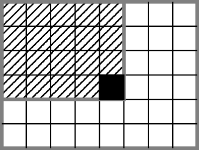
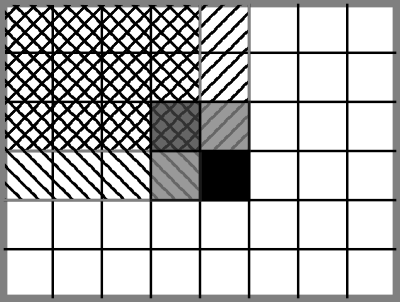
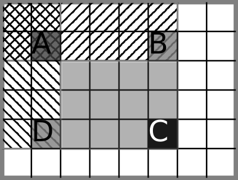
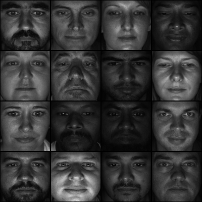
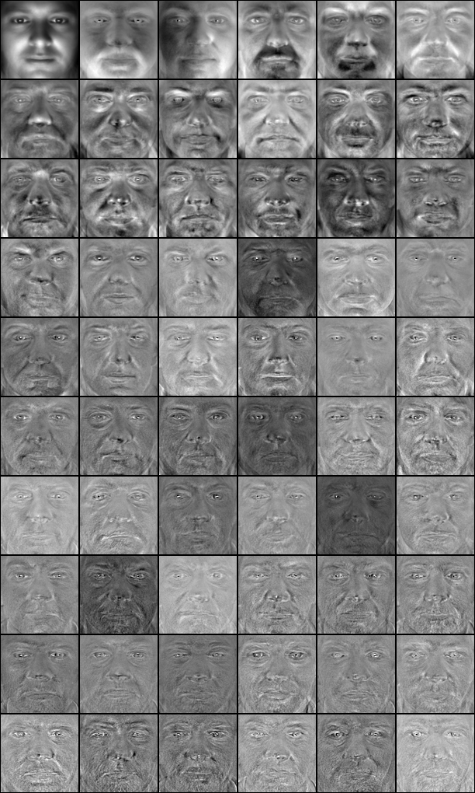
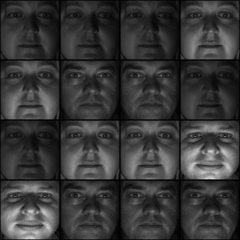

---
title: Luku 12 - Kuvien tilastollinen analyysi
author: Matti Eskelinen
date: 29.4.2018
title-prefix: TIES411
lang: fi
css: style.css
---

# Kuvien tilastollinen analyysi

Tässä luvussa tutustumme kuvien analysointiin tilastollisesti. Opimme
ymmärtämään tunnuslukuja, jakaumia, korrelaatioita ja pääkomponentteja.
Myöhemmissä luvuissa opimme käyttämään näitä asioita kohteiden tunnistamisessa.

Aiheina *PCA*, ehkä lyhyesti *ICA*, histogrammit ja niihin perustuvat piirteet.

Käytännöllisiä asioita tällä kerralla:

* tutkitaan histogrammeja, ehkä verrataan niitä,
* tutustutaan korrelaation käsitteeseen,
* kokeillaan PCA:ta esimerkiksi kasvokuvien kanssa.

Tilastollinen data-analyysi perustuu datajoukoista tehtäviin *yhteenvetoihin*
ja näiden kuvailemiseen. Kuvien tapauksessa analysoidaan siis yksittäisten
pikselien sijaan pikselijoukkoja, kokonaisia kuvia tai jopa suuria kuvajoukkoja
*tilastollisesti*.

Eräs tärkeä syy analysoida dataa tilastollisesti on oppia ymmärtämään, kuinka
tunnistettavia kohteita pitäisi vertailla. Kaikki yleisesti käytetyt kohteiden
luokittelumenetelmät perustuvat jonkinlaiseen *metriikkaan*, jolla mitataan
kohteiden välisiä etäisyyksiä. Kuvadatan tapauksessa kohteiden vertailu
pikselien arvojen perusteella ei vaikuta hyvältä ajatukselta, sillä sama kohde
saattaa tuottaa hyvin erilaisia pikselien kokoelmia riippuen kuvakulmasta ja
valaistuksesta. Vastaavasti kaksi eri kohdetta saattavat tuottaa melko
samankaltaisen kokoelman pikseleitä. Tämän vuoksi on tyypillistä pyrkiä
muodostamaan *piirreavaruuksia*, joissa kohteiden erot tulisivat paremmin
esille.

Lähtökohtana tilastollisessa analyysissä on data $\mathbf{X}$, joka koostuu
$n$-ulotteisista vektoreista $\mathbf{x_i}$. Tyypillisesti kukin *näyte*, eli
datapiste avaruudessa $\mathbb{R}^n$, esiintyy *rivinä* matriisissa
$\mathbf{X}$, jolloin kunkin yksittäisen muuttujan arvot ovat matriisin
sarakkeissa. Näitä muuttujia kutsutaan *havaituiksi muuttujiksi* tai
*havaintomuuttujiksi* (engl. *observed variable*). Data on tyypillisesti
syntynyt jonkin kiinnostavan ilmiön seurauksena, mutta itse ilmiötä ei syystä
tai toisesta pystytä havainnoimaan suoraan. Tällaisissa tilanteissa ilmiö
pyritään mallintamaan *piilevien muuttujien* tai *piilomuuttujien* (engl.
*latent variables*) $\mathbf{l}$ avulla. Tutkittava ilmiö kuvitellaan
funktioksi $\phi$, joka tuottaa havaittujen muuttujien arvoja $\mathbf{x}$
piilevien muuttujien arvoista $\mathbf{l}$:

$$\mathbf{x} = \phi(\mathbf{l}).$$

Olkoon maailman tila $\mathbf{w}$. Haluamme kaivaa siitä esille tietyt meitä
kiinnostavat asiat, ja mallinnamme nämä kiinnostavat ilmiöt piilevien muuttujien
$\mathbf{l}$ avulla. Kuva-analyysin tapauksessa meillä on *näkymä* (engl.
*scene*) jota kuvaamme mallin $\mathbf{s}_l$ avulla. Se on osajoukko koko
maailman tilasta. Tavoitteena on rakentaa funktio $f$, joka tuottaa havaittujen
muuttujien arvoista jonkinlaisen arvion näkymän tilasta:

$$f(\mathbf{x}) = \mathbf{s}_l.$$

Tällainen funktio $f$ perustuu havaittujen muuttujien $\mathbf{x}$ ja piilevien
muuttujien $\mathbf{l}$ välisten *riippuvuuksien* ymmärtämiseen. Näitä
riippuvuuksia voidaan tutkia ja mallintaa tilastollisesti.

Tilastollisia malleja rakennetaan *satunnaismuuttujien* avulla. Tässä vaiheessa
on syytä hahmottaa, että satunnaismuuttujat eivät sisällä *sattumanvaraisia*
vaan *tuntemattomia* ja *epävarmoja* arvoja. Tällaisten muuttujien arvojoukko
voidaan *mallintaa* tilastollisesti. Satunnaismuuttujat voivat saada arvoja
tietystä joukosta, joka voi olla diskreetti joukko tai jatkuva vaihteluväli.
Jotkin näistä arvoista saattavat olla *todennäköisempiä* kuin toiset, ja
muuttujan eri arvojen todennäköisyyksiä kuvataan *todennäköisyysjakauman*
avulla. Jakauma voidaan nähdä funktiona, joka määrää muuttujan kullekin arvolle
todennäköisyyden lukuna väliltä $[0,1]$. Koska muuttuja saa väistämättä jonkin
mahdollisista arvoistaan, funktion integraalin (eli diskreettien arvojen
todennäköisyyksien summan) on oltava $1$.

Merkitään satunnaismuuttujia isoilla kirjaimilla $A,B,C$ ja niiden saamia
arvoja pienillä kirjaimilla $A=a, B=b, C=c$. Muuttujien todennäköisyysjakaumia
merkitään $P_A(A), P_B(B), P_C(C)$; alaindeksit korostavat sitä, että
jokainen $P$ on erilainen, mutta useimmiten tämä lyhennetään muotoon
$P(A),P(B),P(C)...$. Tiettyjen tapahtumien (muuttujien tiettyjen arvojen)
todennäköisyyksiä merkitään $P(A=a),P(B=b),P(C=c)...$, ja toisinaan tässäkin
käytetään selvyyden vuoksi alaindeksejä: $P_A(A=a)$. Jos sekaannuksen vaaraa ei
ole, tapahtumien todennäköisyyksiä saatetaan merkitä lyhyesti $P(a)$.
Satunnaismuuttujia voidaan käsitellä *vektoreina*, jolloin kukin datapiste on
yksi muuttuja, tai sitten *skalaareina*, jolloin kukin vektorin alkio on oma
muuttujansa.

Määritellään vielä *ehdollinen todennäköisyys*. Merkintä $P(A \mid B)$ kuvaa
muuttujan $A$ ehdollista todennäköisyysjakaumaa muuttujan $B$ suhteen. Se kuvaa,
kuinka todennäköisiä kukin $A$:n arvoista on, kun $B$:n arvo tunnetaan. Jos
muuttujat ovat *tilastollisesti riippumattomia*, eli muuttuja $B$ ei anna
mitään lisätietoa muuttujasta $A$, silloin $P(A \mid B) = P(A)$. Palaamme
myöhemmin ehdollisiin todennäköisyyksiin tilastollisten mallien yhteydessä.

## Tilastolliset momentit

Kokonaisen datajoukon käyttäytymistä ja muotoa voidaan kuvailla
yksinkertaisimmillaan tilastollisten tunnuslukujen eli *momenttien* avulla.
Nämä kuvailevat muuttujien *jakaumaa*, eli arvojen jakautumista eri arvojen
kesken, ja jakauman muotoa. Koko jakauman sijaan voidaan siis käyttää sen
muotoa kuvailevia lukuja.

Tärkeimpiä tunnuslukuja ovat *keskiarvo* ja *varianssi* (engl. *mean* and
*variance*). Nämä, kuten muutkin tunnusluvut, määritellään yleensä käyttäen
*odotusarvon* käsitettä. Odotusarvo tarkoittaa arvoa, joka *odotetaan* saatavan,
kun satunnaismuuttujan arvoja havainnoidaan äärettömän monta kertaa ja
lasketaan havaintojen keskiarvo. Formaalimmin odotusarvo on painotettu
keskiarvo, joka saadaan laskemalla summa muuttujan arvojen ja niiden
todennäköisyyksien tuloista:

$$E\left[X\right] = \sum_i x_i P(X=x_i)$$

kun $X$ on satunnaismuuttuja, joka voi saada arvot $x_i$ todennäköisyydellä
$P(x_i)$. Tässä määritelmässä odotusarvon laskeminen siis edellyttää muuttujan
jakauman tuntemista. Tyypillisesti jakaumaa ei tunneta, jolloin voidaan
käyttää *empiiristä* odotusarvoa. Tämä on yksinkertaisesti aritmeettinen
keskiarvo muuttujan $N$:stä havaitusta arvosta:

$$E\left[X\right] = \frac{1}{N}\sum_{i=1}^{N} x_i.$$

Keskiarvoa kutsutaan myös *ensimmäiseksi momentiksi nollan suhteen*, koska siinä
summataan ensimmäisiä potensseja muuttujien etäisyyksille nollasta. Keskiarvo
siis kuvaa kuinka paljon datajoukko kokonaisuudessaan poikkeaa nollasta, ja sitä
merkitään yleensä symbolilla $\mu$.

Muuttujan *varianssi* kuvaa, kuinka laajalle sen saamat arvot leviävät.
Varianssi $Var(X)$ määritellään yleensä odotusarvona neliölliselle etäisyydelle
odotusarvosta $E\left[X\right]$ eli keskiarvosta $\mu$:

$$Var\left(X\right) = \
  E\left[\left(X - E\left[X\right]\right)^2\right] = \
  E\left[\left(X-\mu\right)^2\right].$$

Tämä lauseke sievenee seuraavalla tavalla:

$$Var\left(X\right) = E\left[X^2\right] - \left(E\left[X\right]\right)^2.$$

Varianssi on siis yhtä kuin muuttujan arvon *neliön* odotusarvo, vähennettynä
muuttujan odotusarvon neliöllä. Tämä on hyvin hyödyllistä, ja palaamme tähän
asiaan myöhemmin.

Varianssia merkitään yleensä $\sigma_X^2$ tai yksinkertaisesti $\sigma^2$, ja
sitä kutsutaan myös *toiseksi momentiksi keskiarvon suhteen* tai *toiseksi
keskeismomentiksi*, koska siinä summataan toisia potensseja muuttujien
etäisyyksille keskiarvosta. Kuten todettu, varianssi kuvaa *neliöllisen
etäisyyden* odotusarvoa, ja sen neliöjuurta $\sigma$:aa kutsutaan
*keskihajonnaksi* (engl. *standard deviation*), joka on siis jossakin mielessä
odotusarvo muuttujan arvon ja keskiarvon erotuksen itseisarvolle.

Muita yleisesti käytettyjä momentteja ovat *vinous* (engl. *skewness*) ja
*huipukkuus* (engl. *kurtosis*). Nämä kuvaavat sitä, kuinka symmetrisesti
muuttujan arvot ovat jakautuneet keskiarvon molemmin puolin ja kuinka
voimakkaasti ne ovat keskittyneet keskiarvon ympärille. Vinous on *kolmas* ja
huipukkuus *neljäs normalisoitu keskeismomentti*. Normalisointi tarkoittaa
jakamista $\sigma^n$:llä:

$$m_{\mu}^n = \frac{E\left[\left(x-\mu\right)^n\right]}{\sigma^n}.$$

## Kovarianssi ja korrelaatio

Varianssi kuvaa yksittäisten muuttujien vaihtelua datajoukossa, kun taas
*kovarianssi* kuvaa kahden muuttujan yhteisvaihtelua, eli vaihtelevatko
muuttujien arvot samalla tavalla, vastakkaisella tavalla vai toisistaan
riippumattomalla tavalla.

Kovarianssi määritellään odotusarvojen avulla seuraavasti:

$$Cov(X,Y) = E\left[\left(X-E\left[X\right]\right)
                    \left(Y-E\left[Y\right]\right)\right],$$

eli kovarianssi on ikään kuin kahden muuttujan yhdistetty varianssi. Muuttujan
kovarianssi itsensä kanssa onkin sama asia kuin varianssi. Kovarianssi voidaan
laskea myös vektorimuotoisille muuttujille, jolloin tuloksena on
*kovarianssimatriisi*, jonka diagonaalilla ovat kunkin yksittäisen muuttujan
varianssit.

Kovarianssi kertoo myös, kuinka paljon kahden muuttujan *tulon* odotusarvo
poikkeaa muuttujien odotusarvojen tulosta:

$Cov(X,Y) = E\left[XY\right] - E\left[X\right]E\left[Y\right]$.

Kovarianssin numeroarvoa on vaikea tulkita, koska se riippuu muuttujien
skaaloista. Niinsanottu *Pearsonin korrelaatiokerroin*, jota usein kutsutaan
yksinkertaisesti korrelaatioksi, ratkaisee tämän ongelman jakamalla kovarianssin
muuttujien keskihajontojen tulolla.

$$Corr(X,Y) = \frac{Cov(X,Y)}{\sigma_X \sigma_Y}.$$

Tätä merkitään toisinaan myös symbolilla $\rho_{X,Y}$, ja tuloksena on arvoja
väliltä $\left[-1,1\right]$. Kovarianssi ja korrelaatio kuvaavat muuttujien
*lineaarista* suhdetta. Korrelaatio voidaan ajatella kertoimena, joka kertoo
kuinka paljon muuttujan $B$ arvo muuttuu, kun muuttujan $A$ arvo muuttuu $1$:n
verran. Muuttujien välinen riippuvuus ei aina ole lineaarinen, joten toisinaan
on turvauduttava toisenlaisiin keinoihin. Näihin palaamme myöhemmin.

## Kuva-alueiden momentit

Kokonaisen kuvan tilastolliset tunnusluvut eivät sisällä kovin hyödyllistä
tietoa. Toisaalta pienten kuva-alueiden keskiarvo ja varianssi kertoisivat
jotakin oleellista kuvassa olevista vaihteluista. Kokeillaan siis käyttää
konvoluutiota kuva-alueiden keskiarvon laskemiseen, ja muistetaan varianssin
laskukaava pikseliarvojen neliön odotusarvon ja pikseliarvojen odotusarvon
neliön erotuksena: $Var\left(X\right) = E\left[X^2\right] -
\left(E\left[X\right]\right)^2.$

### Tehtävä 5.1 {-}

Seuraavassa koodiesimerkissä esitetään kuva-alueiden keskiarvon, varianssin ja
keskihajonnan laskeminen. Tuloksena on kuvia, jotka sisältävät nämä momentit
jokaiselle pikseliympäristölle. Kurssisivulla pääsee kokeilemaan eri kuvilla ja
vaihtamaan ympäristön kokoa. Kokeile eri kuvia ja erikokoisia ympäristöjä.
Kuvaile tuloksia. Millä tavoin operaatioita voisi hyödyntää?

### Tehtävä 5.2 {-}

Seuraavassa koodiesimerkissä esitetään kuva-alueiden kovarianssin ja
korrelaation laskeminen. Tuloksena on jälleen kuvia, jossa on nämä suureet
laskettuina jokaiselle pikseliympäristölle. Nämä operaatiot pitää suorittaa
kahdelle kuvalle kerrallaan. Esimerkeissä käytetään saman kuvan siirrettyjä
versioita, sekä saman kuvan Gabor-suodatettuja versioita eri suuntaisilla
maskeilla. Kokeile eri kokoisia alueita ja sekä kovarianssia että korrelaatiota.
kuvaile tuloksia ja yritä selittää, mitä kovarianssi ja korrelaatio näissä
esimerkeissä mittaavat. Mitä eroa niillä on?

## Integraalikuva

Tilastollisten momenttien laskeminen konvoluution avulla on raskas operaatio,
varsinkin jos tutkittava alue on suuri ja operaatio halutaan tehdä jokaiselle
pikselille, kuten yllä. Seuraavaksi tutustumme keinoon laskea pikselien summia
mielivaltaiselta nelikulmaiselta alueelta vakioajassa.

Määritellään **integraalikuva** $Int(I)$ kuvan $I$ suhteen seuraavasti:

$$Int(I)(x,y) = \sum_{i=0}^{x}\sum_{j=0}^{y}I(i,j).$$

{ .centered }

Integraalikuvan pikseli kohdassa $(x,y)$ sisältää siis summan kuvan $I$
pikseleistä, jotka sijaitsevat kuvan vasemman ylänurkan ja kohdan $(x,y)$
välissä. Oheisessa kuvassa mustalla merkityn pikselin integraal on siis summa
viivoitetulla alueella olevien pikselien arvoista, mukaanlukien pikselin oma
arvo. Integraalikuva saadaan muodostettua käymällä kuva yhden kerran läpi
riveittäin ja kokoamalla integraalisumma edellisten pikselien summista
seuraavasti:

$$Int(I)(x,y) = I(x,y) + Int(I)(x-1,y) + Int(I)(x,y-1) - Int(I)(x-1,y-1), \\
  \;\text{siten, että}\; I(x,y) = 0 \;\text{kun}\; x,y < 0.$$

{ .centered }

Kuvaa pitää siis laajentaa lisäämällä alkuun yksi sarake ja rivi joiden arvot
ovat nollia. Integraalikuvan pikselin vinoittainen naapuri $Int(I)(x-1,y-1)$
pitää vähentää summasta, sillä muuten ylänurkan pikselit tulee laskettua
kahteen kertaan. Oheinen kuva selventää asiaa. Vinoviivoitukset kuvaavat
naapuripikselien integraalien kattamia alueita.

Integraalikuvan avulla saadaan laskettua mielivaltaisen nelikulmaisen alueen
pikseliarvojen summa kahdella vähennyslaskulla ja yhdellä yhteenlaskulla.
Olkoot $a,b,c$ ja $d$ pikseleitä, jotka määräävät tutkittavan alueen nurkat
myötäpäivään alkaen vasemmasta ylänurkasta. Tämän alueen summa on

$$\begin{aligned}
  s &= \sum_{i=x_a}^{x_c}\sum_{j=y_a}{y_c}I(i,j) \\
    &= Int(I)(x_c,y_c) - Int(I)(x_b,y_b-1) - Int(I)(x_d-1,y_d) +
       Int(I)(x_a-1,y_a-1).
  \end{aligned}$$

{ .centered }

Vasemman ylänurkan summa tulee vähennettyä kahteen kertaan, joten se täytyy
lisätä summaan. Oheinen kuva selventää tilannetta. Tavoitteena on laskea
keskellä olevan harmaan alueen summa. Pikselin C integraalista on vähennettävä
pikselin B ja pikselin D integraali, jolloin pikselin A integraali on lisättävä
takaisin kokonaissummaan.

Jos nyt muodostamme integraalikuvan tutkittavan kuvan pikseliarvoista ja
neliöllisistä pikseliarvoista, saamme laskettua pikseliympäristöjen keskiarvon
ja varianssin tehokkaasti. Varjopuolena on se, että tutkittavat alueet ovat
nelikulmaisia eivätkä pyöreitä, kuten käytettäessä konvoluutiota Gaussin
ytimellä. Tätä on yritetty korjata laskemalla *vinoittainen* integraali
kääntämällä kuvaa 45 astetta ja laskemalla tälle käännetylle kuvalle integraali.
Laskemalla keskiarvo suoran ja vinon kuvan mukaisista vastinpisteiden
integraaleista saadaan eliminoitua osittain neliön nurkka-alueiden vaikutus.

## Jakaumat

Keskeinen työkalu tilastollisessa analyysissä ovat eri muuttujien *jakaumat*,
jotka kuvaavat muuttujien arvojoukkoa ja eri arvojen suhteellista
*esiintymistiheyttä* eli *frekvenssiä* (engl. *frequency*). Koska
kuva-analyysissä käsitellään tyypillisesti *diskreettejä* muuttujia, käytössä
ovat *histogrammit* eli diskreetit jakaumat. Nämä koostuvat yksinkertaisesti
taulukosta, jossa luetellaan muuttujan kaikki mahdolliset arvot sekä kunkin
arvon esiintymien määrä. Yleensä histogrammi *normalisoidaan* jakaumaksi,
jolloin histogrammi kertoo kunkin yksittäisen arvon esiintymistodennäköisyyden.

Kuvan histogrammi muodostetaan jakamalla pikselien arvoväli haluttuun määrään
lokeroita (engl. *bins*) ja kokoamalla summa pikseleistä, joiden arvot osuvat
kuhunkin lokeroon. Histogrammeja voidaan muodostaa pikselien harmaasävy- ja
väriarvoista, mutta myös erilaisten filtterien tuloksista.

### Tehtävä 5.3 {-}

Seuraavassa koodiesimerkissä lasketaan histogrammeja kuville ja erilaisten
suotimien vasteille. Kokeile eri kuvilla ja suotimilla ja tutki jakaumia.
Kuvaile ja yritä selittää havaintoja.

## Otsun kynnysarvo

Esimerkkinä histogrammien käyttämisestä tutustumme Otsun menetelmänä tunnettuun
tapaan valita kynnysarvo. Menetelmä perustuu ideaan, että kuvan pikselit
jakautuvat kahteen luokkaan: kohteeseen ja taustaan. Oletetaan, että kummallakin
luokalla on oma jakaumansa pikselien arvoille, jolloin koko kuvan jakaumaan
muodostuu kaksi huippua. Valitaan nyt kynnysarvo siten, että muodostuvan kahden
jakauman varianssit ovat mahdollisimman pieniä. Tämä määritellään painotettuna
summana kahden luokan sisäisistä variansseista (*within-class variance*):

$$\sigma_w^2(t) = p_1(t)\sigma_1^2(t) + p_2(t)\sigma_2^2(t).$$

Termit $p_i(t)$ kuvaavat luokkien todennäköisyyksiä, jotka voidaan laskea
normalisoidusta histogrammista joka voidaan siis ymmärtää
*todennäköisyysmassafunktiona* $P$:

$$p_1(t) = \sum_{i=0}^tP(i), p_2(t) = \sum_{i=t+1}^nP(i).$$

Parametri $t$ viittaa kynnysarvoon eli siihen histogrammin lokeroon, jonka
kohdalta jakauma jaetaan kahteen luokkaan, ja $n$ on lokeroiden määrä.
Ensimmäisen luokan todennäköisyys saadaan siis summaamalla yhteen lokeroiden
painot alusta kynnysarvoon, ja toisen luokan todennäköisyys summaamalla yhteen
lokeroiden painot kynnysarvosta loppuun. Toisaalta tietysti toisen luokan
todennäköisyys on myös $p_2(t) = 1 - p_1(t)$.

Otsun mukaan luokkien sisäisten varianssien summan minimointi on sama asia kuin
luokkien välisen varianssin maksimointi (*between-classes variance*):

$$\sigma_b^2(t) = p_1(t) p_t(t) (\mu_1(t) - \mu_2(t))^2.$$

Luokkien keskiarvot $\mu_i(t)$ saadaan laskettua seuraavasti:

$$\begin{aligned}
  \mu_1(t) &= \frac{\sum_{i=0}^t P(i)x(i)}{p_1(t)} \\
  \mu_2(t) &= \frac{\sum_{i=t+1}^n P(i)x(i)}{p_2(t)}
  \end{aligned}$$

missä $x(i)$ tarkoittaa histogrammin lokeron keskikohtaa vastaavaa pikselin
arvoa. Tässä on siis tuttu odotusarvon kaava, jota vielä skaalataan koko luokan
todennäköisyydellä. Kun nyt käydään läpi kaikki mahdolliset kynnysarvot (eli
kaikki histogrammin lokerot) voidaan valita se kynnysarvo, joka tuottaa
suurimman $\sigma_b^2$:n arvon. Usein valitaan vieläpä kaksi parasta
kynnysarvoa ja lasketaan näiden keskiarvo. Tämä menetelmä tuottaa suhteellisen
hyviä kynnysarvoja, jos kuva todella jakaantuu kahteen selkeään luokkaan, ja on
yleisesti käytetty edelleen.

Seuraavassa koodiesimerkissä esitetään kynnystäminen Otsun menetelmällä.

## Histogrammien vertailu

Usein on hyödyllistä tutkia kahden histogrammin välistä *etäisyyttä*. Tämä voi
tulla eteen esimerkiksi silloin, jos kohteita kuvaillaan piirrejakaumien avulla
ja vertaillaan mitkä kohteista ovat samanlaisia. Toisinaan on myös tarpeen
tutkia mistä jakaumasta jokin näytejoukko voisi olla peräisin.

On monia hyvin tunnettuja metriikoita, joilla histogrammeja ja muitakin jakaumia
voi vertailla. Vertailtavien histogrammien tulisi tietysti olla yhtä suuria
(eli niissä tulisi olla yhtä monta lokeroa) ja normalisoituja. Voitaisiin laskea
esimerkiksi normaali euklidinen etäisyys vektoreina tulkituille histogrammeille,
mutta tämä on herkkä pienille eroille arvojen jakautumisessa lokeroihin. Parempi
vaihtoehto on laskea *korrelaatio*:

$$d_{\rho}(H_1,H_2) =
  \frac{\sum_i(H_1(i)-\mu_1)(H_2(i)-\mu_2)}
       {\sqrt{\sum_i(H_1(i)-\mu_1)^2\sum_i(H_2(i)-\mu_2)^2}}.$$

Toinen yleisesti käytetty metriikka on $\chi^2$ eli *chi-squared*:

$$d_{\chi}(H_1,H_2) = \sum_i\frac{(H_1(i)-H_2(i))^2}{H_1(i)}.$$

*Bhattacharyyan kerroin* kuvaa kahden jakauman päällekkäisyyttä:

$$c_B(H_1,H_2) = \sum_i\sqrt{H_1(i)H_2(i)}.$$

Tästä voidaan muodostaa etäisyysmitta vähentämällä se ykkösestä. Tätä kutsutaan
toisinaan *Hellingerin etäisyydeksi*, ja koska summa voidaan ymmärtää
integraalina ja histogrammit ovat eräänlaisia todennäköisyysjakaumia, tuloksena
on $0$ kun histogrammit ovat täysin päällekkäisiä ja $1$ kun ne ovat täysin
erillisiä:

$$d_H(H_1,H2) = 1 - c_B(H_1,H_2).$$

## Informaatioteorian käsitteitä

Tilastolliseen analyysiin ja jakaumiin liittyvät läheisesti *informaatioteorian*
keskeiset käsitteet. Kuvitellaan, että tehtävänä on *koodata* viesti, joka
koostuu yksiköistä joiden jakauma tunnetaan. Käytettävä koodi voidaan optimoida
tämän jakauman mukaan, jolloin viestin pituus voidaan minimoida.

Keskeinen *entropian* käsite mittaa kuinka paljon satunnaismuuttuja sisältää
informaatiota sen perusteella, kuinka epävarma satunnaismuuttujan $X$ arvo
on. Tämä riippuu muuttujan jakaumasta:

$$H(X) = -\sum_{x \in X}P_X(x) \log P_X(x).$$

Jos viestin sisältö on täysin ennalta arvattavissa, viesti ei sisällä yhtään
informaatiota tämän määritelmän mukaan. Vastaavasti viestin sisältämä
informaatio on maksimaalinen, jos sen sisältö on täysin satunnainen. Tämä ei
tietysti kuvaa informaation hyödyllisyyttä vaan sitä, kuinka paljon sitä
voidaan pakata. Täysin satunnaista viestiä ei voida tiivistää yhtään, kun taas
viesti jonka sisältö voidaan ennustaa jonkin säännön mukaan voidaan pakata
tiiviisti kuvailemalla kyseinen sääntö.

Ehdollinen entropia liittyy ehdolliseen todennäköisyyteen, ja kuvaa kuinka
paljon tieto jostakin toisesta muuttujasta lisää ensimmäisen muuttujan
epävarmuutta:

$$H(X \mid Y) =
  -\sum_{y \in Y}P_Y(y)\sum{x\ in X}P_X(X \mid Y) \log P_X(X \mid Y).$$

Tämän avulla voidaan muodostaa käsite *mutual information* eli keskinäinen
informaatio:

$$I(X;Y) = H(X) - H(X \mid Y)$$

joka tarkoittaa sitä, kuinka paljon muuttujan $Y$ arvon tunteminen säästää
bittejä koodatessa muuttujan $X$ arvoa. Näiden käsitteiden pohjalta voidaan
muodostaa vielä yksi tapa vertailla jakaumia, nimittäin *Kullback-Leiblerin
poikkeama* eli *divergenssi*:

$$D_{KL}(P_1 \parallel P_2) =
  \sum_i\log\left(\frac{P_1(i)}{P_2(i)}\right)P_1(i).$$

Tämä luku mittaa kuinka paljon informaatiota menetetään, kun viestin koodaus
perustuu jakaumaan $P_2$ oikean jakauman $P_1$ sijaan. Tämä voidaan ymmärtää
niiden ylimääräisten bittien määränä jotka on siirrettävä, koska käytetään
*huonoa koodausta*; voidaan ajatella, että käytetty koodi on optimoitu jakauman
$P_2$ mukaan, mutta todellinen jakauma onkin $P_1$. Jos jakaumat ovat lähellä
toisiaan, syntyvä hukka on pieni. On huomattava, että $D_{KL}$ ei ole
symmetrinen; $D_{KL}(P_1 \parallel P_2) \neq D_{KL}(P_2 \parallel P_1)$. Sitä ei
siis voida käyttää metriikkana jakaumien vertailussa. Toisinaan tämä ongelma
ohitetaan käyttämällä etäisyytenä mainitun kahden luvun summaa.

Palaamme informaatioteorian käsitteisiin vielä myöhemmissä luvuissa.

## Normaalijakauma

Eräs hyvin monissa tilanteissa vastaan tuleva todennäköisyysjakauma on
*normaalijakauma* tai Gaussinen jakauma (engl. *normal distribution* tai
*Gaussian distribution*). Tämä jakauma on tutun kellokäyrän muotoinen, ja siinä
on keskellä huippu joka tyypillisesti laskee tasaisesti ja nopeasti lähelle
nollaa. Jakauma kuvaa sitä, että suurin osa alkioista saa lähellä keskiarvoa
olevia arvoja, ja kauempana keskiarvosta olevat alkiot ovat yhä harvinaisempia.

Syy siihen, miksi normaalijakaumaa käytetään niin paljon ja miksi se esiintyy
niin monissa eri tilanteissa, löytyy *keskeisestä raja-arvolauseesta* (engl.
*central limit theorem*). Tämä lause kertoo lyhyesti sanottuna sen, että jos
lasketaan keskiarvoja useista riippumattomista satunnaismuuttujista jotka voivat
olla mistä tahansa jakaumasta jolla on hyvin määritelty keskiarvo ja varianssi,
tällaiset keskiarvot ovat normaalijakautuneita. Tämä tarkoittaa siis sitä, että
mikä tahansa ilmiö, joka muodostuu useiden eri ilmiöiden yhteisvaikutuksena,
käyttäytyy normaalijakauman tavoin. Tällaisia ilmiöitä esiintyy kaikkialla
luonnossa. Esimerkiksi voidaan ajatella, että ihmisen pituus määräytyy useiden
erilaisten geneettisten ja ympäristötekijöiden yhteisvaikutuksena, joten on
järkevää olettaa pituuden noudattavan normaalijakaumaa.

Tilastolliset momentit *vinous* ja *huipukkuus* mielletään usein suhteessa
normaalijakaumaan, joka on symmetrinen ja leviää melko tasaisesti. Jakauma on
vino, jos sen toinen reuna on 'paksumpi' kuin toinen. Jakauma on huipukas tai
*kurtoottinen*, jos se on korkeampi ja kapeampi kuin normaalijakauma.
Normaalijakauman kurtoosi on $3$. Jos muuttujan jakauman kurtoosi on tätä
suurempi, sanotaan että jakauma on *harva* (engl. *sparse*); tämä tarkoittaa
sitä, että muuttujan saamat arvot keskittyvät muutamiin yleisimpiin, ja muut
arvot ovat suhteellisen harvinaisia.

Kuvadatan eräs keskeinen ominaisuus on sen *harvuus*. On osoitettu, että minkä
tahansa kuvafiltterin (jopa satunnaisen filtterin) tuottamien arvojen jakauma
on huipukas, eli sen kurtoosi on suurempi kuin $3$. Tämän vuoksi kuvadataa
kutsutaan *ei-gaussiseksi* eli *harvaksi*. Käytännössä tämä näkyy siinä, että
esimerkiksi reunafiltterit tuottavat useimmiten lähellä nollaa olevia arvoja, ja
nollaa suuremmat ja pienemmät arvot ovat suhteellisen harvinaisia. Tämä on
intuitiivisesti järkevää, sillä tyypillisesti kuvissa on enemmän tasaista
pintaa kuin reunoja. Ilmiötä voi havainnoida tutkimalla aiemmin muodostettuja
histogrammeja Gaborin suotimen ja reunanhakusuotimen arvoille.

## Kadir-Brady -menetelmä

Aiemmassa luvussa mainittiin Kadirin ja Bradyn kehittämä visuaalisesti
merkittävien alueiden etsimiseen tarkoitettu menetelmä. Keskeinen idea tässä
menetelmässä on se, että suotimien ääriarvojen sijaan kuva-alueen merkitystä
mitataan informaatioteoriasta tutun *entropian* avulla.

Entropian voidaan ajatella mittaavan kohteen epäjärjestystä, ennustettavuutta ja
yllättävyyttä sen jakauman perusteella. Mitä suurempi entropia, sitä enemmän
epäjärjestystä, ja sitä vaikeampi kohteen edustamia arvoja on ennustaa. Aiemmin
tässä luvussa määriteltiin, että jakauman $p$ entropia $H$ on $-p \log p$. Tässä
symboli $H$ on kreikkalainen kirjain *eta*. Olkoon kuva-alueen $R$ normalisoitu
histogrammi $P_D(R)$, jossa $D$ on diskreetti joukko kuvan arvoja; ne vastaavat
siis histogrammin lokeroita. Tämän alueen entropia arvojen $D$ jakauman suhteen
on siis

$$H_D(R) = -\sum_{d \in D}P_D(R) \log P_D(R).$$

Jos entropia on suuri, jakauma on monimutkainen eli vaikeasti ennustettava.
Kadir ja Brady tutkivat entropiaa useissa skaaloissa, eli käytännössä
muodostamalla suurempien ja suurempien alueiden histogrammeja pisteen ympäriltä.
Kun skaalaa kasvatetaan ja löydetään entropian huippukohta, voidaan ajatella
että on löytynyt pisteympäristö joka on jollakin lailla yllättävä ja vaikeasti
ennustettava, eli sellainen joka erottuu hyvin ympäristöstään. Nämä ovat hyviä
piirrepisteitä. Ongelmaksi muodostuu vain histogrammien muodostaminen suurista
pisteympäristöistä, mikä on hidasta. Operaatiota saadaan nopeutettua käyttämällä
*integraalihistogrammeja*, jotka kuvataan myöhemmässä luvussa.

## Pääkomponenttianalyysi

Suuressa, moniulotteisessa datajoukossa on usein vaihtelua useissa eri suunnissa
ja eri muuttujien välillä on paljon *korrelaatiota*. Tämä tarkoittaa sitä, että
tietyt muuttujaparit muuttuvat osin samaan tahtiin, joko vastakkaisiin suuntiin
(negatiivinen korrelaatio) tai samaan suuntaan (positiivinen korrelaatio). Usein
on myös niin, että tietty kuvajoukko, jossa esiintyy tiettyjä kohteita rajatusta
joukosta, ei täytä kuin hyvin pienen osan koko data-avaruudesta.

**Pääkomponenttianalyysi** (engl. *Principal Component Analysis*, PCA) voidaan
mieltää datan kuvailemiseksi jollakin lailla yksinkertaisemmassa ja datan
sisäistä rakennetta ja vaihtelua paremmin mukailevassa muodossa. Tarkoituksena
on poistaa muuttujien välinen korrelaatio tekemällä *kannanvaihto* käyttäen
*ortogonaalista lineaarista muunnosta* kantavektoreille, jotka mukailevat dataa
mahdollisimman hyvin. Periaatteessa tuloksena on saman datan esitys käyttämällä
uusia, keskenään korreloimattomia muuttujia.

Pääkomponenttianalyysi voidaan tehdä usealla eri tavalla, mutta eräs yleinen
tapa on etsiä datan *kovarianssimatriisin* ominaisarvot ja ominaisvektorit.

Sovellus, jossa pääkomponenttianalyysin avulla tehtyä kannanvaihtoa on käytetty
menestyksellisesti, on kasvojen tunnistaminen. Käytämme tässä esimerkissä
datasettiä, joka on saatu Länsi-Australian Yliopiston tutkijan
[Ajmal Mianin web-sivulta](http://www.csse.uwa.edu.au/~ajmal/databases.html):

{ .centered }

Datajoukosta on valittu 16 eri henkilöä, ja kustakin henkilöstä on 20
kasvokuvaa. On syytä huomata, että kuvat on esikäsitelty siten, että kaikki ovat
samankokoisia, ja kaikissa kuvissa silmät, nenä ja suu ovat suurin piirtein
samassa kohdassa. Kuvia on myös rajattu siten, että hiukset ja vaatteet eivät
näy. Kirkkautta ei kuitenkaan ole normalisoitu, ja kuvissa on suuria
valaistuseroja. PCA löytää kuvista seuraavat pääkomponentit:

{ .centered }

Vasemmassa ylänurkassa on kaikkien kuvien keskiarvo, ja muut ovat tärkeimpiä
pääkomponentteja. Kuten taajuuskomponentit, myös pääkomponentit ovat siis kuvia.
Kuvien koko on 100x100, joten pääkomponentteja on 10000. Muutamasta tärkeimmästä
ei voi päätellä kovin paljon, mutta tässä tapauksessa useimmat vaikuttavat
havaitsevan valaistuseroja. On luultavaa, että jotkin komponentit havaitsevat
myös henkilöiden välisiä yksilöllisiä eroja. Kun kasvokuvat projisoidaan tähän
pääkomponenttien muodostamaan uuteen kantaan, eri henkilöt toivottavasti
kuvautuvat kauaksi toisistaan, kun taas saman henkilön kuvat toivottavasti
kasaantuvat yhteen. Oheisessa kuvassa on vasemmassa ylänurkassa testihenkilön
kuva; tämä otos ei sisälly joukkoon, josta pääkomponentit on muodostettu. Muut
kuvat ovat tämän kuvan 15 lähintä naapuria pääkomponenttien muodostamassa
avaruudessa. Vaikuttaisi siis siltä, että tämä menetelmä tunnistaa melko
luotettavasti oikean henkilön 16 henkilön joukosta.

{ .centered }

On syytä huomata, että sovellus on hyvin rajoitettu. Jos muodostetaan 10000
pääkomponenttia 320 kuvan perusteella, ei voida olettaa tuloksen olevan kovin
tarkka. Samoin 16 eri henkilöä on melko pieni joukko. Miljoonien eri ihmisten
tunnistaminen tällä menetelmällä, erityisesti jos kustakin henkilöstä on vain
pari kuvaa ehkäpä vielä heikommin asemoituna kuin tässä, olisi paljon
haastavampaa.

Palaamme vielä pääkomponentteihin myöhemmin kun ryhdymme tutustumaan kohteiden
tunnistamiseen. Toistetaan tässä vielä se huomio, että kuten taajuuskomponentit,
myös pääkomponentit sisältävät *globaalia* informaatiota kuvasta. Se soveltuu
lähinnä sellaisiin tilanteisiin, joissa on kaksiulotteiselta muodoltaan vakio
kohde tarkasti rajatussa kuvassa.

## Dimension pienentäminen

Olemme jo moneen otteeseen todenneet, että vektoreina tulkitut kuvat sisältävät
hyvin korkeaulotteista dataa. Myös monissa muissa ongelmissa kohdataan hyvin
moniulotteisissa avaruuksissa esiintyvää dataa; sanotaan, että tällaisella
avaruudella on suuri *dimensio*. Myöhemmin hahmontunnistuksen ja koneoppimisen
yhteydessä mietimme tarkemmin sitä, minkä takia datan suuri dimensio on ongelma;
tässä vaiheessa tyydymme toteamaan lyhyesti, että mitä suurempi on datan
dimensio, sitä enemmän tarvitaan esimerkkejä erilaisten dataa analysoivien
mallien kouluttamiseen.

Aiemmin pohdimme myös sitä, että vaikka data sijoittuu korkeaulotteiseen
avaruuteen, sillä ei välttämättä ole yhtä monta *vapausastetta* kuin avaruuden
dimensio sallii. Kunkin datapisteen ympäristössä saattaa siis esiintyä vaihtelua
vain muutamiin eri suuntiin, ei kaikkiin mahdollisiin suuntiin. Sanotaan, että
tällainen data sijoittuu *monistoon* eli *manifoldiin*, sileään topologiseen
avaruuteen joka on *upotettu* (engl. *embedding*) korkeampiulotteisen euklidisen
avaruuden sisään.

Jos datan sisältämä vaihtelu on matalampiulotteista kuin avaruuden dimensio,
tuntuisi hyödylliseltä yrittää pienentää dimensiota. Tähän käytetään usein
nimenomaan PCA:ta. Suurimmat pääkomponentit osoittavat ne suunnat, joissa
datassa tapahtuu eniten vaihtelua. Voidaan siis valita muutama tärkein
pääkomponentti ja muodostaa niistä kantavektorit, joiden määrittämään
matalampiulotteiseen aliavaruuteen data voidaan projisoida. Tämä aliavaruus
kuvaa kuitenkin edelleen suurimman osan datassa tapahtuvasta vaihtelusta.

PCA toimii toisinaan hyvin dimension pienentämisessä, mutta on pidettävä
mielessä, että kyseessä on *lineaarinen* muunnos euklidisesta avaruudesta
toiseen. Jos data sijoittuu hyvin epälineaariseen monistoon, PCA saattaa tuottaa
harhaanjohtavaa tietoa. Ajatellaan vaikkapa aiempaa esimerkkiä yksinkertaisesta
monistosta, pallon pinnasta. Jos pinta projisoidaan lineaarisesti tasolle,
pallon vastakkaisilla puolilla olevat pisteet projisoituvat samaan kohtaan.
Jäljelle jää siis pyöreä ja litteä levy, jossa pisteiden väliset etäisyydet
eivät enää vastaa alkuperäisen datan mukaisia etäisyyksiä.

Monistoissa pitäisi käyttää euklidisen, suoraviivaisen etäisyyden sijaan
*geodesistä*, moniston pintaa pitkin mitattavaa etäisyyttä. Pallopinnan
tapauksessa pallon vastakkaisilla puolilla olevien pisteiden välinen etäisyys
pitäisi mitata pallon pintaa pitkin, ei suoraan pallon keskipisteen kautta; jos
ajatellaan köyden tapaan mutkittelevaa monistoa, saattaa käydä siten että hyvin
kaukana toisistaan olevat pisteet sattuvat euklidisessa avaruudessa lähelle
toisiaan. Datan generoinut ilmiö saattaa kuitenkin olla sellainen, että mikään
luonnollinen vaihtelu ei salli pitää näiden kahden pisteen edustamia objekteja
samanlaisina. Euklidisen etäisyyden käyttäminen tuottaisi virheellisen tuloksen.

Projektio matalampiulotteiseen avaruuteen pitäisi tehdä levittämällä monisto
litteäksi, esimerkiksi kuorimalla pallon pinta ja levittämällä se tasaiseksi.
Nyt taas kaksi vierekkäistä pistettä saattaa päätyä projektion vastakkaisiin
reunoihin. Onkin tarpeen käyttää datasta graafimuotoista esitystä, jossa
pisteiden välinen geodesinen etäisyys tallennetaan solmujen välisten kaarien
painokertoimina.

On olemassa keino pienentää datan dimensiota siten, että pisteiden väliset
likimääräiset geodesiset etäisyydet säilyvät. Tätä menetelmää kutsutaan
*diffuusiokartaksi* (engl. *diffusion map*) ja se perustuu juuri graafeihin ja
datapisteiden välisten geodesisten etäisyyksien arviointiin käyttäen
*diffuusioetäisyyttä*. Menetelmä perustuu lämmön diffuusion eli leviämisen
simulointiin käyttäen *satunnaiskävelyä*. Kukin datapiste yhdistetään muutamiin
lähimpiin datapisteisiin käyttämällä esimerkiksi gaussisesti painotettua
etäisyyttä euklidisessa avaruudessa. Sitten diffuusioprosessin avulla
määritellään jokaisen pisteparin välinen etäisyys sen mukaan, kuinka pitkä matka
on kuljettava graafin kaaria pitkin jotta päästään siirtymään pisteestä toiseen.
On olemassa menetelmät, joilla diffuusioetäisyyden perusteella saadaan
muodostettua *metrinen avaruus*, jossa pisteiden välinen geodesinen etäisyys
säilyy tiettyjen virherajojen puitteissa. Tietysti datapisteitä on oltava
riittävästi, jotta pystytään arvioimaan luotettavasti kunkin pisteen lähimmät
naapurit. Muuten graafiin saattaa tulla linkkejä sellaisten solmujen välille,
jotka ovatkin todellisuudessa eri puolilla monistoa.

Diffuusiokartta on *epälineaarinen* menetelmä dimension pienentämiseksi. Muita
vastaavia menetelmiä ovat esimerkiksi Kohosen *itseorganisoituvat kartat* ja
erilaiset *autoencoder*-tyyppiset neuroverkot. Emme tässä yhteydessä mene sen
tarkemmin näihin menetelmiin, mutta on hyvä ymmärtää että PCA:n tapaiset
lineaariset menetelmät eivät sovellu kaikkiin tilanteisiin ja että on olemassa
myös epälineaarisia menetelmiä.

## Satunnaisprojektio

Diffuusiokartat ovat melko monimutkainen menetelmä käytettäväksi satunnaisiin
kokeiluihin ja testeihin. Ne vaativat myös melko paljon dataa. Myös PCA vaatii
suurehkon datajoukon pääkomponenttien muodostamiseksi. Jos on tarpeen
havainnoida nopeasti datan rakennetta, eräs käyttökelpoinen keino on
*satunnaisprojektio* (engl. *random projection*).

Satunnaisprojektio tarkoittaa datan lineaarimuunnosta käyttäen kantaa, joka
muodostetaan satunnaisesti valituista vektoreista. Tärkeä tulos nimeltä
*Johnson-Lindenstrauss lemma* kertoo, että satunnaisprojektio säilyttää
pisteiden väliset likimääräiset suhteelliset euklidiset etäisyydet. Se myös
määrää rajat syntyvälle virheelle, joka riippuu datapisteiden määrästä ja datan
uudesta dimensiosta projektion jälkeen. Voidaan siis valita $\epsilon$, joka
määrää suurimman sallitun virheen pisteiden välisille etäisyyksille, ja valita
sitten dimensio joka takaa että virhe säilyy tätä pienempänä. Vastaavasti
voidaan valita haluttu dimensio, ja arvioida sitten syntyvän virheen suuruus.

Satunnaisprojektiossa käytetty matriisi voidaan muodostaa monella eri tavalla.
Joka tapauksessa kantavektorit (projektiomatriisin sarakkeet) tulee normalisoida
yksikkövektoreiksi. Eräs yleinen tapa on valita kantavektorit siten, että niiden
alkiot ovat *riippumattomia ja gaussisesti jakautuneita*. Tuloksena on *tiheitä*
matriiseja (suurin osa alkioista poikkeaa nollasta). Toinen tapa on muodostaa
*harva* matriisi  asettamalla suurin osa alkioista nollaksi, ja pieni osa joko
$1$:ksi tai $-1$:ksi.

Olkoon matriisi $\mathbf{X}$ datamatriisi, jonka dimensio on $m \times n$.
Meillä on siis $m$ datavektoria, jotka ovat $n$-ulotteisia. Kun data
projisoidaan $k$-ulotteiseksi, tarvitaan projektiomatriisi, jonka koko on
$n \times k$. Olkoon tämä satunnainen matriisi $\mathbf{R}$.

Jos matriisi $R$ ei ole ortogonaalinen, projektio vääristää avaruutta. Käytännön
kokemukset osoittavat kuitenkin, että satunnaismatriisit ovat hyvin lähellä
ortogonaalista. Tämä johtunee siitä, että jos $k \ll n$, on olemassa hyvin monia
tapoja valita $k$ vektoria jotka ovat lähes ortogonaalisia $n$-ulotteisessa
avaruudessa. Satunnaisesti valitut vektorit voidaan tietysti ortogonalisoida
käyttäen esimerkiksi Gram-Schmidt -menetelmää, mutta tämä on laskennallisesti
raskasta ja saattaa aiheuttaa numeerisia ongelmia. Koska vektorien valinta on
halpa operaatio, voidaan ortogonaalisuutta arvioida esimerkiksi laskemalla
neliöllinen etäisyys matriisin $\mathbf{R}^T\mathbf{R}$ ja yksikkömatriisin
välillä, ja valita uusi matriisi, jos etäisyys on suurempi kuin jokin raja-arvo.

## Riippumattomat komponentit*

Toisenlainen näkökulma datan vaihtelun selittämiseen on se, että datan
ajatellaan sisältävän useita erillisiä komponentteja tai *lähteitä*, jotka ovat
toisistaan *tilastollisesti riippumattomia*. Yksinkertainen esimerkki on
audiosignaali, jossa on kaksi erillistä äänilähdettä, kuten esimerkiksi kaksi
ihmistä jotka puhuvat yhtä aikaa toistensa päälle kuuntelematta toisiaan,
jolloin nämä kaksi puhesignaalia ovat riippumattomia. Tyypillinen esimerkki on
myös aivosähkökäyrä, jossa kunkin elektrodin havaintoihin sekoittuu signaaleja
monilta eri aivoalueilta. Kuvissa taas on aina hyvin paljon erilaisia itsenäisiä
komponentteja, toisin sanoen kohteita ja niiden osia. Näistä kahdesta
jälkimmäisestä esimerkistä on kuitenkin huomattava, että riippumattomuusoletus
ei täysin päde. Eri aivoalueiden signaalit korreloivat hieman keskenään, samoin
kuvissa olevat kohteet ja niiden osat.

Menetelmä, jolla datasta voidaan löytää riippumattomia komponentteja, on
nimeltään *independent component analysis* (ICA). Se perustuu **tilastollisen
riippumattomuuden** *maksimointiin* arvioitujen komponenttien välillä. Koska
kyseessä on optimointitehtävä, komponenttien välillä olevat vähäiset
riippuvuudet eivät tuota ongelmia. Tehtävän ratkaisemiseen on olemassa monia
erilaisia menetelmiä, ja yksi käytetyimmistä on suomalaisten tutkijoiden (mm.
Jarmo Hurri ja Aapo Hyvärinen) kehittämä FastICA.

ICA-menetelmässä oletetaan, että tutkittava data on syntynyt *lineaarisena*
sekoituksena joukosta *piileviä muuttujia* (engl. *latent variables*) jotka ovat
keskenään *tilastollisesti riippumattomia* ja *ei-gaussisesti* jakautuneita;
toisin sanoen, näiden komponenttien jakauma on *harvempi* kuin normaalijakauma,
eli yleisimmät arvot esiintyvät *useammin* kuin normaalijakauma edellyttäisi.
Näitä piileviä muuttujia kutsutaan riippumattomiksi komponenteiksi, lähteiksi
tai faktoreiksi, ja ICA-menetelmällä nämä voidaan löytää maksimoimalla
riippumattomuus esimerkiksi iteratiivisella menetelmällä kuten FastICA.
Löydetyt komponentit eivät siis välttämättä ole keskenään täysin riippumattomia,
vaan jonkinlainen maksimi joka datasta löydetään. Menetelmä muistuttaa hieman
pääkomponenttianalyysiä ja faktorianalyysiä, mutta on niitä tehokkaampi.
Perusmenetelmässä komponenttien sekoitus on *lineaarinen*, mutta on mahdollista
käyttää myös epälineaarisia sekoitusfunktioita ja laajentaa siten menetelmän
käyttömahdollisuuksia.

Hyvärinen, Hurri ja Hoyer ovat kirjoittaneet vapaasti verkosta ladattavan kirjan
[Natural Image Statistics](http://www.naturalimagestatistics.net) jossa
tutkitaan kuvia tilastollisesti muun muassa ICA:n avulla. Kirjassa kerrotaan
esimerkiksi, että pienien kuvanpalasten riippumattomat komponentit ovat
erilaisia *reunafilttereitä*, jotka muistuttavat Gaborin filttereitä. Samoin
havaitaan, että löydetyt komponentit eivät ole täysin riippumattomia.

## Tehtäviä

1) Kokeile tilastollisia momentteja eri kuvilla ja erikokoisilla ympäristöillä.
   Kuvaile tuloksia. Millä tavoin operaatioita voisi hyödyntää?
2) Kokeile sekä kovarianssia että korrelaatiota erikokoisilla ympäristöillä.
   Kuvaile tuloksia ja yritä selittää, mitä kovarianssi ja korrelaatio näissä
   esimerkeissä mittaavat. Mitä eroa niillä on?
3) Tutki eri kuvien jakaumia. Kokeile myös suotimia. Kuvaile ja yritä selittää
   havaintoja.
4) BONUS: Kerää tai etsi netistä jotakin sinua kiinnostavaa kuvadataa, muokkaa
   sitä tarvittaessa, ja kokeile pääkomponenttianalyysiä (koodi kurssirepossa).
   Raportoi havainnoista ja tuloksista. Ei pakollinen, sillä vaatii
   ohjelmistojen asentamista omalle koneelle.
