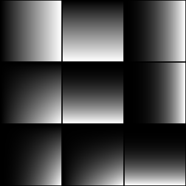
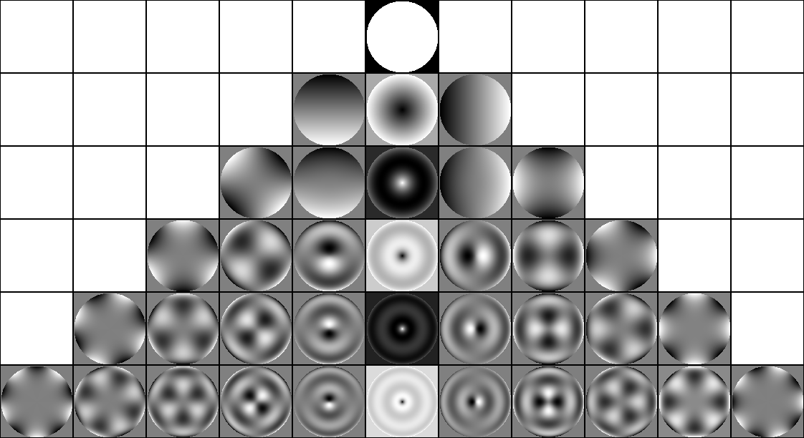
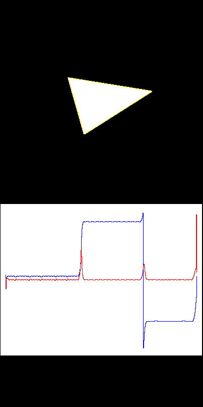
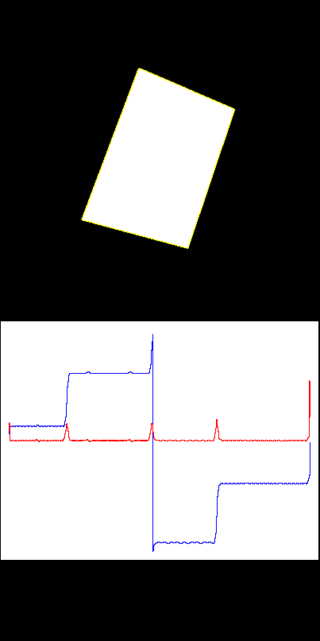
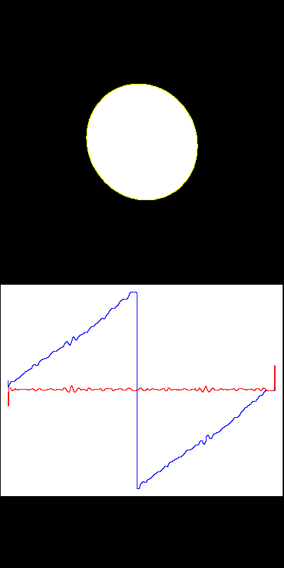

---
title: Luku 13 - Hahmontunnistuksen perusteet
author: Matti Eskelinen
date: 29.4.2018
title-prefix: TIES411
lang: fi
css: style.css
---

# Hahmontunnistuksen perusteet

Tässä luvussa opimme perusasiat hahmontunnistuksesta ja päätösteoriasta,
pohdimme piirteytystä, ja kokeilemme soveltaa opittua yksinkertaisten
tilastollisten momenttien ja mallien avulla.

Käytännöllisiä asioita tällä kerralla:

* laskemme yksinkertaisista kappaleista momentteja testipiirteiksi,
* kuvailemme monimutkaisempia kappaleita pistepiirteiden avulla,
* visualisoimme piirteitä graafisesti histogrammeina ja pistepilvinä,
* kokeilemme luokittelua käyttäen etäisyyksiä ja lähimpiä naapureita,
* kokeilemme tehdä päätösfunktion joka luokittelee kappaleet.

Hahmo tai kuvio (engl. *pattern*) on jossakin datajoukossa oleva
säännönmukainen tai toistuva ilmiö, joka poikkeaa satunnaisesta.
Hahmontunnistus (engl. *pattern recognition*) on löyhä kokoelma käsitteitä ja
menetelmiä, joilla pyritään tunnistamaan datasta aiemmin nähtyjä kuvioita tai
havaitsemaan ja oppimaan datasta uusia kuvioita. Toisinaan puhutaan myös
*tilastollisesta hahmontunnistuksesta* tai *päätösteoreettisista menetelmistä*,
sillä menetelmät pohjautuvat tilastolliseen analyysiin ja päätösteoriaan.

## Piirteistä ja datajoukoista

Olemme jo aiemmin käsitelleet alustavasti piirteytystä. Se tarkoittaa siis
kohteiden kuvailua vertailtavassa muodossa eli vektoreina. Hahmontunnistus
perustuu kohteen mittaamiseen piirteiden avulla, ja tässä piilee
hahmontunnistuksen vahvuus ja heikkous. Vektoreita on helppo käsitellä; osaamme
tehdä niiden kanssa monenlaisia asioita, muodostaa normeja, metriikoita ja
topologioita, laskea etäisyyksiä ja etsiä lähimpiä naapureita. Ongelmallista on
se, että emme tutki itse kohteita vaan niistä muodostettuja vektoreita.

Aiemmin sivusimme jo lyhyesti havaintomuuttujia ja piileviä muuttujia.
Muistamme, että usein kiinnostavaa ilmiötä ei voida havainnoida suoraan;
kohdetta kuvaavista piilevistä muuttujista ei saada suoria havaintoja. Voidaan
kutsua tätä piilevien muuttujien joukkoa maailman tilaksi $\mathbf{w}$.
Tavoitteena on tutkia havaintomuuttujia $\mathbf{x}$, jotka ovat kohteista
mitattuja piirrevektoreita, ja löytää muuttujien $\mathbf{x}$ ja $\mathbf{w}$
väliltä jokin vastaavuus.

Matemaattiset esitysmuodot saattavat luoda harhan täsmällisyydestä. Pystymme
laskemaan datajoukoista tarkkoja numeroarvoja ja arvioimaan todennäköisyyksiä.
Myöhemmin tässä luvussa opimme, kuinka saamme laskettua tarkan todennäköisyyden
sille, että piilevät muuttujat saavat tietyn arvon. On pidettävä mielessä, että
tulosten luotettavuus riippuu käytettävissä olevasta datasta: kuinka monia
havaintoja on käytettävissä, ja kuinka tarkka vastaavuus havaintomuuttujien ja
piilevien muuttujien välillä on tässä datajoukossa. Laskennallinen
todennäköisyys perustuu aina oletuksiin esimerkiksi valittujen muuttujien
jakaumista, ja oletukset eivät välttämättä päde kovinkaan hyvin.

Piirteytykseen perustuvan hahmontunnistuksen yhteydessä on syytä muistaa myös,
että lopputulos riippuu oleellisesti siitä, kuinka hyvin piirteet kuvaavat
tutkittavia kohteita. Erityisesti jos tavoitteena on erottaa toisistaan kaksi
tai useampia kohteiden ryhmiä eli luokitella kohteita, lopputulos riippuu
oleellisesti siitä, kuinka hyvin piirteet jakautuvat erillisiin ryhmiin. Jos
ryhmien välillä on paljon päällekkäisyyttä, mikään menetelmä ei voi tuottaa
luotettavaa luokittelutulosta.

## Kuvien piirteytys

Tutkitaan seuraavaksi, kuinka voimme piirteyttää kuvia ja niissä olevia
kohteita.

### Kuvamomentit

Perinteinen ja yleissivistykseen kuuluva tapa kuvailla binäärikuvasta löytyviä
kappaleita ovat niin sanotut kuvamomentit. Momentti on tietynlainen painotettu
keskiarvo kuvan tai kappaleen pikseliarvoista. Momentit kuvailevat kappaleen
muotoa tilastollisten tunnuslukujen tapaan, eli ne kuvaavat pikselien
jakautumista kappaleen sisällä.

Määritellään momentit $M_{ij}$ kuvalle $I(x,y)$ seuraavasti:

$$M_{ij} = \sum_x \sum_y x^i y^j I(x,y)$$.

Pohtimalla hetken yllä olevaa kaavaa huomaamme, että

$$M_{00} = \sum_x \sum_y I(x,y)$$

mikä binäärikuvan tapauksessa tarkoittaa pinta-alaa. Samoin huomaamme, että
$M_{10}$ on kappaleen muodostavien pikselien x-koordinaattien summa ja $M_{01}$
on niiden y-koordinaattien summa. Siten

$$(x_c,y_c) = (\frac{M_{10}}{M_{00}},\frac{M_{01}}{M_{00}})$$

on kappaleen *sentroidi* eli massakeskipiste. Kaikki momentit voidaan laskea
myös harmaasävykuville, jolloin kuva on ymmärrettävä eräänlaisena
tiheysfunktiona. Sentroidin avulla voidaan määritellä *keskeismomentit*
(central moments) jotka ovat *siirtoinvariantteja* eli eivät riipu kappaleen
sijainnista kuvassa.

Määritellään keskeismomentit $\mu_{ij}$ kuvalle $I(x,y)$ ja sentroidille
$(x_c,y_c)$ seuraavasti:

$$\mu_{ij} = \sum_x \sum_y (x - x_c)^i (y - y_c)^j I(x,y)$$.

Keskeismomenttien avulla saadaan muodostettua esimerkiksi kappaleen
*kovarianssimatriisi*, jonka ominaisvektorit laskemalla voidaan analysoida
kappaleen pääakseleita ja niiden suuntaa.

Keskeismomentit, joille $i + j \ge 2$, saadaan vielä normalisoitua siten, että ne
ovat *skaala-invariantteja* eli riippumattomia kappaleen koosta kuvassa:

$$\eta_{ij} = \frac{\mu_{ij}}{\mu_{00}^{1 + \frac{i + j}{2}}}$$.

Näistä normalisoiduista keskeismomenteista voidaan muodostaa
*kääntöinvariantteja* momentteja, jotka siis eivät riipu kappaleen asennosta
kuvassa. Tunnetuimpia ovat Hu-momentit, jotka löytyvät myös OpenCV:stä. Näistä
esimerkkinä mainittakoon ensimmäinen Hu-momentti

$$H_1 = \eta_{20} + \eta_{02}$$

jolla on vastaavuus fysiikasta tutun inertiamomentin kanssa; jos tulkitaan
pikselien arvot fysikaaliseksi tiheydeksi, tämä momentti kuvaisi sentroidin eli
massakeskipisteen ympäri pyörivän kappaleen inertiamomenttia.

Tarkempaa tietoa [kuvamomenteista wikipediasta]. Huomattakoon täältä esimerkiksi
Hu-momentteja kohtaan esitetty kritiikki, jonka mukaan toinen ja kolmas
momentti eivät sopisi hyvin hahmontunnistukseen.

[kuvamomenteista wikipediasta]: http://en.wikipedia.org/wiki/Image_moment

(tähän tulee koodiesimerkki pian...)

Kuvamomentit voidaan jälleen nähdä projektioina kantavektoreille, jossa
kantavektorit ovat pikselikoordinaattien muodostamia polynomeja.

{ .centered }

### Zernike-momentit*

Zernike-momentit hyödyntävät ajatusta momenteista erityisessä momenttikannassa,
mutta ne rakennetaan ortogonaalisten Zerniken polynomien avulla. Verrattuna
tavallisiin kuvapolynomeihin ortogonaalisuus tuo sen edun, että momentit
sisältävät vähemmän toisteista tietoa. Lisäksi Zerniken momentit esittävät kuvan
muodossa, josta alkuperäinen kuva saadaan helposti palautettua kohtalaisella
tarkkuudella käyttäen suhteellisen pientä määrää komponentteja. Zerniken
polynomit on määritelty yksikköympyrässä; tutkittava kuva pitää siis muuntaa
polaarimuotoon ja skaalata ykkösen säteiseksi ympyräksi. Zerniken momentit
muodostetaan laskemalla tällaisen kuvan sisätulo kuvassa esitetyn kaltaisten
Zerniken polynomien kanssa.

{ .centered }

### Jakaumat

Momenttien lisäksi kynnystettyjä kappaleita voidaan kuvailla erilaisten
histogrammien eli diskreettien jakaumien perusteella. Kynnystetystä tai
kvantisoidusta kuvasta voidaan etsiä yhtenäiset kappaleet ja muodostaa näiden
avulla maskikuva, jossa on ykköstä kunkin kiinnostavan kappaleen alueella ja
nollaa muualla; kertomalla alkuperäinen tai suodatettu kuva tällä maskilla
saadaan poistettua kaikki muu paitsi yksi kiinnostava kappale. Sitten voidaan
muodostaa esimerkiksi harmaasävyhistogrammi, gradienttihistogrammi tai vaikkapa
Gabor-histogrammi joita voidaan sitten käyttää piirteinä. Joskus kun kappaleiden
kirkkaus tai väri poikkeaa toisistaan huomattavasti saattaa riittää laskea vain
keskiarvo ja varianssi.

Kappaleista voidaan muodostaa myös tekstuurijakaumia käyttäen esimerkiksi
*local binary pattern* -piirteitä (LBP). Tämä on suomalaisten Ojalaisen ja
Pietikäisen kehittämä tekstuuripiirre, jossa tutkitaan kunkin pikselin
ympäristöä ja katsotaan mitkä naapuruston pikselit ovat suurempia kuin
tarkasteltava pikseli. Jos tutkitaan 8-naapurustoa, tällä tavoin saadaan
8-bittinen binääriluku. Pyöräyttämällä luvun sillä tavoin, että suurin tai
pienin nollien tai ykkösten jono tulee aina ensiksi, saadaan piirteestä
kääntöinvariantti. Näistä piirteistä muodostetaan yleensä histogrammi
tutkittavalta kuva-alueelta. Lisätietoa erinomaisessa Matti Pietikäisen
[artikkelissa scholarpediassa](
http://www.scholarpedia.org/article/Local_Binary_Patterns).

### Gradienttijakaumat

Viime aikoina suosittu tapa tunnistaa esimerkiksi ihmisiä kuvista on
gradientin suuntahistogrammi (engl. *Histogram of Oriented Gradients*, HOG).
Tämä on kuvapiirre, jossa kuvataan gradientin eri suuntien esiintymistiheyttä
joukolla histogrammeja, jotka lasketaan pieniltä kuva-alueilta.

Histogrammien muodostaminen voi käydä raskaaksi, varsinkin jos kuvasta pitää
tutkia useita päällekkäisiä, eri kokoisia alueita. Tähän on ratkaisuna käyttää
*integraalihistogrammia*. Tämä on ikään kuin integraalikuva, mutta se muodostuu
$n$:stä erillisestä integraalista joista kukin vastaa yhtä histogrammin lokeroa.
Menetelmässä siis muodostetaan integraalikuva kuhunkin histogrammin lokeroon
kuuluvista pikseleistä. Tämä vie luonnollisesti melko paljon tilaa, joten usein
on tapana käyttää esimerkiksi 16 tai 32 lokeroa. Gradienttihistogrammien lisäksi
tämä menetelmä soveltuu myös normaalien kuvahistogrammien muodostamiseen.

### Reunapiirteet

Kappaleen sisältä laskettujen tilastollisten momenttien tai jakaumien lisäksi
kappaleen muotoa voidaan kuvailla sen reunakäyrän avulla. Useimmat menetelmät
olettavat, että reunakäyrä muodostaa suljetun lenkin, joten tavallisesti
reunakäyrä muodostetaan seuraamalla kynnystetyn kappaleen reunaa. Tämä voidaan
tehdä esimerkiksi seuraavalla tavalla:

1) Tutkitaan kuvaa riveittäin kunnes löydetään kappaleeseen kuuluva pikseli.
2) Alustetaan reunakäyrä tällä pikselillä ja asetetaan suunta vasemmalle
   edellisen reunapikselin suunnaksi.
3) Tutkitaan myötäpäivään suuntia alkaen edellisen reunapikselin suuntaa
   seuraavasta suunnasta.
4) Kun löytyy kappaleeseen kuuluva pikseli, lisätään se reunakäyrään ja
   laitetaan muistiin suunta jossa edellinen reunapikseli on. Jatketaan kohdasta
   3.
5) Kun palataan takaisin alkukohtaan tai törmätään kuvan reunaan voidaan
   lopettaa.

Jos kappaleissa voi olla reikiä ne täytyy käsitellä erikseen. Reikien reunat
voidaan löytää merkitsemällä kappaleen reunapikselit jollakin toisella arvolla
kuin taustan ja kappaleen pikseleiden arvot. Kun reunakäyrä on löydetty,
jatketaan pikseleiden tutkimista riveittäin alkaen edellisen reunakäyrän
aloituspisteestä. Jos löydetään uusi kohta jossa on vasemmalla puolella taustaan
kuuluva pikseli ja oikealla puolella kappaleeseen kuuluva pikseli jota ei ole
merkitty reunaksi, ryhdytään seuraamaan taas reunaa. Reiät voidaan tunnistaa
kappaleen ulkoreunoista siitä, että ne kaareutuvat vastapäivään kun taas
ulkoreuna kaareutuu myötäpäivään. Niiden keskimääräinen *kaarevuus* on siis
negatiivinen.

Konvekseille kappaleille voidaan muodostaa reunapiirre näytteistämällä etäisyys
kappaleen massakeskipisteestä reunalle tietyin kulma-askelin. Tästä esityksestä
saadaan kääntöinvariantti valitsemalla aloituskohdaksi suurin tai pienin
etäisyys. Epäkonvekseille kappaleille saadaan myös muodostettua vastaavan
kaltainen reunapiirre etsimällä ensin kappaleen konveksi peite ja kuvailemalla
erikseen peitteen reuna ja peitteen ja kappaleen leikkauksena syntyvät
ylimääräiset palaset.

Reunakäyrästä voidaan myös muodostaa reunasignaali seuraamalla reunakäyrää ja
näytteistämällä sen *suuntaa* (ensimmäisen asteen derivaatta) tai *kaarevuutta*
(toisen asteen derivaatta) tasaisin välein. Skaalainvarianssi voidaan saavuttaa
normalisoimalla signaalin lähtöjoukko esimerkiksi välille $[0,1]$.
Kääntöinvarianssi voi olla hankampi saavuttaa, mutta voidaan esimerkiksi valita
lähtöpisteeksi massakeskipisteestä nähden lähimpänä tai kauimpana oleva piste.
Voidaan myös etsiä esimerkiksi pisin reunakäyrän pätkä jolla signaali on
lähellä vakiota ja asettaa tämän pätkän alkupiste koko reunakäyrän
alkupisteeksi.

Reunakäyrän suunta on $\theta$, jolle

$$\tan\theta = \frac{dy}{dx}$$

ja reunakäyrän kaarevuus on $\kappa$, joka voidaan johtaa muotoon

$$\kappa = \frac{dx ddy - dy ddx}{\sqrt{(dx^2+dy^2)^3}}.$$

Tässä $dx$ ja $dy$ tarkoittavat $x$:n ja $y$:n muutosta reunapisteen
ympäristössä, esimerkiksi $x_{+1} - x_{-1}$ ja $y_{+1} - y_{-1}$. $ddx$ ja $ddy$
tarkoittavat *muutoksen muutosta*, eli esimerkiksi $dx_{+1} - dx_{-1}$. Tämä on
hyvin karkea tapa, ja parempi tulos saadaan sovittamalla polynomi pisteen
ympäristöön ja laskemalla tämän polynomin derivaatat. Tätä karkeaakin tapaa
saadaan parannettua *suodattamalla* reunakäyrää, esimerkiksi konvolvoimalla
Gaussin ytimellä.

Seuraavassa tutkitaan reunapiirteitä eri monikulmioille. Kulma on merkitty
sinisellä ja kaarevuus punaisella. Muokattava koodiesimerkki tulee pian.

{ .centered }

{ .centered }

{ .centered }

Helppo tapa tehdä reunasignaalista kääntöinvariantti on laskea sen
Fourier-muunnos. Muistamme, että Fourier-muunnos on globaali ja periodinen,
joten samankaltaisten reunasignaalien Fourier-muunnos on samankaltainen
riippumatta signaalin alkupisteestä. Kappaleen skaala ja reunan nopeataajuiset
muutokset voivat aiheuttaa ongelmia: voi olla syytä uudelleennäytteistää
eri kappaleiden reunasignaalit siten, että kaikissa on osapuilleen yhtä monta
näytepistettä. Samoin voi olla syytä jättää suurimmat taajuudet huomiotta, sillä
nämä vastaavat reunakäyrän pieniä röpelöitä ja yksityiskohtia, jotka saattavat
vaihdella paljonkin jopa samaan luokkaan kuuluvien kappaleiden välillä.

## Regressio*

Joissakin sovelluksissa on tarpeen tehdä vain mittauksia kappaleista. Muoto- ja
reunapiirteitä voidaan joskus käyttää sellaisenaan mittaustuloksina, tai sitten
niitä voidaan käyttää apuna mittaustuloksen muodostamisessa suorittamalla niille
yksinkertaisia laskutoimituksia. Joskus voi kuitenkin olla tarpeen tutkia
tarkemmin vastaavuutta piirteiden ja jonkin jatkuvan suureen välillä, jotta
löydettäisiin sopiva kuvaus piirteiltä mittaustulokselle. Tätä kuvausta
piirreavaruudesta johonkin jatkuvaan skalaari- tai vektoriavaruuteen kutsutaan
*regressioksi* ja tähän palaamme tarkemmin seuraavalla luennolla.

## Luokittelu ja lähimmät naapurit

Monissa sovelluksissa täytyy mittaamisen sijaan tai mittaamisen lisäksi jakaa
havaintoja erillisiin ryhmiin. Tätä kuvausta piirreavaruudesta diskreetteihin
luokkiin kutsutaan *luokitteluksi*.

Kenties yksinkertaisin tapa luokitella havaintoja, joka usein myös toimii
käytännössä, on menetelmä nimeltä *k lähintä naapuria* (engl. *k nearest
neighbors*, kNN). Siinä tallennetaan kaikki havainnot, joiden oikea luokitus
tunnetaan. Data-avaruudesta etsitään kunkin uuden havaintopisteen $k$ lähintä
naapuria, ja määrätään havainto siihen luokkaan, joka esiintyy naapurustossa
useimmin.

On huomattava, että kNN-menetelmän tulos riippuu oleellisesti käytettävästä
etäisyysmitasta sekä siitä, kuinka hyvin eri luokat erottuvat toisistaan
datajoukossa. Ongelmia voi seurata myös siitä, jos piirreavaruuden dimensio on
kovin suuri. Hyvin korkeaulotteisessa avaruudessa euklidiset etäisyydet
havaintopisteestä suureen osan muista datapisteistä saattavat olla lähellä
toisiaan. Eri piirteiden välinen skaalaus saattaa muodostua ratkaisevaksi
tekijäksi tässä tapauksessa. Sen takia voi olla suositeltavaa pienentää ensin
avaruuden dimensiota esimerkiksi PCA:lla. Jälleen on muistettava PCA:n
lineaarisuus. Jos on syytä epäillä, että data sijaitsee hyvin epälineaarisessa
monistossa, voi olla tarpeen käyttää jotakin muuta menetelmää, kuten
diffuusiokarttoja.

Menetelmän heikkous on myös lähimpien naapurien haku. Naiivissa toteutuksessa
pitäisi käydä kaikki datapisteet läpi, laskea etäisyys tutkittavaan pisteeseen,
ja järjestää pisteet etäisyyden mukaan. On kuitenkin olemassa tietorakenne
nimeltä *kd-puu*, jolla lähimpien naapurien hakua voidaan nopeuttaa. Tämä
tietorakenne muistuttaa binääripuita, mutta puun solmut ovat k-ulotteisia
pisteitä. Jokaisen sisäsolmun voidaan ajatella määrittävän hypertason, joka
jakaa avaruuden kahtia. Tämä mahdollistaa muun muassa lähimpien naapurien
etsimisen tehokkaasti, kun suuri osa avaruudesta voidaan jättää huomiotta.

Luokittelu voidaan nähdä avaruuden jakamisena osiin *päätöspintojen* avulla:
pinnan toisella puolella olevat pisteet kuuluvat yhteen luokkaan ja
vastakkaisella puolella olevat toiseen. Joissakin menetelmissä, kuten myöhemmin
esiteltävissä tukivektorikoneissa, päätöspinta muodostetaan eksplisiittisesti,
kun taas esimerkiksi kNN-menetelmässä päätöspinta muodostuu implisiittisesti
valitun päätössäännön perusteella.

## Päätösteoria

Hahmontunnistus on useimmiten osa suurempaa järjestelmää, joka mittaa jotakin
todellisen maailman ilmiötä ja pyrkii tekemään mittausten perusteella järkeviä
päätöksiä suoritettavista toimenpiteistä. Päätösteoria tutkii, kuinka tiettyjen
mittaustulosten perusteella voitaisiin tehdä *optimaalisia päätöksiä*. Tämä
riippuu mittaustuloksiin liittyvistä *epävarmuustekijöistä* ja eri päätöksiin
liittyvistä *arvostuksista*; jos mittaustulos on hyvin epävarma ja
vaihtoehtoisten päätösten *arvo* tai *hinta* on hyvin erilainen, on voitava
arvioida milloin on kannattavaa ottaa riski. Päätösteoria voidaan formuloida
usealla eri tavalla, ja tilastollisessa hahmontunnistuksessa suositaan yleensä
*Bayesilaista päätösteoriaa*.

Kuvitellaan, että analysoitava päätös liittyy kohteiden tunnistamiseen
liukuhihnalla. Haluamme lajitella liukuhihnalla liikkuvat kohteet kahteen eri
laatikkoon. Päätös perustuu kohteista tehtyihin mittauksiin, joita kuvataan
piirrevektorin $\mathbf{x}$ avulla. Mittausten perusteella arvioidaan maailman
tilaa $\mathbf{w}$, joka tässä tapauksessa tarkoittaa sitä, kumpaan ryhmään
kohde kuuluu.

Kuvataan tilanne satunnaismuuttujien ja todennäköisyysjakaumien avulla. Meillä
on kaksi satunnaismuuttujaa, $X$ ja $W$. Näiden jakaumat $P(X)$ ja $P(W)$
kuvaavat piirrevektorien ja eri tilavaihtoehtojen esiintymistiheyttä.
$P(X=\mathbf{x})$ on todennäköisyys sille, että tietty piirrevektori
$\mathbf{x}$ havaitaan, ja $P(W=\mathbf{w}$ on todennäköisyys sille, että
maailman tila on $\mathbf{w}$.

Haluamme arvioida todennäköisyysjakaumaa $P(W \mid X)$, eli maailman tilan
*ehdollista* jakaumaa havaintojen suhteen. Tämä jakauma kuvaa sitä, miten
todennäköisiä eri tilat ovat, kun tietty havainto on tehty. Tätä jakaumaa
kutsutaan *posteriorijakaumaksi* tai *a posteriori -todennäköisyysjakaumaksi*.
Nimitys viittaa siihen, että todennäköisyyttä arvioidaan havainnon *jälkeen*;
on tehty havainto $X=\mathbf{x}$ ja halutaan vertailla muuttujan $W$ mahdollisia
arvoja. Voitaisiin siis kirjoittaa jakauma muodossa $P(W \mid X=\mathbf{x})$.
Haluamme valita arvon $\mathbf{w}$, joka *maksimoi* posterioritodennäköisyyden.

Muistamme, että kuuluisan *Bayesin säännön* tai *Bayesin teoreeman* mukaan
voimme kirjoittaa jakauman $P(W \mid X)$ muodossa

$$P(W \mid X) = \frac{P(X \mid W)P(W)}{P(X)}.$$

Tässä kaavassa jakaumaa $P(W)$ kutsutaan *priorijakaumaksi* tai *a priori -
todennäköisyysjakaumaksi*. Nimitys viittaa siihen, että eri tilavaihtoehtojen
todennäköisyyttä arvioidaan *ennen* havaintoa. Kun mitään havaintoja ei ole
tehty, on rationaalista tutkia sitä, kuinka usein eri vaihtoehdot ovat aiemmin
esiintyneet. Jos päätös pitäisi tehdä pelkän priorijakauman perusteella,
päädyttäisiin valitsemaan aina se vaihtoehto, joka on esiintynyt useimmin.
Bayesin kaava kertoo, kuinka tätä *etukäteisuskomusta* voidaan muokata tehdyn
havainnon perusteella.

Jakaumaa $P(X \mid W)$ kutsutaan *uskottavuudeksi* (engl. *likelihood*).
Huomaamme, että se voidaan nähdä myös muuttujan $X$ posteriorijakaumana, kun on
havaittu maailman tila $W$. Se siis kuvaa millaisia arvoja $X$:n odotetaan
saavan kun $W$:n arvo tunnetaan. Nyt emme kuitenkaan tunne $W$:n arvoa; meillä
on tiedossa $X$:n arvo sekä $X$:n posteriorijakauma $W$:n suhteen, jonka olemme
muodostaneet aiempien havaintojen perusteella. Yritämme arvata $W$:n arvon
havaitun $X$:n arvon perusteella. Termi uskottavuus viittaakin tässä yhteydessä
siihen, että se $W$ joka vastaa $X$:n suurinta posterioritodennäköisyyttä on
uskottavin vaihtoehto $W$:n arvoksi. Tämä uskottavuus perustuu kuitenkin vain
yhteen havaintoon, joten sitä on muokattava priorijakauman perusteella; jos
arvon $w_1$ uskottavuus on hiukan suurempi kuin arvon $w_2$, mutta arvo $w_2$
esiintyy huomattavasti useammin priorijakaumassa, voi olla parempi valita $w_2$.

Bayesin kaavan jakajana toimivaa termiä $P(X)$ eli muuttujan $X$ jakaumaa, joka
ei riipu $W$:sta, kutsutaan toisinaan *havainnoksi* (engl. *evidence*). Se kuvaa
siis sitä, kuinka usein tietty $X$:n arvo esiintyy, ja sitä käytetään
normalisoimaan kaavan tuottama tulos todennäköisyydeksi. Tyypillinen tilanne on
kuitenkin se, että emme ole kiinnostuneita valitun vaihtoehdon numeerisesta
todennäköisyydestä vaan haluamme vain valita todennäköisimmän vaihtoehdon.
Haluamme siis valita $\mathbf{w}$:n, jolle posterioritodennäköisyys maksimoituu.
Vakiotermillä kertominen ei muuta funktion maksimien paikkoja vaan pelkästään
skaalaa niiden suuruutta. Voidaan siis valita

$$w = \underset{\mathbf{W}}{\operatorname{arg\,max}} P(X \mid W)P(W).$$

Bayesilainen päätösteoria perustuu muuttujan posterioritodennäköisyyden
maksimointiin Bayesin säännön avulla yllä olevan kaavan mukaan. Voidaan
osoittaa, että valitsemalla tämä $w$ minimoidaan virheen todennäköisyys, toisin
sanoen todennäköisyys sille, että valitaan $w_1$ kun oikea valinta olisi ollut
$w_2$, tai päinvastoin. Tämä yleistyy useammallekin kuin kahdelle vaihtoehdolle ja myös
jatkuville suureille. Tämä on tietyssä mielessä optimaalinen tapa tehdä valinta.
On kuitenkin muistettava, että optimaalisuus on määritelty suhteessa käytössä
oleviin jakaumiin, eli siihen mitä tutkittavista muuttujista tiedetään tai
oletetaan päätöshetkellä. Jos käytössä ei ole yhtään havaintoa, päätös on
käytännössä satunnainen arvaus. Samoin päätöksen laatu riippuu siitä, kuinka
hyvin havaintomuuttujien $\mathbf{x}$ arvot erottelevat piilevien muuttujien
$\mathbf{w}$ arvot toisistaan.

Yllä kuvattu päätössääntö perustuu oletukseen, että kaikki lopputulokset ovat
yhtä arvokkaita, ja että virhepäätöksiin liittyvä kustannus on yhtä suuri. Usein
on kuitenkin niin, että erilaisilla virheillä on erilainen painoarvo. Voidaan
määritellä *kustannusfunktio*, joka kertoo millainen kustannus liittyy siihen,
että tehdään *valinta* $\mathbf{v}$ kun todellinen maailman tila onkin
$\mathbf{w}$: $K(\mathbf{v} \mid \mathbf{w})$. Muistamme, että *riski*
tarkoittaa odotettua kustannusta, eli kustannusta kerrottuna kustannuksen
todennäköisyydellä. Tässä tapauksessa tunnemme todennäköisyyden sille, että
todellinen maailman tila on $\mathbf{w}$: $P(W=\mathbf{w} \mid X=\mathbf{x})$.
Tämä on siis posterioritodennäköisyys, jonka laskimme yllä Bayesin kaavalla.
Kyseessä ei ole enää jakauma, vaan jakaumasta poimittu yhden tapahtuman
todennäköisyys. On muistettava, että tässä tapauksessa normalisointi täytyy
tehdä, muuten kyseessä ei ole todennäköisyys eli kaikkien vaihtoehtojen summa ei
ole $1$.

Tiettyyn valintaan $\mathbf{v}_i$ liittyvä *ehdollinen riski* havainnolle
$\mathbf{x}$ on siis

$$R(\mathbf{v}_i \mid \mathbf{x}) =
  \sum_{j}K(\mathbf{v}_i \mid \mathbf{w}_j)P(\mathbf{w}_j \mid \mathbf{x}).$$

Voimme siis laskea kunkin valinnan ehdollisen riskin ja tehdä valinnan siten,
että riski minimoituu. Voidaan myös määritellä kustannus sille, että ei tehdä
päätöstä lainkaan: jos eri vaihtoehtojen todennäköisyydet ovat hyvin lähellä
toisiaan, joissakin tilanteissa voi olla parempi jättää valinta tekemättä.

## Tehtäviä

