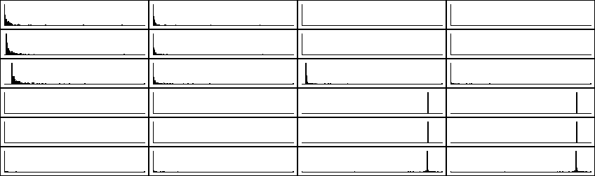
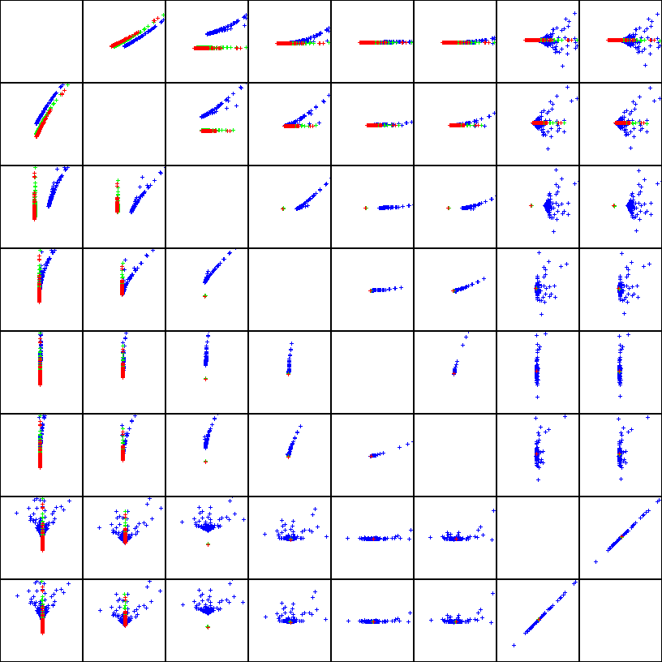
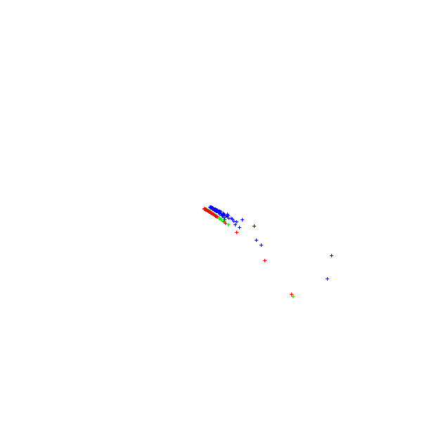
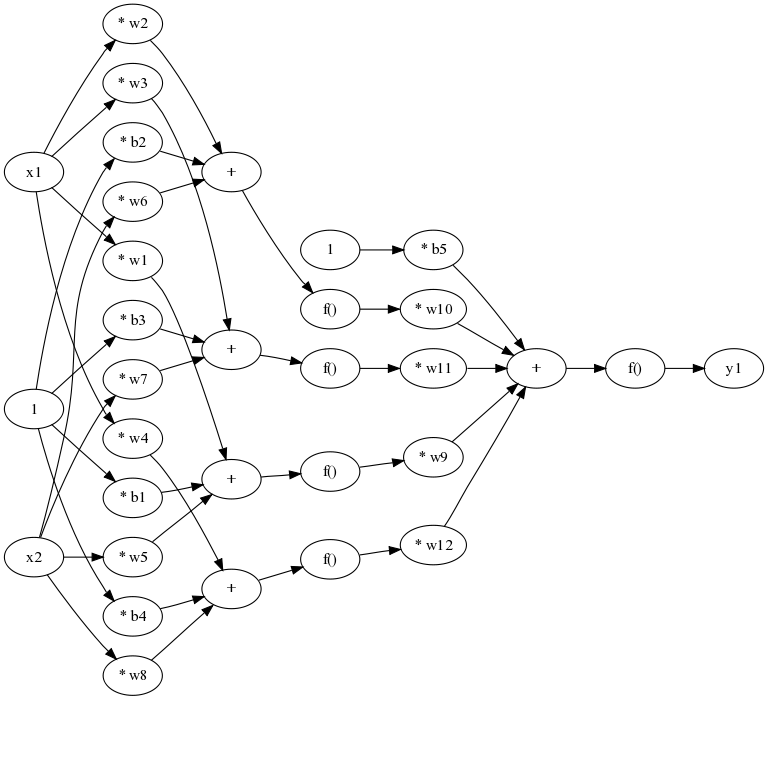

---
title: Luku 14 - Koneoppiminen ja luokittelu
author: Matti Eskelinen
date: 6.5.2018
title-prefix: TIES411
lang: fi
css: style.css
---

<!--# Koneoppiminen ja luokittelu-->

Tässä luvussa opimme perusasiat koneoppimisesta ja mallien kouluttamisesta.
Opimme mitä tarkoittavat ylioppiminen ja alioppiminen ja miten analysoidaan
asioita nimeltä *bias* ja *variance*.

Käytännöllisiä asioita tällä kerralla:

* Opimme perusasioita ja käsitteitä koneoppimisesta,
* tutustumme luokittelumenetelmiin ja tyypilliseen luokitteluprosessiin,
* tutkimme virheitä koulutus- ja validointijoukossa,
* valitsemme parhaat parametrit kokeilujen perusteella.

## Mitä koneoppiminen on

Koneoppimisen tavoitteena on rakentaa ohjelmistojärjestelmiä, jotka kykenevät
oppimaan asioita datasta. Arthur Samuelin vanha määritelmä vuodelta 1959
mainitsee koneoppimisen tavoitteeksi sen, että tietokoneet voisivat oppia
tekemään asioita ilman yksityiskohtaista vaiheittaista ohjeistusta ja
ohjelmointia.

Tom Mitchell muotoili täsmällisemmän määritelmän vuonna 1998: sen mukaan
tietokoneohjelman voidaan sanoa oppivan kokemuksesta $E$ liittyen johonkin
tehtävään $T$ suhteessa mittariin $P$, jos se suoriutuu mittarilla $P$ mitaten
paremmin tehtävässä $T$ kokemuksen $E$ jälkeen. Tämä määritelmä luonnollisesti
pitää sisällään oletuksen, että ohjelman toiminta voi muuttua kokemuksien
seurauksena.

Koneoppiminen perustuu tyypillisesti siihen, että havaintodatasta etsitään
jokin säännönmukaisuus ja kuvataan se mallina. Tällaisen mallin tarkoituksena on
useimmiten joko lajitella asioita luokkiin (**luokittelu**, engl.
*classification*), ennustaa jonkin ilmiön tulevaa kehitystä (**regressio**,
engl. *regression*), tai havaita poikkeavuuksia datassa (engl. *anomaly
detection*). Opittujen mallien keskeinen ominaisuus on **yleistävyys**
(engl. *generalizability*), eli se kuinka hyvin malli ennustaa uusien näytteiden
käyttäytymistä (eli sellaisten näytteiden, joita ei ole käytetty mallin
kouluttamisessa). Hyvin yleistävä malli kuvaa kohteiden olennaisia ominaisuuksia
ja toimii siten hyvin myös aivan uusienkin näytteiden kanssa.

Koneoppimisen malleja voidaan rakentaa useilla eri tavoilla, käyttäen erilaisia
matemaattisia abstraktioita. Tyypillisesti mallit rakennetaan siten, että niihin
jää muokattavia parametreja, joiden avulla mallin toimintaa voidaan säätää.
Mallin parametrien valitsemista siten, että malli toimii odotetulla tavalla,
kutsutaan mallin *kouluttamiseksi* (engl. *training*). Tätä varten havaintodata
jaetaan tyypillisesti kolmeen osaan: koulutusdataan, validointidataan ja
testidataan. Ensimmäistä käytetään mallin parametrien säätämiseen, toisella
varmistetaan että parametrivalinta on järkevä, ja kolmannella varmistetaan
opityn mallin yleistävyys. Näihin vaiheisiin palaamme vielä myöhemmin.

Malleja voidaan kouluttaa useilla eri tavoilla, joiden tärkein ero liittyy
siihen, millä tavalla mallien suoriutumisesta annetaan palautetta. Niin sanottu
*valvottu* tai *ohjattu* oppiminen (engl. *supervised learning*) tarkoittaa
sitä, että oikeat vastaukset ovat tiedossa ja oppimisprosessin ohjaamisessa
käytetään etäisyysmittauksia mallin tuottaman vastauksen ja oikean vastauksen
välillä. Sen sijaan *vahvistusoppiminen* (engl. *reinforcement learning*)
perustuu palautteeseen, joka on positiivista tai negatiivista, mutta
absoluuttinen etäisyys oikeaan vastaukseen ei ole tiedossa. Lopulta *valvomaton*
tai *ohjaamaton* oppiminen (engl. *unsupervised learning*) tarkoittaa sitä, että
oikeat vastaukset eivät ole tiedossa, joten oppimisen täytyy perustua
rakenteiden ja riippuvuuksien löytämiseen datasta esimerkiksi rypästelyn avulla.

## Ali- ja ylioppiminen

Mallien kouluttamisessa esiintyy kaksi keskeistä ongelmaa, jotka ovat osittain
toisilleen vastakkaisia: **bias** ja **variance**. Suomeksi nämä voisi kääntää
esimerkiksi sanoilla *harha* ja *erimielisyys*. Puhutaan myös *alioppimisesta*
ja *ylioppimisesta*.

**Alioppiminen** eli *bias* tarkoittaa sitä, että malli ei kuvaa riittävän hyvin
koulutusdatassa olevaa vaihtelua, joten se ei myöskään pysty ennustamaan uusien
näytteiden käyttäytymistä. Usein *bias* on *systemaattinen* poikkeama odotetusta
tuloksesta, joka johtuu liian yksinkertaisesta mallista. Alioppimisen syynä voi
olla malli jossa on liian vähän parametreja, tai mallin pohjana olevat piirteet
kuvaavat tutkittavaa ilmiötä huonosti. Alioppimisen tunnistaa siitä, että virhe
on suhteellisen suuri sekä koulutusdatalla että validointidatalla. Alioppimista
ei voida korjata lisäämällä datan määrää, vaan on parannettava mallia tai sen
perustana olevia piirteitä.

**Ylioppiminen** eli *variance* puolestaan tarkoittaa sitä, että malli kuvaa
liian tarkasti koulutusdatassa olevaa vaihtelua, joten se ei *yleisty* riittävän
hyvin ennustaakseen uusien näytteiden käyttäytymistä. Usein *variance* näkyy
*satunnaisena* poikkeamana odotetusta tuloksesta, johon yleinen syy on liian
monimutkainen malli. Ylioppimisen syitä voivat olla liian vähäinen tai muuten
puutteellinen koulutusdata, joka ei kata tutkittavan ilmiön kaikkea vaihtelua,
malli jolla on liikaa vapausasteita, liian monia piirteitä tai muuten huonosti
tutkittavaa ilmiötä kuvaavat piirteet. Ylioppimisen tunnistaa siitä, että virhe
on hyvin pieni koulutusdatalla mutta suuri validointidatalla. Datan määrän
lisääminen voi auttaa, mutta on myös syytä kokeilla mallin yksinkertaistamista.
Usein on tyydyttävä jonkinlaiseen kompromissiin ali- ja ylioppimisen välillä.

Ylioppimista voidaan hallita myös käyttäen *regularisointia*. Tyypillinen tapa
on estää mallin parametrien suuret vaihtelut lisäämällä mallin
kustannusfunktioon termi, joka saa suuria arvoja kun parametrien arvot ovat
suuria. Yleisemmin regularisointi tarkoittaa ongelman muuttamista helpommin
käsiteltävään muotoon esimerkiksi tekemällä ennakko-oletuksia tutkittavan
funktion sileydestä tai käyttämällä aiempaa tietoa tutkittavasta ilmiöstä.

## Luokitteluprosessi

Eräs tyypillisimmistä konenäkötehtävistä on rakentaa luokittelija, joka saa
syötteenä kuvan ja palauttaa yhden tai useampia tunnisteita, jotka kertovat
mihin luokkiin kuuluvia kohteita kuvasta löytyy. Tehtävän ratkaisu etenee
yleensä seuraavien vaiheiden mukaan:

1) Näytekuvien eli datajoukon hankinta,
2) sopivan esikäsittelyn valitseminen kuville vaihteluiden vähentämiseksi,
3) piirteiden valinta ja datajoukon kuvaaminen piirreavaruuteen,
4) piirrevektorien esikäsittely ja skaalaaminen,
5) datajoukon jakaminen koulutus-, validointi- ja testijoukoiksi,
6) luokittelumenetelmän valinta ja luokittimen kouluttaminen validointia
   käyttäen ja oppimistulosta analysoiden,
7) testaaminen testijoukolla.

Näiden vaiheiden välillä on usein tarpeen siirtyä edestakaisin kun havaitaan
puutteita aiempien vaiheiden tuloksissa. Näytekuvia saattaa olla liian vähän tai
ne ovat sopimattomia tarkoitukseen. Ensimmäisenä kokeillut piirteet eivät ehkä
toimikaan ihanteellisella tavalla. Valittu luokittelumenetelmä ei välttämättä
tuotakaan toivottua tulosta. Nyrkkisääntönä voitaneen sanoa, että dataa ei
yleensä voi olla liikaa, mutta datan rakennetta on syytä pyrkiä ymmärtämään.

Datan ymmärtämistä vaikeuttaa se, että usein data on hyvin korkeaulotteista ja
sitä ei pystytä piirtämään ihmisen ymmärtämään muotoon. Erilaiset osaprojektiot,
muuttujien välisen korrelaation analysointi, jakaumien tutkiminen ja esimerkiksi
pääkomponenttianalyysi tai satunnaisprojektio voivat olla avuksi.

Seuraavissa esimerkeissä analysoimme dataa, joka on muodostettu kolmen erilaisen
kuvion invarianteista momenteista. Kuviot ovat ellipsejä, nelikulmioita ja
kolmioita. Kuviot voivat olla missä tahansa asennossa, joten ristikorrelaatio ei
auta tunnistamaan kohteita: kaikkien datajoukkojen keskiarvo on sumea pyöreä
möykky.

Datan jakaumista nähdään, että datajoukot ovat jossakin määrin päällekkäisiä,
mutta ensimmäinen ja kolmas piirre näyttäisivät tuovan eroja luokkien välille.

Datan osaprojektiot ja satunnaisprojektiot puolestaan viittaisivat siihen, että
kutakin kohdetta edustavat pisteet sijoittuvat tiiviisiin ryppäisiin jotka ovat
enimmäkseen erillisiä keskenään. Kohteet siis pitäisi pystyä erottelemaan
toisistaan tässä piirreavaruudessa.

### kNN - luokittelija

Helpoin tapa luokitella kohteita on tutkia havaintopisteiden lähimpiä naapureita
piirreavaruudessa, joten sitä voi kokeilla ensimmäisenä. Prosessi
kNN-luokittelijan luomiseksi on yksinkertaisuudessaan seuraava:

1) hankitaan datajoukko ja piirteytetään se,
2) jaetaan datajoukko koulutus-, validointi- ja testijoukkoihin,
3) tallennetaan koulutusjoukon piirrevektorit kd-puuhun,
4) testataan luokittelutulosta eri k:n arvoilla validointijoukon alkioille,
5) valitaan paras k ja varmistetaan sen hyvyys kokeilemalla vielä testijoukolla.

Tämän luokittelijan heikkous on se, että jokainen luokittelu vaatii lähimpien
pisteiden etsintää koulutusjoukossa. Käyttämällä kd-puita tämä saadaan tehtyä
tehokkaasti, ja on myös olemassa menetelmiä joilla kd-puusta voidaan karsia pois
ryppäiden keskellä olevia alkioita hakujen nopeuttamiseksi.

Käyttämällä kNN-luokittelijaa eri muotoisille kappaleillemme saadaan
vahvistettua aiemmin tehty havainto siitä, että datapisteet vaikuttavat
jakautuvan melko tiiviisiin, erillisiin ryppäisiin: lähes kaikki lähimmät
naapurit kuuluvat oikeaan luokkaan. Esimerkiksi $5$ vaikuttaa hyvältä $k$:n
arvolta. Tämä tulos antaa ymmärtää, että myös muiden luokittelumenetelmien
pitäisi pystyä tuottamaan hyvä tulos.

### MLP - luokittelija

Neuroverkot ovat suosittu menetelmä kaikenlaisissa koneoppimisen tehtävissä.
Syynä tähän on se, että tietynlaisten neuroverkkojen on voitu osoittaa pystyvän
estimoimaan mitä tahansa funktiota. Jos tehtävä voidaan määritellä kuvauksena
piirrevektoreilta joillekin toisille vektoreille tai skalaareille ja käytössä
on riittävästi dataa ja laskentakapasiteettia, voidaan löytää neuroverkko joka
toteuttaa tämän kuvauksen. Kouluttamisen jälkeen neuroverkkoa on helppo ja
nopea käyttää: se muodostaa käytännössä painotettuja summia piirrevektoreista ja
mahdollisesti syöttää ne jonkin funktion läpi.

Neuroverkkoja käyttäen voidaan toteuttaa luokittelija koodaamalla odotetut
luokittelutulokset vektoreina, esimerkiksi jos luokkia on kolme, voidaan tehdä
kolmen alkion mittaisia vektoreita joissa aina yksi alkio on ykkönen ja muut
nollia. Voidaan ajatella, että tämä kuvaa todennäköisyyttä sille, mihin luokkaan
tutkittava piirrevektori kuuluu. Samat rajoitukset tietysti pätevät kuin
muillakin koneoppimisen menetelmillä: jos eri luokat ovat pahasti päällekkäin
piirreavaruudessa, ei ole mahdollista saada kovin hyvää luokittelutulosta.

Neuroverkot rakentuvat solmuista, jotka organisoidaan kerroksiksi. Ensimmäinen
kerros on syötekerros; siinä on yhtä monta solmua kuin piirrevektoreissa on
piirteitä, eli kukin syötekerroksen solmu vastaanottaa yhden piirrearvon.
Viimeinen kerros on tuloskerros, ja siinä on yhtä monta solmua kuin
tulosvektoreissa on alkioita. Meidän kolmen luokan luokittelijan toteuttavassa
verkossamme olisi siis kolme solmua tuloskerroksessa.

Jokainen verkon solmu kytkeytyy kaarella jokaiseen seuraavan kerroksen solmuun.
Kaarilla on painokertoimet, ja solmun arvo voidaan laskea kertomalla edellisen
kerroksen solmujen arvot yhdistävän kaaren painokertoimella ja laskemalla
tulokset yhteen. Lisäksi summaan lisätään *bias*-termi. Lopputulos syötetään
*aktivaatiofunktioksi* kutsutun funktion läpi. Tämä on funktio, joka pakottaa
solmun arvot tietylle välille, usein joko välille $[-1,1]$ tai $[0,1]$, ja
yhdessä bias-termin kanssa aktivaatiofunktio määrää kapean syötearvojen alueen,
jolla solmun tuottama vaste kasvaa nopeasti. Tällä mekanismilla matkitaan
oikeiden neuronien toimintaa: tyypillisesti neuroni tarvitsee tietyn määrän
ärsykkeitä ennen kuin se laukeaa, ja yleensä ärsykekynnyksen ylittyessä neuroni
alkaa nopeasti tuottaa voimakkaita vasteita. Aktivaatiofunktio mahdollistaa myös
epälineaarisen käytöksen; ilman sitä solmut laskisivat vain painotettuja summia
syötearvoistaan, ja tuloksena olisi lineaarisia funktioita.

Neuroverkkoja koulutetaan syöttämällä verkon läpi piirrevektoreita, joille
tunnetaan oikea lopputulos; verkon pitäisi oppia matkimaan syöteaineistoa ja
ennakoimaan uusien syötteiden tuottamia vasteita. Verkolle on määritelty
kustannusfunktio, joka koostuu lopputuloksessa olevasta virheestä sekä
regularisointitermistä, joka kasvattaa virhettä sitä enemmän mitä suurempia
painokertoimia verkossa on. Tämän tarkoituksena on pitää suurin osa verkon
painokertoimista lähellä nollaa ja ehkäistä ylioppimista. Käyttäen sopivaa
optimointimenetelmää voidaan etsiä verkon solmuille sellaiset painokertoimet,
että kustannus minimoituu. Usein tähän käytetään gradienttimenetelmiä, mutta
myös esimerkiksi geneettisillä algoritmeilla on saatu hyviä tuloksia.

Neuroverkkojen kustannusfunktion gradientti on monimutkainen ja sen lähtöjoukko
on hyvin korkeaulotteinen avaruus. Lokaaleja minimejä on paljon, ja usein haku
päätyy hyvin hitaasti laskeutuvan 'kuilun' pohjalle. Optimointitehtävälle
määritelläänkin yleensä maksimimäärä kierroksia sekä jokin pieni $\epsilon$ joka
määrää kuinka paljon virheen tulee pienentyä jokaisella optimointikierroksella.
Jos kierrosmäärä täyttyy tai virheen muutos on häviävän pieni, voidaan lopettaa.

Verkon kouluttaminen aloitetaan alustamalla verkon painokertoimet satunnaisesti
esimerkiksi välille $[-1,1]$. Nollia ei pidä käyttää painokertoimien
alkuarvauksina. Lokaalien minimien vuoksi on syytä suorittaa optimointi useita
kertoja eri alkuarvauksilla ja valita lopputuloksista paras. Verkon
painokertoimien lisäksi täytyy optimoida välikerroksen solmujen määrä sekä
käytetty regularisointitermi; nämä vaikuttavat siihen, kuinka monimutkaisia
funktioita verkko tuottaa, ja huonosti valitut arvot johtavat helposti yli- tai
alioppimiseen. Tämä optimointi tehdään tyypillisesti kouluttamalla verkkoa
useilla eri arvoilla ja valitsemalla se vaihtoehto, joka tuottaa pienimmän
virheen validointijoukolla. Näitä itse luokittelijaa kuvaavia parametreja
kutsutaan usein *hyperparametreiksi* erotukseksi tuloksena olevan mallin
parametreista, jotka neuroverkkojen tapauksessa ovat verkon painokertoimia.

Edellä kuvatut momenttipiirteet osoittautuvat odotettua haastavammiksi
neuroverkolle: ilmeisesti datajoukot ovat sen verran lähellä toisiaan ja
muodostavat sen verran epälineaarisia monistoja, että aivan yksinkertainen
verkko ei kykene luokittelemaan näytteitä oikein. Tarvitaan vähintään viisi
välikerroksen solmua oikean tuloksen saamiseksi, ja tulos paranee tasaisesti
seitsemääntoista solmuun asti. Lisäksi regularisointitermin on oltava hyvin
pieni, mikä viittaa siihen, että lähes kaikkien verkon painokertoimien tulee
olla nollia.

### SVM - luokittelija

Tukivektorikoneet (engl. *Support Vector Machine*, SVM) ovat viime aikoina
saaneet paljon suosiota luokittelumenetelmänä. Niillä voidaan muodostaa tietyssä
mielessä optimaalinen erotteleva hypertaso luokkien välille siten, että
luokkien väliin jäävä marginaali on mahdollisimman suuri. Nimitys
tukivektorikone tulee siitä, että tämä hypertaso määritellään suhteessa
lähimpänä oleviin koulutusjoukon datapisteisiin; nämä pisteet ovat ikään kuin
tason tukivektoreita.

Tukivektorikone periaatteessa erottelee kaksi luokkaa toisistaan lineaarisen
tason avulla. Ne voidaan laajentaa useammalle luokalle kouluttamalla jokaista
luokkaa kohti oma luokittelija, joka erottelee kyseisen luokan pisteet muiden
luokkien pisteistä. Samoin tukivektorikoneet voidaan yleistää sellaisiin
tilanteisiin, joissa luokkien välinen päätöspinta ei ole lineaarinen käyttämällä
niin sanottua kernel-temppua: piirreavaruus projisoidaan korkeampiulotteiseen
avaruuteen käyttämällä kernel-funktiota. Tässä korkeampiulotteisessa avaruudessa
toivon mukaan löydetään lineaarinen hypertaso, joka erottaa luokat toisistaan.

### Bayes - luokittelija*

Aiemmin tässä luvussa tutkimme eri piirteiden jakaumia eri luokkia edustavilla
havainnoilla, ja huomasimme eroavaisuuksia joiden perusteella havaintoja voisi
yrittää luokitella. Aiemmin oppimamme Bayesin kaava tarjoaa työkalut tällaisen
luokittelijan rakentamiseen.

Pohditaan hetken aikaa aiemmin esitettyjä histogrammeja, jotka ovat siis
diskreettejä todennäköisyysjakaumia jos lokeroiden summa normalisoidaan
ykköseksi. Muistellaan myös Bayesin kaavaa. Mitä jakaumia nämä histogrammit
edustavat? Kussakin histogrammissa on yhden piirteen $\mathbf{x}_i$ arvojen
jakauma yhdessä luokassa $\mathbf{w}_j$. Kukin histogrammi siis edustaa jakaumaa
$P(X_i \mid W=\mathbf{w}_j)$. Olemme tutkimassa posteriorijakaumaa
$P(W \mid X)$, joten histogrammit edustavat *uskottavuustermiä* $P(X \mid W)$
Bayesin kaavassa.

Palautetaan mieleen posterioritodennäköisyyden maksimointi Bayesin kaavan
mukaan. Haluamme löytää maailman tilan $\mathbf{w}$, joka tässä siis vastaa
tehdyn havainnon sijoittumista johonkin kolmesta luokasta, jolle
posterioritodennäköisyys $\mathbf{x}$:stä tehtyyn havaintoon pohjautuen on
maksimaalinen:

$$w = \underset{\mathbf{W}}{\operatorname{arg\,max}} P(X \mid W)P(W).$$

Tässä kaavassa siis prioritodennäköisyys $P(W)$ tarkoittaa todennäköisyyttä
sille, että satunnaisesti valittu näyte kuuluu tiettyyn luokkaan. Meidän
tapauksessamme kaikista kohteista on yhtä monta näytettä, joten priori on
kaikille luokille sama. Näin ei välttämättä aina ole asian laita, joten on
mietittävä tapauskohtaisesti tai laskettava koulutusaineistosta mitkä eri
luokkien suhteelliset esiintymistiheydet ovat.

Yksinkertainen Bayes-luokittelijamme toimii siis seuraavasti.

1) Kerätään koulutusaineistosta histogrammit muuttujittain siten, että eri
   luokkien histogrammit ovat vertailukelpoisia - käytännössä siten, että
   tietyn muuttujan kaikissa histogrammeissa on sama arvoväli ja sama määrä
   lokeroita. Normalisoidaan histogrammit todennäköisyysjakaumiksi. Nämä ovat
   kunkin luokan uskottavuusfunktioita.
2) Kullekin uudelle näytteelle ja kullekin piirremuuttujalle etsitään oikea
   histogrammin lokero. Kerätään talteen kutakin luokkaa edustavan histogrammin
   kyseisessä lokerossa oleva lukuarvo. Tämä on kyseisen luokan uskottavuus
   kyseisen muuttujan perusteella; tämä ei ole sama kuin todennäköisyys, sillä
   yhteisjakaumaa ei ole normalisoitu.
3) Kootaan uskottavuusarvot kaikkien muuttujien histogrammeista ja *kerrotaan*
   keskenään yhden luokan uskottavuusarvot. Näin saadaan kaikkien muuttujien
   yhdistetty uskottavuusarvo jokaiselle luokalle.
4) Jos prioritodennäköisyys ei ole kaikille luokille sama, kerrotaan saatu
   uskottavuus vielä prioritodennäköisyydellä. Se luokka, jonka uskottavuus on
   tässä vaiheessa suurin, on paras arvaus luokittelutulokseksi *maksimaalisen
   a posteriori* -todennäköisyyden mielessä.
5) Jos halutaan todennäköisyys kyseiselle muuttujien arvojen ja luokittelun
   yhdistelmälle, pitäisi vielä jakaa $P(X)$:llä. Käytännössä tämä tehtäisiin
   muodostamalla yhdistetty histogrammi kaikille luokille, normalisoimalla, ja
   jakamalla kukin muuttujan uskottavuusarvo yhdistetyn histogrammin kyseisen
   lokeron kohdalla olevalla todennäköisyysarvolla. Harvoin tätä kuitenkaan
   tarvitaan.

Tämä on matemaattisesti perusteltu tapa valita paras vaihtoehto kerätyn datan
perusteella. On kuitenkin huomioitava muutama asia. Uskottavuus riippuu
histogrammien muodostamiseen käytetystä datasta, valitusta histogrammien
lokerojaosta, ja tehdystä priorioletuksesta. Prioritodennäköisyys tulee valita
sen mukaan, miten usein eri luokat oikeasti esiintyvät; joskus koulutusdataan on
valikoitu yhtä monta edustajaa jokaisesta luokasta vaikka toiset luokat
esiintyisivätkin useammin kuin toiset.

Oleellisin huomio tästä yksinkertaisesta Bayes-luokittelijasta liittyy yllä
olevan kuvauksen kohtaan 3: se, että uskottavuusarvot *kerrotaan* keskenään
pitää sisällään sen oletuksen, että eri muuttujat ovat keskenään
*tilastollisesti riippumattomia*. Tällaista luokittelijaa kutsutaan *Naiiviksi
Bayes-luokittelijaksi* ja se saattaa toisinaan antaa täysin vääriä tuloksia.
Usein muuttujien välillä on keskinäisiä riippuvuuksia, mikä käytännössä
tarkoittaa sitä, että niiden välinen *ehdollinen todennäköisyys* ei ole sama
kuin muuttujien todennäköisyyksien tulo.

Muuttujien välisten riippuvuuksien mallintamiseen voidaan käyttää Bayesin
verkkoja. Nämä ovat suunnattuja graafeja, joissa muuttujia edustavien solmujen
välille piirretty kaari kuvaa kyseisten muuttujien välillä olevaa tilastollista
riippuvuutta. Tällaisten muuttujien uskottavuuksien yhdistäminen tulee tehdä
*ehdollisen todennäköisyysjakauman* perusteella. Bayesin verkko voidaan
muodostaa joko käsin aiemman tiedon tai uskomuksen perusteella, mutta on
olemassa menetelmiä verkkojen päättelemiseksi havaintodatasta. Tässä yhteydessä
emme kuitenkaan syvenny sen enempää Bayesin verkkoihin.

Jakaumia voi olla hankalaa käyttää histogrammimuodossa; erityisesti jos
tarvitaan useiden muuttujien ehdollisia jakaumia, jolloin on koottava datasta
moniulotteisia histogrammeja. Nämä vievät paljon muistitilaa. Usein tilanne on
vieläpä sellainen, että käytössä ei ole riittävästi dataa jotta histogrammi
saataisiin muodostettua luotettavasti. Onkin tyypillistä mallintaa jakaumat
esimerkiksi Gaussisena jakaumana tai Gaussisina sekoitemalleina (engl. *Gaussian
Mixture Models*, GMM).

### Sliding windows*

(laajennetaan myöhemmin)

### Boosting*

(laajennetaan myöhemmin)

## Luokittelutulosten arviointi

Jaotellaan aluksi luokittelutulokset neljään eri luokkaan. Oikeat positiiviset
(engl. *true positive*) eli $tp_1$ ovat niitä näytteitä jotka on luokiteltu
luokkaan $1$ ja jotka oikeasti kuuluvat tähän luokkaan. Oikeat negatiiviset
(engl. *true negative*) eli $tn_1$ ovat niitä näytteitä jotka on luokiteltu
johonkin muuhun luokkaan kuin $1$ ja jotka oikeasti eivät kuulu tähän luokkaan.
Väärät positiiviset (engl. *false positive*) eli $fp_1$ ovat niitä näytteitä
jotka on luokiteltu luokkaan $1$ mutta jotka eivät oikeasti kuulu tähän
luokkaan. Lopuksi väärät negatiiviset (engl. *false negative*) eli $fn_1$ ovat
näytteitä jotka on luokiteltu johonkin muuhun luokkaan kuin $1$ mutta jotka
oikeasti kuuluisivat tähän luokkaan.

### Tarkkuus ja herkkyys

Näiden luokkien perusteella saadaan määriteltyä monia erilaisia mittareita
luokittelutuloksen hyvyydelle. Yksinkertaisimmat näistä ovat tarkkuus (engl.
*precision*) ja herkkyys (engl. *recall* tai *sensitivity*).

$$\text{precision} = p = \frac{tp}{tp + fp}$$

Tarkkuus tarkoittaa siis sitä, kuinka suuri osuus positiivisista
luokittelutuloksista on oikeasti positiivisia.

$$\text{recall} = r = \frac{tp}{tp + fn}$$

Herkkyys puolestaan tarkoittaa sitä, kuinka moni positiivisista näytteistä
tunnistettiin positiiviseksi.

$$\text{specificity} = \frac{tn}{tn + fp}$$

Kolmas perusmittari on *specificity*, joka voitaisiin kääntää
johdonmukaisuudeksi. Se mittaa siis sitä, kuinka moni negatiivisista näytteistä
tunnistettiin negatiivisiksi.

$$\text{accuracy} = \frac{tp + tn}{tp + tn + fp + fn}$$

Lopulta *accuracy* eli täsmällisyys tarkoittaa sitä, kuinka suuri osuus kaikista
näytteistä luokiteltiin oikein.

### F1-arvo

Niinsanottu $F_1$-arvo on suosittu tapa mitata luokitustuloksia. Se voidaan
määritellä *precision*- ja *recall*-mittarien avulla seuraavasti:

$$F_1 = 2\frac{p \times r}{p + r}.$$

Tämä mittari saa hyviä arvoja silloin kun sekä $p$ että $r$ ovat lähellä
ykköstä, ja huonoja arvoja silloin kun joko $p$ tai $r$ on lähellä nollaa.
Se voidaan myös kirjoittaa muotoon

$$F_1 = 2\frac{tp}{2tp + fp + fn}.$$

### Matthewsin korrelaatiokerroin

Usein data-aineistot ovat sellaisia, että joko positiivisia tai negatiivisia
näytteitä on hyvin paljon vähemmän. Esimerkiksi moniluokkaisessa luokituksessa
on tyypillistä, että kukin luokka pitää erikseen oppia erottamaan kaikkien
muiden luokkien näytteistä, jolloin negatiivisia näytteitä voi olla
moninkertainen määrä. Monien mittarien tulos vääristyy tällaisesta epäsuhdasta.
Esimerkiksi jos positiivisia näytteitä on vain 5% kaikista näytteistä,
luokittelemalla kaikki näytteet negatiivisiksi saadaan luokitin jonka
täsmällisyys (*accuracy*) on $0.95$, joka äkkiseltään vaikuttaisi aika hyvältä.
Tällaisesta luokittelijasta ei kuitenkaan ole mitään käytännön hyötyä.

Tällaisiin epäsuhtaisiin tilanteisiin soveltuu Matthewsin korrelaatiokerroin
(*Matthews Correlation Coefficient*) eli MCC.

$$MCC = \frac{tp \times tn - fp \times fn}{\sqrt{(tp+fp)(tp+fn)(tn+fp)(tn+fn)}}$$

## Ristiinvalidointi

Jos dataa ei ole kovin paljon, voi olla vaikeaa jakaa datajoukko riittävän
suuriin koulutus-, validointi- ja testijoukkoihin. Tähän ongelmaan voi löytyä
apu *ristiinvalidoinnista* (engl. *cross validation*). Siinä koulutusjoukko
jaetaan $k$ yhtä suureen osaan. Luokittelija koulutetaan useaan kertaan siten,
että kukin osa toimii vuorollaan validointijoukkona. Lopulta jokaista
datapistettä on käytetty sekä koulutuksessa että validoinnissa, mutta ei
kuitenkaan yhtä aikaa molemmissa. Koulutuksen hyvyysarvona voidaan käyttää
kaikkien koulutuskertojen keskiarvoa.

## Tehtäviä
