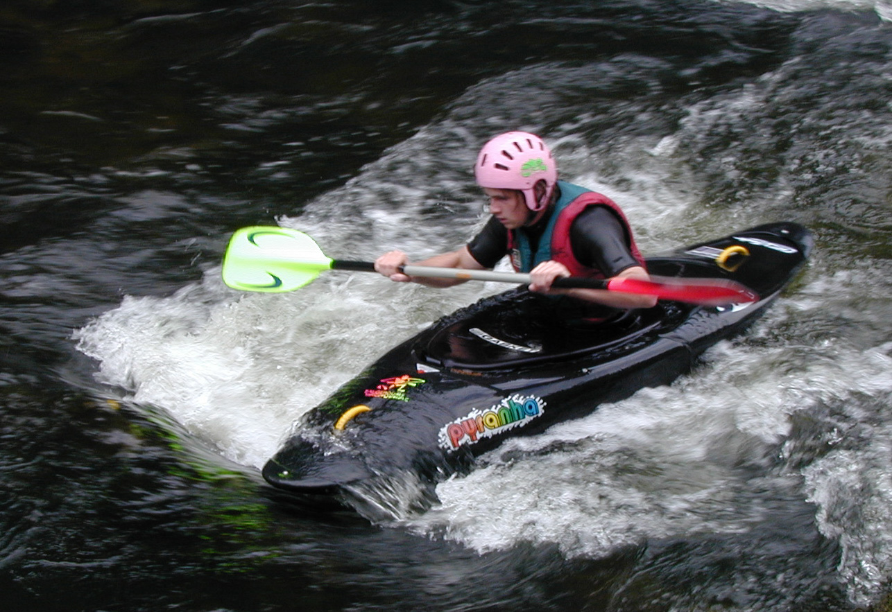

% TIES411 Konenäkö ja kuva-analyysi
% Tuomo Rossi ja Matti Eskelinen
% Kevät 2017

## TIES411 Konenäkö ja kuva-analyysi

* 4 op, suoritustapa harjoitustyö tai tentti
* Professori Tuomo Rossi, FM Matti Eskelinen
* <http://users.jyu.fi/~amjayee/TIES411/>
* Tavoitteet:
    - Ymmärretään millaista dataa kuvat sisältävät
    - Ymmärretään kuinka tärkeimmät analysointimenetelmät toimivat
    - Osataan soveltaa menetelmiä yksinkertaisiin kuviin
    - Hahmotetaan kuinka hankalampia kuvia voi ryhtyä analysoimaan

## Konenäkö

* Digitaalisten kuvien automaattista analysointia tietokoneiden avulla
* Aktiivinen tieteenala jo 60-luvulta
* Laaja: yhdistelee matematiikkaa, signaalinkäsittelyä, tilastotiedettä,
  data-analyysiä, koneoppimista, kognitiivista psykologiaa, ...
* Haastava: ihminen ymmärtää edelleen kuvia paljon konetta paremmin
* Palkitseva: käytännöllinen ala jossa saa aikaan näkyviä tuloksia ja jolla on
  paljon erilaisia hyödyllisiä sovelluksia

## Miksi konenäkö on niin vaikeaa?

## Yksinkertaisiinkin kuviin liittyy haasteita

## Kurssin sisältöä 1

* Kuvien esitysmuodot, yksinkertaiset matemaattiset operaatiot
* Lineaariset invariantit systeemit, konvoluutio, suodatus
* Taajuustason analyysi, Fourier-muunnos
* Tilastollinen analyysi, tunnusluvut, jakaumat, pääkomponentit
* Värit ja värien spektri
* Spektrikuvaus ja monikanavakuvien analysointi
* Reunojen etsintä, reunakäyrien seuraaminen
* Yhtenäisten alueiden etsintä, segmentointi, alueiden kuvaileminen

## Kurssin sisältöä 2

* Skaala-avaruus ja pistepiirteet
* Liikkuva kuva ja optical flow
* Kolmiulotteiset takaisinprojektiot
* Hahmontunnistuksen perusteet ja yksinkertainen piirteytys
* Koneoppimisen perusteet, mallien kouluttaminen ja validointi
* Luokittelumenetelmät, kuten neuroverkot, tukivektorikoneet, Bayesilaiset mallit
* Tilastolliset parametriset mallit
* Yhteenveto

## Materiaalia

* Szeliski, Richard: *Computer Vision: Algorithms and Applications*
    - <http://szeliski.org/book>
* Prince, Simon: *Computer Vision: Models, Learning and Inference*
    - <http://computervisionmodels.com>
* Kurssisivu
    - <http://users.jyu.fi/~amjayee/TIES411/>
* Luentomoniste
    - <http://users.jyu.fi/~amjayee/TIES411/ties411-luentomoniste.pdf>
