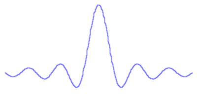

% TIES411 Konenäkö ja kuva-analyysi
% Tuomo Rossi ja Matti Eskelinen
% Kevät 2017

## TIES411 Konenäkö ja kuva-analyysi

* 4 op, suoritustapa harjoitustyö tai tentti
* Professori Tuomo Rossi, FM Matti Eskelinen
* Tavoitteet:
    - Ymmärretään millaista dataa kuvat sisältävät
    - Ymmärretään kuinka tärkeimmät analysointimenetelmät toimivat
    - Osataan soveltaa menetelmiä yksinkertaisiin kuviin
    - Hahmotetaan kuinka hankalampia kuvia voi ryhtyä analysoimaan

## Konenäkö

* Digitaalisten kuvien automaattista analysointia tietokoneiden avulla
* Aktiivinen tieteenala jo 60-luvulta
* Laaja: yhdistelee matematiikkaa, signaalinkäsittelyä, tilastotiedettä,
  data-analyysiä, koneoppimista, kognitiivista psykologiaa, ...
* Haastava: ihminen ymmärtää edelleen kuvia paljon konetta paremmin
* Palkitseva: käytännöllinen ala jossa saa aikaan näkyviä tuloksia ja jolla on
  paljon erilaisia hyödyllisiä sovelluksia

## Miksi konenäkö on niin vaikeaa?

## Yksinkertaisiinkin kuviin liittyy haasteita

## Kurssin sisältöä 1

* Kuvien esitysmuodot, yksinkertaiset matemaattiset operaatiot
* Lineaariset invariantit systeemit, konvoluutio, suodatus
* Taajuustason analyysi, Fourier-muunnos
* Tilastollinen analyysi, tunnusluvut, jakaumat, pääkomponentit
* Värit ja värien spektri
* Spektrikuvaus ja monikanavakuvien analysointi
* Reunojen etsintä, reunakäyrien seuraaminen
* Yhtenäisten alueiden etsintä, segmentointi, alueiden kuvaileminen

## Kurssin sisältöä 2

* Skaala-avaruus ja pistepiirteet
* Hahmontunnistuksen perusteet ja yksinkertainen piirteytys
* Koneoppimisen perusteet, mallien kouluttaminen ja validointi
* Luokittelumenetelmät, kuten neuroverkot ja tukivektorikoneet
* Tilastollinen hahmontunnistus
* Tilastolliset graafiset mallit
* Yksinkertaiset parametriset rakenteet
* Tilastolliset rakennemallit

## Materiaalia

* Szeliski, Richard: *Computer Vision: Algorithms and Applications*
    - <http://szeliski.org/book>
* Prince, Simon: *Computer Vision: Models, Learning and Inference*
    - <http://computervisionmodels.com>
* Kurssisivu
    - <http://ties411.it.jyu.fi>
* Luentomoniste
    - <http://ties411.it.jyu.fi/luentomoniste.pdf>

## Kuvanmuodostus

* Kuva on kolmiulotteisen näkymän kaksiulotteinen *projektio* eli *heijastuma*
* Jatkuva kuva *näytteistetään* epäjatkuvaksi tallenteeksi
* Kuva voidaan tulkita *signaalina*

## Signaali

* Signaalit kuvaavat fysikaalisten suureiden *vaihtelua*
* Vaihtelu tapahtuu *ajan* suhteen, joskus myös *tilan* suhteen
* Vaihtelua voidaan kuvata summana eri taajuuksilla tapahtuvista säännöllisistä
  vaihteluista

## Näytteistys

* Näytteistys on jatkuvan signaalin tallentamista diskreettinä joukkona
  näytepisteitä
* Kuvien näytteistystä tehdään sekä ajassa että tilassa
* Sopiva näytteistystaajuus riippuu signaalin muutostaajuudesta

## Aliasoituminen

* Tarkoittaa taajuuskomponenttien *sekoittumista* liian alhaisen
  näytteistystaajuuden vuoksi
* Kuvaan syntyy taajuuksia joita siinä ei oikeasti ole
* Tapahtunut vahinko on peruuttamaton

## Interpolointi

* Jatkuvan signaalin *palauttaminen* näytteistä
* Yksityiskohtien määrä riippuu näytteistystaajuudesta
* Nopeat muutokset on poistettava suodattamalla tai sitten on nostettava
  näytteistystaajuutta

## Whittaker-Shannon interpolointi

$$x(t) = \sum_{n=-\infty}^{\infty}x(nT) \cdot sinc\left(\frac{t-nT}{T}\right)$$

## Tulos

## Uudelleennäytteistys

* Joskus on tarpeen näytteistää uudelleen eri taajuudella
* Esim. kuvien pienentäminen
* Kutsutaan *uudelleennäytteistykseksi*
* Vaatii nopeiden muutosten suodattamista aliasoitumisen välttämiseksi

## Kuvien esitysmuodot

* Signaali
* Funktio
* Vektori
* Graafi

## Kuvamatematiikkaa

* Hyödynnetään kuvien vektoritulkintaa
* Alkioittaiset operaatiot toisen (samankokoisen) kuvan tai skalaarin kanssa
* Yhteenlasku, kertolasku, vähennyslasku
* Mutta myös skalaarifunktiot kuten neliöjuuri, exp, log

## Kynnystäminen

* Pakotetaan pikselit valkoisiksi tai mustiksi sen mukaan ovatko ne pienempiä
  vai suurempia kuin kynnysarvo $t$
* Kutsutaan myös *binärisöinniksi*, koska tuloksena on kaksivärinen kuva

$$T\left(t,I\right)(x,y)=\begin{cases}
                         1, &\text{ jos } I(x,y) < t\\
                         0, &\text{ muuten,}
                        \end{cases}$$
