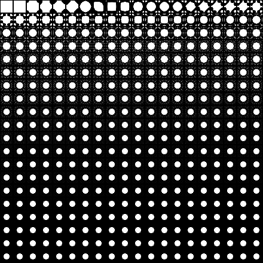
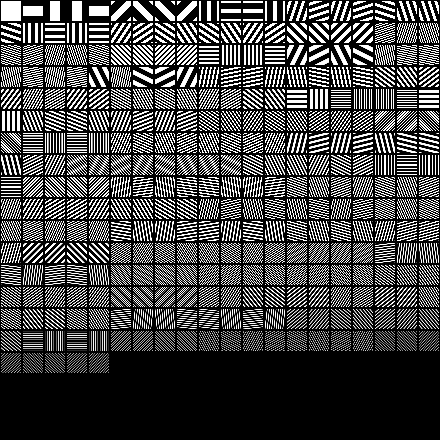
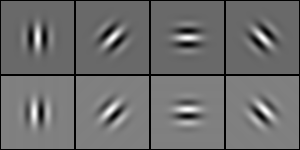

% TIES411 Konenäkö ja kuva-analyysi
% Tuomo Rossi ja Matti Eskelinen
% Kevät 2017

## Näytteistetyn signaalin integrointi

* Diracin $\delta$ auttaa muodostamaan integroituvan mallin näytteistetyistä
  signaaleista

* Intuitiivisesti integraali yli koko signaalin on näytepisteiden arvojen summa

* Integroituva signaali muodostuu summana siirrettyjä $\delta$-olioita

$$\int_{-\infty}^{\infty}\delta(x)f(x)dx = f(0).$$

## Kuvat vektoreina ja kannanvaihdot

* Aiemmin kuvailtiin kuvien *vektorimuoto*

* Kuvien kantavektorit vastaavat yksittäisiä pikseleitä

* Lineaarialgebrasta on tuttua ajatus *kannanvaihdosta*

* Yleensä tavoitteena esittää vektorit "hyödyllisemmässä" muodossa

## Fourier-muunnos kannanvaihtona

* Ajatellaan siniaaltojen muodostamia kantavektoreita

* Kannanvaihto tällaiseen kantaan tuottaa tietoa kuvassa tapahtuvista
  *säännöllisistä muutoksista*

* Tällainen kannanvaihto voidaan tehdä *Fourier-muunnoksen* avulla

* Voidaan tehdä *mille tahansa signaalille*

## Fourier-kantavektoreita

*Kuvien Fourier-kantavektorit ovat kuvia!*

## Yksiulotteinen Fourier-muunnos

* Voimassa integroituvalle funktiolle

$$F(g(x))(u) = \int_{-\infty}^{\infty}g(x)e^{-i 2 \pi ux}dx.$$

* Huom: eksponenttilauseke on Eulerin kaava

## Eulerin kaava

$$\begin{aligned}
  e^{ix} &= cosx + i sinx\\
  e^{-ix} &= cos(-x) + i sin(-x) = cos x - i sin x\\
  &\Rightarrow e^{-i 2 \pi ux} = cos(2 \pi ux) - i sin(2 \pi ux).
  \end{aligned}$$

*Nämä ovat kompleksilukuja!*

## Diskreetti Fourier-muunnos

$$F\left(x\left(n\right)\right)\left(u\right) = \sum_{n=0}^{N-1}
  x\left(n\right) \cdot e^{-i 2 \pi \frac{un}{N}}, u \in \mathbb{Z}.$$

Huom: signaali oletetaan periodiseksi.

## Eulerin kaavan avulla

$$F\left(x\left(n\right)\right)\left(u\right) = \sum_{n=0}^{N-1}
  \left(x\left(n\right) \cdot \cos\left(2 \pi \left(\frac{un}{N}\right)\right) -
  i \cdot x\left(n\right) \cdot
  \sin\left(2 \pi \left(\frac{un}{N}\right)\right)\right).$$

Näitä lukuja $F\left(x\left(n\right)\right)\left(u\right)$ kutsutaan Fourier-kertoimiksi.

## Käänteinen Fourier-muunnos

$$x\left(n\right) = \frac{1}{N}\sum_{u=0}^{N-1}
  F\left(x\left(n\right)\right)\left(u\right) \cdot e^{i 2 \pi \frac{un}{N}},
  n \in \mathbb{Z}.$$

## Eulerin kaavan avulla

$$\begin{aligned}
  x(n) = \sum_{u=0}^{N-1}
  &Re\left(F\left(x\left(n\right)\right)\left(u\right)\right) \cdot
  \cos\left(2 \pi \left(\frac{un}{N}\right)\right) -\\
  &Im\left(F\left(x\left(n\right)\right)\left(u\right)\right) \cdot
  \sin\left(2 \pi \left(\frac{un}{N}\right)\right).
  \end{aligned}$$

Lopputulos on reaalinen, joten imaginaariosa voidaan olettaa nollaksi.

## Kaksiulotteinen Fourier-muunnos

$$F\left(g\left(x,y\right)\right)\left(u,v\right) =
  \int_{-\infty}^{\infty}\int_{-\infty}^{\infty}
  g\left(x,y\right) \cdot e^{-i 2 \pi \left(ux+vy\right)}dxdy.$$

Nämä ovat sinitasoaaltoja eli *spatiaalisia taajuuskomponentteja*.

## Kaksiulotteinen diskreetti Fourier-muunnos

$$\begin{aligned}
  F\left(I\left(x,y\right)\right)\left(u,v\right)
  &= \sum_{x=0}^{W-1} e^{-i 2 \pi \frac{ux}{W}} \cdot
  \left(\sum_{y=0}^{H-1} e^{-i 2 \pi \frac{vy}{H}} \cdot
  I\left(x,y\right)\right) \\
  &= \sum_{x=0}^{W-1} \sum_{y=0}^{H-1} I\left(x,y\right) \cdot
  e^{-i 2 \pi \left(\frac{ux}{W}+\frac{vy}{H}\right)}.
  \end{aligned}$$

Tuloksena on kompleksiarvoinen kuva, joka on samankokoinen kuin alkuperäinen.

## Käänteismuunnos

$$\begin{aligned}
  I\left(x,y\right)
  &= \frac{1}{N*M} \sum_{u=0}^{W-1} \sum_{v=0}^{H-1}
  F\left(I\left(x,y\right)\right)\left(u,v\right) \cdot
  e^{+i 2 \pi \left(\frac{ux}{W}+\frac{vy}{H}\right)}.
  \end{aligned}$$

## Fourier-kanta pienelle kuvalle

## Taajuuskomponenttien vaikutus

## Taajuuskomponenttien järjestys

## Fast Fourier Transform

* Fourier-muunnos saadaan laskemalla jokaista kerrointa ('pikseliä') kohti painotettu summa kaikista kuvan pikseleistä

* Aikavaativuus on siis $O(N^2)$ kun pikselien määrä on $N$

* FFT eli *Fast Fourier Transform* suoriutuu ajassa $O(N \log N)$ jakamalla ongelmaa pienempiin osiin

* Vähemmän laskutoimituksia, joten numeeriset pyöristysvirheet kertautuvat vähemmän

## Konvoluutioteoreema

* Käytännön hyötyä Fourier-muunnoksesta:

$$F\left(f \ast g\right) = F\left(f\right) \cdot F\left(g\right)$$

* Konvoluutio muuttuu taajuustasossa *kertolaskuksi*

* Hyödyllistä, kun suodinmaski on suuri!

## Paikallinen taajuusinformaatio

* Fourier-muunnos tuottaa globaalia tietoa kuvasta

* Käyttämällä *ikkunointifunktiota* saadaan paikallisempaa informaatiota

* Ongelmaksi tulee epätarkkuusperiaate - tarkkuus kärsii joko taajuuden tai paikan/ajan suhteen

## Gaborin suotimet

* Suodinmaskeja, joilla konvolvoidaan kuvaa

* Sinitasoaaltoja, jota ikkunoidaan Gaussin funktiolla

* Reaali- ja kompleksiosa, eräänlaisia paikallisia Fourier-muunnoksia

* Muistuttaa ihmisen näköaivokuoren signaalille tekemää muunnosta

## Gabor-maskit

