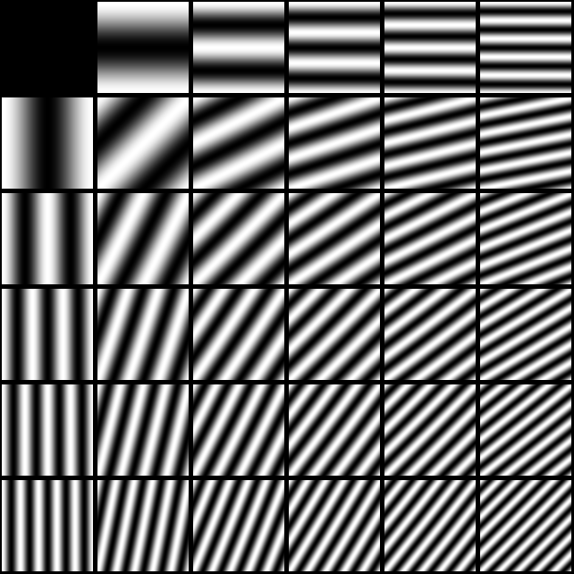

% TIES411 Konenäkö ja kuva-analyysi
% Tuomo Rossi ja Matti Eskelinen
% Kevät 2017

## Näytteistetyn signaalin integrointi

* Diracin $\delta$ auttaa muodostamaan integroituvan mallin näytteistetyistä
  signaaleista
* Intuitiivisesti integraali yli koko signaalin on näytepisteiden arvojen summa
* Integroituva signaali muodostuu summana siirrettyjä $\delta$-olioita

$$\int_{-\infty}^{\infty}\delta(x)f(x)dx = f(0).$$

## Fourier-muunnos kannanvaihtona

* Ajatellaan siniaaltojen muodostamia kantavektoreita
* Kannanvaihto tällaiseen kantaan tuottaa tietoa kuvassa tapahtuvista
  *säännöllisistä muutoksista*
* Tällainen kannanvaihto voidaan tehdä *Fourier-muunnoksen* avulla

