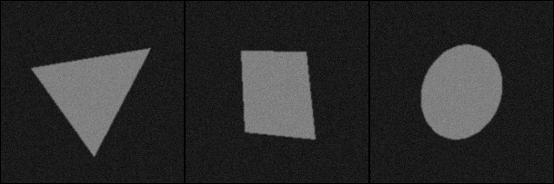

Ryhdymme kurssin loppua kohden käsittelemään yksittäisten kuvien sijaan koko
kuva-aineistoa. Tällä kerralla opettelemme organisoimaan kokeilumme skripteiksi
ja kokeilemme tilastollisen datan kokoamista kaikista valitsemistamme kuvista.
Ryhdymme myös vähitellen harjoittelemaan perusmenetelmiä datan analysoimiseksi
ja visualisoimiseksi.

Tässä vaiheessa kaikki ovat jo tehneet monenlaisia kokeiluja yksittäisillä
kuvilla ja löytäneet joitakin lupaavia tapoja esikäsitellä kuvia sopivampaan
muotoon ongelman ratkaisemiseksi. Seuraava vaihe on valita joukko operaatioita,
suorittaa ne kaikille kuville ja tallentaa lopputulos kuvatiedostoiksi.
Riippuen valituista operaatioista saattaa olla järkevää tallentaa useita
välivaiheita.

Seuraavaksi kaikki tuloskuvat pitäisi käydä läpi ja arvioida, miten hyvin
valitut operaatiot toimivat koko kuvajoukolle. Saattaa olla tarpeen säätää
joitakin parametreja tai lisätä välivaiheita, jotta lopputulos olisi
mahdollisimman hyvä mahdollisimman monelle kuvalle. On hyvin todennäköistä, että
kuvajoukossa on joitakin kuvia, joille valitut operaatiot eivät toimi. Tässä
tilanteessa ei kannata käyttää liikaa aikaa säätämiseen, vaan tyytyä
epätäydelliseen tulokseen tai poistaa ongelmalliset kuvat. Voi olla tarpeen
pohtia, miten ilmenneet ongelmat ratkaistaisiin valmiissa sovelluksessa.

## Esimerkki

Tutkitaan yksinkertaisia geometrisia muotoja, kolmioita, neliöitä ja ympyröitä,
jotka ovat vääristyneet eri tavoin. Lopullisessa sovelluksessa olisi tarkoitus
selvitä myös valaistuksen vaihteluista ja varjoista, mutta tässä vaiheessa
valaistus on yksinkertaisuuden vuoksi tasainen. Kohinaa on jonkin verran.

Datajoukon kuvat voi ladata [täältä](http://users.jyu.fi/~amjayee/TIES411/shapes_v1.zip).



Tehdään skripti, joka lukee kaikki kuvat vuoron perään, suorittaa niille joukon
operaatioita, ja tallentaa lopputuloksen kuvana uuteen tiedostoon tarkastelua
varten. Tässä kohtaa on syytä huomata, että kuvia on parasta käsitellä yksi
kerrallaan vuoron perään. Muisti loppuu hyvin pian nykyaikaisistakin
tietokoneista, jos muistiin avataan samanaikaisesti satoja suuria kuvia. Tässä
datajoukossa on 300 kpl noin 40 kilotavun kokoisia kuvia, joten niitä vielä
pystyisi käsittelemään muistissa samanaikaisestikin, mutta tyypillisen
datajoukon kuvat ovat huomattavasti suurempia.

## CSV-tiedostojen käsittely

On hyvä ajatus säilyttää dataa jossakin helposti luettavassa ja käsiteltävässä
muodossa. Esimerkissämme käytämme CSV-tiedostoja, sillä

* ne ovat helposti ihmisen luettavissa ja muokattavissa myös tekstieditorissa,
* ne saa luettua sellaisenaan esimerkiksi Exceliin ja moniin muihinkin
  työkaluihin jatkokäsittelyä ja visualisointeja varten, ja
* tarvittaessa on helppo koodata itsekin työkaluja niiden käsittelyyn.

Lähdemme liikkeelle siitä, että kuvailemme alkuperäisen datajoukkomme
CSV-tiedoston riveinä. Kirjaamme tiedostoon kunkin kuvan polun ja tiedostonimen
suhteessa tämän CSV-tiedoston sijaintiin, sekä kuvan esittämän kohteen luokan
kokonaislukuina $1$, $2$, $3$. Sovelluksesta riippuen kuviin voi liittää mitä
tahansa muutakin ennakkoon tiedossa olevaa tietoa, ja esimerkiksi loppuun voi
jättää sarakkeen mahdollisia kommentteja varten.

Saamme helposti muodostettua pohjan tiedostoa varten keräämällä kuvatiedostojen
nimet jonkin kansion alikansioista vaikkapa komennolla

```{.bash}
ls -Rpx1 shapes > shapes.csv
```

Kirjoittamalla shell-skriptin saa liitettyä tiedostonimeen myös polun, mutta
tämä kertaluontoinen työ on kohtuullisella vaivalla tehtävissä myös käsin
tekstieditorissa.

Tällaista datajoukon kuvailevaa tiedostoa kutsutaan joskus *manifestiksi*, joka
on siis eräänlainen pakkausluettelo. Se auttaa systematisoimaan datan
käsittelyä, mikä puolestaan on avuksi erilaisten kokeilujen toistamisessa
tarpeen mukaan. Jos haluaa vaikkapa jättää osan kuvista pois kokeiluista
väliaikaisesti tai kokonaan, tämän voi tehdä esimerkiksi lisäämällä manifestiin
ylimääräisen sarakkeen, jonka arvon perusteella kuva jätetään käsittelemättä.
Kommenttisarake auttaa muistamaan, mikä mahdollisesti oli syynä tiedoston pois
jättämiseen, ja jos myöhemmin haluaa kokeilla jotakin uutta, kuva on edelleen
olemassa ja sen saa helposti palautettua käsittelyyn. Jos taas kuvia tuhoaa ja
lisää summittaisesti, eikä erilaisia kokeiluja dokumentoi millään tavalla, on
todella hankalaa palata myöhemmin takaisin johonkin aiempaan tilanteeseen.

Käytetään CSV-tiedoston lukemiseen pythonin `csv`-modulia. Sen avulla tiedoston
rivit saa luettua kätevästi `dict`-olioiksi, jos csv-tiedoston ensimmäisellä
rivillä on määritelty sarakkeiden nimet. Jos nimiä ei ole tiedostossa, ne saa
myös kerrottua konstruktorin `fieldnames`-parametrilla. Rivien lukemisen
yhteydessä on hyvä ajatus muuntaa sarakkeiden sisältö oikean tyyppiseksi.
Esimerkissämme haluamme varmistaa, että luokkasarakkeen arvot ovat
kokonaislukuja.  Konstruktorin parametreilla voi myös määritellä esimerkiksi
sarakkeiden ja rivien erottimet, jos tiedoston formaatti on jokin muu kuin
perinteinen.

```{.python}
import csv
def read_data(filename):
  result = []
  with open(filename, 'r') as csvfile:
    reader = csv.DictReader(csvfile, delimiter=",", skipinitialspace=True, quotechar="'", lineterminator="\n")
    for row in reader:
      row["class"] = np.int32(row["class"])
      result.append(row)
  return result
```

## Datan käsittely

Tehdään kuville yksinkertainen gaussinen suodatus kohinan poistamiseksi sekä
kynnystys käyttäen kiinteää kynnysarvoa. Kerätään samalla kuvista esimerkin
vuoksi kohteeseen kuuluvien pikselien kokonaismäärä, jota kutsumme 'massaksi'.
Kirjoitetaan tuloksena syntyvä kuva toiseen tiedostoon, jotta voimme 
tarvittaessa tarkistaa, millaiseen lopputulokseen kerätty data perustuu.
Kirjoitetaan käsittelyoperaatioista sellainen funktio, jota voimme käyttää 
`map`-operaatiolla koko datajoukkoon. Se ottaa siis parametrina csv-tiedostosta
luetun `dict`-olion ja paluttaa muokatun olion.

```{.python}
def process(shape):
  filename = shape["file"]
  print(filename)
  img = cv.GaussianBlur(np.float32(cv.imread(filename, cv.IMREAD_GRAYSCALE)), (5,5), 1)
  t = np.float32(img > 100)
  m = np.sum(t)
  shape["mass"] = m
  cv.imwrite(filename.replace('images', 'results'), t*255)
  return shape
```

Funktiosta palautuu takaisin siis vain `dict`-olio täydennettynä kerätyillä
tiedoilla. Ladattu kuva tuhoutuu aikanaan funktiosta poistumisen jälkeen, joten
se ei jää kuormittamaan muistia. Lopputuloksen tallentamiseksi
csv-tiedostoon käytämme edelleen `csv`-modulia. Tiedostoon kirjoitettaessa
sarakkeiden nimet täytyy luetella, jotta kirjoittaja tietää sarakkeiden oikean
järjestyksen.

```{.python}
def write_data(filename, data):
  with open(filename, 'w') as resultfile:
    writer = csv.DictWriter(resultfile, fieldnames=["file","class","mass"], delimiter=",", quotechar="'", quoting=csv.QUOTE_MINIMAL, lineterminator="\n")
    writer.writeheader()
    writer.writerows(data)
```

Voimme nyt toteuttaa esimerkkikokeilumme yksinkertaisesti lukemalla datajoukon
tiedot manifestista, suorittamalla käsittelyfunktion koko datajoukolle
`map`-operaation avulla, ja kirjoittamalla lopputuloksen uuteen tiedostoon.
Näin saamme helposti dokumentoitua kokeilumme tekemällä kustakin oman skriptin
ja tallentamalla tulokset eri tiedostoihin ja kuvakansioihin.

```{.python}
shapes = read_data('shapes.csv')
output = list(map(process, shapes))
write_data('results.csv', output)
```

Lopputuloksena olevan csv-tiedoston voi avata vaikkapa Exceliin ja piirtää
esimerkiksi massan jakauman luokittain histogrammeina tai arvioituina
tiheysfunktioina. Kurssisivulla olevassa .ipynb-muistikirjassa on esimerkkejä
pandas-kirjaston käyttämisestä visualisointiin ja datan käsittelyyn. Tämä on
erityisesti Jupyter Notebook -ympäristössä hyvin tehokas ja intuitiivinen
työkalu.

## Tehtäviä

Tee python-skripti, joka lukee kaikki aineistosi kuvat, suorittaa niille
valitsemasi esikäsittelyoperaation ja tallentaa tulokset erilliseen kansioon.
Tarvittaessa voit tallentaa erikseen useita välivaiheita.

Käy läpi tulokset. Jos kuvia on paljon, esimerkiksi yli sata, riittää käydä läpi
jokin edustava osajoukko. Arvioi, miten hyvin valitsemasi operaatio toimii.
Pitäisikö jotakin parantaa? Kuinka ongelmia voisi mahdollisesti yrittää välttää
tai korjata lopullisessa sovelluksessa?

Mieti samalla jo alustavasti, millaisia numeerisia piirretietoja voisit laskea
kuvista ongelmasi ratkaisemista varten.
